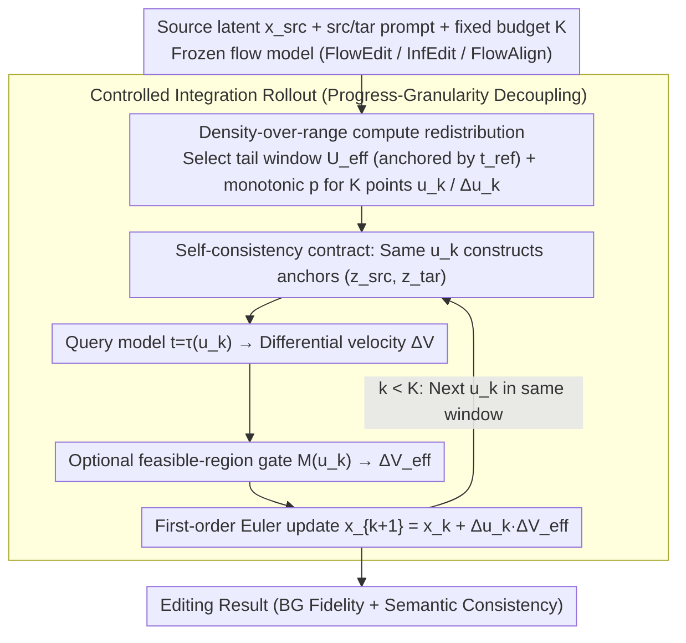

# Semantic Granularity Navigation in Image Editing

**Conference**: ICML 2026  
**arXiv**: [2605.21190](https://arxiv.org/abs/2605.21190)  
**Code**: To be confirmed  
**Area**: Diffusion Models / Image Editing  
**Keywords**: Real Image Editing, Flow Matching, Training-free Inference Controller, Scale-Progress Decoupling, Semantic Granularity

## TL;DR
NaviEdit decouples the implicit coupling where "model scale coordinate = editing progress clock" in diffusion/flow editors. Under a fixed step budget, it uses a training-free inference-time controller to concentrate computational effort on the density within an effective scale window rather than expanding the range into high-noise regions, improving both background fidelity and semantic consistency across PIE-Bench / ImgEdit-Bench and multiple flow backbones.

## Background & Motivation

**Background**: T2I models based on diffusion or flow matching (SD3, FLUX, Stable Diffusion series) are widely used as general visual priors. Combined with training-free editing pipelines like SDEdit, Prompt-to-Prompt, and FlowEdit, real image editing is achieved by regulating the sampling process during inference to transform the source image into the target description without retraining.

**Limitations of Prior Work**: The trade-off between editability $\leftrightarrow$ fidelity remains unresolved. To achieve thorough semantic changes, trajectories are often pushed to higher noise levels (e.g., FlowEdit pulling the anchor to larger noise levels), resulting in drift, hallucinated objects, and color explosions in non-edited areas. Conversely, preserving structures often fails to modify geometric shapes (e.g., round cake $\rightarrow$ square cake). Existing works (TiNO-Edit, Schedule Your Edit, Dual-Schedule Inversion) mostly focus on schedule shaping but operate within the "scale as progress" framework.

**Key Challenge**: These methods express **two fundamentally different concepts** using the same coordinate: *scale* (determining the "editable information domain," from coarse structure to fine texture) and *progress* (determining the accumulated semantic change). Probing experiments reveal a three-stage regime on the scale axis: at high scales, the prompt-conditioned differential field $\Delta V(u)$ diverges and leakage pressure $\rho(u)$ spikes; at low scales, high-frequency reconstruction dominates, preventing geometric edits. A "sweet spot" exists in the $\rho(u)$ valley between them. Using scale as progress implies that increasing editing strength forces the integral into high-risk tails, incurring an irreducible risk floor.

**Goal**: Under the hard constraints of a training-free approach, frozen backbone, and fixed model-call budget $K$, this work aims to liberate "expanding scale range" from being the sole means of strengthening edits, pivoting instead towards redistributing computational power as **density** within a fixed effective window.

**Key Insight**: Editing is viewed as a controlled integration of latents on an explicit progress axis $s\in[0,1]$, where the scale coordinate $u(s)$ is downgraded to a controllable "measurement + actuation" input. The evaluation object shifts to the entire rollout (not a single step), characterized by the functional *semantic granularity*.

**Core Idea**: Decouple progress and scale at the rollout level, enforcing a self-consistency contract where mixing/querying/update use the same $u_k$ at each step, and allocate the fixed budget to increase density within the effective scale window.

## Method

### Overall Architecture
Inputs consist of the source latent $x_{\text{src}}$, source prompt $c_{\text{src}}$, target prompt $c_{\text{tar}}$, a fixed step budget $K$, and a frozen flow model (compatible with base editors like FlowEdit / InfEdit / FlowAlign). NaviEdit acts as a rollout-level controller replacing the "budget $\rightarrow$ range" rules of the base editor: it selects a fixed tail window $\mathcal{U}_{\text{eff}}$ on the scheduler path (anchored by $t_{\text{ref}}$, excluding extreme high-noise tails) and determines $K$ sampling points $\{u_k\}$ and increments $\{\Delta u_k\}$ via a monotonic coordinate $p\in[0,1]$. Each step: the same $u_k$ constructs co-located anchors $(z^{\text{src}},z^{\text{tar}})$; the model is queried at $t=\tau(u_k)$ to obtain the differential velocity $\Delta V$ (optionally passed through a feasible-region gate $M(u_k)$ to get $\Delta V_{\text{eff}}$); a first-order Euler update $x_{k+1}=x_k+\Delta u_k\,\Delta V_{\text{eff}}$ is performed. The process requires no training, no inversion, and no external masks.

### Key Designs

**1. Formalizing Controlled Integration with Progress-Granularity Decoupling: Optimizing Scalewise Compute Allocation**

The pain point is that existing methods only focus on the final state when evaluating quality, ignoring where compute is spent across scales. NaviEdit formulates editing as a controlled integral along a progress axis $s\in[0,1]$: $\frac{dx}{ds}=\frac{du}{ds}\,\Delta V_{\text{eff}}\big(x(s);u(s),\epsilon(s)\big)$, where scale $u$ is a controlled input. Semantic granularity is defined as a rollout functional $\mathcal{G}[x(\cdot),u(\cdot)]=\int_0^1 \phi\big(x(s),u(s)\big)\,ds$, where $\phi(x,u)$ is a locally non-negative risk density increasing with leakage pressure $\rho(u)$ and directional oscillation $\omega(u)$. Probes are measured by adding noise to source latents $z^{\text{src}}=(1-u)x_{\text{src}}+u\epsilon$, constructing target anchors $z^{\text{tar}}=x+(z^{\text{src}}-x_{\text{src}})$, and calculating $\Delta V(u)=v_\theta(z^{\text{tar}},\tau(u),c_{\text{tar}})-v_\theta(z^{\text{src}},\tau(u),c_{\text{src}})$. Theorem 4.2 proves that coupled scheduling inevitably includes outside-window quality $m_{\text{bad}}$, creating an irreducible lower bound for $\mathcal{G}$.

**2. Density-over-range Redistribution in Effective Windows: Fixing Range and Tuning Density**

Experiments show that in coupled scheduling, increasing steps improves CLIP but degrades PSNR/SSIM because larger budgets automatically expand the range into high-noise regions. NaviEdit fixes an effective tail window $\mathcal{U}_{\text{eff}}$ on the scheduler path (anchored by $t_{\text{ref}}$) and invests all additional budget into density within this window. Sampling points $\{u_k\}$ are parameterized via monotonic coordinates $p\in[0,1]$. Online density adjustment using discrete proxies for $\rho$ and $\omega$ is possible without extra model calls. Theorem 4.3 demonstrates that increasing density within the window strictly outperforms range expansion into $\mathcal{U}_{\text{bad}}$, as the former's discretization error vanishes with $K$ while the latter faces a constant risk floor.

**3. First-order Consistent Discretization via Self-consistency Contract: Consistent Axes for Mix/Query/Update**

NaviEdit enforces that the same $u_k$ is used for mixing (anchor construction), querying (model input $t=\tau(u_k)$), and updating (step size $\Delta u_k$). The update is $x_{k+1}=x_k+\Delta u_k\,\Delta V_{\text{eff}}(x_k;u_k,\epsilon_k)$. Theorem 4.4 explains that using inconsistent scales across these three components causes the differential velocity to measure a system different from the one being actuated, accumulating systematic bias (drift and artifacts). Ablations confirm that axis mismatch leads to monotonic degradation in both drift and compliance indicators.

### Loss & Training
Completely training-free with no parameter updates. During inference, it uses a small number of hyperparameters (e.g., $K=50$ for PIE-Bench, $t_{\text{ref}}=42$). An optional feasible-region gate $M(u)$ is generated from internal signals of the base editor without additional model evaluation. Runs on a single RTX 3090.

## Key Experimental Results

### Main Results

Comparison on PIE-Bench (700 real images with GT masks) across various paradigms:

| Category | Method | Struct.Dist↓ | PSNR↑ | SSIM↑ | LPIPS↓ | CLIP-Whole↑ | CLIP-Edited↑ |
|------|------|------|------|------|------|------|------|
| Fixed | FlowEdit (SD3) | 14.64 | 22.46 | 84.08 | 103.00 | 25.91 | 22.50 |
| Fixed | FlowAlign (SD3) | 6.21 | 27.78 | 92.41 | 34.47 | 25.44 | 21.80 |
| Reschedule | SYE (DDIM+PnP) | 27.17 | 21.73 | 87.45 | 110.64 | 24.44 | 21.26 |
| Reschedule | TurboEdit (SDXL-Turbo) | 13.80 | 21.44 | 80.08 | 108.60 | 24.66 | 21.70 |
| Navi | Navi-FlowEdit ($M\equiv 1$) | 14.25 | 22.54 | 89.36 | 92.47 | **26.01** | **22.59** |
| Navi | **Navi-FlowEdit + gate** | 10.67 | 27.94 | **93.85** | 48.74 | **26.18** | **22.72** |
| Navi | **Navi-FlowAlign ($M\equiv 1$)** | **5.40** | **28.33** | 93.40 | **34.49** | 26.15 | 22.44 |

On ImgEdit-Bench, Navi-InfEdit and Navi-FlowAlign variants outperform baselines. Gains are most significant in background, action, and replace categories—scenarios most prone to trajectory drift.

### Ablation Study

Controlled comparison of coupling vs. decoupling across backbones (fixed $K=28$, same differential mechanism):

| Backbone | Schedule | SSIM↑ | PSNR↑ | CLIP-Whole↑ | CLIP-Edited↑ |
|------|------|------|------|------|------|
| SD3 | couple | 88.22 | 22.18 | 26.01 | 22.55 |
| SD3 | **decouple** | **93.22** | **27.81** | **26.15** | **22.67** |
| SD3.5 | couple | 85.68 | 22.01 | 26.57 | 22.91 |
| SD3.5 | **decouple** | **92.32** | **27.45** | **26.77** | **23.32** |
| FLUX.1 [dev] | couple | 82.14 | 21.81 | 27.02 | 23.35 |
| FLUX.1 [dev] | **decouple** | **91.75** | **26.83** | **27.06** | **23.42** |

### Key Findings
- **Density Beats Range**: At the same budget, the rollout proxy $\widehat{\mathcal{G}}$ correlates linearly with $m_{\text{bad}}$, and PSNR-bg drops monotonically as $m_{\text{bad}}$ increases, validating the risk-floor theory.
- **CFG Cannot Fix Coupling**: Increasing CFG scale does not replicate the gains of decoupling because CFG modifies field magnitude but not the budget allocation across scales, leaving the cost floor of coupled scheduling unaddressed.
- **Portable Across Base Editors**: Positive gains across FlowEdit, InfEdit, and FlowAlign suggest that progress-scale decoupling is a universal principle rather than a pipeline-specific trick.

## Highlights & Insights
- **Diagnosis-driven Methodology**: Using $\rho(u)$ and $\omega(u)$ probes to map scale regimes allows for designing controllers around a "valley" rather than arbitrary schedule tuning.
- **Rollout-level Perspective**: Shifting focus from instantaneous velocity at a single step to compute allocation functionals along a rollout turns "schedule tuning" into a formal optimization problem.
- **Universal Self-consistency Contract**: The requirement that mixing, querying, and updating share the same coordinate is a critical sanity check for any inference-time method using differential fields.

## Limitations & Future Work
- The controller regulates budget allocation but does not improve underlying scene reasoning; conservative gate settings may lead to "incomplete" results for fine-grained replacements.
- Lack of explicit geometric or relational consistency constraints might lead to global consistency failures in scenes with complex object relationships.
- Reliance on the base editor exposing a conditional differential field and monotonic scale path.
- Future work should include higher resolutions, more complex prompts, and larger user studies, as well as testing on emerging backbones.

## Related Work & Insights
- **vs FlowEdit (Kulikov et al., 2025)**: FlowEdit follows the traditional range-expansion route for strengthening edits; NaviEdit demonstrates superior performance across all metrics when applied on top of it.
- **vs Schedule Your Edit / Dual-Schedule Inversion**: These works recognize the importance of scale allocation but maintain the implicit scale-progress coupling and lack axis consistency, leading to unstable performance.
- **vs Prompt-to-Prompt / MasaCtrl / PnP**: These involve intervention at the update rule level, while NaviEdit focuses on step positioning, making them orthogonal and combinable.

## Rating
- Novelty: ⭐⭐⭐ Bridgeing the gap between progress and scale is a distinct perspective supported by formal risk-floor theorems.
- Experimental Thoroughness: ⭐⭐⭐⭐ Covers 2 benchmarks, 3 editors, and 3 backbones with strong ablations.
- Writing Quality: ⭐⭐⭐⭐ Clear logical progression from diagnosis to formalization and empirical proof.
- Value: ⭐⭐⭐⭐ A plug-and-play controller providing immediate benefits to training-free editing pipelines.

<!-- RELATED:START -->

## Related Papers

- [\[CVPR 2026\] Meta-CoT: Enhancing Granularity and Generalization in Image Editing](../../CVPR2026/image_generation/meta-cot_enhancing_granularity_and_generalization_in_image_editing.md)
- [\[ICLR 2026\] Next Visual Granularity Generation](../../ICLR2026/image_generation/next_visual_granularity_generation.md)
- [\[ICML 2026\] WISE: A World Knowledge-Informed Semantic Evaluation for Text-to-Image Generation](wise_a_world_knowledge-informed_semantic_evaluation_for_text-to-image_generation.md)
- [\[ICML 2026\] OmniAID: Decoupling Semantic and Artifacts for Universal AI-Generated Image Detection in the Wild](omniaid_decoupling_semantic_and_artifacts_for_universal_ai-generated_image_detec.md)
- [\[ICML 2026\] DirectEdit: Step-Level Accurate Inversion for Flow-Based Image Editing](directedit_step-level_accurate_inversion_for_flow-based_image_editing.md)

<!-- RELATED:END -->
