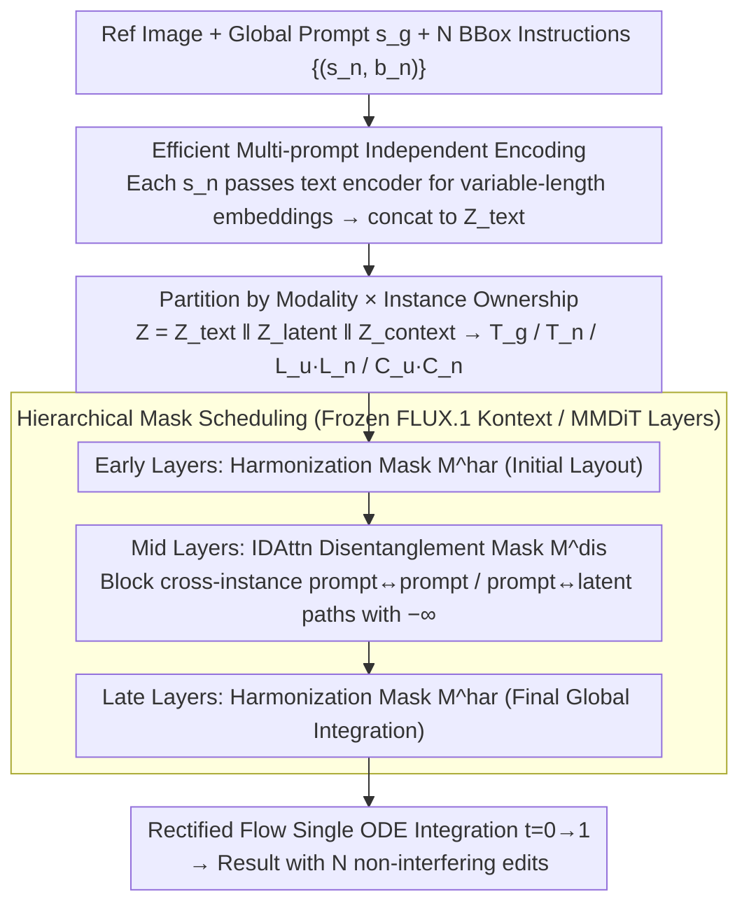

# Shifting the Breaking Point of Flow Matching for Multi-Instance Editing

**Conference**: ICML2026  
**arXiv**: [2602.08749](https://arxiv.org/abs/2602.08749)  
**Code**: https://github.com/Blowing-Up-Groundhogs/IDAttn  
**Area**: Image Generation / Image Editing / Flow Matching / Multi-Instance Editing  
**Keywords**: Flow Matching, MMDiT, Multi-Instance Editing, Attention Disentanglement, Infographic Text Editing

## TL;DR
To address the persistent issue of "attribute leakage" during simultaneous multi-instance editing in MMDiT-based models (e.g., FLUX.1 Kontext) utilizing Rectified Flow Matching, this paper proposes Instance-Disentangled Attention (IDAttn). By applying structured masks to joint attention, each editing instruction is bound to its corresponding bounding box. Combined with a hierarchical disentanglement/harmonization schedule and efficient independent multi-prompt encoding, the method enables $N$ non-interfering edits in a single forward pass. It significantly outperforms multi-turn and concatenation baselines on the newly proposed Infographic text editing benchmark.

## Background & Motivation

**Background**: Text-driven image editing has long been dominated by U-Net diffusion models. Recently, the community has pivoted toward MMDiT + Rectified Flow Matching (e.g., Stable Diffusion 3, FLUX.1 Kontext), where the ODE formulation offers higher visual quality and faster inference. Editing typically involves concatenating reference image tokens with noise latents within a single joint attention mechanism.

**Limitations of Prior Work**: Existing FM editors primarily support "whole-image editing" or a minimal number of concurrent edits. In multi-instance scenarios (e.g., dozens of text boxes in an infographic), they suffer from either massive missed edits or "attribute leakage," where semantics from box A seep into box B. While multi-turn inference mitigates this, the cost for $N$ steps is prohibitive and repeatedly degrades background consistency.

**Key Challenge**: Flow matching learns a **global** velocity field $v_\theta(x, t \mid c)$ where the condition $c$ is injected globally. Joint attention allows prompt, latent, and context tokens to attend to each other freely. This design causes query/key interference between different instances within the shared vector field, as instance-level isolation is not architecturally enforced.

**Goal**: Given $N$ local instructions with bounding boxes $\{(s_n, b_n)\}_{n=1}^N$, the objective is to achieve (i) editing disentanglement (no interference between instructions), (ii) locality (preserving non-edited areas), and (iii) global coherence (maintaining a harmonious overall image), all while (iv) completing all edits in a single forward pass to maintain sub-linear inference costs without modifying backbone weights or the global FM training objective.

**Key Insight**: The authors observe that the root cause of attribute leakage is **structural**—any two unrelated tokens are permitted to communicate in joint attention. Rather than iteratively optimizing attention maps during inference (as seen in P2P-based methods), it is more effective to modify the attention **connectivity graph** directly and apply different connectivity strategies across the depth of the MMDiT.

**Core Idea**: Use a $\{0, -\infty\}$ additive mask to partition joint attention into instance-wise subgraphs. Intermediate layers execute strict disentanglement to self-contain prompt/latent/context for each instance, while early and late layers perform harmonization to integrate fragments into a coherent global image.

## Method

### Overall Architecture
The method solves multi-instance interference by converting the process into a single forward ODE integration on a frozen FLUX.1 Kontext backbone. A structured additive mask, partitioned by instance, is applied to joint attention. First, the global/null prompt $s_g$ and individual instructions $s_n$ are independently encoded and concatenated into text tokens. Joint tokens are partitioned—by modality and instance ownership—into $Z = Z^{\text{text}} \| Z^{\text{latent}} \| Z^{\text{context}}$, comprising global prompts $\mathbb{T}_g$, instance prompts $\mathbb{T}_n$, background/instance latents $\mathbb{L}_u/\mathbb{L}_n$, and background/instance contexts $\mathbb{C}_u/\mathbb{C}_n$. Different MMDiT depths use varied mask constraints to integrate the velocity field from $t=0$ to $t=1$.

### Key Designs

**1. Instance-Disentangled Attention (IDAttn): Architecturally Severing Cross-Instance Paths**

The authors diagnose attribute leakage as a structural failure of unconstrained joint attention. IDAttn modifies the standard operator $\mathrm{Attn}(Q,K,V) = \mathrm{softmax}(QK^\top/\sqrt{d})V$ to $\mathrm{IDAttn}(Q,K,V,M) = \mathrm{softmax}(QK^\top/\sqrt{d} + M)V$, using an additive mask $M \in \{0, -\infty\}$ to prune incorrect token connections. Two complementary masks are defined: the disentanglement mask $M^{\mathrm{dis}}$ only permits connectivity within an instance $(\mathbb{T}_n \cup \mathbb{L}_n \cup \mathbb{C}_n)$, unidirectional attention from global prompts $\mathbb{T}_g$ to all latents/contexts, and background latent/context attention to global/non-instance prompts. Cross-instance $\mathbb{T}_n \leftrightarrow \mathbb{T}_m$ ($n \neq m$) paths are strictly blocked. The harmonization mask $M^{\mathrm{har}}$ relaxes these constraints to allow latents/contexts to attend to all image tokens while maintaining prompt isolation. Retaining the global prompt $\rightarrow$ latent path during disentanglement ensures global style remains consistent across regions.

**2. Hierarchical Mask Scheduling: Targeted Decoupling in Semantic-Binding Layers**

The application of masks is depth-dependent. Following the observation that Transformers extract coarse features in early layers, bind semantics in middle layers, and coordinate globally in late layers, the authors utilize a schedule of $(L_{\text{early}}, L_{\text{mid}}, L_{\text{late}}) = (M^{\mathrm{har}}, M^{\mathrm{dis}}, M^{\mathrm{har}})$. Disentanglement is prioritized in the middle layers where attribute leakage is most prevalent. Ablation studies across 8 combinations demonstrate that this three-stage approach is optimal for Tgt CLIP, Bg LPIPS, Loc CLIP, and Action Rate (AR). Using $M^{\mathrm{dis}}$ throughout compromises background consistency, while using $M^{\mathrm{har}}$ throughout results in performance similar to vanilla FLUX (AR fixed at ~80%).

**3. Efficient Multi-prompt Independent Encoding: Scaling with Semantic Volume**

In extreme scenarios like InfoEdit, where $N$ can reach 285 per image, text encoding efficiency is critical. Standard approaches such as single-prompt masking or fixed-length padding suffer from either semantic contamination or $O((NL)^2)$ memory explosion. This method encodes $s_g$ and each $\{s_n\}_{n=1}^N$ **separately** into variable-length embeddings before concatenation into $Z^{\text{text}}$. This provides "isolation by design" and ensures that the attention cost scales with the actual total semantic content rather than $N \times L_{\text{pad}}$.

### Loss & Training
The inference process is training-free as IDAttn and the hierarchical schedule are plug-and-play. For domain-specific refinement, the standard conditional rectified flow matching loss is used: $\mathcal{L}_{\mathrm{FM}} = \mathbb{E}_{t, x_1, x_0}[\|v_\theta(x_t, t \mid c) - (x_1 - x_0)\|^2]$, where $x_t = (1-t)x_0 + t x_1$. After integrating IDAttn and multi-prompt encoding, LoRA ($r=32$) is applied to all MMDiT layers and fine-tuned on 1,512 samples from the Crello Edit training set to specifically improve performance on small regions and short instructions.

## Key Experimental Results

### Main Results
On **LoMOE-Bench** (80 images, 2-7 edits per image):

| Method | Tgt CLIP↑ | LPIPS$_\text{B}$↓ | SSIM$_\text{B}$↑ | Loc CLIP↑ | HPS↑ | AR%↑ |
|------|-----------|-------------------|------------------|-----------|------|------|
| LoMOE | 26.00 | 0.090 | 0.834 | 29.40 | 0.546 | 98.96 |
| LayerEdit | 25.61 | 0.147 | 0.864 | 29.07 | 0.186 | 100.00 |
| FLUX (Single) | 24.71 | 0.206 | 0.830 | 27.58 | -0.059 | 94.79 |
| FLUX μT (Multi-turn) | 25.71 | 0.150 | 0.873 | 28.27 | 0.550 | 94.27 |
| FLUX w/ v.c. | 24.49 | 0.170 | 0.893 | 27.60 | 0.265 | 92.71 |
| **Ours** | **25.60** | **0.099** | **0.919** | **29.08** | **0.574** | 89.06 |

The proposed method achieves superior results in background consistency (LPIPS/SSIM) and human preference (HPS). It matches LoMOE in Tgt/Loc CLIP without the high inference costs associated with multi-diffusion concatenation.

On the **Infographic Editing Benchmark**:

| Method | Crello FID↓ | Crello CER↓ | Crello AR%↑ | InfoEdit FID↓ | InfoEdit CER↓ | InfoEdit AR%↑ |
|------|-------------|-------------|-------------|---------------|---------------|---------------|
| FLUX (Single) | 10.06 | 0.65 | 68.72 | 4.36 | 0.77 | 39.94 |
| FLUX μT | 12.10 | 0.63 | 90.44 | 65.73 | 0.90 | 99.81 |
| FLUX st. (Concat) | 15.69 | 0.59 | 73.49 | 10.48 | 0.66 | 63.25 |
| Calligrapher μT | 10.15 | 0.73 | 51.21 | 113.23 | 0.92 | 99.98 |
| **Ours** | 9.45 | 0.61 | 52.00 | **2.41** | 0.64 | 52.61 |
| **Ours + ft** | 10.85 | **0.52** | **92.16** | 2.80 | **0.56** | 80.90 |

On InfoEdit, FID significantly drop from 4.36 to 2.41/2.80, and the Character Error Rate (CER) improves to 0.56. The fine-tuned version maintains low FID while boosting AR to 80.9%, confirming that LoRA helps address under-fitting for small instructions.

### Ablation Study

| Config | Tgt CLIP↑ | LPIPS$_\text{B}$↓ | Loc CLIP↑ | AR%↑ |
|------|-----------|-------------------|-----------|------|
| All $M^{\mathrm{dis}}$ | 25.51 | 0.108 | 29.14 | 94.27 |
| All $M^{\mathrm{har}}$ | 25.05 | 0.103 | 28.54 | 80.21 |
| $(\mathrm{dis}, \mathrm{har}, \mathrm{har})$ | 25.01 | 0.099 | 28.53 | 82.29 |
| $(\mathrm{dis}, \mathrm{dis}, \mathrm{har})$ | 25.63 | 0.100 | 29.21 | 91.15 |
| $(\mathrm{har}, \mathrm{dis}, \mathrm{dis})$ | 25.59 | 0.103 | 29.23 | 93.23 |
| **$(\mathrm{har}, \mathrm{dis}, \mathrm{har})$ (Final)** | **25.67** | **0.091** | **29.26** | 92.19 |

Efficient prompt encoding without IDAttn performs similarly to the vanilla baseline. However, combining it with IDAttn pushes Tgt CLIP to 25.67 and reduces LPIPS to 0.091—**IDAttn is the source of quality, while efficient encoding is the source of efficiency.**

User studies and Gemini 3 Flash LLM-as-Judge ELO ratings show the proposed method significantly leads in both natural and infographic categories.

### Key Findings
- **Layer Positioning of Masking**: Placing $M^{\mathrm{dis}}$ in the middle layers while wrapping it with $M^{\mathrm{har}}$ is Pareto optimal. Applying $M^{\mathrm{dis}}$ to early layers degrades performance (AR drops to ~80%), suggesting that token communication is essential during initial coarse feature extraction.
- **Robustness to Imprecise BBoxes**: Broad bounding boxes do not severely impact quality due to the backbone's internal localization capabilities. Overlapping boxes are handled gracefully as softmax becomes sharper on smaller boxes, automatically prioritizing specific instructions.
- **Scalability with $N$**: As $N$ increases, vanilla FLUX baselines begin to ignore instructions, while the proposed method remains stable even with dozens of concurrent edits.
- **Dependency on BBoxes**: The method relies on external OCR or detectors for $b_n$. Erroneous bounding boxes lead to failure; end-to-end localization remains a future work.

## Highlights & Insights
- **Defining Attribute Leakage as Architectural**: Unlike P2P or Attend-and-Excite, which optimize maps during inference, IDAttn uses masks to sever paths at the architecture level. This requires no per-sample iteration and is easily integrated into any MMDiT.
- **Transferability of Mask Scheduling**: The "early/late harmonization + mid disentanglement" pattern aligns with ViT research on hierarchical representation (textures, semantics, global coordination). This pattern could theoretically apply to multi-control signal generation or video trajectory editing.
- **Novel Infographic Benchmark**: Unlike natural image benchmarks where $N \leq 7$, infographics involve hundreds of small regions (0.6% of image area), providing a rigorous test for high-density, layout-constrained editing.
- **Underestimated Multi-Prompt Trick**: Switching from padding to variable-length concatenation for multi-prompts preserves isolation while controlling costs, a technique applicable to any cross-attention-based conditional model.

## Limitations & Future Work
- **BBox Dependency**: Relies on external inputs; end-to-end localize-and-edit is a potential agentic pipeline.
- **Distribution Focus**: Fine-tuning was predominantly on Crello styles; generalization to complex hand-drawn posters or comics is not yet systematically evaluated.
- **Binary Hard Mask**: Potential for unnatural transitions at boundaries; soft masks or integration with attention rollout methods could be explored.
- **Backbone Verification**: While claimed to be general for MMDiT-based FM models, empirical gains on SD3, OmniGen, or Lumina are yet to be documented.

## Related Work & Insights
- **vs P2P / Attend-and-Excite**: Previous works optimize cross-attention in U-Net diffusion. This work applies architectural masks to joint attention in MMDiT, compatible with Rectified FM.
- **vs LoMOE / LayerEdit**: These use multi-diffusion or layer-wise learning in discrete steps. Our method completes all edits in a single forward pass and scales to hundreds of boxes.
- **vs FLUX.1 Kontext (Native)**: Helps FLUX manage "instruction dropout" for $N > 5$ and avoids visual degradation seen in multi-turn approaches for $N > 20$.
- **vs Calligrapher**: Calligrapher handles one box at a time, leading to background "budgeting" issues over multiple rounds; this work demonstrates that architectural disentanglement is faster and more accurate for text rendering.

## Rating
- Novelty: ⭐⭐⭐⭐ Redefining attribute leakage from an optimization problem to a connectivity problem is a clean perspective shift.
- Experimental Thoroughness: ⭐⭐⭐⭐ Comprehensive coverage across natural images and infographics, plus thorough ablation of schedules.
- Writing Quality: ⭐⭐⭐⭐ Mathematical definitions and token partitioning are clear; Figure 1 is a crucial anchor for understanding.
- Value: ⭐⭐⭐⭐ Infographic localization is a real industrial use case. IDAttn is plug-and-play with low barriers for community adoption.

<!-- RELATED:START -->

## Related Papers

- [\[ICML 2026\] Bootstrap Your Generator: Unpaired Visual Editing with Flow Matching](bootstrap_your_generator_unpaired_visual_editing_with_flow_matching.md)
- [\[NeurIPS 2025\] Equivariant Flow Matching for Symmetry-Breaking Bifurcation Problems](../../NeurIPS2025/image_generation/equivariant_flow_matching_for_symmetry-breaking_bifurcation_problems.md)
- [\[ICML 2026\] Principled RL for Flow Matching Emerges from the Chunk-level Policy Optimization](principled_rl_for_flow_matching_emerges_from_the_chunk-level_policy_optimization.md)
- [\[ICLR 2026\] Laplacian Multi-scale Flow Matching for Generative Modeling](../../ICLR2026/image_generation/laplacian_multi-scale_flow_matching_for_generative_modeling.md)
- [\[ICML 2026\] A Kinetic Energy Perspective of Flow Matching](a_kinetic_energy_perspective_of_flow_matching.md)

<!-- RELATED:END -->
