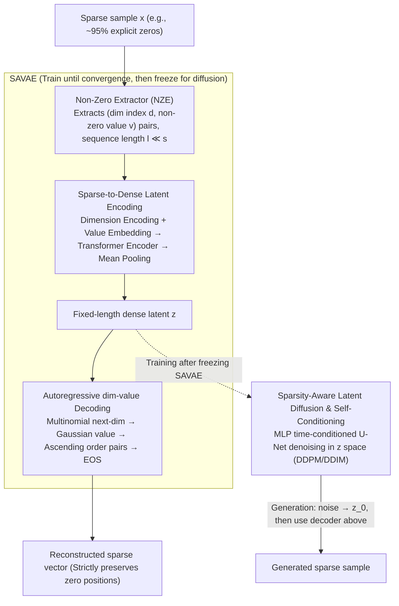

# Skipping the Zeros in Diffusion Models for Sparse Data Generation

**Conference**: ICML 2026  
**arXiv**: [2605.01817](https://arxiv.org/abs/2605.01817)  
**Code**: <https://github.com/PhilSid/sparsity-exploiting-diffusion>  
**Area**: Diffusion Models / Sparse Data Generation / Scientific Computing / Generative Modeling  
**Keywords**: Sparse Diffusion, Latent Diffusion, Autoregressive Decoding, Single-cell Sequencing, Calorimeter Images

## TL;DR
SED transforms diffusion models from "full dense denoising across all dimensions" to "diffusion only on non-zero dimensions + autoregressive decoding of dimension-value pairs," making the computational cost nearly constant relative to the number of non-zeros instead of linear with dimension, while strictly preserving the semantic information of "explicit zeros" in scientific data.

## Background & Motivation

**Background**: Diffusion Models (DM) have achieved SOTA on dense continuous data such as images, audio, and text, with DDPM/LDM serving as the de facto standards. However, much scientific data is inherently sparse: particle physics calorimeters (~95% zeros), single-cell RNA sequencing (scRNA) (90-98% zeros), recommender systems, and sparse images—where most coordinates are **zero** (no signal) rather than "near zero."

**Limitations of Prior Work**: (1) **Sparse smoothing**—feeding sparse data into DDPM/LDM causes the output to generate spurious non-zero values at all zero coordinates, destroying sparse patterns (see MNIST demonstration in Figure 1). This is catastrophic for zeros with explicit physical meanings, such as biological dropouts or "no energy deposition" in physics. (2) **Computational waste**—Rate-Distortion analysis (Figure 3) shows that while DMs allocate almost zero bit rate to zero dimensions, the denoising network still performs forward passes on all dimensions; "information capacity is concentrated in informative dimensions, but computation is not." (3) Existing patch-like methods have flaws: thresholding outputs (DDPM-T/LDM-T) preserves sparsity but sacrifices detail; domain-specific models (SARM) rely on manual spiral sampling priors for zero positions, leading to poor generalization; discrete DMs cannot handle continuous values; the recently proposed sparsity-aware DM (Ostheimer 2025) doubles the dimension by assigning a binary indicator to each dimension.

**Key Challenge**: Information (rate) is sparse, but the **computation and parameterization** of dense DMs are dense, creating a natural mismatch. One must either retain dense architectures and lose sparse semantics or abandon Transformer scalability for manual sparse priors; no previous solution achieved both.

**Goal**: (1) Enable DMs to perform diffusion on compact representations that **only process non-zero dimensions**, making computation scale with **signal density** rather than ambient dimension; (2) **strictly preserve zero patterns**, ensuring output zero positions match the ground truth; (3) avoid reliance on manual priors to remain applicable across multiple scientific domains (physics/biology/vision).

**Key Insight**: The authors represent each sparse sample as a set of "(dimension index, non-zero value)" pairs. A Transformer encoder pools this variable-length set into a **fixed-length** dense latent variable $\mathbf{z}$. Diffusion is performed on this dense latent space (which is mature and stable), and decoding involves autoregressively generating "next dimension-value pairs" until [EOS].

**Core Idea**: Break the implicit assumption that "diffusion should span all dimensions." Keep diffusion dense and stable in the **latent space**, but allow the **input space representation** and **decoding** to skip zeros, ensuring computational power follows the signal.

## Method

### Overall Architecture
SED addresses the contradiction where "sparse data fed into dense diffusion smooths zeros and wastes computation" by first compressing each sparse sample into a fixed-length dense latent vector, running mature diffusion in the latent space, and then autoregressively decoding dimension-value pairs back. This is done in two LDM-style stages: first, train a **SAVAE (Sparsity-Aware VAE)** — the Non-Zero Extractor (NZE) converts $\mathbf{x}^{(i)} \in \mathbb{R}^s$ into "dimension-value" pairs $(\mathbf{d}^{(i)}, \mathbf{v}^{(i)})$ (length $l_i \ll s$). A Transformer encoder $q_\phi$ pools this variable-length token sequence into a fixed-length latent $\mathbf{z}$. An autoregressive decoder $p_\theta = p_{\theta_1}(\mathbf{d}) p_{\theta_2}(\mathbf{v})$ sequentially outputs the next dimension and corresponding value. After SAVAE is frozen, a standard DM (DDPM/DDIM) is trained in the $\mathbf{z}$ space (corresponding to SEDP/SEDI). During generation, denoising $\mathcal{N}(0,I)$ yields $\mathbf{z}_0$, which is decoded back to a sparse vector.

### Key Designs

**1. Latent Coding SAVAE: Scaling Sequence Length with Signal**

Computational power in dense DMs is wasted on zero dimensions. SAVAE's countermeasure is to let the Transformer see only non-zero items from the start. NZE extracts the non-zero index set $\mathbf{d}^{(i)} = \{j \mid \mathbf{x}^{(i)}_j \neq 0\}$ and their values $\mathbf{v}^{(i)}$, where the sequence length $l_i = \|\mathbf{x}^{(i)}\|_0$ is much smaller than the ambient dimension $s$. To inform the Transformer which feature each token represents, the authors reuse the form of positional encoding but replace "sequence position" with "dimension index," resulting in **Dimension Encoding** $\text{DE}_{(dim, 2i)} = \sin(dim / k^{2i/d_{model}})$ ($k=20000$). Values are linearly projected and added to the DE before being fed into the encoder. The output is mean-pooled (adding a [CLS] token was tested and showed similar performance but lower stability) to obtain a fixed-length $\mathbf{z}$, with reparameterized sampling $\mathbf{z} \sim q_\phi$. This ensures computation grows with non-zeros $l_i$ rather than dimension $s$, which is the root of SED's efficiency; meanwhile, $\mathbf{z}$ is a dense low-dimensional vector compatible with mature DDPM/DDIM backends.

**2. Autoregressive dim-value Decoding: Structural Requirements of Variable-Length Sparsity**

Decoding $\mathbf{z}$ back to sparse space requires deciding "which" dimensions are non-zero (quantity varies per sample) and their "values." Fixed lengths cannot express this—one cell might have few active genes while another has many. The decoder $p_\theta(\mathbf{d}, \mathbf{v} \mid \mathbf{z})$ is therefore split into two jointly trained heads: $p_{\theta_1}$ uses a multinomial distribution to predict the next non-zero dimension index from the remaining dimensions, and $p_{\theta_2}$ predicts the corresponding value at that position using a Gaussian distribution. Pairs are decoded following a canonical ascending order of dimension indices until an [EOS] token is encountered. This ascending order eliminates permutation ambiguity. Crucially, teacher forcing is used during training to evaluate all target pairs in parallel, meaning the autoregressive nature only slows down sampling, not training.

**3. Sparsity-Aware Latent Diffusion & Self-Conditioning: Leaving Sparsity Customization to SAVAE**

The diffusion process itself remains unchanged, stable, and controllable. All "sparsity adaptation" is concentrated in the SAVAE. Decoupling these allows independent module upgrades, and training on dense $\mathbf{z}$ is far more stable than in high-dimensional sparse spaces. After freezing SAVAE, the diffusion objective is $\mathcal{L}_{\text{SED}}(\theta) = \mathbb{E}\|\mathbf{z}_0 - f_\theta(\mathbf{z}_t, t, \tilde{\mathbf{z}}_0)\|^2$, where $\mathbf{z}_t = \sqrt{\gamma(t)}\mathbf{z}_0 + \sqrt{1-\gamma(t)}\boldsymbol{\epsilon}$ and $\tilde{\mathbf{z}}_0$ is a prior estimate for self-conditioning (Chen 2023). The backbone is an MLP-based time-conditioned U-Net (conv-free as $\mathbf{z}$ lacks grid spatial structure), supporting both DDPM and DDIM samplers as SEDP and SEDI.

### Loss & Training
SAVAE follows a $\beta$-VAE form: $\mathcal{L}_{\text{SAVAE}} = -\log p_\theta(\mathbf{d}, \mathbf{v}|\mathbf{z}) + \beta \cdot D_{\text{KL}}(q_\phi \| p)$, with $\beta = 10^{-6}$ for light regularization. The negative log-likelihood is decomposed into the dimension part (multinomial) and the value part (Gaussian). Training is two-stage: first, SAVAE is trained to convergence, then it is frozen while diffusion is trained. $\gamma(t)$ decreases monotonically from 1 to 0, parameterized by log-SNR.

## Key Experimental Results

### Main Results
Covering three domains and six datasets: **Physics**—muon signal/background calorimeter images ($32 \times 32$, ~95% zero); **Biology**—Tabula Muris (98% zero) and Human Lung PF (96% zero) scRNA; **Vision**—MNIST (81% zero), Fashion-MNIST (50% zero). Metrics: Wasserstein distance $W_P$ for $P_T$ and invariant mass in physics; SCC and MMD for scRNA; sparsity histogram matching for vision.

| Task | Model (Params) | Metric | Value | Remarks |
|------|------------|------|------|------|
| Muon Signal | DDPM (37M) | $W_P (P_T)$↓ | 220.32 | dense completely fails |
| Muon Signal | DDPM-T (37M) | $W_P (P_T)$↓ | 24.22 | thresholding mitigates |
| Muon Signal | SARM (25M, domain) | $W_P (P_T)$↓ | 28.01 | uses spiral prior |
| Muon Signal | **SEDP (15M)** | $W_P (P_T)$↓ | **16.31** | least params and best |
| Tabula Muris | DDPM (5M) | SCC↑ / MMD↓ | 0.50 / 3.60 | dense fails |
| Tabula Muris | scDiffusion (5M, domain) | SCC↑ / MMD↓ | 0.71 / 1.53 | requires cell corpus pretraining |
| Tabula Muris | **SEDP (4M)** | SCC↑ / MMD↓ | **0.74 / 0.55** | no domain pretraining needed |
| Human Lung PF | **SEDP (4M)** | SCC↑ / MMD↓ | **0.82 / 0.54** | beats scDiffusion |

### Ablation Study

| Configuration | Key Metric | Description |
|------|---------|------|
| SED Full (SAVAE + Latent Diffusion + AR Decoding) | Optimal | — |
| LDM (No Sparsity Awareness) | LDM SCC=0.87 but MMD=5.82 | Correct shape but large distribution distance |
| LDM-T (Thresholded) | SCC drops to 0.26 | Thresholding destroys LDM details |
| DDPM/DDIM Original | Complete failure | Neither preserves sparsity nor matches distribution |
| SARM (Physics domain prior) | Weaker than SED | Manual spiral prior lack of generality |
| Sampling Time (95% Sparsity) | SED 24ms vs DDPM 453ms | 19× speedup at high sparsity |
| Dim-sorting Accuracy (Fashion-MNIST) | 100% | Long sequence but simple and error-free |
| Dim-sorting Accuracy (Muon BG) | 87.9% | Highest error rate under complex structures |

### Key Findings
- **Computation is nearly constant relative to dimension**: On scRNA data with 1,000 active genes, adding extra zero genes up to 27k dimensions causes DDPM/LDM to grow linearly in compute, while SED remains nearly flat (Figure 2/9).
- **Higher sparsity yields more significant speedup**: Muon (95%) speeds up by nearly 20×, MNIST (81%) by 7×, while Fashion-MNIST (50%) shows almost no speedup—SED's advantage scales strictly with sparsity.
- **SED outperforms dense baselines, thresholded variants, and domain-specific scDiffusion in scRNA tasks**—where the latter requires expensive cell corpus pretraining.
- Autoregressive sorting errors **do not** systematically worsen on long sequences (Fashion-MNIST sequences are 100% correct); the bottleneck is data complexity rather than length (e.g., Muon BG 87.9%).

## Highlights & Insights
- **"Computation only for informative dimensions" is a principle overlooked in the dense DM era**: The authors provide an elegant diagnostic analysis using Rate-Distortion theory to show that DDPM gives zero dimensions almost zero bit rate while exhausting all computational capacity on them.
- **Dimension Encoding reuses positional encoding concepts**: Replacing "sequence position" with "feature index" is a remarkably clean engineering modification that allows Transformers to consume sparse (index, value) pairs directly.
- **Two-stage decoupling**: SAVAE solves "how to represent sparsity," while diffusion handles "how to generate dense latents." Clean separation allows each module to be replaced or upgraded independently.
- This approach is transferable to graph generation (edge sparsity), 3D point clouds (spatial sparsity), KV cache compression in sparse attention, and sparsely activated MoE.

## Limitations & Future Work
- **Reliance on autoregressive decoding**—sampling must be serial, imposing latency overhead for ultra-long non-zero sequences; the authors explicitly call for non-autoregressive alternatives.
- **Dimension sorting errors** can generate unrealistic samples (MNIST demo in Figure 7), affecting 12% of samples in complex sparse patterns like particle physics; however, the authors verify this doesn't impact overall generative quality in physical experimental data.
- **Vanishing advantage at low sparsity**: On Fashion-MNIST (50% zero), SED's sampling time is nearly identical to DDPM, while LDM is faster—SED is specialized for high-sparsity.
- On scRNA, SED is slightly weaker than some LDM configurations in SCC (though better in MMD)—indicating a subtle trade-off between preserving sparsity and matching the overall distribution.
- Lack of detailed comparison with sparse Transformer works (e.g., XTrimoGene).

## Related Work & Insights
- **vs DDPM/LDM (dense baselines)**: They run denoising on all dimensions; SED only on non-zeros, achieving linear speedup with sparsity and strict zero preservation.
- **vs DDPM-T / LDM-T (post-hoc thresholding)**: Thresholding is a hack that preserves sparsity at the cost of boundary detail; SED is a structural solution.
- **vs SARM (Lu 2021, domain-specific)**: SARM hardcodes physics zero-position priors using spiral sampling, resulting in poor generalization; SED outperforms it without domain priors.
- **vs Discrete DM (Austin 2021)**: Discrete DMs can generate exact zeros but only in discrete state spaces, failing to handle continuous sparse values; SED models both "where signal is" and "how much signal there is."
- **vs scDiffusion (Luo 2024)**: scDiffusion requires pretraining an autoencoder on a massive cell corpus; SED outperforms it end-to-end without domain pretraining.
- **vs Sparse Transformer (XTrimoGene, scGPT)**: Those are for representation learning, using MSE loss only on masked genes; SED is generative and must predict dimension indices from scratch.

## Rating
- Novelty: ⭐⭐⭐⭐⭐ Breaking the "diffusion must span sparse dimensions" assumption with an AR dim-value pair decoding perspective is highly original.
- Experimental Thoroughness: ⭐⭐⭐⭐⭐ spans physics, biology, and vision, covering dense, thresholded, and domain-specific baselines.
- Writing Quality: ⭐⭐⭐⭐⭐ Clear logic from Rate-Distortion diagnostics to motivation to validation, with intuitive illustrations.
- Value: ⭐⭐⭐⭐⭐ provides a win-win solution for computation and fidelity in high-sparsity scientific scenarios; open-source code is available.

<!-- RELATED:START -->

## Related Papers

- [\[ICML 2026\] SAEmnesia: Erasing Concepts in Diffusion Models with Supervised Sparse Autoencoders](saemnesia_erasing_concepts_in_diffusion_models_with_supervised_sparse_autoencode.md)
- [\[CVPR 2026\] Guiding Token-Sparse Diffusion Models](../../CVPR2026/image_generation/guiding_token-sparse_diffusion_models.md)
- [\[ICML 2026\] GUDA: Counterfactual Group-wise Training Data Attribution for Diffusion Models via Unlearning](guda_counterfactual_group-wise_training_data_attribution_for_diffusion_models_vi.md)
- [\[ICCV 2025\] Less is More: Improving Motion Diffusion Models with Sparse Keyframes](../../ICCV2025/image_generation/less_is_more_improving_motion_diffusion_models_with_sparse_keyframes.md)
- [\[ICML 2026\] When Preference Labels Fall Short: Aligning Diffusion Models from Real Data](when_preference_labels_fall_short_aligning_diffusion_models_from_real_data.md)

<!-- RELATED:END -->
