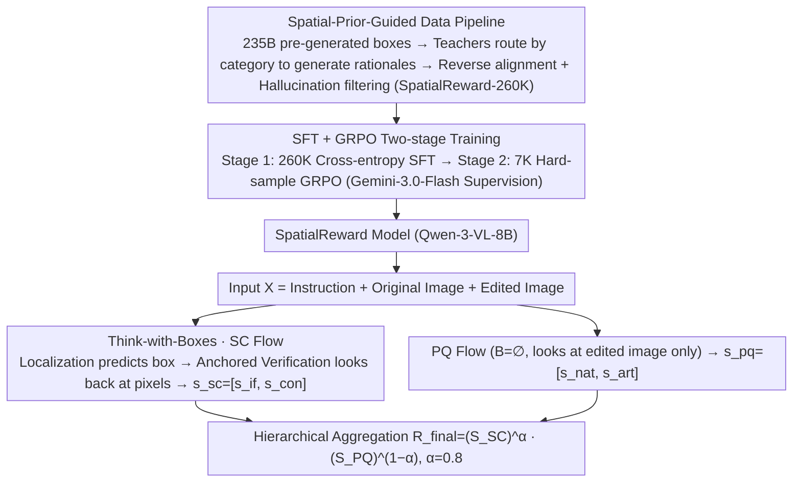

# SpatialReward: Bridging the Perception Gap in Online RL for Image Editing via Explicit Spatial Reasoning

**Conference**: ICML 2026  
**arXiv**: [2602.07458](https://arxiv.org/abs/2602.07458)  
**Code**: Project Page https://lorangan-ddup.github.io/SpatialReward/ (Available)  
**Area**: Image Generation / Image Editing / RLHF / Reward Model / Multimodal Evaluation  
**Keywords**: Reward Model, Image Editing, Online RL, Think-with-Boxes, Spatial Reasoning

## TL;DR
The authors identify an "attention collapse" issue in MLLM-based editing reward models—where the model focuses on sink tokens rather than comparing the original and edited images—and propose SpatialReward. It directs an 8B model to first predict bounding boxes for edited regions and then use these box tokens as anchors for interleaved cross-image reasoning. Combined with a 260K-sample spatial-aware dataset and a two-stage GRPO training process, it achieves SOTA on three reward benchmarks and improves the GEdit-Bench score of OmniGen2 by +0.90 (double the improvement of GPT-4.1).

## Background & Motivation

**Background**: Instruction-based image editing (InstructPix2Pix, MagicBrush, OmniGen, Qwen-Edit, FLUX, etc.) has advanced from "style transfer" to complex multi-region editing. Recently, Flow-GRPO and Dance-GRPO introduced online RL to diffusion models, treating editing as an interactive trial-and-error process aligned with human preferences, significantly outperforming SFT. However, the efficacy of online RL is strictly bottlenecked by the reward model, which must provide reliable, efficient, interpretable, and fine-grained signals across image regions.

**Limitations of Prior Work**: Existing reward designs fall into three categories, none of which are ideal for online RL in editing: (i) Pairwise rewards (e.g., MMRB2) excel at zero-shot relative ranking, but online RL requires absolute scalars; converting rankings to scalars introduces ambiguity, and $O(N^2)$ inference costs are unsustainable. (ii) Pointwise discriminative models (e.g., EditReward) add a linear head on VLM embeddings to regress human preferences but lack explicit reasoning chains, suffer from high annotation costs, and have poor scalability. (iii) Pointwise generative models ("MLLM-as-a-judge", e.g., EditScore, GPT-5) can output a chain-of-thought but require strict "cross-image regional comparison" for editing tasks. Current MLLMs lack explicit spatial anchors, and even top-tier closed-source models like GPT-5 suffer from "attention collapse": attention distributions collapse onto a few head/tail sink tokens, effectively ignoring the source image and degrading to single-image evaluation, which leads to missing subtle discrepancies.

**Key Challenge**: The training dynamics of online RL require a reward model that can perform fine-grained region-level discrimination across images while outputting absolute scalars. Mainstream MLLM evaluators lack spatial anchors to guide cross-image comparisons, so neither prompt engineering nor parameter distillation can cure "attention collapse," leading to systematic deviations from human preferences.

**Goal**: (i) Explicitly diagnose and quantify the "attention collapse" perception gap; (ii) Design an architecture that forces MLLMs to perform cross-image regional comparison; (iii) Construct a large-scale spatial-aware dataset to support this capability; (iv) Use GRPO to align preferences on hard samples; (v) Validate its ability to improve the quality of downstream online RL editing models.

**Key Insight**: The authors observed that humans follow a "locate then compare" two-step process when judging edits, which MLLMs lack natively. If the model is explicitly made to predict bounding boxes of edited regions before reasoning and then uses these box tokens as "look-here" hard pointers injected into the reasoning chain, attention can be redirected from sink tokens back to the relevant pixel areas.

**Core Idea**: Use "Think-with-Boxes" to treat spatial anchors (bounding boxes) as interleaved tokens that the language model can directly cite, forcing every region-level judgment to "look back" and make fine-grained scores based on pixel evidence. This capability is solidified into a stable reward signal via a spatial-prior data pipeline and SFT $\rightarrow$ GRPO two-stage training.

## Method

### Overall Architecture
SpatialReward addresses the perception gap where MLLMs fail to look back at the source image by transforming scoring into a conditional generation task: mapping input $X$ to a structured output $Y=(B, \mathcal T, s)$, where $B$ is a sequence of bounding boxes, $\mathcal T$ is the rationale, and $s$ is the scalar score. Following the VIEScore protocol, judgments are decoupled into two distinct flows: Semantic Consistency (SC, covering instruction following $s_{if}$ and source consistency $s_{con}$) which follows the "locate then compare" Think-with-Boxes path, and Perceptual Quality (PQ, covering naturalness $s_{nat}$ and artifacts $s_{art}$) which performs reference-less evaluation on the edited image alone. The results are synthesized via hierarchical aggregation: $R_{final}=(S_{SC})^{\alpha}(S_{PQ})^{1-\alpha}$ (where $\alpha=0.8$).

### Key Designs

**1. Think-with-Boxes: Encoding "Where to Look" in the Reasoning Chain**

The root cause of MLLM collapse onto sink tokens during cross-image evaluation is the lack of grounding to specific pixels. SpatialReward forces the SC flow into three steps using box tokens as interleaved citations: first, **Localization** predicts bounding boxes $B$ for all edited objects (e.g., `<|bbox_0|>(x1,y1,x2,y2)`); second, during **Anchored Verification**, every appearance of `<|bbox_id|>` in the rationale $\mathcal T$ forces the model to "look back" at the corresponding pixels, while an additional `<|global|>` token triggers a global context scan; finally, it outputs SC scores $s_{sc}=[s_{if}, s_{con}]$. The PQ flow, requiring no comparison, uses $B=\emptyset$ and outputs only text and $s_{pq}=[s_{nat}, s_{art}]$. The backbone is Qwen-3-VL-8B-Instruct. This mechanism forces the model to re-examine relevant areas for every regional judgment, restoring healthy cross-image attention (as shown in Fig.1c).

**2. Spatial-Prior-Guided Data Pipeline: 260K Aligned Training Samples**

Teaching SFT the "ground then reason" paradigm requires large-scale data where boxes, rationales, and scores are consistently aligned. The authors distilled SpatialReward-260k using a three-step pipeline: **Step I** uses Qwen-3-VL-235B to pre-generate boxes $B$ as spatial priors. **Step II** routes samples to expert teachers: human edits go to Gemini-2.5-Pro with crop prompts, while object edits go to GPT-5 with visualized box overlays to force focus. **Step III** feeds $\mathcal T_{raw}$ and $B$ back into Qwen-3-VL-235B for alignment (writing into interleaved format) and hallucination checks, discarding inconsistent samples. The final 260K set includes 100K cleaned EditScore data (with boxes), 100K EditReward data (new rationales), and 60K self-constructed multi-region edits.

**3. SFT + GRPO Two-stage Training: Correcting SFT Tail Bias with Online RL**

SFT fits the "average" of the teacher distribution and may still hallucinate on tail-end hard samples. **Stage 1** performs SFT on Qwen-3-VL-8B-Instruct using standard cross-entropy: $\mathcal L_{SFT}=-\sum_t \log P_\theta(y_t|y_{<t}, X)$. **Stage 2** identifies 7K low-score hard samples and uses Gemini-3.0-Flash as an Online Supervisor to provide 0–1 consistency scores for model rollouts. Optimization follows GRPO for relative group preference: $\mathcal J_{GRPO}=\mathbb E[\frac{1}{G}\sum_i \frac{\pi_\theta(o_i|q)}{\pi_{\theta_{old}}(o_i|q)}\hat A_i] - \beta D_{KL}(\pi_\theta\|\pi_{ref})$, where advantage $\hat A_i=(r_i-\mathrm{mean}\{r_j\})/\mathrm{std}\{r_j\}$. This specifically targets the hard samples where SFT is prone to error. A critical detail for RL dynamics is reward aggregation: using a weighted geometric mean $R=(S_{SC})^\alpha (S_{PQ})^{1-\alpha}$ provides dense gradients while penalizing bottlenecks, unlike min (sparse gradients, slow convergence) or arithmetic mean (fails to penalize single-dimension failures).

## Key Experimental Results

### Main Results
Overall accuracy on three reward benchmarks (bold denotes highest; SpatialReward uses Qwen-3-VL-8B):

| Model | EditReward-Bench (Ovrl) | MMRB2 (Ovrl) | MER-Bench (Ovrl) |
|------|------------------------|--------------|------------------|
| GPT-4.1 | 0.705 | 0.535 | 0.358 |
| GPT-5 | 0.755 | 0.619 | 0.423 |
| Gemini-2.5-Pro | 0.722 | 0.534 | 0.462 |
| Gemini-3.0-Flash | 0.769 | 0.621 | **0.508** |
| EditScore-8B (baseline) | 0.690 | 0.570 | 0.350 |
| EditReward (Discrim.) | 0.792 | 0.657 | 0.448 |
| **SpatialReward (Ours, 8B)** | **0.803** | **0.661** | 0.483 |

Downstream Online RL (OmniGen2 + Flow-GRPO, Overall score gain $\Delta$ on GEdit-Bench-EN):

| Reward signal | GEdit Ovrl | $\Delta$ |
|---------------|-----------|----------|
| Baseline OmniGen2 | 6.42 | — |
| w/ GPT-4.1 | 6.73 | +0.45 |
| w/ EditScore | 6.89 | +0.61 |
| w/ EditReward | 7.19 | +0.77 |
| **w/ SpatialReward** | **7.32** | **+0.90** |

### Ablation Study

| Configuration | EditReward-Bench Acc. | Description |
|------|------------------------|------|
| SFT baseline (No spatial anchors) | 0.743 | Starting point |
| SFT w/ Box Only (Predict but don't cite) | 0.761 | Gains from boxes alone |
| SFT w/ Think-with-Box | 0.778 | Explicit citation adds gains |
| **+ Online GRPO** | **0.803** | RL stage is critical |
| Weighted Geometric Mean (Ours) | **0.803** | Dense gradients + bottleneck penalty |

Attention Diagnosis (on 776 samples from EditReward-Bench):

| Method | Entropy Diff $|\Delta H|$ ↓ | Source Entropy $H_{src}$ | Center Mass ↓ | Consist. ↑ |
|------|-------------------|----------------|----------|---------------|
| Baseline | 3.48 ± 0.57 | 2.88 ± 0.71 | 0.84 ± 0.05 | 0.04 |
| **Ours** | **1.16 ± 1.10** | **5.71 ± 0.81** | **0.37 ± 0.14** | **0.12** |

### Key Findings
- Box prediction alone gains 1.8 points; adding box citations adds another 1.7 points, proving spatial anchors and active citation are independent effective components.
- On the difficult MER-Bench 4-Pair task (fine-grained sub-dimension differences), SpatialReward (21.5% accuracy) surpasses Gemini-3.0-Flash (19.5%), demonstrating the value of spatial anchors for extreme granularity.
- In RL, SpatialReward's +0.90 gain is 1.5x of EditScore (+0.61) and 2x of GPT-4.1 (+0.45), while being 1.5x faster than EditReward via vLLM integration.
- Attention diagnosis quantitatively confirms the "attention collapse" hypothesis: centrality dropped from 0.84 to 0.37, while source entropy rose from 2.88 to 5.71, restoring a healthy symmetric distribution.

## Highlights & Insights
- It is the first to quantitatively diagnose the "perception gap" in MLLM-as-a-judge as "attention collapse to sink tokens" and fix it with a simple box-cite mechanism.
- The essence of "Think-with-Boxes" is allowing generated tokens to pass spatial hard pointers, an idea applicable to any cross-image/region task (Multi-doc retrieval, UI verification, Spatial QA).
- The use of weighted geometric mean for reward aggregation is a significant engineering insight: it avoids the sparse gradients of 'min' and the failure to penalize bottlenecks in arithmetic means.
- The data pipeline (Expert Routing + Box Overlay + Reverse Alignment) provides a standard template for distilling high-quality data from a mix of open and closed models.

## Limitations & Future Work
- The reward is a single scalar; it does not yet backpropagate local rewards for each edited region (Region-level credit assignment is a future direction for Flow-GRPO).
- Spatial anchors rely solely on boxes; they lack support for arbitrary shapes (masks), which may be too coarse for pixel-level tasks like hair editing.
- The GRPO stage uses Gemini-3.0-Flash as a supervisor, which is still a closed-source model, limiting full open-source replication of the reward model.
- At 8B, the model still lags behind Gemini-3.0-Flash on MER-Bench (0.483 vs 0.508), suggesting spatial anchors do not entirely close the gap in complex multi-constraint reasoning.

## Related Work & Insights
- **vs EditScore**: EditScore (8B) is distilled from GPT-4.1 but lacks spatial anchors and suffers from attention collapse; this paper shows adding Think-with-Boxes gains +11.3% with the same parameters.
- **vs EditReward**: EditReward only models instruction following; its lack of source consistency modeling can cause generators to over-modify images. This work uses explicit SC dimensions to prevent content drift.
- **vs VIEScore / Multi-modal LM Evaluators**: Most rely on raw model power or yes/no probabilities; this work proves that even an 8B model with spatial anchors can outperform trillion-parameter closed models.
- **vs VLM Spatial Reasoning (Shikra, Ferret)**: While previous work shows coordinates enhance object-attribute binding, this is the first application to reward modeling, making "explicit citation of coordinates" the core evaluation mechanism.

## Rating
- Novelty: ⭐⭐⭐⭐⭐ 
- Experimental Thoroughness: ⭐⭐⭐⭐⭐ 
- Writing Quality: ⭐⭐⭐⭐⭐ 
- Value: ⭐⭐⭐⭐⭐ 

<!-- RELATED:START -->

## Related Papers

- [\[ICLR 2026\] EditScore: Unlocking Online RL for Image Editing via High-Fidelity Reward Modeling](../../ICLR2026/image_generation/editscore_unlocking_online_rl_for_image_editing_via_high-fidelity_reward_modelin.md)
- [\[CVPR 2026\] SpatialReward: Verifiable Spatial Reward Modeling for Fine-Grained Spatial Consistency in Text-to-Image Generation](../../CVPR2026/image_generation/spatialreward_verifiable_spatial_reward_modeling_for_fine-grained_spatial_consis.md)
- [\[CVPR 2026\] UniGen-1.5: Enhancing Image Generation and Editing through Reward Unification in RL](../../CVPR2026/image_generation/unigen-15_enhancing_image_generation_and_editing_through_reward_unification_in_r.md)
- [\[ICLR 2026\] Bridging Generalization Gap of Heterogeneous Federated Clients Using Generative Models](../../ICLR2026/image_generation/bridging_generalization_gap_of_heterogeneous_federated_clients_using_generative_.md)
- [\[ICML 2026\] A Systematic Investigation of RL-Jailbreaking in LLMs](a_systematic_investigation_of_rl-jailbreaking_in_llms.md)

<!-- RELATED:END -->
