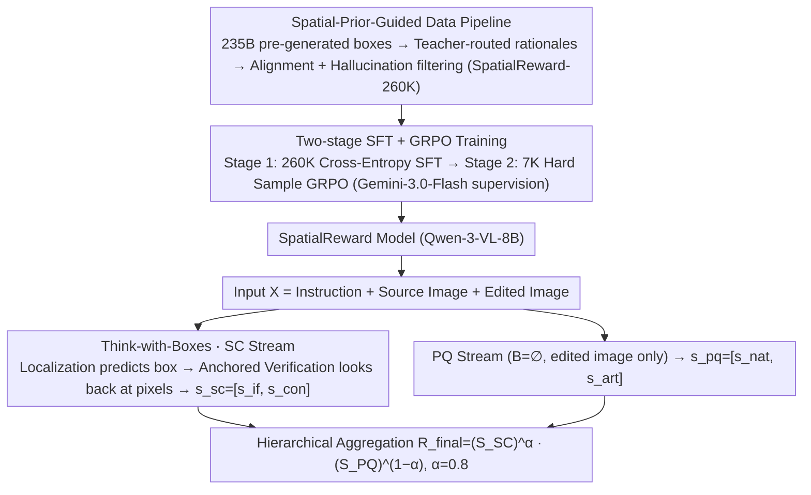

# SpatialReward: Bridging the Perception Gap in Online RL for Image Editing via Explicit Spatial Reasoning

**Conference**: ICML 2026  
**arXiv**: [2602.07458](https://arxiv.org/abs/2602.07458)  
**Code**: Project Page https://lorangan-ddup.github.io/SpatialReward/ (Available)  
**Area**: Image Generation / Image Editing / RLHF / Reward Model / Multimodal Evaluation  
**Keywords**: Reward Model, Image Editing, Online RL, Think-with-Boxes, Spatial Reasoning

## TL;DR
The authors identify an "attention collapse" issue in MLLM-based editing reward models—where the models fail to compare the source and edited images and instead collapse onto sink tokens for blind judgment. They propose SpatialReward: an 8B model that first predicts bounding boxes for edited regions and then utilizes these box tokens as anchors for interleaved cross-image reasoning. Combined with a 260K-sample spatial-aware dataset and two-stage GRPO training, it achieves SOTA on three reward benchmarks and improves OmniGen2's GEdit-Bench score by +0.90 (double the gain of GPT-4.1).

## Background & Motivation

**Background**: Instructed image editing (e.g., InstructPix2Pix, MagicBrush, OmniGen, Qwen-Edit, FLUX) has expanded from "style transfer" to complex multi-region editing. Recently, Flow-GRPO and Dance-GRPO introduced online RL into diffusion models, treating editing as an interactive trial-and-error process aligned with human preferences, significantly outperforming SFT. However, the efficacy of online RL is strictly bottlenecked by the reward model—reward signals must be reliable, efficient, interpretable, and capable of fine-grained judgment across image regions.

**Limitations of Prior Work**: Existing reward designs fall into three categories, none of which are ideal for online RL in editing tasks: (i) Pairwise rewards (e.g., MMRB2) excel at zero-shot relative ranking, but online RL requires absolute scalars; converting rankings to scalars introduces ambiguity, and $O(N^2)$ inference costs are prohibitive. (ii) Pointwise discriminative models (e.g., EditReward) add linear heads to VLM embeddings to regress human preferences but lack explicit reasoning chains, suffer from high annotation costs, and have poor scalability. (iii) Pointwise generative models ("MLLM-as-a-judge", e.g., EditScore, GPT-5) can output chains-of-thought but require strict "cross-image regional comparison" for editing—current MLLMs lack explicit spatial anchors. Even top-tier closed-source models like GPT-5 suffer from "attention collapse": attention distributions collapse onto a few sink tokens at the start and end, while the source image is largely ignored, effectively degrading to single-image evaluation and missing subtle differences.

**Key Challenge**: The training dynamics of online RL require the reward model to perform fine-grained region-level discrimination across images while outputting absolute scalars. However, current MLLM evaluators lack spatial anchors to guide cross-image comparison, meaning neither prompt engineering nor parameter distillation can cure "attention collapse," leading to systematic deviations from human preferences.

**Goal**: (i) Formally diagnose and quantify the "attention collapse" perception gap; (ii) Design an architecture that forces MLLMs to perform cross-image regional comparison; (iii) Construct large-scale spatial-aware data to support this capability; (iv) Align preferences on hard samples using GRPO; (v) Verify its ability to improve the quality of downstream online RL editing models.

**Key Insight**: The authors found that humans follow a "localize then compare" two-step process when judging edits, which MLLMs lack natively. By explicitly requiring the model to predict bounding boxes of edited regions before reasoning and using these box tokens as "look here" hard pointers injected into the reasoning chain, attention can be redirected from sink tokens back to the relevant pixel regions.

**Core Idea**: Use "Think-with-Boxes" to treat spatial anchors (bounding boxes) as interleaved tokens that the language model can directly cite, forcing each region-level judgment to "look back" and provide fine-grained scores based on pixel evidence. This capability is solidified into a stable reward signal via a spatial-prior data pipeline and a two-stage SFT $\rightarrow$ GRPO training process.

## Method

### Overall Architecture
SpatialReward addresses the perception gap where MLLMs fail to look back at the source image during scoring. It reformulates the reward from a blind scoring task into a conditional generation task: mapping input $X$ to a structured output $Y=(B, \mathcal T, s)$, where $B$ is a sequence of bounding boxes for edited regions, $\mathcal T$ is the textual rationale, and $s$ is the scalar score. Following the VIEScore protocol, judgment is decoupled into two streams: Semantic Consistency (SC, including instruction following $s_{if}$ and source consistency $s_{con}$) follows the "Think-with-Boxes" path to compare images, while Perceptual Quality (PQ, including naturalness $s_{nat}$ and artifacts $s_{art}$) performs reference-less evaluation on the edited image alone. Results are finally synthesized via hierarchical aggregation: $R_{final}=(S_{SC})^{\alpha}(S_{PQ})^{1-\alpha}$ (with $\alpha=0.8$).

### Key Designs

**1. Think-with-Boxes: Encoding "Where to Look" into the Reasoning Chain**
MLLMs collapse to sink tokens during cross-image evaluation because they are never forced to ground to specific pixels. SpatialReward forces the SC stream through three steps using spatial anchors as interleaved tokens: first, **Localization** predicts bounding boxes $B$ for all edited objects (e.g., `<|bbox_0|>(x1,y1,x2,y2)`); then, **Anchored Verification** forces the model to "look back" at corresponding pixels whenever a `<|bbox_id|>` appears in the rationale $\mathcal T$, with an additional `<|global|>` token triggering a global context scan; finally, it outputs SC scores $s_{sc}=[s_{if}, s_{con}]$. The PQ stream omits $B$ as it does not require the source image. Using Qwen-3-VL-8B-Instruct as the backbone, this mechanism forces the model to re-examine the target regions for every regional judgment, restoring a healthy attention distribution (as visualized in Fig. 1c).

**2. Spatial-Prior-Guided Data Pipeline: 260K Aligned Training Samples**
Training the "ground-then-reason" paradigm requires large-scale data where boxes, rationales, and scores are consistently aligned. The authors distilled SpatialReward-260k using a three-step pipeline: **Step I** uses Qwen-3-VL-235B to pre-generate bounding boxes $B$ as spatial priors. **Step II** routes samples to expert teachers: human editing tasks go to Gemini-2.5-Pro with crop prompts, while object editing goes to GPT-5 with visual box overlays to force focus. **Step III** feeds raw rationales $\mathcal T_{raw}$ and $B$ back into Qwen-3-VL-235B for alignment (formatting as interleaved tokens) and hallucination checks, discarding samples where $\mathcal T$ and $B$ are inconsistent. The final 260K includes 100K cleaned EditScore samples, 100K regenerated EditReward rationales, and 60K self-constructed multi-region editing samples.

**3. SFT + GRPO Two-Stage Training: Correcting Long-Tail Bias via Online RL**
SFT only fits the "average" of the teacher distribution and may still produce hallucinated scores on long-tail hard samples. **Stage 1** performs SFT on Qwen-3-VL-8B-Instruct using 260K samples with a standard cross-entropy loss $\mathcal L_{SFT}=-\sum_t \log P_\theta(y_t|y_{<t}, X)$. **Stage 2** selects 7K low-score hard samples and uses Gemini-3.0-Flash as an online supervisor to provide consistency rewards (0–1 binary) for model rollouts. Optimization follows GRPO:
$$\mathcal J_{GRPO}=\mathbb E[\frac{1}{G}\sum_i \frac{\pi_\theta(o_i|q)}{\pi_{\theta_{old}}(o_i|q)}\hat A_i] - \beta D_{KL}(\pi_\theta\|\pi_{ref})$$
where the advantage $\hat A_i=(r_i-\mathrm{mean}\{r_j\})/\mathrm{std}\{r_j\}$. The final reward uses a weighted geometric mean $R=(S_{SC})^\alpha (S_{PQ})^{1-\alpha}$ instead of a minimum (which yields sparse gradients) or an arithmetic mean (which fails to penalize single-dimension failures), providing dense gradients while suppressing "short boards" (weak dimensions).

## Key Experimental Results

### Main Results
Overall accuracy on three reward benchmarks (Bold denotes best; SpatialReward uses Qwen-3-VL-8B):

| Model | EditReward-Bench (Ovrl) | MMRB2 (Ovrl) | MER-Bench (Ovrl) |
| :--- | :---: | :---: | :---: |
| GPT-4.1 | 0.705 | 0.535 | 0.358 |
| GPT-5 | 0.755 | 0.619 | 0.423 |
| Gemini-2.5-Pro | 0.722 | 0.534 | 0.462 |
| Gemini-3.0-Flash | 0.769 | 0.621 | **0.508** |
| EditScore-8B (baseline) | 0.690 | 0.570 | 0.350 |
| EditReward (Discriminative) | 0.792 | 0.657 | 0.448 |
| **SpatialReward (Ours, 8B)** | **0.803** | **0.661** | 0.483 |

Downstream Online RL (OmniGen2 + Flow-GRPO, improvement $\Delta$ in Overall score on GEdit-Bench-EN):

| Reward signal | GEdit Ovrl | $\Delta$ |
| :--- | :---: | :---: |
| Baseline OmniGen2 | 6.42 | — |
| w/ GPT-4.1 | 6.73 | +0.45 |
| w/ EditScore | 6.89 | +0.61 |
| w/ EditReward | 7.19 | +0.77 |
| **w/ SpatialReward** | **7.32** | **+0.90** |
| stronger backbone (UniRef-Edit) | 7.46→7.56 | +0.10 |

### Ablation Study

| Configuration | EditReward-Bench Acc | Description |
| :--- | :---: | :--- |
| SFT baseline (No spatial anchors) | 0.743 | Starting point |
| SFT w/ Box Only (Predict but don't cite) | 0.761 | Boxes alone help |
| SFT w/ Think-with-Box | 0.778 | Explicit citation gain |
| **+ Online GRPO** | **0.803** | RL stage is critical |
| Bucket Principle (min aggregation) | 0.774 | Sparse gradients |
| Arithmetic Mean aggregation | 0.771 | No "short board" penalty |
| Weighted Geometric Mean (Ours) | **0.803** | Dense & penalizing |

Attention Diagnosis (on 776 EditReward-Bench samples):

| Method | Entropy Diff $|\Delta H|$ ↓ | Source Entropy $H_{src}$ | Concentration ↓ | Consistency ↑ |
| :--- | :---: | :---: | :---: | :---: |
| Baseline | 3.48 ± 0.57 | 2.88 ± 0.71 | 0.84 ± 0.05 | 0.04 |
| **Ours** | **1.16 ± 1.10** | **5.71 ± 0.81** | **0.37 ± 0.14** | **0.12** |

### Key Findings
- Predicting boxes alone gains 1.8 points; citing them during reasoning gains another 1.7 points, showing spatial anchors and active citation are independent, effective components.
- On the MER-Bench 4-Pair set (fine-grained sub-dimension differences), SpatialReward (21.5%) outperforms Gemini-3.0-Flash (19.5%), proving spatial anchors are particularly effective for hard discrimination.
- In RL, SpatialReward's +0.90 gain is 1.5x EditScore's (+0.61) and 2x GPT-4.1's (+0.45), with 1.5x faster inference than EditReward (via vLLM integration).
- Attention diagnosis quantitatively confirms the hypothesis: concentration decreased (0.84 $\rightarrow$ 0.37) and source entropy increased (2.88 $\rightarrow$ 5.71), restoring the distribution to a healthy symmetric state.

## Highlights & Insights
- Formally diagnoses the "attention collapse to sink tokens" in MLLM-as-a-judge and cures it with a box-citation mechanism.
- "Think-with-Boxes" allows generation tokens to pass spatial "hard pointers," a concept transferable to any task requiring cross-image judgment (e.g., UI verification, spatial QA).
- The use of the weighted geometric mean for reward aggregation solves the gradient sparsity of `min` and the "short board" oversight of arithmetic means, significantly impacting RL dynamics.
- The data pipeline (specialist routing + box overlay + consistency check) serves as a template for generating high-quality data from ensemble teacher models.

## Limitations & Future Work
- The reward is a single scalar rather than region-level rewards backpropagated individually; region-level credit assignment is a future direction for denser supervision.
- Spatial anchors rely on boxes; they may be too coarse for hair-level or irregular shape editing compared to masks.
- Reliance on Gemini-3.0-Flash for GRPO supervision limits full open-source reproducibility.
- The 8B model still trails Gemini-3.0-Flash on MER-Bench (0.483 vs 0.508), indicating that spatial anchors do not entirely bridge the gap in complex multi-constraint reasoning.

## Related Work & Insights
- **vs. EditScore**: While both use similar backbones, EditScore lacks spatial anchors and suffers from attention collapse; this work shows spatial grounding adds +11.3% in accuracy.
- **vs. EditReward**: EditReward lacks source consistency modeling, leading to over-modification in RL; SpatialReward's explicit SC dimension prevents content drift.
- **vs. Spatial VLMs (Shikra, Ferret, etc.)**: While these works use coordinates to enhance object binding, SpatialReward is the first to use "explicitly citing coordinates during reasoning" as a core mechanism for reward modeling.

## Rating
- Novelty: ⭐⭐⭐⭐⭐ 
- Experimental Thoroughness: ⭐⭐⭐⭐⭐ 
- Writing Quality: ⭐⭐⭐⭐⭐ 
- Value: ⭐⭐⭐⭐⭐ 

<!-- RELATED:START -->

## Related Papers

- [\[ICLR 2026\] EditScore: Unlocking Online RL for Image Editing via High-Fidelity Reward Modeling](../../ICLR2026/image_generation/editscore_unlocking_online_rl_for_image_editing_via_high-fidelity_reward_modelin.md)
- [\[CVPR 2026\] SpatialReward: Verifiable Spatial Reward Modeling for Fine-Grained Spatial Consistency in Text-to-Image Generation](../../CVPR2026/image_generation/spatialreward_verifiable_spatial_reward_modeling_for_fine-grained_spatial_consis.md)
- [\[ICML 2026\] A Systematic Investigation of RL-Jailbreaking in LLMs](a_systematic_investigation_of_rl-jailbreaking_in_llms.md)
- [\[ICLR 2026\] Bridging Generalization Gap of Heterogeneous Federated Clients Using Generative Models](../../ICLR2026/image_generation/bridging_generalization_gap_of_heterogeneous_federated_clients_using_generative_.md)
- [\[CVPR 2026\] ReasonEdit: Towards Reasoning-Enhanced Image Editing Models](../../CVPR2026/image_generation/reasonedit_towards_reasoning-enhanced_image_editing_models.md)

<!-- RELATED:END -->
