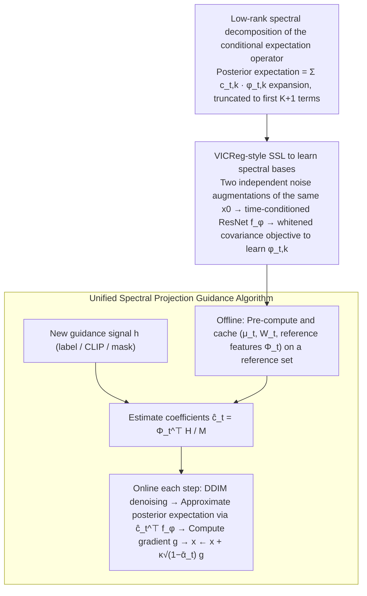

# Spectral Guidance for Flexible and Efficient Control of Diffusion Models

**Conference**: ICML 2026  
**arXiv**: [2605.28900](https://arxiv.org/abs/2605.28900)  
**Code**: https://github.com/gabmoreira/spectralguidance  
**Area**: Diffusion Models / Image Generation / Controllable Generation  
**Keywords**: Spectral Guidance, Training-free Guidance, Conditional Expectation Operator, Singular Value Decomposition, Self-supervised Learning

## TL;DR
This paper proposes Spectral Guidance: by self-supervising the learning of the left singular functions of the conditional expectation operator in the diffusion process, arbitrary guidance signals (labels / CLIP / masks) are projected onto a set of spectral bases aligned with diffusion dynamics. This bypasses denoiser backpropagation, achieving a 37 percentage point accuracy improvement over the strongest training-free baseline on CIFAR-10 while being 4x faster in sampling.

## Background & Motivation

**Background**: Controllable generation in diffusion models primarily follows two paths. The first is classifier guidance / classifier-free guidance, which binds the model to a fixed set of conditions during training. The second is training-free guidance (DPS / LGD / FreeDoM / TFG), which pulls arbitrary clean-data loss $p(y\mid x_0)$ back to the $x_t$ space via the denoiser's point estimate $\hat{x}_0(x_t)$ during sampling.

**Limitations of Prior Work**: The first category lacks flexibility, requiring retraining for new conditions. The second category is flexible but costly: it requires backpropagation through the denoiser at every sampling step, which is computationally expensive and prone to vanishing gradients. Furthermore, the approximation $p(y\mid x_0)\approx p(y\mid \hat{x}_0(x_t))$ only holds strictly when $p(y\mid x_0)$ is an affine function of $x_0$; at high noise levels, the posterior mean often drifts off the data manifold, leading to incorrect guidance gradient directions.

**Key Challenge**: Training-free guidance aims to use arbitrary clean-data signals but is forced to perform point estimation through the denoiser, creating a natural conflict between flexibility and stability/efficiency.

**Goal**: Construct an intermediate representation independent of specific guidance signals, such that calculating $p_t(y\mid x_t)$ degrades into a linear projection, decoupled from the denoiser.

**Key Insight**: View the conditional expectation $p_t(y\mid x_t) = \mathbb{E}_{X_0\sim p_t(\cdot\mid x_t)}[p(y\mid X_0)]$ as a linear operator $T_t$ from the clean space $\mathcal{H}_0$ to the noisy space $\mathcal{H}_t$. As $t$ increases and noise erases information, $T_t$ becomes low-rank almost everywhere, leaving only a few "noise-resistant" directions. These directions are the left singular functions $\{\phi_{t,k}\}$ of $T_t$, forming a set of time-varying low-dimensional coordinates aligned with diffusion dynamics.

**Core Idea**: Perform a spectral expansion of any guidance signal on this set of left singular bases $\mathbb{E}[h(X_0)\mid x_t]=\sum_k c_{t,k}\phi_{t,k}(x_t)$. Truncating to the first $K+1$ terms provides a stable and inexpensive guidance estimate. $\phi_{t,k}$ itself can be learned offline using a VICReg-style SSL objective, no longer depending on denoiser gradients.

## Method

### Overall Architecture
The bottleneck of training-free guidance lies in calculating the posterior expectation $p_t(y\mid x_t)$ at each step, which necessitates denoiser point estimation and backpropagation. This paper algebraicizes this process: first, a set of "spectral coordinates" aligned with the diffusion process is learned offline as an intermediate representation shared by all guidance signals. Subsequently, any new guidance signal is projected onto these coordinates; online sampling then degrades into linear projection on a shallow network plus one shallow gradient calculation, without touching the denoiser. The workflow is split into offline and online phases—offline learning of spectral bases and caching reference features, and online projection of label / CLIP / mask signals to inject them into the trajectory.

### Key Designs

**1. Low-rank spectral decomposition of the conditional expectation operator: Turning "posterior expectation" into denoiser-independent linear projection**

Training-free guidance is limited because $p_t(y\mid x_t)=\mathbb{E}_{X_0\sim p_t(\cdot\mid x_t)}[p(y\mid X_0)]$ depends on the specific signal $h$ and the denoiser point estimate $\hat x_0(x_t)$. This paper treats the posterior expectation as a linear operator $T_t:\mathcal{H}_0\to\mathcal{H}_t$, $(T_tf)(x_t):=\mathbb{E}[f(X_0)\mid x_t]$, where its adjoint $T_t^\ast$ corresponds to forward diffusion. The covariance operator $T_tT_t^\ast$ is compact and self-adjoint, possessing a spectral decomposition $T_tf=\sum_k \sigma_{t,k}\phi_{t,k}(x_t)\,\mathbb{E}_{p_0}[f\psi_{t,k}]$. Proposition 4.1 expresses the posterior expectation of any $h\in\mathcal{H}_0$ as an expansion on the left singular functions:

$$\mathbb{E}[h(X_0)\mid x_t]=\sum_k c_{t,k}\,\phi_{t,k}(x_t),\qquad c_{t,k}=\mathbb{E}[h(X_0)\phi_{t,k}(X_t)].$$

Thus, calculating the posterior expectation shifts from depending on $h$ and denoiser point estimates to a fixed linear projection depending only on the diffusion process itself. The truncation to low-rank is possible because the $L^2(p_t)$ error of the first $K$ terms is bounded by $\sigma_{t,K+1}^2\|h\|_{p_0}^2$. Proposition 4.7 further proves that $\sigma_{t,k}^2\le \mathbb{E}_{p_0}[\chi^2(p_t(\cdot\mid X_0)\|p_t)]$ ($k\ge2$) vanishes as $\bar\alpha_t\to0$. The higher the noise, the fewer modes survive, making the low-rank approximation stricter; $K$ thus serves as an "intrinsic information dimension upper bound" for guidance.

**2. VICReg-style SSL to learn spectral bases: Using dual-noise diffusion as augmentation to learn singular functions without the denoiser**

The singular functions $\{\phi_{t,k}\}$ must be learned without access to the denoiser. Theorem 4.2 provides a variational characterization: for any $f=(f_1,\dots,f_K)^\top$ with $\mathbb{E}_{p_t}[f]=0$, $\max_f \operatorname{Tr}(\mathbf{C}_t(f)\boldsymbol{\Sigma}_t(f)^{-1})=\sum_{k=2}^{K+1}\sigma_{t,k}^2$, where the maximizers are $\text{span}\{\phi_{t,k}\}$. This Rayleigh–Ritz form is equivalent to Kernel PCA with the kernel $\zeta(x_t,\tilde x_t):=\int p_t(x_t\mid x_0)p_t(\tilde x_t\mid x_0)p_0(x_0)\,dx_0$. Crucially, $(x_t, \tilde x_t)$ pairs obtained by sampling independent noise for the same $x_0^{(i)}$ are paired samples of the covariance operator $T_tT_t^\ast$—replacing manual crops in VICReg. Implementation uses a lightweight time-conditioned ResNet $f_\phi:\mathcal{X}\times\mathbb{R}_{>0}\to\mathbb{R}^K$ producing $\mathbf{Z},\tilde{\mathbf{Z}}\in\mathbb{R}^{B\times K}$. Whitening matrix $\mathbf{W}=\mathbf{V}(\boldsymbol{\Lambda}+\xi\mathbf{I})^{-1/2}$ is constructed from the batch covariance decomposition $\hat{\boldsymbol{\Sigma}}=\mathbf{V}\boldsymbol{\Lambda}\mathbf{V}^\top$ to optimize:

$$L=-\operatorname{Tr}\big((\mathbf{Z}^w)^\top\tilde{\mathbf{Z}}^w\big)\big/\big(K(B-1)\big),$$

where the whitening term $\boldsymbol{\Sigma}_t(f)^{-1}$ prevents collapse, with stop-gradient applied to one side to stabilize training.

**3. Unified Spectral Projection Guidance Algorithm: Heavy lifting moved offline, online left with shallow gradients reused across tasks**

With $f_\phi$, all "heavy lifting" is moved to a one-time offline phase: for each $t\in\mathcal{T}$, whitening transforms $(\boldsymbol{\mu}_t,\mathbf{W}_t)$ and reference feature matrices $\boldsymbol{\Phi}_t=[\mathbf{1}\;(\mathbf{Z}_t-\boldsymbol{\mu}_t)\mathbf{W}_t]\in\mathbb{R}^{M\times(K+1)}$ are pre-computed and cached on a reference set $\mathcal{D}_\text{ref}=\{x_0^{(i)}\}_{i=1}^M$. For a new signal $h$, coefficients $\hat{\mathbf{c}}_t=\boldsymbol{\Phi}_t^\top\mathbf{H}/M$ are estimated via Monte Carlo. During sampling (Algorithm 2), each step performs standard DDIM denoising, approximates $\mathbb{E}[h(X_0)\mid x_t]$ with $\hat{\mathbf{c}}_t^\top f_\phi^w(x,t)$, computes gradient $g=\nabla_{x}\mathcal{L}(\hat{\mathbf{c}}_t^\top f_\phi^w(x,t))$, and injects it into the trajectory $x\leftarrow x+\kappa\sqrt{1-\bar\alpha_t}\,g$. Only the loss $\mathcal{L}$ changes for different tasks: log-likelihood for labels, cosine similarity for CLIP, and MSE for masks. Since gradients only pass through a 16M parameter $f_\phi$ (vs 114M denoiser) and $\{\boldsymbol{\Phi}_t\}$ is reused, the training-free flexibility is fully realized.

### Loss & Training
The training optimizes a single objective $L=-\operatorname{Tr}((\mathbf{Z}^w)^\top\tilde{\mathbf{Z}}^w)/(K(B-1))$ with a small ridge term $\xi$. Timesteps are sampled uniformly from $\mathcal{T}$; $\boldsymbol{\mu},\mathbf{W}$ are recomputed per batch. $K$ is set to 512 for CIFAR-10 / CelebA-HQ and 2000 for ImageNet. Training $f_\phi$ on CelebA-HQ takes $\approx 10$ GPU·h; pre-calculating $\{\boldsymbol{\Phi}_t\}$ takes only 0.8 GPU·h.

## Key Experimental Results

### Main Results
Spectral Guidance is compared against DPS / LGD / FreeDoM / MPGD / UGD / TFG on CIFAR-10 / CelebA-HQ / ImageNet across label, attribute, CLIP, and mask tasks using a shared unconditional DDPM U-Net.

| Dataset / Task | Metric | Unconditional | Strongest baseline | Ours | Gain |
|---|---|---|---|---|---|
| CIFAR-10 / Labels | Acc↑ | 10.0 | 52.0 (TFG) | **89.4** | **+37.4** |
| CIFAR-10 / Labels | FID↓ | 98.1 | 88.3 (MPGD) | **70.7** | −17.6 |
| CelebA-HQ / Gender+Age | Acc↑ | 25.0 | 75.2 (TFG) | **91.5** | +16.3 |
| CelebA-HQ / Gender+Hair | Acc↑ | 22.4 | 76.0 (TFG) | **88.3** | +12.3 |
| ImageNet / Labels | Acc↑ | 0.0 | 40.9 (TFG) | **41.6** | +0.7 |
| CelebA-HQ / Mask | IoU↑ | 0.38 | 0.78 (TFG, FreeDoM) | **0.80** | +0.02 |
| CelebA-HQ / CLIP | VQAScore↑ | 0.34 | 0.62 (TFG) | **0.64** | +0.02 |

Efficiency Contrast (CelebA-HQ, DDIM 100 steps, batch=1):

| Phase | Metric | Uncond. | TFG | Ours |
|---|---|---|---|---|
| Offline | Train $f_\phi$ / GPU·h | – | – | 10.0 |
| Offline | Pre-compute $\{\Phi_t\}$ / GPU·h | – | – | 0.8 |
| Online | Latency per step / ms | 19.2 | 81.2 | **21.7** |
| Online | Throughput / s per image | 1.9 | 8.1 | **2.2** |
| Online | Peak VRAM / GB | 1.1 | 2.8 | 3.6 |
| End-to-end | Total time for 10k imgs / h | 5.3 | 22.5 | **16.9** |

### Ablation Study

| Configuration | Key Metric | Description |
|---|---|---|
| Full ($K=512$) | Acc-FID Frontier | Significantly outperforms training-free baselines, approaching CG. |
| Rank $K\in\{8,\dots,512\}$ | Acc | Acc rises sharply at $K=8\to 128$ then saturates, validating low-rank bounds. |
| Large $\kappa$ | FID | High guidance scale pushes trajectories off the data manifold (Trade-off). |
| Time window | Acc(τ) correlation | Best window $\tau$ correlates with the normalized trace of $T_tT_t^\ast$ (Spectral phase transition). |

### Key Findings
- The 37% leap on CIFAR-10 stems from the spectral bases—the same $\{\boldsymbol{\Phi}_t\}$ supports labels, CLIP, and masks, proving these coordinates capture task-agnostic intrinsic diffusion structures.
- $K$ acts as an "intrinsic information dimension" and a guidance scale knob; beyond the saturation point, adding modes effectively increases guidance strength.
- A spectral "phase transition" exists (CIFAR-10 ~400, CelebA-HQ ~700) where guidance is most effective, providing an interpretable criterion for scheduling.
- Dense pixel-level constraints (e.g., inpainting) exceed $K$-dimensional subspace capacity, meaning Spectral Guidance is complementary to DPS-like methods rather than a replacement.

## Highlights & Insights
- **Reframing Training-free Guidance as Spectral Projection**: By algebraicizing the $p_t(y\mid x_t)$ bottleneck into operator SVD, different guidance signals are unified under the same set of bases.
- **Natural Coupling of VICReg and Diffusion**: Dual-noise sampling acts as natural augmentation for $T_tT_t^\ast$, giving "augmentation invariance" a rigorous spectral interpretation.
- **Spectral Phase Transition as a Physical Pointer**: The guidance schedule is determined by $\sigma_{t,k}$ decay rather than trial-and-error, migrating schedule design to science.
- **Offline-Online Amortization**: Eliminating denoiser backprop from the online path reduces per-step computation to shallow gradients, enabling plug-and-play guidance at scale.

## Limitations & Future Work
- Evaluation was limited to pixel-level DDPMs; scaling to latent diffusion or large T2I models remains to be tested, though the theory should extend to latent spaces.
- Coefficient estimation $\hat{\mathbf{c}}_t$ requires a labeled reference set $\mathcal{D}_\text{ref}$, unlike pure training-free baselines. This can be mitigated by using small or self-sampled datasets.
- Low-rank subspaces cannot express dense pixel constraints (inpainting), making it complementary to posterior-mean methods like DPS.
- Compatibility with flow matching and robustness to domain gaps in spectral bases are open questions.

## Related Work & Insights
- **vs CG / CFG**: While CG/CFG hardcodes conditions, this method uses unconditional models + spectral bases for universal reuse at similar online costs.
- **vs DPS / LGD / MPGD**: Unlike these methods that backprop through the denoiser, Spectral Guidance models the posterior expectation via SVD and limits gradients to a shallow $f_\phi$.
- **vs UGD / FreeDoM / TFG**: Instead of empirical "time-travel" schedules, this paper derives the optimal guidance window directly from spectral decay.
- **vs NoiseCLR / Jacobian Spectral Editing**: While others use spectral analysis for post-hoc editing, this work uses spectral decomposition as the fundamental mechanism for guidance.

## Rating
- Novelty: ⭐⭐⭐⭐⭐ 
- Experimental Thoroughness: ⭐⭐⭐⭐ 
- Writing Quality: ⭐⭐⭐⭐⭐ 
- Value: ⭐⭐⭐⭐⭐ 

<!-- RELATED:START -->

## Related Papers

- [\[CVPR 2026\] CFG-Ctrl: Control-Based Classifier-Free Diffusion Guidance](../../CVPR2026/image_generation/cfg-ctrl_control-based_classifier-free_diffusion_guidance.md)
- [\[ICML 2026\] Caracal: Causal Architecture via Spectral Mixing](caracal_causal_architecture_via_spectral_mixing.md)
- [\[AAAI 2026\] RelaCtrl: Relevance-Guided Efficient Control for Diffusion Transformers](../../AAAI2026/image_generation/relactrl_relevance-guided_efficient_control_for_diffusion_transformers.md)
- [\[CVPR 2026\] SeaCache: Spectral-Evolution-Aware Cache for Accelerating Diffusion Models](../../CVPR2026/image_generation/seacache_spectral-evolution-aware_cache_for_accelerating_diffusion_models.md)
- [\[ICML 2026\] GuidedBridge: Training-freely Improving Bridge Models with Prior Guidance](guidedbridge_training-freely_improving_bridge_models_with_prior_guidance.md)

<!-- RELATED:END -->
