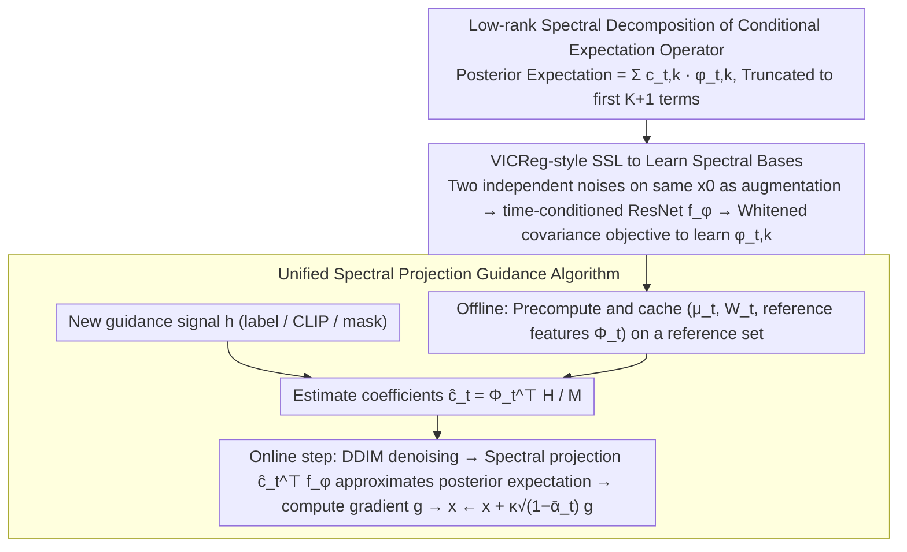

# Spectral Guidance for Flexible and Efficient Control of Diffusion Models

**Conference**: ICML 2026  
**arXiv**: [2605.28900](https://arxiv.org/abs/2605.28900)  
**Code**: https://github.com/gabmoreira/spectralguidance  
**Area**: Diffusion Models / Image Generation / Controllable Generation  
**Keywords**: Spectral Guidance, Training-free Guidance, Conditional Expectation Operator, SVD, Self-supervised Learning

## TL;DR
Ours proposes Spectral Guidance: by learning the left singular functions of the conditional expectation operator of the diffusion process via self-supervised learning, any guidance signal (labels / CLIP / mask) is projected onto these spectral bases aligned with diffusion dynamics. This bypasses denoiser backpropagation, achieving a 37 percentage point accuracy improvement over the strongest training-free baseline on CIFAR-10 while sampling 4x faster.

## Background & Motivation

**Background**: Controllable generation for diffusion models primarily follows two paths. First, classifier guidance / classifier-free guidance, which binds the model to a fixed set of conditions from the training phase. Second, training-free guidance (DPS / LGD / FreeDoM / TFG), which pulls arbitrary clean-data loss $p(y\mid x_0)$ back to the $x_t$ space via the denoiser's point estimate $\hat{x}_0(x_t)$ during sampling.

**Limitations of Prior Work**: The first category lacks flexibility, requiring retraining for new conditions. The second is flexible but costly: it requires backpropagation through the denoiser at every sampling step, which is computationally expensive and prone to vanishing gradients. Furthermore, the approximation $p(y\mid x_0)\approx p(y\mid \hat{x}_0(x_t))$ strictly holds only when $p(y\mid x_0)$ is an affine function of $x_0$; at high noise levels, the posterior mean often drifts off the data manifold, leading to incorrect guidance gradients.

**Key Challenge**: Training-free guidance seeks to use arbitrary clean-data signals but is forced to pass through the denoiser for point estimation, creating a natural conflict between flexibility and stability/efficiency.

**Goal**: Construct an intermediate representation independent of specific guidance signals, such that calculating $p_t(y\mid x_t)$ reduces to a linear projection, decoupled from the denoiser.

**Key Insight**: View the conditional expectation $p_t(y\mid x_t)=\mathbb{E}_{X_0\sim p_t(\cdot\mid x_t)}[p(y\mid X_0)]$ as a linear operator $T_t$ mapping from the clean space $\mathcal{H}_0$ to the noisy space $\mathcal{H}_t$. As $t$ increases and noise erases information, $T_t$ becomes low-rank almost everywhere, leaving only a few "noise-resistant" directions. These directions are the left singular functions $\{\phi_{t,k}\}$ of $T_t$, forming a set of time-varying coordinates aligned with the diffusion dynamics.

**Core Idea**: Perform a spectral expansion of any guidance signal on these left singular bases: $\mathbb{E}[h(X_0)\mid x_t]=\sum_k c_{t,k}\phi_{t,k}(x_t)$. Truncating this to the first $K+1$ terms yields a stable and cheap guidance estimate. The $\phi_{t,k}$ functions themselves can be learned offline via a VICReg-style SSL objective, no longer depending on denoiser gradients.

## Method

### Overall Architecture
The bottleneck of training-free guidance lies in calculating the posterior expectation $p_t(y\mid x_t)$ at each step, which necessitates denoiser point estimation and backpropagation. Ours algebraizes this: first, learn a set of "spectral coordinates" aligned with the diffusion process offline as a shared intermediate representation for all guidance signals. Then, any new guidance signal is simply projected onto these coordinates, reducing online sampling to linear projection on a shallow network plus a shallow gradient, without touching the denoiser. The entire pipeline is split into offline and online phases—learning spectral bases and caching reference features offline, then projecting label / CLIP / mask signals and injecting them into the trajectory online.

### Key Designs

**1. Low-rank Spectral Decomposition of the Conditional Expectation Operator: Turning "Posterior Expectation" into a Denoiser-Independent Linear Projection**

Training-free guidance is stuck because $p_t(y\mid x_t)=\mathbb{E}_{X_0\sim p_t(\cdot\mid x_t)}[p(y\mid X_0)]$ depends on both the specific signal $h$ and the denoiser point estimate $\hat x_0(x_t)$. At high noise, the point estimate drifts, causing incorrect gradients. Ours treats the posterior expectation as a linear operator $T_t:\mathcal{H}_0\to\mathcal{H}_t$, where $(T_tf)(x_t):=\mathbb{E}[f(X_0)\mid x_t]$, and its adjoint $T_t^\ast$ corresponds to forward diffusion. The covariance operator $T_tT_t^\ast$ is a compact self-adjoint operator, possessing a spectral decomposition $T_tf=\sum_k \sigma_{t,k}\phi_{t,k}(x_t)\,\mathbb{E}_{p_0}[f\psi_{t,k}]$, where $\sigma_{t,1}=1$ corresponds to the constant mode. Proposition 4.1 then writes the posterior expectation of any $h\in\mathcal{H}_0$ as an expansion over left singular functions:

$$\mathbb{E}[h(X_0)\mid x_t]=\sum_k c_{t,k}\,\phi_{t,k}(x_t),\qquad c_{t,k}=\mathbb{E}[h(X_0)\phi_{t,k}(X_t)].$$

Calculating the posterior expectation thus switches from depending on $h$ and denoiser point estimates to a fixed linear projection depending only on the diffusion process itself. The low-rank truncation is justified because the $L^2(p_t)$ error of the first $K$ terms is bounded by $\sigma_{t,K+1}^2\|h\|_{p_0}^2$. Proposition 4.7 further proves that $\sigma_{t,k}^2\le \mathbb{E}_{p_0}[\chi^2(p_t(\cdot\mid X_0)\|p_t)]$ ($k\ge2$) vanishes as $\bar\alpha_t\to0$—higher noise leaves fewer surviving modes, making the low-rank approximation stricter. This makes $K$ an "upper bound on the intrinsic information dimension" of guidance.

**2. VICReg-style SSL to Learn Spectral Bases: Using Two Diffused Versions as Augmentation to Learn Singular Functions Without the Denoiser**

The singular functions $\{\phi_{t,k}\}$ must be learned without touching the denoiser. Theorem 4.2 provides a variational characterization: for any $f=(f_1,\dots,f_K)^\top$ with $\mathbb{E}_{p_t}[f]=0$, we have $\max_f \operatorname{Tr}(\mathbf{C}_t(f)\boldsymbol{\Sigma}_t(f)^{-1})=\sum_{k=2}^{K+1}\sigma_{t,k}^2$, where the maximizer is $\text{span}\{\phi_{t,k}\}$. This Rayleigh–Ritz form is equivalent to Kernel PCA with the kernel $\zeta(x_t,\tilde x_t):=\int p_t(x_t\mid x_0)p_t(\tilde x_t\mid x_0)p_0(x_0)\,dx_0$. The key observation is: sampling $(x_t, \tilde x_t)$ with independent noise on the same $x_0^{(i)}$ is exactly a paired sampling of the covariance operator $T_tT_t^\ast$—this replaces manual augmentation in VICReg, strictly aligning the SSL objective with spectral decomposition. Implementation-wise, pairs are passed through a lightweight time-conditioned ResNet $f_\phi:\mathcal{X}\times\mathbb{R}_{>0}\to\mathbb{R}^K$ to get $\mathbf{Z},\tilde{\mathbf{Z}}\in\mathbb{R}^{B\times K}$. Using the eigenvalue decomposition $\hat{\boldsymbol{\Sigma}}=\mathbf{V}\boldsymbol{\Lambda}\mathbf{V}^\top$ of the batch covariance, a whitening matrix $\mathbf{W}=\mathbf{V}(\boldsymbol{\Lambda}+\xi\mathbf{I})^{-1/2}$ is constructed to optimize:

$$L=-\operatorname{Tr}\big((\mathbf{Z}^w)^\top\tilde{\mathbf{Z}}^w\big)\big/\big(K(B-1)\big),$$

where the whitening term $\boldsymbol{\Sigma}_t(f)^{-1}$ prevents collapse, and stop-gradient is applied to one side to stabilize training.

**3. Unified Spectral Projection Guidance Algorithm: Heavy Lifting is Offline, Online Only Involves Shallow Gradients and Reusable Bases**

With $f_\phi$, all heavy lifting is moved to a one-time offline phase: for each $t\in\mathcal{T}$, precompute and cache whitened transforms $(\boldsymbol{\mu}_t,\mathbf{W}_t)$ and reference feature matrices $\boldsymbol{\Phi}_t=[\mathbf{1}\;(\mathbf{Z}_t-\boldsymbol{\mu}_t)\mathbf{W}_t]\in\mathbb{R}^{M\times(K+1)}$ on reference set $\mathcal{D}_\text{ref}=\{x_0^{(i)}\}_{i=1}^M$. For a new guidance signal $h$, coefficients $\hat{\mathbf{c}}_t=\boldsymbol{\Phi}_t^\top\mathbf{H}/M$ are estimated via Monte Carlo. During sampling (Algorithm 2), each step performs standard DDIM denoising, approximates $\mathbb{E}[h(X_0)\mid x_t]$ using $\hat{\mathbf{c}}_t^\top f_\phi^w(x,t)$, computes the gradient $g=\nabla_{x}\mathcal{L}(\hat{\mathbf{c}}_t^\top f_\phi^w(x,t))$, and injects it into the trajectory via $x\leftarrow x+\kappa\sqrt{1-\bar\alpha_t}\,g$. Only the loss $\mathcal{L}$ changes across tasks: labels use log-likelihood in $\nabla z/z$ form (expansion may violate positivity locally, so ratios replace log), CLIP uses $\mathcal{L}(\mathbf{z})=\mathbf{z}^\top \mathbf{e}_\text{text}/\|\mathbf{z}\|$, and masks use $-\|\mathbf{z}-\mathbf{z}_\text{target}\|^2$. Since gradients only pass through the 16M parameter $f_\phi$ (as opposed to the 114M denoiser) and the same $\{\boldsymbol{\Phi}_t\}$ is reused, "arbitrary guidance without retraining" becomes practical.

### Loss & Training
The model optimizes the single objective $L=-\operatorname{Tr}((\mathbf{Z}^w)^\top\tilde{\mathbf{Z}}^w)/(K(B-1))$ with a small ridge term $\xi$ for whitening. Timesteps are sampled uniformly from $\mathcal{T}$; $\boldsymbol{\mu},\mathbf{W}$ are recomputed per batch with stop-gradient on one side. $K=512$ is used for CIFAR-10 / CelebA-HQ, and $K=2000$ for ImageNet. Learning $f_\phi$ for CelebA-HQ takes $\approx 10$ GPU·h, and precomputing $\{\boldsymbol{\Phi}_t\}$ takes only 0.8 GPU·h.

## Key Experimental Results

### Main Results
Evaluated on CIFAR-10 / CelebA-HQ / ImageNet against DPS / LGD / FreeDoM / MPGD / UGD / TFG, covering label / attribute combination / CLIP / mask guidance. All methods share the same unconditional DDPM U-Net.

| Dataset / Task | Metric | Uncond. | Best baseline | Ours | Gain |
|---|---|---|---|---|---|
| CIFAR-10 / Labels | Acc↑ | 10.0 | 52.0 (TFG) | **89.4** | **+37.4** |
| CIFAR-10 / Labels | FID↓ | 98.1 | 88.3 (MPGD) | **70.7** | −17.6 |
| CelebA-HQ / Gender+Age | Acc↑ | 25.0 | 75.2 (TFG) | **91.5** | +16.3 |
| CelebA-HQ / Gender+Hair | Acc↑ | 22.4 | 76.0 (TFG) | **88.3** | +12.3 |
| ImageNet / Labels | Acc↑ | 0.0 | 40.9 (TFG) | **41.6** | +0.7 |
| CelebA-HQ / Mask | IoU↑ | 0.38 | 0.78 (TFG) | **0.80** | +0.02 |
| CelebA-HQ / CLIP | VQAScore↑ | 0.34 | 0.62 (TFG) | **0.64** | +0.02 |

Efficiency comparison (CelebA-HQ, DDIM 100 steps, batch=1):

| Stage | Metric | Uncond. | TFG | Ours |
|---|---|---|---|---|
| Offline | Train $f_\phi$ / GPU·h | – | – | 10.0 |
| Offline | Precompute $\{\Phi_t\}$ / GPU·h | – | – | 0.8 |
| Online | Latency per step / ms | 19.2 | 81.2 | **21.7** |
| Online | Single image throughput / s | 1.9 | 8.1 | **2.2** |
| Online | Peak VRAM / GB | 1.1 | 2.8 | 3.6 |
| End-to-end | Total time for 10k imgs / h | 5.3 | 22.5 | **16.9** |

### Ablation Study

| Configuration | Key Metric | Description |
|---|---|---|
| Full ($K=512$, sweep $\kappa$) | Acc-FID Pareto | Significantly outperforms all training-free baselines, approaching classifier guidance. |
| Var. rank $K\in\{8,\dots,512\}$ | Acc saturates | Acc rises sharply from $K=8\to 128$ then saturates, validating Proposition A.11. |
| Large $\kappa$ | FID degradation | Guidance dominates score, pushing trajectory off-manifold (standard diversity-fidelity trade-off). |
| Sliding window $[\tau-100,\tau+100]$ | Acc(τ) correlation | Optimal $\tau$ corresponds to the spectral "phase transition" zone of $\operatorname{tr}(T_tT_t^\ast)$. |

### Key Findings
- The +37.4 accuracy gain on CIFAR-10 stems from the spectral bases—the same $\{\boldsymbol{\Phi}_t\}$ supports labels, CLIP, and masks, proving these coordinates are a "task-agnostic intrinsic structure of diffusion".
- $K$ is not just a representation dimension; past the saturation point, it acts as a "guidance intensity knob": adding modes is equivalent to increasing the effective guidance scale at fixed $\kappa$.
- The spectrum of $T_tT_t^\ast$ undergoes a phase transition (CIFAR-10 ~400, CelebA-HQ ~700). This transition zone is precisely where guidance is most effective, providing an interpretable criterion for "when to guide".
- Dense constraints (e.g., inpainting half a 256×256×3 image) exceed the $K$-dimensional subspace capacity, meaning Spectral Guidance is complementary to DPS-style methods rather than a replacement.

## Highlights & Insights
- **Reinterpreting "Training-free Guidance" as "Training-free Spectral Projection"**: Previous training-free methods were bottlenecked by the difficulty of calculating $p_t(y\mid x_t)$. This work algebraizes it as SVD and uses SSL to learn singular functions, unifying guidance signals under one set of bases.
- **Natural Coupling of VICReg and Diffusion**: Two independent noisy versions of the same $x_0$ are paired samples of the covariance operator, providing any diffusion process with an inherent spectral interpretation without manual augmentations.
- **Spectral Phase Transition as a Physical Pointer**: Moving the "guidance schedule" design from empirical tuning to a theoretical choice dictated by the $\sigma_{t,k}$ decay curve.
- **Offline-Online Amortization**: Removing denoiser backpropagation from the online path and leaving only 16M shallow gradients is key for scaling plug-and-play guidance.

## Limitations & Future Work
- Evaluation was conducted on pixel-level, medium-scale DDPMs; latent diffusion and large-scale T2I models remain to be tested, though the framework naturally extends to latent spaces.
- Estimating $\hat{\mathbf{c}}_t$ requires a reference set $\mathcal{D}_\text{ref}$ with $h$ annotations, which is a cost compared to pure training-free methods; however, this set can be small or self-sampled from the unconditional model.
- Pixel-level linear inverse problems (inpainting/SR) require more constraints than the $K$-rank subspace can provide; ours is complementary to posterior-mean methods like DPS.

## Related Work & Insights
- **vs CG / CFG**: While CG/CFG bake conditions into training, ours uses an unconditional model + spectral bases to allow any condition at a CG-level online cost.
- **vs DPS / LGD / MPGD**: These depend on $\hat{x}_0(x_t)$ and denoiser backpropagation; ours models the whole posterior expectation via SVD and limits gradients to a shallow $f_\phi$.
- **vs NoiseCLR / Jacobian Spectral Editing**: While the latter use spectral analysis as a post-hoc editing tool, ours places spectral decomposition at the core of the guidance itself.

## Rating
- Novelty: ⭐⭐⭐⭐⭐ 
- Experimental Thoroughness: ⭐⭐⭐⭐ 
- Writing Quality: ⭐⭐⭐⭐⭐ 
- Value: ⭐⭐⭐⭐⭐ 

<!-- RELATED:START -->

1.  **DPS**: Diffusion Posterior Sampling for General Loss Functions, ICLR 2023.
2.  **TFG**: Training-free Guidance for Diffusion Models, ICML 2024.
3.  **VICReg**: Variance-Invariance-Covariance Regularization for Self-Supervised Learning, ICLR 2022.

<!-- RELATED:END -->

## Related Papers

- [\[CVPR 2026\] CFG-Ctrl: Control-Based Classifier-Free Diffusion Guidance](../../CVPR2026/image_generation/cfg-ctrl_control-based_classifier-free_diffusion_guidance.md)
- [\[ICML 2026\] Caracal: Causal Architecture via Spectral Mixing](caracal_causal_architecture_via_spectral_mixing.md)
- [\[AAAI 2026\] RelaCtrl: Relevance-Guided Efficient Control for Diffusion Transformers](../../AAAI2026/image_generation/relactrl_relevance-guided_efficient_control_for_diffusion_transformers.md)
- [\[ICML 2026\] GuidedBridge: Training-freely Improving Bridge Models with Prior Guidance](guidedbridge_training-freely_improving_bridge_models_with_prior_guidance.md)
- [\[ICML 2026\] Local Hessian Spectral Filtering for Robust Intrinsic Dimension Estimation](local_hessian_spectral_filtering_for_robust_intrinsic_dimension_estimation.md)

<!-- RELATED:END -->
