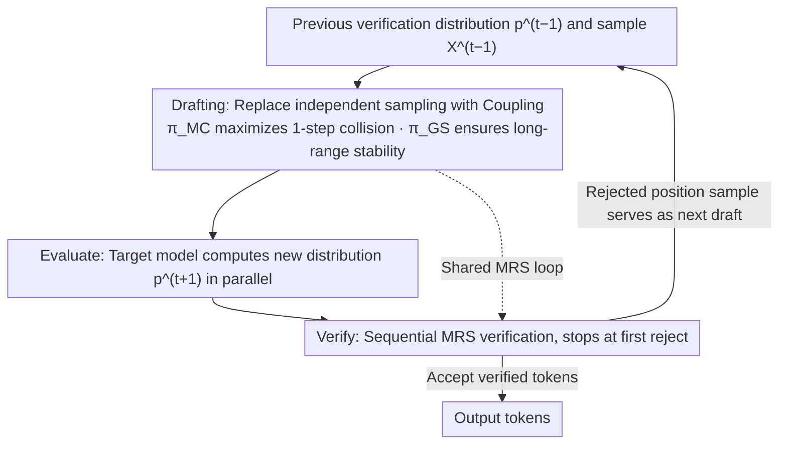

# Speculative Coupled Decoding for Training-Free Lossless Acceleration of Autoregressive Visual Generation

**Conference**: ICML 2026  
**arXiv**: [2510.24211](https://arxiv.org/abs/2510.24211)  
**Code**: https://github.com/junhyukso/SCD (Available)  
**Area**: Image Generation / Autoregressive Visual Models / Inference Acceleration  
**Keywords**: Speculative Decoding, Jacobi Iteration, Coupling, Autoregressive Image Generation, Lossless Acceleration

## TL;DR
This paper identifies the root cause of limited acceleration in Speculative Jacobi Decoding (SJD) for autoregressive visual generation: independent sampling of draft tokens between successive iterations leads to a collision probability near zero. By replacing independent sampling with Maximal or Gumbel Coupling (a one-line modification with zero additional training), image generation is accelerated by up to $4.2\times$ and video generation by up to $13.6\times$, while strictly maintaining the output distribution consistency with original AR decoding.

## Background & Motivation

**Background**: Autoregressive (AR) modeling has become the mainstream paradigm for unified generation of images, videos, 3D, and audio (e.g., Lumina-mGPT, Janus-Pro, Cosmos-1-AR). However, generating a high-resolution image requires serial decoding of thousands of tokens, resulting in significant inference latency. Speculative Decoding (SD) is the de facto standard for LLM text acceleration, using a cheap draft model to predict $L$ tokens followed by parallel verification by a target model, ensuring the output strictly follows the target distribution via modified rejection sampling.

**Limitations of Prior Work**: Standard SD performs poorly on visual AR for two reasons: the high cost of training a separate draft model, and the flat distribution of visual tokens leading to low draft hit rates. The recently proposed Speculative Jacobi Decoding (SJD) uses the distribution verified in the previous Jacobi iteration as the next draft, bypassing the need for a draft model and training. However, its visual acceleration is only $\sim 2\times$, far below the $4\times$+ seen in text SD.

**Key Challenge**: The authors find that the acceptance rate $\beta_i^{(t)} = 1 - \mathcal{D}_{TV}(p^{(t)}, p^{(t-1)})$ is directly determined by the similarity between adjacent prefix contexts. Even if two draft distributions are close in probability space (low TV distance), the actual collision probability ($\Pr[X^{(t)} = X^{(t-1)}]$) remains extremely low due to independent sampling. The flat visual token distribution results in high Rényi-2 entropy, pushing the collision probability near zero, with approximately 94% of positions changing every iteration. This gap between "proximity in probability space" and "proximity in realization space" makes SJD trajectories unstable, with volatile and non-convergent acceptance rates.

**Goal**: To maximize the effective acceptance rate of SJD without introducing extra models, modifying the target model, or sacrificing losslessness, thereby pushing the visual AR acceleration ratio to levels comparable to or higher than text SD.

**Key Insight**: Instead of independent sampling, use Coupling tools from information theory to allow draft sampling for adjacent iterations to share randomness. This maximizes $\Pr[X^{(t)} = X^{(t-1)}]$ while keeping individual marginal distributions unchanged. Since the losslessness of SD depends only on the marginal distribution of the draft and not on the correlation between drafts, Coupling provides stability gains for "free."

**Core Idea**: Replace the independent sampling line in the SJD drafting stage with Maximal Coupling (equivalent to reusing the MRS from verification) or Gumbel Sharing Coupling. This one-line code change, with zero extra training or memory, pushes the collision probability from near 0 to the vicinity of the $1 - \mathcal{D}_{TV}$ upper bound.

## Method

### Overall Architecture

SCD addresses the "close probability space but distant sample space" problem in SJD. Even when adjacent draft distributions are close, independent resampling causes tokens to change constantly. The method modifies only the sampler in the drafting stage to ensure adjacent iterations share randomness and produce the same tokens whenever possible under their respective marginals. The overall framework retains the three-stage loop of SJD: the drafting stage samples draft tokens from the previous verification distribution $p^{(t-1)}$ in parallel; the evaluate stage computes new distributions $p^{(t+1)}_j = p_\theta(\cdot \mid X^t_{0:j-1})$ using the target model; and the verify stage uses modified rejection sampling (MRS) to sequentially validate tokens, stopping at the first rejection to set the next draft. SCD's only modification is replacing "independent sampling from $p^t_j$" with "sampling a pair $(X^t_j, X^{t-1}_j)$ from the coupling of $p^t_j$ and $p^{t-1}_j$, taking $X^t_j$ as the draft."

### Key Designs

**1. Maximal Coupling ($\pi_{MC}$): Reaching the Theoretical 1-step Collision Bound**

The SJD acceptance rate is limited by $\Pr[X^{(t)}=X^{(t-1)}]$, which independent sampling suppresses toward zero due to the Rényi-2 entropy bound $C_{SJD} \le e^{-\frac{1}{2}(H_2(p)+H_2(q))}$. Coupling constructs a joint distribution $\pi(x,y)$ that maintains marginals $x\sim p^{(t)}$ and $y\sim p^{(t-1)}$ while maximizing $C(\pi)=\Pr[X=Y]$ at the theoretical limit $1-\mathcal{D}_{TV}(p^{(t)}, p^{(t-1)})$. Since the MRS used in verification is itself a maximal coupling—given $X\sim Q$, it outputs $Y$ such that $Y\sim P$ and $\Pr[Y=X]=1-\mathcal{D}_{TV}(P,Q)$—the drafting stage can simply reuse the same MRS logic. This greedily maximizes the 1-step acceptance rate while strictly preserving the output distribution.

**2. Gumbel Sharing Coupling ($\pi_{GS}$): Trading for Long-range Stability**

While $\pi_{MC}$ is 1-step greedy-optimal, it lacks non-trivial guarantees for continuous iterations. $\pi_{GS}$ provides an alternative by sharing Gumbel noise $G$ across iterations: $X=\arg\max_i(\log P_i+g_i)$ and $Y=\arg\max_i(\log Q_i+g_i)$. Its 1-step collision lower bound is $C(\pi_{GS})\ge (1-\mathcal{D}_{TV})/(1+\mathcal{D}_{TV})$, slightly lower than $\pi_{MC}$, but this bound holds for any pair of distributions, providing better multi-step Hamming distance $\mathrm{Hamm}(t,t+N)$ guarantees. This is more beneficial for tasks with high redundancy, such as video AR or low-resolution images, where maintaining early draft tokens is more valuable than continuous fine-tuning.

**3. Zero-Overhead Implementation: Merged Drafting and Verification**

Since drafting and verification utilize the same MRS operation, they can be merged into a single loop without additional forward passes. The $\texttt{MRS}(p^t_j, p^{t-1}_j, X^t_j)$ in drafting and $\texttt{MRS}(p^{t+1}_j, p^t_j, X^t_j)$ in verification are functionally identical operations indexed across iterations. By vectorizing the verification loop (recording the first rejection index rather than breaking early), drafting and verification are completed in one pass. MRS vectorization takes only $\sim 1.5$ ms on Janus-Pro 7B, negligible compared to the 26–36 ms Transformer forward pass.

### Loss & Training

Entirely training-free. SCD is a pure inference-time algorithm replacement. All logit post-processing (top-k, CFG) is applied before the distribution $p^{(t)}$ is defined to maintain the strictness of the lossless proof.

## Key Experimental Results

### Main Results

| Model / Dataset | Config | NFE ↓ | Latency ↓ | Speedup | FID ↓ | CLIP ↑ |
|---------------|------|-------|--------|--------|-------|--------|
| Lumina-mGPT / MS-COCO | Vanilla AR | 2390 | 102.0 s | $1.0\times$ | 30.79 | 31.31 |
| Lumina-mGPT / MS-COCO | SJD ($L=64$) | 1036 | 43.0 s | $2.31\times$ | 30.81 | 31.31 |
| Lumina-mGPT / MS-COCO | + $\pi_{MC}$ ($L=64$) | 568 | 24.4 s | $\mathbf{4.21\times}$ | 30.83 | 31.37 |
| Lumina-mGPT / MS-COCO | + $\pi_{GS}$ ($L=64$) | 568 | 24.2 s | $\mathbf{4.21\times}$ | 30.90 | 31.37 |
| Janus-Pro 7B / MS-COCO | SJD ($L=32$) | 318 | 10.6 s | $1.25\times$ | 37.76 | – |
| Janus-Pro 7B / MS-COCO | + $\pi_{GS}$ ($L=32$) | 154 | 5.39 s | $\mathbf{2.45\times}$ | 37.49 | – |
| Cosmos-1-AR / Real-Estate-10k | Vanilla AR | 7680 | 157 s | $1.0\times$ | FVD 156.9 | – |
| Cosmos-1-AR / Real-Estate-10k | + $\pi_{GS}$ ($L=128$) | 564 | 13.6 s | $\mathbf{13.6\times}$ | FVD 152.4 | – |

### Ablation Study

| Config | NFE | Note |
|------|-----|------|
| SJD baseline | 1036 | Independent sampling, ~94% tokens change per round |
| + $\pi_{MC}$ | 568 | Maximal coupling, maximizes 1-step collision |
| + $\pi_{GS}$ | 568 | Gumbel coupling, ensures long-range collision |
| vs. Lossy GSD ($G=10$) | 701 | GSD is faster but FID drops from 30.79 to 33.21 |
| Coupling strength $\alpha$ | – | NFE decreases monotonically as $\alpha \to 1$ |
| Window size $L$ sweep | – | SJD plateaus at $L\!>\!16$; SCD benefits from larger $L$ |

### Key Findings

- **Window Size Sensitivity**: Standard SJD speedup plateaus at $\sim 2.3\times$ regardless of increasing $L$ from 16 to 64, whereas SCD reaches $4.2\times$ at $L=64$. This confirms that SJD's bottleneck is the acceptance rate bottlenecked by independent sampling, not the window size.
- **Video vs. Image**: Video AR acceleration is far higher ($13.6\times$ vs $4.2\times$) due to strong temporal redundancy, where $\pi_{GS}$ long-term stability excels.
- **1-step vs. Multi-step**: $\pi_{MC}$ is superior in 1-step Hamming distance, but $\pi_{GS}$ is more stable over 2 or 3 steps, reflecting the trade-off between greedy and long-range optimality.
- **Causal Evidence**: As coupling strength $\alpha$ increases from 0 to 1, both token-level Hamming distance and NFE decrease monotonically, solidifying the chain: "higher collision → context stability → reduced NFE."

## Highlights & Insights

- The insight that "proximity in probability $\neq$ proximity in samples" is profound. SJD’s failure is precisely mapped to the Rényi-2 entropy bound, explaining why visual AR (flat distribution, high entropy) is harder to accelerate than text. This can be mapped to any problem involving distribution similarity versus sample consistency.
- Reusing the MRS from verification as the drafting sampler is an elegant design that results in nearly zero implementation cost and allows for vectorized execution.
- $\pi_{GS}$ highlights a "1-step optimum vs. long-range stability" trade-off that likely exists in other iterative inference acceleration methods (like consistency models or Jacobi for LLMs).
- The paper follows a perfect paradigm: "minor modification + rigorous proof + strong results," achieving $4-13\times$ speedup with a few lines of code and zero training.

## Limitations & Future Work

- The acceleration ceiling is determined by the target model's $\mathcal{D}_{TV}(p^{(t)}, p^{(t-1)})$. If contexts change drastically (e.g., high-resolution generation with strong CFG), even $\pi_{MC}$ is bounded by this TV distance.
- There is no task-adaptive rule for selecting between $\pi_{MC}$ and $\pi_{GS}$; choices are currently empirical (e.g., $\pi_{GS}$ for video/low-res, $\pi_{MC}$ for high-res images).
- The exploration was limited to AR visual generation. Potential gains in AR audio or robotics sequences, which also feature flat distributions, remain unexplored.

## Related Work & Insights

- **vs. SJD (Teng et al., 2024)**: SJD uses the previous distribution as a draft without a draft model, but independent sampling caps speedup at $\sim 2\times$. Ours uses Coupling to reach $4.2\times$ while remaining lossless.
- **vs. GSD (So et al., 2025)**: GSD is lossy and uses group acceptance for speedup ($3.4\times$), but causes FID degradation (30.8 to 33.2). SCD is faster and strictly lossless.
- **vs. Medusa (Cai et al., 2024)**: Medusa uses trained multiple heads for $4\times$ text acceleration. SCD achieves similar gains in vision without any training.
- **vs. Judge Decoding (Bachmann et al., 2025)**: Relies on a judge model to relax acceptance conditions, sacrificing losslessness. SCD maintains losslessness.

## Rating
- **Novelty**: ⭐⭐⭐⭐⭐ Introducing Information Theoretic Coupling to SJD is a fresh perspective with upper-bound performance gains.
- **Experimental Thoroughness**: ⭐⭐⭐⭐ Covers various models (Lumina, Janus-Pro, Cosmos-1) across image and video, with comprehensive sweeps for $\alpha$, Hamming distance, and CFG.
- **Writing Quality**: ⭐⭐⭐⭐⭐ Clear progression from motivation to proof and algorithm.
- **Value**: ⭐⭐⭐⭐⭐ High industrial value due to its plug-and-play nature for existing AR visual generation pipelines.

<!-- RELATED:START -->

1. **SJD**: Speculative Jacobi Decoding for Joint Image-Text Generation.
2. **GSD**: Group Speculative Decoding for Autoregressive Visual Generation.
3. **Cosmos-1**: High-Resolution Autoregressive Video Generation.
4. **Lumina-mGPT**: Illuminate Any Language with Magickal Generative Pre-trained Transformer.

<!-- RELATED:END -->

## Related Papers

- [\[CVPR 2026\] Multi-Scale Local Speculative Decoding for Image Generation](../../CVPR2026/image_generation/multi-scale_local_speculative_decoding_for_image_generation.md)
- [\[AAAI 2026\] Annealed Relaxation of Speculative Decoding for Faster Autoregressive Image Generation](../../AAAI2026/image_generation/annealed_relaxation_of_speculative_decoding_for_faster_autor.md)
- [\[ICCV 2025\] Grouped Speculative Decoding for Autoregressive Image Generation](../../ICCV2025/image_generation/grouped_speculative_decoding_for_autoregressive_image_generation.md)
- [\[ICML 2026\] DFlash: Block Diffusion for Flash Speculative Decoding](dflash_block_diffusion_for_flash_speculative_decoding.md)
- [\[CVPR 2026\] SparVAR: Exploring Sparsity in Visual Autoregressive Modeling for Training-Free Acceleration](../../CVPR2026/image_generation/sparvar_exploring_sparsity_in_visual_autoregressive_modeling_for_training-free_a.md)

<!-- RELATED:END -->
