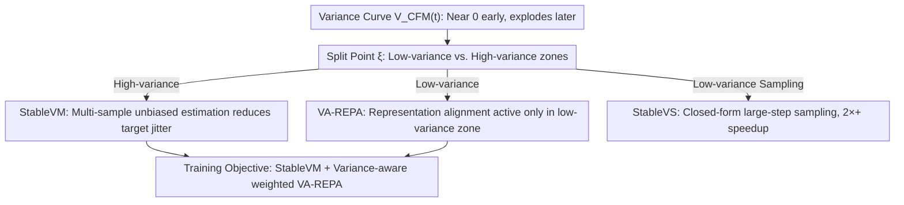

# Stable Velocity: A Variance Perspective on Flow Matching

**Conference**: ICML 2026  
**arXiv**: [2602.05435](https://arxiv.org/abs/2602.05435)  
**Code**: https://github.com/linYDTHU/StableVelocity  
**Area**: Image Generation / Flow Matching / Diffusion Models  
**Keywords**: flow matching, variance reduction, representation alignment, sampling acceleration, stochastic interpolation

## TL;DR
This paper re-examines flow matching from the overlooked perspective of "conditional velocity variance." It discovers that training trajectories naturally split into a high-variance zone near the prior and a low-variance zone near the data. Based on this, a unified framework, Stable Velocity, is proposed, featuring an unbiased multi-sample variance reduction loss (StableVM), a VA-REPA module that enables representation alignment only in low-variance zones, and a training-free sampler (StableVS) that utilizes closed-form solutions in low-variance zones. The method achieves improved training efficiency and >2× sampling acceleration on ImageNet 256 and SD3.5/Flux/Qwen-Image/Wan2.2.

## Background & Motivation

**Background**: The flow matching/stochastic interpolation paradigm, represented by Conditional Flow Matching (CFM), has unified diffusion and flow models. By letting neural networks fit the conditional velocity field $v_t(x_t \mid x_0)$, these models learn the probability flow from a prior $\mathcal{N}(0, I)$ to the data distribution. This approach is the standard training choice for large-scale generative models such as SD3, Flux, and Wan2.2.

**Limitations of Prior Work**: The training objective of CFM, $v_t(x_t \mid x_0)$, is essentially a single-sample Monte Carlo estimate of the true marginal velocity field $v_t(x_t)$, which exhibits extreme variance. Especially as $t$ approaches 1 (near the prior and far from the data), a noisy sample $x_t$ can be explained by almost any data point, causing the regression target to fluctuate violently, resulting in slow and unstable optimization. Meanwhile, auxiliary representation alignment losses like REPA are applied indiscriminately across all $t$, but the temporal structure of their effectiveness has never been analyzed.

**Key Challenge**: CFM treats the entire interval $t \in [0, 1]$ as a "homogeneous" segment for training and sampling. However, the conditional velocity variance $\mathcal{V}_{\text{CFM}}(t)$ is highly non-uniform along $t$—it is nearly zero in the early stages and explodes in the later stages. Existing methods neither perform variance reduction for the high-variance segments nor exploit the favorable structure of the low-variance segments.

**Goal**: (1) Provide an analytical characterization of the flow matching training variance, (2) construct an unbiased variance reduction objective in the high-variance zone, (3) make the representation alignment auxiliary loss adaptively active only in meaningful segments, and (4) accelerate sampling by leveraging the simplified dynamics of the low-variance zone.

**Key Insight**: By tracing the conditional velocity covariance to obtain $\mathcal{V}_{\text{CFM}}(t)$ and plotting curves for GMM, CIFAR-10, and ImageNet latents, a split point $\xi$ is consistently observed: variance is near 0 for $t < \xi$ and rises rapidly for $t \ge \xi$. Furthermore, as data dimensionality increases, $\xi$ moves closer to 1, expanding the low-variance zone. This curve serves as the physical basis for the proposed designs.

**Core Idea**: Replace the uniformly applied CFM/REPA/Sampler with a "time-partitioned" unified framework—employing multi-sample variance reduction in high-variance zones and strengthening representation supervision while enabling closed-form large-step sampling in low-variance zones.

## Method

### Overall Architecture
The paper addresses the issue where CFM treats $t \in [0,1]$ as a homogeneous interval for training and sampling, ignoring the drastic temporal changes in conditional velocity variance. The approach first analytically derives the variance of the CFM objective $\mathcal{V}_{\text{CFM}}(t)$ at the probabilistic level to identify the split point $\xi$ between the "near-zero" and "exploding" segments. Based on this curve, the framework applies partitioned strategies: variance reduction in high-variance zones, and semantic supervision with closed-form large-step sampling in low-variance zones. This is implemented via three orthogonal modules sharing the same $\xi$: the StableVM training loss, the VA-REPA auxiliary loss, and the StableVS sampler, all of which can be integrated into existing REPA/REG/iREPA pipelines.

### Key Designs

**1. StableVM: Reducing Target Jitter in High-Variance Zones with Multi-sample Unbiased Estimation**

The CFM training objective $v_t(x_t \mid x_0)$ is essentially a single-sample Monte Carlo estimate of the true marginal velocity $v_t(x_t)$. When $t$ is near 1, a noisy $x_t$ can correspond to almost any data point, leading to unstable regression. StableVM addresses this variance directly: instead of sampling $x_t$ from a single conditional path, it samples from a mixture path $p_t^{\text{GMM}}(x_t \mid \{x_0^i\}) = \tfrac{1}{n}\sum_i p_t(x_t \mid x_0^i)$. The regression target is replaced with a self-normalized weighted average of $n$ reference samples: $\widehat{v}_{\text{StableVM}}(x_t; \{x_0^i\}) = \sum_k p_t(x_t \mid x_0^k)\, v_t(x_t \mid x_0^k) / \sum_j p_t(x_t \mid x_0^j)$. The paper proves that it shares the same global optimum $v_t(x_t)$ as CFM (unbiased, Thm 3.1), possesses strictly smaller variance (Thm 3.2), and decays at $O(1/n)$ with $n$ reference samples (Thm 3.3). Unlike the biased STF approach (only applicable to VP diffusion), the mixture sampling in StableVM achieves true unbiasedness and generalizes to general stochastic interpolations. For conditional generation, a FIFO memory bank with capacity $K=256$ is maintained to resolve sample sparsity within batches.

**2. VA-REPA: Enabling Representation Alignment Only in Meaningful Low-Variance Zones**

Existing REPA-style semantic alignment losses are applied uniformly to all $t$. However, the authors observe that the alignment loss $\ell_{\text{RA}}$ of pre-trained REPA models is consistently low and learnable in the low-variance zone, but saturates at extremely high values in the high-variance zone—since deterministic semantic recovery from near-pure noise is ill-posed. VA-REPA applies a time-dependent weight $w(t) \in [0, 1]$ to the alignment loss: $\mathcal{L} = \mathcal{L}_{\text{StableVM}} + \lambda_{\text{RA}}\, \mathbb{E}_{t,x_t}[w(t)\,\ell_{\text{RA}}(x_t)] / \mathbb{E}_t[w(t)]$. Three implementations for $w(t)$ are explored: hard threshold $\mathbb{I}[t<\xi]$, sigmoid relaxation $\sigma(k(\xi - t))$, and SNR form $\text{SNR}(t)/(\text{SNR}(t)+\text{SNR}(\xi))$, with sigmoid as the default. The normalization $\mathbb{E}_t[w(t)]$ is critical—it prevents the effective auxiliary gradient from being diluted when most samples in the high-variance zone are deactivated.

**3. StableVS: Utilizing Straight Trajectories for >2× Sampling Acceleration**

Traditional samplers use small steps to handle unknown curvature throughout the trajectory. In the low-variance zone, $v_t(x_t) \approx v_t(x_t \mid x_0)$, and the reverse SDE can be written as a DDIM-style posterior $p_\tau(x_\tau \mid x_t, v_t) = \mathcal{N}(\mu_{\tau \mid t}, \beta_t^2 I)$. For PF-ODE, there is also a closed-form solution: $x_\tau = \sigma_\tau[(1/\sigma_t - \sigma'_t/\sigma_t \cdot \Psi_{t,\tau})x_t + \Psi_{t,\tau} v_t(x_t)]$. Under linear interpolation and $\beta_t=0$, both simplify to $x_\tau = x_t + (\tau - t)v_t(x_t)$—meaning the trajectory in the low-variance zone is a constant-velocity line, allowing accurate integration with arbitrary large steps. StableVS allocates the saved step quota to the high-variance segments that require smaller steps, requiring no fine-tuning. Experiments on SD3.5/Flux/Qwen-Image/Wan2.2 show that setting $\xi=0.85$ and using only 9 steps in the low-variance zone maintains quality.

### Loss & Training
The final training objective is the StableVM loss $\mathcal{L}_{\text{StableVM}}$ plus the variance-aware normalized $\lambda_{\text{RA}}$ times the VA-REPA term. Default configuration: $\xi = 0.7$ (training) / $0.85$ (sampling), bank capacity $K = 256$, with $w_{\text{sigmoid}}$ weighting. Backbone: SiT-XL/2, ImageNet 256 latent, with $n$ reference samples implemented via in-batch combinations.

## Key Experimental Results

### Main Results
ImageNet 256×256, SiT-XL/2 + CFG ($w=1.8$, interval CFG):

| Method | Epoch | FID↓ | sFID↓ | IS↑ | Prec.↑ | Rec.↑ |
|------|-------|------|-------|-----|--------|-------|
| SiT-XL/2 | 1400 | 2.06 | 4.50 | 270.3 | 0.82 | 0.59 |
| REPA | 80 | 1.98 | 4.60 | 263.0 | 0.80 | 0.61 |
| REPA | 800 | 1.42 | 4.70 | 305.7 | 0.80 | 0.65 |
| iREPA | 80 | 1.93 | 4.59 | 268.8 | 0.80 | 0.60 |
| REG | 480 | 1.40 | 4.24 | 296.9 | 0.77 | 0.66 |
| **Ours (StableVM+VA-REPA)** | 80 | **1.80** | 4.52 | 272.4 | 0.81 | 0.60 |
| **Ours** | 480 | **1.44** | 4.49 | 302.9 | 0.80 | 0.64 |
| REPA-E† (VAE FT) | 800 | 1.12* | 4.09* | 302.9* | 0.79* | 0.66* |
| **Ours (class-balanced)** | 480 | **1.33*** | 4.46* | 307.8* | 0.80* | 0.64* |

Ours surpasses the 80-epoch baselines of REPA/iREPA/REG at 80 epochs, and at 480 epochs, it approaches REPA-E which requires 800 epochs and VAE fine-tuning.

Across model scales (no CFG, 100k iter): SiT-B/2 FID improved from 52.06 to 49.69, SiT-L/2 from 22.75 to 21.03, and SiT-XL/2 from 18.59 to 17.12.

### Ablation Study

Orthogonal integration into different REPA variants (100k iter):

| Method | FID↓ | sFID↓ | IS↑ | Prec.↑ | Rec.↑ |
|------|------|-------|-----|--------|-------|
| REPA | 18.59 | 5.39 | 70.6 | 0.64 | 0.62 |
| + Ours | **17.12** | 5.39 | 74.8 | 0.65 | 0.63 |
| REG | 8.90 | 5.50 | 125.3 | 0.72 | 0.59 |
| + Ours | **8.11** | 5.34 | 128.8 | 0.74 | 0.60 |
| iREPA | 16.62 | 5.31 | 76.7 | 0.65 | 0.63 |
| + Ours | **16.02** | 5.30 | 78.6 | 0.66 | 0.63 |

Ablation on split point $\xi$: $\xi=0.6$ is slightly better at 100k (17.38), but $\xi=0.7$ is consistently best at 400k. $\xi=0.8$ leads to degradation by including noisy segments in alignment.

### Key Findings
- **Orthogonal Drop-in Components**: Improvements are stable across vanilla REPA, REG, and iREPA, suggesting that "variance partitioning" is a universal design principle.
- **Training Phase Dependence of $\xi$**: Smaller values are preferred early on (weaker auxiliary supervision helps initial convergence), while larger values are better later (broader effective alignment for fine semantics). $\xi=0.7$ is chosen as a compromise.
- **Fine-tuning Free Acceleration**: StableVS achieves >2× speedup on SD3.5/Flux/Qwen-Image/Wan2.2 with almost no change in PSNR/SSIM/LPIPS, indicating that large models indeed learn near-linear velocity fields in the low-variance zone.

## Highlights & Insights
- Visualizing the "conditional velocity variance curve $\mathcal{V}_{\text{CFM}}(t)$" as an explicit physical quantity allows for a systematic diagnostic approach to unify training, auxiliary loss, and sampling design.
- The self-normalized importance sampling in StableVM provides a "free" $O(1/n)$ variance decay rate. Its unbiased formulation allows it to be ported to all stochastic interpolations, unlike the biased STF.
- VA-REPA reveals a mismatch in the underlying assumptions of REPA-style works—semantic alignment is often treated as a full-process task, though semantic information is destroyed in high-noise segments. This insight is transferable to any task using pre-trained representation supervision for diffusion models.
- StableVS implies that mainstream T2I/T2V models contain significant "low-variance straight segments." Future distillation or consistency methods could potentially restrict their targets to high-variance segments to further compress step counts.

## Limitations & Future Work
- **Limitations**: The split point $\xi$ depends on unknown data distributions and is currently set empirically at $0.7$ (training) / $0.85$ (sampling). The class memory bank may remain sparse for extreme long-tail categories.
- **Specific Observation**: (1) Training experiments are focused on SiT models and ImageNet 256; gains from training Flux/SD3.5 from scratch are not shown. (2) StableVS assumes the model has learned $v_t$ accurately; performance on under-trained models is not analyzed. (3) The trade-off between $n$ (reference samples) and GPU memory is not fully explored.
- **Future Directions**: Online estimation of $\mathcal{V}_{\text{CFM}}(t)$ for adaptive $\xi$; coupling the VA-REPA weight $w(t)$ with loss curves for automatic gating; combining StableVS with consistency distillation.

## Related Work & Insights
- **vs CFM (Tong et al., 2023)**: StableVM provides an analytical variance characterization and an unbiased multi-sample alternative that strictly reduces variance while maintaining the global optimum.
- **vs STF (Xu et al., 2023)**: StableVM achieves true unbiasedness by sampling mixture inputs $p_t^{\text{GMM}}$, extending beyond VP diffusion to general stochastic interpolations.
- **vs REPA / REG / iREPA**: These works apply alignment uniformly; VA-REPA uses variance curves to show alignment in high-variance zones is ill-posed and adds a gating mechanism for consistent gains.
- **vs DDIM / Rectified Flow / Consistency Models**: StableVS is most similar to the first two—it requires no additional training, simply exploiting the fact that the model has already learned a near-linear velocity field in the low-variance segment.

## Rating
- **Novelty**: ⭐⭐⭐⭐⭐ Systematically uses the variance curve as a unified design principle across training, auxiliary supervision, and sampling.
- **Experimental Thoroughness**: ⭐⭐⭐⭐ Comprehensive on ImageNet and across scales/variants, though missing large-scale model training validation (deducted half star).
- **Writing Quality**: ⭐⭐⭐⭐⭐ Very clean narrative; technical components are well-justified by the underlying variance theory.
- **Value**: ⭐⭐⭐⭐⭐ Drop-in training gains and fine-tuning-free 2× sampling speedup are immediately applicable to production-grade T2I/T2V deployment.

<!-- RELATED:START -->

## Related Papers

- [\[ICML 2026\] A Kinetic Energy Perspective of Flow Matching](a_kinetic_energy_perspective_of_flow_matching.md)
- [\[ICLR 2026\] Terminal Velocity Matching](../../ICLR2026/image_generation/terminal_velocity_matching.md)
- [\[ICLR 2026\] MeanCache: From Instantaneous to Average Velocity for Accelerating Flow Matching Inference](../../ICLR2026/image_generation/meancache_from_instantaneous_to_average_velocity_for_accelerating_flow_matching_.md)
- [\[CVPR 2026\] Stable Mean Flow: Lyapunov-Inspired One-Step Flow Matching](../../CVPR2026/image_generation/stable_mean_flow_lyapunov-inspired_one-step_flow_matching.md)
- [\[ICML 2026\] The Coupling Within: Flow Matching via Distilled Normalizing Flows](the_coupling_within_flow_matching_via_distilled_normalizing_flows.md)

<!-- RELATED:END -->
