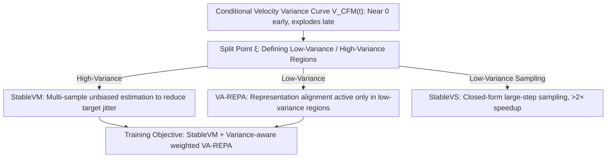

# Stable Velocity: A Variance Perspective on Flow Matching

**Conference**: ICML 2026  
**arXiv**: [2602.05435](https://arxiv.org/abs/2602.05435)  
**Code**: https://github.com/linYDTHU/StableVelocity  
**Area**: Image Generation / Flow Matching / Diffusion Models  
**Keywords**: flow matching, variance reduction, representation alignment, sampling acceleration, stochastic interpolants

## TL;DR
This paper re-examines flow matching from the overlooked perspective of "conditional velocity variance." It discovers that training trajectories naturally split into a high-variance region near the prior and a low-variance region near the data. Based on this, a unified framework, Stable Velocity, is proposed, consisting of an unbiased multi-sample variance reduction loss (StableVM), a variance-aware representation alignment (VA-REPA) active only in the low-variance region, and a fine-tuning-free sampler (StableVS) utilizing closed-form solutions in the low-variance region. The method achieves improved training efficiency and $>2\times$ sampling acceleration across ImageNet 256 and models like SD3.5, Flux, Qwen-Image, and Wan2.2.

## Background & Motivation

**Background**: The flow matching/stochastic interpolant paradigm, represented by Conditional Flow Matching (CFM), has unified diffusion and flow models. By training neural networks to fit the conditional velocity field $v_t(x_t \mid x_0)$, it learns the probability flow from a prior $\mathcal{N}(0, I)$ to the data distribution. This has become the standard for training large generative models such as SD3, Flux, and Wan2.2.

**Limitations of Prior Work**: The CFM training objective $v_t(x_t \mid x_0)$ is essentially a single-sample Monte Carlo estimate of the true marginal velocity field $v_t(x_t)$, which suffers from extreme variance. Specifically, as $t$ approaches 1 (near the prior and far from the data), a noisy sample $x_t$ can be explained by almost any data point, causing the regression target to fluctuate violently and making optimization slow and unstable. Simultaneously, auxiliary representation alignment losses like REPA are applied indiscriminately across all $t$, without analysis of the temporal structure of their effectiveness.

**Key Challenge**: CFM treats the entire interval $t \in [0, 1]$ as a "homogeneous" segment for both training and sampling. However, the conditional velocity variance $\mathcal{V}_{\text{CFM}}(t)$ is highly non-uniform along $t$—it is nearly zero in the early stages and explodes in the later stages. Existing methods neither perform variance reduction for the high-variance segments nor exploit the favorable structure of the low-variance segments.

**Goal**: (1) Provide an analytical characterization of flow matching training variance, (2) construct an unbiased variance reduction objective in high-variance regions, (3) enable auxiliary representation alignment losses to act adaptively only on meaningful segments, and (4) accelerate sampling by leveraging the simplified dynamics of low-variance regions.

**Key Insight**: By calculating the trace of the conditional velocity covariance, $\mathcal{V}_{\text{CFM}}(t)$ curves plotted on GMM, CIFAR-10, and ImageNet latents consistently show a split point $\xi$: the variance is near 0 when $t < \xi$ and rises rapidly when $t \ge \xi$. Furthermore, as data dimensionality increases, $\xi$ shifts closer to 1, expanding the low-variance region. This curve serves as the physical basis for the designs in this paper.

**Core Idea**: Replace the uniformly applied CFM/REPA/samplers with a "partition-based" unified framework—employ multi-sample variance reduction in high-variance regions, and enhance representation supervision while enabling closed-form large-step sampling in low-variance regions.

## Method

### Overall Architecture
Ours addresses the issue where CFM treats the entire $t \in [0, 1]$ interval as homogeneous, ignoring the drastic changes in conditional velocity variance. The approach first analytically derives the CFM objective variance $\mathcal{V}_{\text{CFM}}(t)$ at the probabilistic level to identify the split point $\xi$ between the near-zero and exploding variance regions. Subsequently, three orthogonal modules sharing the same $\xi$ are designed around this curve: the training loss StableVM, the auxiliary loss VA-REPA, and the sampler StableVS. These can be integrated individually or collectively into existing REPA/REG/iREPA pipelines.

### Key Designs

**1. StableVM: Reducing Target Jitter in High-Variance Regions via Multi-sample Unbiased Estimation**

The CFM training objective $v_t(x_t \mid x_0)$ is inherently a single-sample Monte Carlo estimate of the true marginal velocity $v_t(x_t)$. As $t \to 1$, the regression target fluctuates wildly. StableVM directly addresses this variance: instead of sampling $x_t$ from a single conditional path, it samples from a mixture path $p_t^{\text{GMM}}(x_t \mid \{x_0^i\}) = \frac{1}{n}\sum_i p_t(x_t \mid x_0^i)$. The regression target is replaced by a self-normalized weighted average of $n$ reference samples: $\widehat{v}_{\text{StableVM}}(x_t; \{x_0^i\}) = \sum_k p_t(x_t \mid x_0^k) v_t(x_t \mid x_0^k) / \sum_j p_t(x_t \mid x_0^j)$. The paper proves this objective shares the same global optimum $v_t(x_t)$ as CFM (Theorem 3.1) but has strictly lower variance (Theorem 3.2), which decays at $O(1/n)$ as $n$ increases (Theorem 3.3). Unlike the biased STF approach (which only fits VP diffusion), StableVM's mixture sampling makes it truly unbiased and generalizable to arbitrary stochastic interpolants. For conditional generation, a FIFO class memory bank with capacity $K=256$ is maintained to provide sufficient reference samples for sparse classes within a batch.

**2. VA-REPA: Restricting Representation Alignment to Meaningful Low-Variance Regions**

Standard REPA-style semantic alignment losses are applied uniformly across all $t$. However, the authors observe that the alignment loss $\ell_{\text{RA}}$ of pre-trained models remains low and learnable in low-variance regions but saturates at extremely high values in high-variance regions—recovering deterministic semantics from near-pure noise is ill-posed. VA-REPA introduces a temporal weight $w(t) \in [0, 1]$, making the total loss: $\mathcal{L} = \mathcal{L}_{\text{StableVM}} + \lambda_{\text{RA}} \mathbb{E}_{t,x_t}[w(t) \ell_{\text{RA}}(x_t)] / \mathbb{E}_t[w(t)]$. Implementations for $w(t)$ include a hard threshold $\mathbb{I}[t < \xi]$, sigmoid relaxation $\sigma(k(\xi - t))$, or an SNR-based form. Normalization by $\mathbb{E}_t[w(t)]$ is crucial; it prevents the auxiliary gradient from being diluted when most samples fall in high-variance zones. Effectively, the variance curve acts as a gate to ensure alignment happens only when appropriate.

**3. StableVS: Treating Low-Variance Segments as Linear for >2× Acceleration via Closed-form Sampling**

Traditional samplers must use small steps to handle unknown curvature. However, in low-variance regions where $v_t(x_t) \approx v_t(x_t \mid x_0)$, the reverse SDE can be expressed as a DDIM-style posterior $p_\tau(x_\tau \mid x_t, v_t) = \mathcal{N}(\mu_{\tau \mid t}, \beta_t^2 I)$, with $\mu_{\tau \mid t} = (\rho_t - \lambda_t \sigma'_t / \sigma_t)x_t + \lambda_t v_t(x_t)$. For PF-ODE, there is also a closed-form solution: $x_\tau = \sigma_\tau[(1/\sigma_t - \sigma'_t/\sigma_t \cdot \Psi_{t,\tau})x_t + \Psi_{t,\tau} v_t(x_t)]$. Under the special case of linear interpolation and $\beta_t=0$, these degrade to $x_\tau = x_t + (\tau - t)v_t(x_t)$—meaning the trajectory in the low-variance segment follows a constant velocity line, allowing for accurate integration with arbitrarily large steps. StableVS allocates the saved step quota to high-variance segments that require precision, requiring no fine-tuning. Experiments on SD3.5/Flux/Wan2.2 show that setting $\xi = 0.85$ and using only 9 steps in the low-variance region maintains quality, trading structural priors for computation.

### Loss & Training
The final training objective combines the StableVM loss $\mathcal{L}_{\text{StableVM}}$ with the variance-aware normalized $\lambda_{\text{RA}}$ weighted VA-REPA term. Default configuration: $\xi = 0.7$ (training) / $0.85$ (sampling), memory bank capacity $K = 256$, and $w_{\text{sigmoid}}$ weighting. The backbone is SiT-XL/2 on ImageNet 256 latents. The number of reference samples $n$ is achieved via in-batch combinations without additional networks.

## Key Experimental Results

### Main Results
ImageNet $256 \times 256$, SiT-XL/2 + CFG ($w=1.8$, interval-based CFG):

| Method | Epoch | FID↓ | sFID↓ | IS↑ | Prec.↑ | Rec.↑ |
|------|-------|------|-------|-----|--------|-------|
| SiT-XL/2 | 1400 | 2.06 | 4.50 | 270.3 | 0.82 | 0.59 |
| REPA | 80 | 1.98 | 4.60 | 263.0 | 0.80 | 0.61 |
| REPA | 800 | 1.42 | 4.70 | 305.7 | 0.80 | 0.65 |
| iREPA | 80 | 1.93 | 4.59 | 268.8 | 0.80 | 0.60 |
| REG | 480 | 1.40 | 4.24 | 296.9 | 0.77 | 0.66 |
| **Ours (StableVM+VA-REPA)** | 80 | **1.80** | 4.52 | 272.4 | 0.81 | 0.60 |
| **Ours** | 480 | **1.44** | 4.49 | 302.9 | 0.80 | 0.64 |
| REPA-E† (VAE fine-tuned) | 800 | 1.12* | 4.09* | 302.9* | 0.79* | 0.66* |
| **Ours (class-balanced)** | 480 | **1.33*** | 4.46* | 307.8* | 0.80* | 0.64* |

Ours exceeds the 80-epoch baseline of REPA/iREPA/REG at only 80 epochs. At 480 epochs, it approaches the performance of REPA-E, which requires 800 epochs and VAE fine-tuning.

Across model scales (no CFG, 100k iter): SiT-B/2 FID 52.06 $\to$ 49.69, SiT-L/2 22.75 $\to$ 21.03, SiT-XL/2 18.59 $\to$ 17.12.

### Ablation Study

Orthogonal improvements on different REPA variants (100k iter):

| Method | FID↓ | sFID↓ | IS↑ | Prec.↑ | Rec.↑ |
|------|------|-------|-----|--------|-------|
| REPA | 18.59 | 5.39 | 70.6 | 0.64 | 0.62 |
| + Ours | **17.12** | 5.39 | 74.8 | 0.65 | 0.63 |
| REG | 8.90 | 5.50 | 125.3 | 0.72 | 0.59 |
| + Ours | **8.11** | 5.34 | 128.8 | 0.74 | 0.60 |
| iREPA | 16.62 | 5.31 | 76.7 | 0.65 | 0.63 |
| + Ours | **16.02** | 5.30 | 78.6 | 0.66 | 0.63 |

Split point $\xi$ ablation: At 100k, $\xi=0.6$ is slightly better (17.38), but at 400k, $\xi=0.7$ is optimal, while $\xi=0.8$ degrades (as it includes noisy segments in alignment).

### Key Findings
- The three components are **orthogonal and drop-in**: Stable gains are observed when added to vanilla REPA, REG, or iREPA, indicating "variance partitioning" is a universal design principle.
- The choice of $\xi$ has a **training stage dependency**: Smaller $\xi$ (weaker auxiliary supervision) helps early convergence, while larger $\xi$ in later stages provides better semantic structure. $\xi=0.7$ is a balanced trade-off.
- StableVS achieved **$>2\times$ acceleration without fine-tuning** on SD3.5/Flux/Qwen-Image/Wan2.2 with almost no change in PSNR/SSIM/LPIPS, proving large models indeed learn near-linear velocity fields in low-variance regions.

## Highlights & Insights
- Visualizing the "conditional velocity variance curve $\mathcal{V}_{\text{CFM}}(t)$" as a physical quantity allows for a unified design of training, auxiliary losses, and samplers—a rare "diagnostic-first" approach in flow matching literature.
- The self-normalized importance sampling form of StableVM provides an $O(1/n)$ variance reduction rate "for free," unlike the biased STF which only supports VP diffusion. This theoretical advance brings variance reduction to all stochastic interpolants.
- VA-REPA addresses a mismatch in REPA-style works: semantic alignment is treated as a global task, but semantic information is destroyed at high noise levels. This insight is transferable to any task using pre-trained representation supervision (e.g., control, safety alignment).
- StableVS's simplicity suggests that SOTA T2I/T2V models possess significant "low-variance linear segments." Future distillation or consistency methods could potentially focus solely on distilling high-variance segments.

## Limitations & Future Work
- **Limitations acknowledged by authors**: The precise location of $\xi$ depends on unknown data distributions and is currently determined empirically (0.7 for training, 0.85 for sampling); memory banks may remain sparse for extreme long-tail classes.
- **Identified Limitations**: (1) Training experiments are limited to SiT models on ImageNet 256; scalability to training Flux/SD3.5 from scratch is not shown. (2) StableVS assumes the model has accurately learned $v_t$; failures may occur in under-trained models. (3) The trade-off between $n$, batch size, and VRAM isn't fully explored.
- **Future Directions**: Online estimation of $\mathcal{V}_{\text{CFM}}(t)$ for adaptive $\xi$; coupling $w(t)$ with the loss curve for automatic gating; combining StableVS with consistency distillation.

## Related Work & Insights
- **vs CFM (Tong et al., 2023)**: CFM uses single-sample conditional velocity; Ours provides variance analysis and StableVM as an unbiased alternative with lower variance.
- **vs STF (Xu et al., 2023)**: STF uses multi-sample reweighting but is limited to VP diffusion and is biased. StableVM achieves unbiasedness through $p_{t}^{\text{GMM}}$ mixture sampling.
- **vs REPA / REG / iREPA**: These works apply alignment uniformly. Ours proves alignment is ill-posed in high-variance regions and provides a gated improvement.
- **vs DDIM / Rectified Flow / Consistency Models**: StableVS is most similar to DDIM and Rectified Flow but requires no training, leveraging the fact that models naturally learn linear fields in low-variance sections.

## Rating
- Novelty: ⭐⭐⭐⭐⭐ Uses variance curves as a unified principle across training, auxiliary loss, and sampling.
- Experimental Thoroughness: ⭐⭐⭐⭐ Extensive ImageNet and large model sampler validation, though training-side lack of large-scale models costs half a star.
- Writing Quality: ⭐⭐⭐⭐⭐ Clear storyline, consistent use of $\xi$, and rigorous mathematical presentation.
- Value: ⭐⭐⭐⭐⭐ Drop-in training gains and 2× inference speedup are directly applicable to industrial T2I/T2V deployment.

<!-- RELATED:START -->

## Related Papers

- [\[ICML 2026\] A Kinetic Energy Perspective of Flow Matching](a_kinetic_energy_perspective_of_flow_matching.md)
- [\[CVPR 2026\] VeCoR — Velocity Contrastive Regularization for Flow Matching](../../CVPR2026/image_generation/vecor_--_velocity_contrastive_regularization_for_flow_matching.md)
- [\[ICML 2026\] The Coupling Within: Flow Matching via Distilled Normalizing Flows](the_coupling_within_flow_matching_via_distilled_normalizing_flows.md)
- [\[ICML 2026\] AG-REPA: Causal Layer Selection for Representation Alignment in Audio Flow Matching](ag-repa_causal_layer_selection_for_representation_alignment_in_audio_flow_matchi.md)
- [\[ICML 2026\] Exploring and Exploiting Stability in Latent Flow Matching](exploring_and_exploiting_stability_in_latent_flow_matching.md)

<!-- RELATED:END -->
