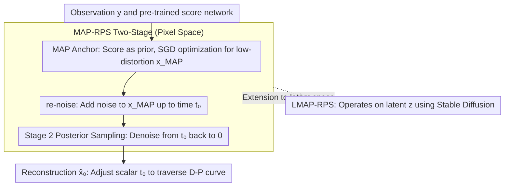

# Stage-wise Distortion-Perception Traversal in Zero-shot Inverse Problems with Diffusion Models

**Conference**: ICML 2026  
**arXiv**: [2605.28711](https://arxiv.org/abs/2605.28711)  
**Code**: https://github.com/weigerzan/MAP_RPS (Available)  
**Area**: Diffusion Models / Image Restoration / Inverse Problems  
**Keywords**: distortion-perception tradeoff, zero-shot inverse problem, diffusion posterior sampling, MAP estimation, latent diffusion

## TL;DR
A two-stage framework, MAP-RPS, is proposed: it first uses the diffusion model's score for Maximum A Posteriori (MAP) estimation to approach the Minimum Mean Square Error (MMSE) solution (low-distortion anchor), then re-noises the MAP result to time $t_0$ followed by posterior sampling (sliding along the D-P curve towards high perceptual quality). A single pre-trained diffusion model enables flexible traversal of the distortion-perception trade-off during inference and achieves SOTA multi-task performance on MS-COCO when extended to latent diffusion.

## Background & Motivation

**Background**: Diffusion models have become the mainstream framework for zero-shot Bayesian inverse problem solving (Super-Resolution, deblurring, inpainting, compressed sensing, HDR). Representative methods like DPS, $\Pi$GDM, ReSample, and PSLD sample from the posterior $p_{X\mid Y}$ by approximating $\nabla_{\mathbf{x}_t}\log p_t(\mathbf{y}\mid\mathbf{x}_t)$.

**Limitations of Prior Work**: As proven by Blau & Michaeli (2018), the distortion-perception (D-P) trade-off dictates that distortion metrics (PSNR/SSIM) and perception metrics (LPIPS/FID) are fundamentally at odds. Pure posterior sampling resides at the "high perception/high distortion" end of the D-P curve, while pure MMSE estimation resides at the other. Practical applications (e.g., medical imaging favoring fidelity, consumer photography favoring perception) require free movement between these ends, but existing methods either rely on manual tuning of sampling steps, averaging multiple samples, or tedious hyperparameter adjustment, or they require training new models. **A principled, inference-time controllable, and computationally efficient D-P traversal mechanism is missing.**

**Key Challenge**: The two optimal estimators at the ends of the D-P curve, $X_{\text{MMSE}}=\mathbb{E}[X\mid Y]$ and the perception-optimal estimator (e.g., posterior sampling), stem from entirely different optimization objectives. Theoretically, Freirich et al. showed that linear interpolation between the two can traverse the D-P curve (Eq. 15), but in zero-shot diffusion, the MMSE end is extremely difficult to compute—it requires repeated posterior sampling and averaging, making the computational cost of a single sample explode.

**Goal**: Decomposition into two sub-problems: (1) efficiently obtaining a low-distortion starting point (approximating MMSE) in a zero-shot diffusion framework without repeated sampling; (2) **continuously and controllably** "pushing" this low-distortion point toward the high-perception end.

**Key Insight**: The authors observe that in image restoration, the "ground truth image" is typically nearly unique—implying that the posterior distribution $p_{X\mid Y}$ is approximately **strongly log-concave** (unimodal and concentrated) in many scenarios. Under this mild assumption, the distance between MAP and MMSE estimates is provably bounded ($\mathcal{O}(\sqrt{n_x/\mu})$), yet MAP is significantly cheaper (gradient optimization instead of repeated sampling). For the second stage, the "noise-denoise" bidirectional flow of diffusion models is utilized: the MAP result is re-noised to an intermediate time $t_0$, and then the posterior sampling SDE is run from $t_0$ back to 0. A larger $t_0$ leads to pure posterior sampling (perceptual optimum), while $t_0=0$ degrades to MAP (distortion optimum). **A single scalar $t_0$ traverses the D-P curve at inference time.**

**Core Idea**: Use **MAP as a replacement for MMSE as the low-distortion anchor + re-noise time $t_0$ as the D-P slider**, transforming the binary choice between MMSE and posterior sampling into a continuous adjustment without retraining or multi-sample averaging.

## Method

### Overall Architecture
MAP-RPS enables a fixed pre-trained diffusion model to freely traverse the distortion-perception trade-off at inference time. It executes this in two sequential stages: first, using the diffusion score as a prior and gradient optimization to find a low-distortion MAP anchor (the distortion end of the D-P curve); second, re-noising this anchor along the forward SDE to an intermediate time $t_0$ and using an existing posterior sampler to denoise back to 0 (sliding toward the perception end). The inputs are observation $\mathbf{y}=\mathcal{A}(\mathbf{x})+\sigma_{\mathbf{y}}\mathbf{n}$ and a pre-trained score network $\mathbf{s}_\theta(\mathbf{x}_t,t)$. The output is the reconstructed image $\hat{\mathbf{x}}_0$, with the user adjusting a scalar $t_0\in[0,T]$ to select any point on the curve. This process can be implemented in VAE latent space (LMAP-RPS) to leverage Stable Diffusion for near-real-world MS-COCO tasks.

### Key Designs

**1. MAP as a Low-distortion Anchor: Provable Error Bounds + Score Gradients**

The distortion end of the D-P curve is theoretically the MMSE solution $X_{\text{MMSE}}=\mathbb{E}[X\mid Y]$, which is computationally prohibitive in zero-shot diffusion due to the need for averaging samples. The authors use the much cheaper MAP solution, supported by the observation that the posterior is approximately $\mu$-strongly log-concave. Theorem 3.2 proves $\mathbb{E}\|X_{\text{MAP}}-X_{\text{MMSE}}\|\le\sqrt{n_x/\mu}$ and $\mathbb{E}\|X-X_{\text{MAP}}\|^2\le D^*+n_x/\mu$, indicating that the additional distortion introduced by MAP is bounded by $\mathcal{O}(n_x^{1/2})$. Algorithmically, Stage 1 solves $\mathbf{x}_{\text{MAP}}=\arg\max_{\mathbf{x}}\log p_{Y\mid X}(\mathbf{y}\mid\mathbf{x})+\log p_X(\mathbf{x})$ starting from random initialization. The likelihood term is an $\ell_2$ data term, and the prior gradient is given by the computable closed form in Theorem 3.3: $\nabla_{\mathbf{x}}\log p_X(\mathbf{x})=\frac{1-\bar\alpha_{t_1}}{r_{t_1}^2\sqrt{\bar\alpha_{t_1}}}\mathbb{E}_{p_{X_{t_1}\mid X_0}}\nabla_{\mathbf{x}_{t_1}}\log p_{t_1}(\mathbf{x}_{t_1})$. Thus, a single SGD optimization path (1 score forward pass per iteration) provides the anchor, orders of magnitude cheaper than MMSE.

**2. Re-noised Posterior Sampling: Traversal with a Single Parameter $t_0$**

To continuously shift the low-distortion anchor toward high perception, the authors utilize the symmetric "re-noise/denoise" structure. Stage 2 re-noises $\mathbf{x}_{\text{MAP}}$ via the forward SDE to $\mathbf{x}_{t_0}\sim\mathcal{T}(0,t_0)_\#\delta_{\mathbf{x}_{\text{MAP}}}$, and then applies the posterior sampling SDE $\tilde{\mathcal{T}}(t_0,0;\mathbf{y})_\#$ back to 0. At $t_0=0$, the result is purely MAP (lowest distortion); at $t_0=T$, it is standard posterior sampling (best perception). intermediate $t_0$ values provide interpolation points. Theorem 3.5 provides a Wasserstein-2 upper bound $W_2(p_X,\,p_{0\to t_0\to 0})\le(\bar\alpha_{t_0})^{1-L_s}\sqrt{2n_x/\mu}+\epsilon_{\text{score}}$, and Corollary 3.6 states that when the score network Lipschitz constant $L_s<1$, this bound decreases monotonically with $t_0$. This makes the D-P theory a plug-and-play inference control.

**3. LMAP-RPS: Latent Space Execution for Large Models**

To handle high-resolution inverse problems, the MAP optimization and re-noised posterior sampling are shifted to the latent space $\mathbf{z}\in\mathbb{R}^d$. Observation constraints are mapped back to pixel space via the decoder $\mathcal{D}$ to approximate $\log p_{Y\mid Z}(\mathbf{y}\mid\mathbf{z})\approx\log p_{Y\mid X}(\mathbf{y}\mid\mathcal{D}(\mathbf{z}))$. This allows the use of Stable Diffusion on datasets like MS-COCO. Because the latent dimension is lower, MAP optimization is faster, and the overall complexity is lower than baselines like ReSample or PSLD.

### Loss & Training
The method is entire zero-shot and does not update diffusion model parameters. Stage 1 minimizes $-\log p_{Y\mid X}(\mathbf{y}\mid\mathbf{x})-\log p_X(\mathbf{x})$ using SGD. Stage 2 uses Euler–Maruyama to solve the posterior sampling SDE, where the posterior score can be implemented via standard methods like DPS or $\Pi$GDM. Hyperparameters include MAP iterations $N$, step size $\gamma$, and re-noise time $t_0$.

## Key Experimental Results

### Main Results
Evaluated on 6 latent-space inverse problems (inpainting, SR 4×, deblur, CS 2×, HDR, nonlinear deblur) on MS-COCO, compared against Latent-DPS, ReSample, PSLD, and others:

| Task | Metric | LMAP-RPS (0) | LMAP-RPS (600) | Runner-up Baseline |
|------|------|---------------|------------------|----------|
| Inpainting | PSNR↑ / LPIPS↓ / FID↓ | **28.14** / **0.2769** / **61.35** | 27.22 / 0.3084 / 92.23 | Latent-SITCOM 28.06 / Latent-DMAP 0.3078 / Latent-DCDP 72.05 |
| SR 4× | PSNR↑ / LPIPS↓ / FID↓ | **25.03** / 0.3888 / 107.57 | 24.49 / **0.3505** / **87.20** | LDIR 25.01 / Latent-DMAP 0.3721 / ReSample 91.43 |
| Deblur Aniso | PSNR↑ / LPIPS↓ / FID↓ | **26.42** / 0.3504 / 90.80 | 25.59 / **0.3503** / 85.01 | Latent-SITCOM 26.28 / Latent-DCDP 0.3535 / Latent-DCDP 81.27 |
| CS 2× | PSNR↑ / LPIPS↓ / FID↓ | 22.87 / 0.3498 / **113.06** | **22.90** / **0.3497** / 113.58 | ReSample 21.82 / 0.3806 / 113.36 |
| HDR | PSNR↑ / LPIPS↓ / FID↓ | **25.86** / **0.3595** / **108.79** | 23.06 / 0.3944 / 116.08 | Latent-DCDP 23.31 / ReSample 0.3666 / ReSample 111.89 |
| Nonlinear Deblur | PSNR↑ / LPIPS↓ / FID↓ | **24.27** / **0.3942** / 119.43 | 24.29 / – / – | LDIR 23.13 / Latent-DCDP 0.4225 / Latent-DCDP 140.32 |

### Ablation Study

| Configuration | Key Observation | Explanation |
|------|---------|------|
| $t_0=0$ (Pure MAP) | Highest PSNR, poor LPIPS/FID | Target at distortion end; corresponds to the max $(\bar\alpha_{t_0})^{1-L_s}$ in the $W_2$ bound. |
| $t_0=600$ (Strong re-noise) | Better LPIPS/FID, lower PSNR | Increasing $t_0 \to$ decreasing $\bar\alpha_{t_0} \to$ monotonic decrease in perception error bound (Corollary 3.6). |
| $t_0$ Continuous Scan | D-P curve on FFHQ closest to "ideal" | Superior to Latent-DPS or variance scaling in approximating the theoretical Pareto front. |
| Without Stage 1 | Degrades to standard posterior sampling | Loses low-distortion anchor, lead to significant PSNR drop. |
| Without Stage 2 | Perception significantly worse | Perceptual quality limited to MAP's unimodal estimate. |

### Key Findings
- **Two $t_0$ settings cover majority of SOTA**: LMAP-RPS(0) excels in distortion-sensitive tasks (HDR, nonlinear deblur), while LMAP-RPS(600) excels in perception-sensitive tasks (SR 4×). The same algorithm/model covers both ends by tuning one parameter.
- **Lower computational cost**: Total Neural Function Evaluations (NFE) are fewer than refinement methods like ReSample or PSLD, as Stage 1 gradients are cheap and Stage 2 starts from an intermediate $t_0$.
- **Robustness of theoretical assumptions**: Even in real distributions that are not strictly log-concave, the distortion delta between MAP and MMSE remains small.

## Highlights & Insights
- **Reinterpreting Diffusion flow as a D-P Interpolator**: The authors operationalize the theoretical interpolation of Freirich (2021) using the diffusion time axis $t_0$.
- **MAP as MMSE + Theoretical Safeguards**: Using a "computable theoretical sub-optimum" (MAP) with a provable error bound is an effective engineering strategy.
- **Transferable Insight**: Any dual-objective trade-off scenario with one "cheap" end and one "expensive" end can potentially adopt this two-stage "anchor + re-noise + sample" template.

## Limitations & Future Work
- **Dependency on strong log-concavity**: The theoretical guarantee may fail in highly multimodal inverse problems (e.g., strong occlusions with multiple solutions).
- **Manual $t_0$ selection**: Lacks an automated strategy for selecting $t_0$ based on downstream application or user preferences.
- **MAP initialization sensitivity**: Stage 1 optimization might stall in local modes; warm-starting with a coarse posterior sample could be explored.
- **Latent space likelihood approximation**: The decoder error is not theoretically quantified and could be refined using VAE posterior variance.

## Related Work & Insights
- **vs DPS / $\Pi$GDM**: These are limited to the perception end; MAP-RPS uses them as sub-modules for Stage 2 to achieve D-P control.
- **vs Wang et al. 2025 (variance-scaling)**: MAP-RPS uses the interpretable $t_0$ time parameter, which provides clearer theoretical bounds and better performance on the FFHQ Pareto front.
- **vs ReSample / PSLD / Latent-DAPS**: These target latent diffusion inverse problems but provide fixed trade-off points; LMAP-RPS scans the entire curve with fewer NFEs.

## Rating
- Novelty: ⭐⭐⭐⭐ Treating $t_0$ as a D-P slider is simple yet powerful; effectively integrates existing sub-techniques into a theoretically grounded framework.
- Experimental Thoroughness: ⭐⭐⭐⭐ Extensive testing on FFHQ and MS-COCO across 6 tasks against 9 baselines; could be expanded to higher resolutions (>1K) or video.
- Writing Quality: ⭐⭐⭐⭐ Clear progression from theory to experiment; SDE notation may be dense for some readers.
- Value: ⭐⭐⭐⭐ Provides a zero-cost "traversal slider" for engineers using diffusion inverse problems and links D-P theory to the diffusion process for researchers.

<!-- RELATED:START -->

## Related Papers

- [\[ICML 2026\] Saving Foundation Flow-Matching Priors for Inverse Problems](saving_foundation_flow-matching_priors_for_inverse_problems.md)
- [\[ICML 2026\] GUDA: Counterfactual Group-wise Training Data Attribution for Diffusion Models via Unlearning](guda_counterfactual_group-wise_training_data_attribution_for_diffusion_models_vi.md)
- [\[CVPR 2025\] Traversing Distortion-Perception Tradeoff Using a Single Score-Based Generative Model](../../CVPR2025/image_generation/traversing_distortion-perception_tradeoff_using_a_single_score-based_generative_.md)
- [\[NeurIPS 2025\] A Gradient Flow Approach to Solving Inverse Problems with Latent Diffusion Models](../../NeurIPS2025/image_generation/a_gradient_flow_approach_to_solving_inverse_problems_with_latent_diffusion_model.md)
- [\[AAAI 2026\] Constrained Particle Seeking: Solving Diffusion Inverse Problems with Just Forward Passes](../../AAAI2026/image_generation/constrained_particle_seeking_solving_diffusion_inverse_problems_with_just_forwar.md)

<!-- RELATED:END -->
