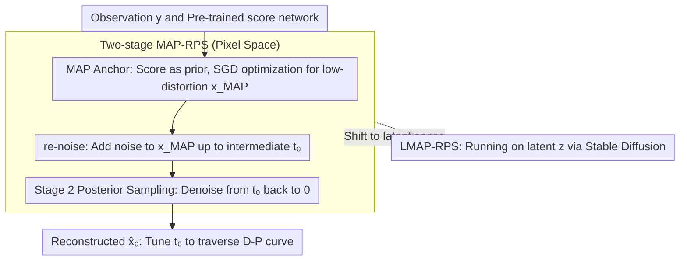

# Stage-wise Distortion-Perception Traversal in Zero-shot Inverse Problems with Diffusion Models

**Conference**: ICML 2026  
**arXiv**: [2605.28711](https://arxiv.org/abs/2605.28711)  
**Code**: https://github.com/weigerzan/MAP_RPS (Available)  
**Area**: Diffusion Models / Image Restoration / Inverse Problems  
**Keywords**: distortion-perception tradeoff, zero-shot inverse problem, diffusion posterior sampling, MAP estimation, latent diffusion

## TL;DR
A two-stage framework, MAP-RPS, is proposed: first, a MAP estimate is performed using the diffusion model score to approximate the MMSE solution (a low-distortion starting point); subsequently, the MAP result is re-noised to a specific timestep $t_0$ followed by posterior sampling (sliding along the D-P curve towards high perceptual quality). A single pre-trained diffusion model can flexibly traverse the distortion-perception trade-off during inference. The method achieves multi-task SOTA on MS-COCO after extension to latent diffusion.

## Background & Motivation

**Background**: Diffusion models have become the mainstream framework for zero-shot solving of Bayesian inverse problems (super-resolution, deblurring, inpainting, compressed sensing, HDR). Representative methods such as DPS, $\Pi$GDM, ReSample, and PSLD sample from the posterior $p_{X\mid Y}$ by approximating $\nabla_{\mathbf{x}_t}\log p_t(\mathbf{y}\mid\mathbf{x}_t)$.

**Limitations of Prior Work**: As proven by Blau & Michaeli (2018), the distortion-perception (D-P) trade-off dictates that distortion metrics (PSNR/SSIM) and perception metrics (LPIPS/FID) are inherently adversarial. Pure posterior sampling resides at the "high perception/high distortion" end of the D-P curve, while pure MMSE estimation resides at the opposite end. Practical applications (e.g., medical imaging favoring fidelity, consumer photography favoring perception) require free movement between these ends. However, existing methods either rely on tuning sampling steps, averaging multiple samples, manual hyperparameter tuning, or training new models. **A principled, inference-controlled, and computationally efficient D-P traversal mechanism is lacking.**

**Key Challenge**: The two optimal estimators at the ends of the D-P curve—$X_{\text{MMSE}}=\mathbb{E}[X\mid Y]$ and the perception-optimal estimator (e.g., posterior sampling)—arise from completely different optimization objectives. Theoretically, Freirich et al. showed that linear interpolation between the two can traverse the D-P curve (Eq. 15). However, in zero-shot diffusion scenarios, the MMSE end is difficult to compute as it requires repeated posterior sampling and averaging, leading to explosive computational costs for a single sample.

**Goal**: Decomposition into two sub-problems: (1) How to efficiently obtain a low-distortion starting point (approximating MMSE) in a zero-shot diffusion framework without repeated sampling; (2) Given this low-distortion point, how to **continuously and controllably** "push" it toward the high-perception end.

**Key Insight**: The authors observe that in image restoration, the "ground truth" is often nearly unique, implying the posterior distribution $p_{X\mid Y}$ is approximately **strongly log-concave** (unimodal and concentrated) in many scenarios. Under this mild assumption, the distance between MAP and MMSE is provably bounded ($\mathcal{O}(\sqrt{n_x/\mu})$), yet MAP is significantly cheaper (gradient optimization instead of repeated sampling). For the second stage, the "forward-backward" flow of diffusion models is utilized: the MAP result is re-noised to an intermediate timestep $t_0$, and then the posterior sampling SDE is run from $t_0$ back to 0. A larger $t_0$ approaches pure posterior sampling (perceptual-optimal), while $t_0=0$ reduces to MAP (distortion-optimal). **A single scalar $t_0$ traverses the D-P curve at inference time.**

**Core Idea**: Use **MAP as a low-distortion anchor instead of MMSE + use the re-noise timestep $t_0$ as a D-P slider**, transforming the binary choice between MMSE and posterior sampling into a continuous adjustment without retraining or multi-sample averaging.

## Method

### Overall Architecture
MAP-RPS solves the problem of how to freely slide the distortion-perception trade-off at inference using a fixed pre-trained diffusion model. It is split into two sequential stages: first, using the diffusion score as a prior and gradient optimization to find a low-distortion MAP anchor (distortion end); second, re-noising this anchor along the forward SDE to an intermediate timestep $t_0$, and running an off-the-shelf posterior sampler from $t_0$ to 0 (sliding toward the perception end). The inputs are the observation $\mathbf{y}=\mathcal{A}(\mathbf{x})+\sigma_{\mathbf{y}}\mathbf{n}$ and a pre-trained score network $\mathbf{s}_\theta(\mathbf{x}_t,t)$. The output is the reconstructed image $\hat{\mathbf{x}}_0$, where the user tunes a scalar $t_0\in[0,T]$ to pick any point on the curve. This workflow can be shifted to the VAE latent space (LMAP-RPS) to leverage Stable Diffusion for near-real-world tasks on MS-COCO.

### Key Designs

**1. MAP instead of MMSE as a low-distortion anchor: Provable error bounds + single-forward score gradients**

The distortion end of the D-P curve is theoretically the MMSE solution $X_{\text{MMSE}}=\mathbb{E}[X\mid Y]$, which is computationally prohibitive in zero-shot diffusion. The authors use the much cheaper MAP solution, supported by the engineering intuition that image restoration targets are nearly unique and the posterior is approximately $\mu$-strongly log-concave. Theorem 3.2 proves $\mathbb{E}\|X_{\text{MAP}}-X_{\text{MMSE}}\|\le\sqrt{n_x/\mu}$ and $\mathbb{E}\|X-X_{\text{MAP}}\|^2\le D^*+n_x/\mu$, meaning the additional distortion from MAP is bounded by $\mathcal{O}(n_x^{1/2})$, with tighter bounds as the posterior becomes more concentrated (larger $\mu$). Algorithmically, Stage 1 starts from random initialization to solve $\mathbf{x}_{\text{MAP}}=\arg\max_{\mathbf{x}}\log p_{Y\mid X}(\mathbf{y}\mid\mathbf{x})+\log p_X(\mathbf{x})$, where the likelihood reduces to an $\ell_2$ term and the prior gradient is given by the computable closed-form in Theorem 3.3: $\nabla_{\mathbf{x}}\log p_X(\mathbf{x})=\frac{1-\bar\alpha_{t_1}}{r_{t_1}^2\sqrt{\bar\alpha_{t_1}}}\mathbb{E}_{p_{X_{t_1}\mid X_0}}\nabla_{\mathbf{x}_{t_1}}\log p_{t_1}(\mathbf{x}_{t_1})$. Thus, a single SGD path (one score forward pass per iteration) yields the anchor, which is orders of magnitude cheaper than MMSE averaging.

**2. re-noised posterior sampling: Traversing the D-P curve with a single parameter $t_0$**

The authors utilize the symmetric "noise/denoise" structure of diffusion models as a linear interpolator. Stage 2 re-noises $\mathbf{x}_{\text{MAP}}$ along the forward SDE to $\mathbf{x}_{t_0}\sim\mathcal{T}(0,t_0)_\#\delta_{\mathbf{x}_{\text{MAP}}}$, and then uses a posterior sampling SDE $\tilde{\mathcal{T}}(t_0,0;\mathbf{y})_\#$ to denoise from $t_0$ back to 0. Here, $t_0=0$ reduces entirely to MAP (minimal distortion), while $t_0=T$ reduces to standard posterior sampling (optimal perception). Any $t_0 \in (0, T)$ provides an interpolation point—anchored by MAP at the distortion end and re-introducing stochasticity via the score at the perception end. Theoretically, Theorem 3.5 provides a Wasserstein-2 upper bound $W_2(p_X,\,p_{0\to t_0\to 0})\le(\bar\alpha_{t_0})^{1-L_s}\sqrt{2n_x/\mu}+\epsilon_{\text{score}}$. Corollary 3.6 further notes that when the score network Lipschitz constant $L_s < 1$, this bound decreases monotonically with $t_0$, meaning "more noise $\rightarrow$ better perception."

**3. LMAP-RPS: Operation in latent space for large-scale models**

To leverage the power of Latent Diffusion Models (LDMs), the authors move the MAP optimization and re-noised posterior sampling into the latent space $\mathbf{z}\in\mathbb{R}^d$. Observation constraints are mapped back to pixel space via the decoder $\mathcal{D}$ to approximate $\log p_{Y\mid Z}(\mathbf{y}\mid\mathbf{z})\approx\log p_{Y\mid X}(\mathbf{y}\mid\mathcal{D}(\mathbf{z}))$. Theorems C.2 and C.3 in Appendix C extend the pixel-space theoretical guarantees to the latent version. This allows direct application of Stable Diffusion on MS-COCO, and since the latent dimension is lower, MAP optimization is faster, resulting in lower total computational complexity than multi-step refinement baselines like ReSample or PSLD.

### Loss & Training
The entire process is zero-shot inference, updating no diffusion model parameters. The Stage 1 objective is $-\log p_{Y\mid X}(\mathbf{y}\mid\mathbf{x})-\log p_X(\mathbf{x})$ (data term is $\ell_2$, prior term is implemented via score estimation from Theorem 3.3), optimized via standard SGD. Stage 2 uses Euler–Maruyama to solve the posterior sampling SDE, where the posterior score can be replaced by existing implementations like DPS or $\Pi$GDM. Tunable hyperparameters are limited to three: MAP iterations $N$, step size $\gamma$, and re-noise timestep $t_0$.

## Key Experimental Results

### Main Results
On MS-COCO, 6 latent-space inverse problems (inpainting / SR 4× / anisotropic deblur / CS 2× / HDR / nonlinear deblur) were compared against Latent-DPS, ReSample, PSLD, STSL, LDIR, Latent-DCDP, Latent-DMAP, Latent-DAPS, and Latent-SITCOM:

| Task | Metric | LMAP-RPS (0) | LMAP-RPS (600) | Runner-up Baseline |
|------|------|---------------|------------------|----------|
| Inpainting | PSNR↑ / LPIPS↓ / FID↓ | **28.14** / **0.2769** / **61.35** | 27.22 / 0.3084 / 92.23 | Latent-SITCOM 28.06 / Latent-DMAP 0.3078 / Latent-DCDP 72.05 |
| SR 4× | PSNR↑ / LPIPS↓ / FID↓ | **25.03** / 0.3888 / 107.57 | 24.49 / **0.3505** / **87.20** | LDIR 25.01 / Latent-DMAP 0.3721 / ReSample 91.43 |
| Deblur Aniso | PSNR↑ / LPIPS↓ / FID↓ | **26.42** / 0.3504 / 90.80 | 25.59 / **0.3503** / 85.01 | Latent-SITCOM 26.28 / Latent-DCDP 0.3535 / Latent-DCDP 81.27 |
| CS 2× | PSNR↑ / LPIPS↓ / FID↓ | 22.87 / 0.3498 / **113.06** | **22.90** / **0.3497** / 113.58 | ReSample 21.82 / 0.3806 / 113.36 |
| HDR | PSNR↑ / LPIPS↓ / FID↓ | **25.86** / **0.3595** / **108.79** | 23.06 / 0.3944 / 116.08 | Latent-DCDP 23.31 / ReSample 0.3666 / ReSample 111.89 |
| Nonlinear Deblur | PSNR↑ / LPIPS↓ / FID↓ | **24.27** / **0.3942** / 119.43 | 24.29 / – / – | LDIR 23.13 / Latent-DCDP 0.4225 / Latent-DCDP 140.32 |

### Ablation Study

| Config | Key Observation | Explanation |
|------|---------|------|
| $t_0=0$ (Pure MAP) | Highest PSNR, poorer LPIPS/FID | Lowest distortion end; $(\bar\alpha_{t_0})^{1-L_s}$ term in $W_2$ bound is maximal |
| $t_0=600$ (Strong re-noise) | Better LPIPS/FID, lower PSNR | $t_0$ increase $\rightarrow$ $\bar\alpha_{t_0}$ decrease $\rightarrow$ monotonic decrease in perception bound (Corollary 3.6) |
| $t_0$ Continuous Scan | D-P curve on FFHQ most closely matches "ideal D-P curve" | Closer to the theoretical Pareto frontier than variance scaling (Wang 2025) or ReSample |
| Remove Stage 1 | Degrades to standard posterior sampling | Loses low-distortion anchor, sharp drop in PSNR |
| Remove Stage 2 (MAP only) | Significantly worse LPIPS/FID | Perceptual quality limited to the MAP unimodal peak |

### Key Findings
- **Two $t_0$ settings cover most SOTA results**: LMAP-RPS(0) excels in distortion-sensitive tasks (Best in HDR, nonlinear deblur), while LMAP-RPS(600) excels in perception-sensitive tasks (Best LPIPS/FID in SR 4×). The same algorithm and model cover both ends via a single inference parameter.
- **Computation is cheaper than baselines**: Total NFEs are lower than multi-step refinement methods like ReSample and PSLD because MAP optimization requires only one score forward pass per step, and Stage 2 starts from an intermediate $t_0$ instead of $T$.
- **Robustness of theoretical assumptions**: Experiments in Appendix E.1 show that even when the image distribution isn't strictly log-concave, the distortion overhead of MAP over MMSE remains small.

## Highlights & Insights
- **Diffusion noise/denoise re-interpreted as a D-P interpolator**: The theoretical linear interpolation between MMSE and perception-optimal (Freirich 2021) is operationalized as "pushing" the anchor point along the diffusion time axis.
- **Using MAP as MMSE + strong log-concavity as a safeguard**: A clever engineering strategy that replaces an uncomputable theoretical optimum with a computable theoretical sub-optimum, complete with error bounds.
- **Transferable Insight**: Any "dual-objective trade-off + one expensive/one cheap" scenario (e.g., fidelity vs. diversity) can adopt this template: cheap anchor point + perturbation to intermediate state + expensive sampling back to zero.

## Limitations & Future Work
- **Dependency on strong log-concavity**: In highly multi-modal inverse problems (e.g., strong occlusions), theoretical guarantees might weaken.
- **Manual $t_0$ selection**: While a single parameter is simple, an automatic strategy for selecting $t_0$ based on downstream tasks or user preference is missing.
- **Initialization sensitivity in Stage 1**: Random initialization + SGD might get stuck in local modes of the prior; warm-start strategies from coarse posterior sampling could be explored.
- **Latent likelihood approximation**: Approximating $\log p_{Y\mid X}(\mathbf{y}\mid\mathcal{D}(\mathbf{z}))$ remains a point estimate; incorporating VAE posterior variance could refine this.

## Related Work & Insights
- **vs DPS / $\Pi$GDM**: These are limited to the perception end (standard posterior sampling). MAP-RPS uses them as sub-modules in Stage 2, adding a MAP anchor and $t_0$ slider to enable D-P control.
- **vs Wang et al. 2025 (variance-scaled posterior sampling)**: Wang scales injection noise variance, requiring Gaussian assumptions; MAP-RPS uses an interpretable time parameter $t_0$ with clearer bounds and better Pareto frontier approximation.
- **vs ReSample / PSLD / Latent-DAPS**: These address latent diffusion inverse problems but provide fixed trade-off points; LMAP-RPS scans the entire curve with fewer NFEs.

## Rating
- Novelty: ⭐⭐⭐⭐ Using $t_0$ as a D-P slider is a clean, powerful perspective.
- Experimental Thoroughness: ⭐⭐⭐⭐ Extensive tasks (6) and baselines (9) on MS-COCO, including D-P curve analysis.
- Writing Quality: ⭐⭐⭐⭐ Clear theoretical-to-experimental loop.
- Value: ⭐⭐⭐⭐ Provides a zero-cost "slide-to-control D-P" capability for diffusion-based image restoration.

<!-- RELATED:START -->

## Related Papers

- [\[ICML 2026\] Saving Foundation Flow-Matching Priors for Inverse Problems](saving_foundation_flow-matching_priors_for_inverse_problems.md)
- [\[ICML 2026\] GUDA: Counterfactual Group-wise Training Data Attribution for Diffusion Models via Unlearning](guda_counterfactual_group-wise_training_data_attribution_for_diffusion_models_vi.md)
- [\[CVPR 2025\] Traversing Distortion-Perception Tradeoff Using a Single Score-Based Generative Model](../../CVPR2025/image_generation/traversing_distortion-perception_tradeoff_using_a_single_score-based_generative_.md)
- [\[NeurIPS 2025\] A Gradient Flow Approach to Solving Inverse Problems with Latent Diffusion Models](../../NeurIPS2025/image_generation/a_gradient_flow_approach_to_solving_inverse_problems_with_latent_diffusion_model.md)
- [\[AAAI 2026\] Constrained Particle Seeking: Solving Diffusion Inverse Problems with Just Forward Passes](../../AAAI2026/image_generation/constrained_particle_seeking_solving_diffusion_inverse_problems_with_just_forwar.md)

<!-- RELATED:END -->
