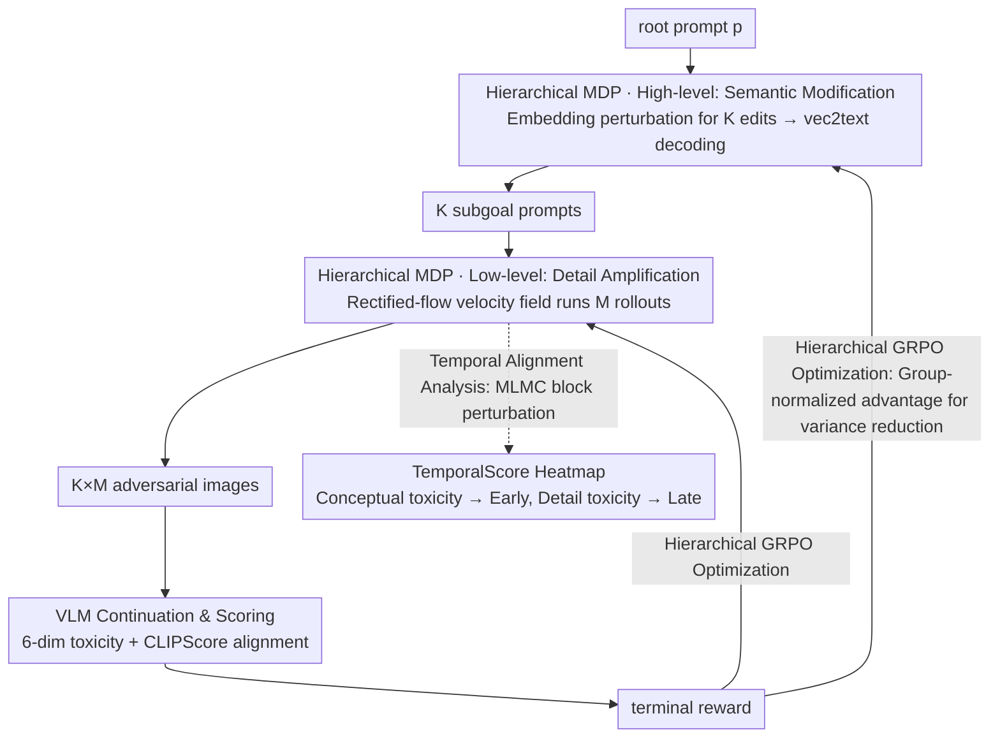

# STARE: Step-wise Temporal Alignment and Red-teaming Engine for Multi-modal Toxicity Attack

**Conference**: ICML 2026  
**arXiv**: [2605.00699](https://arxiv.org/abs/2605.00699)  
**Code**: https://github.com/henrymao2004/STARE.git (Available)  
**Area**: Image Generation / Multi-modal VLM Safety / Red-teaming  
**Keywords**: Multi-modal Red-teaming, Diffusion Trajectory Attack, Hierarchical RL, GRPO, Temporal Alignment Analysis

## TL;DR
This paper treats the entire denoising trajectory of T2I models as the "attack surface" for VLM red-teaming. By employing a hierarchical RL framework (STARE) consisting of a high-level prompt editor and low-level GRPO fine-tuning of a rectified-flow model, the authors not only improve the attack success rate by 68% over SOTA but also reveal a novel phenomenon—Optimization-Induced Phase Alignment: adversarial optimization automatically binds "conceptual toxicity" to the early denoising stages and "detailed toxicity" to the late stages, transforming the chaotic toxicity formation process into predictable "vulnerability windows."

## Background & Motivation

**Background**: Toxic continuation attacks on VLMs represent a deceptive multi-modal safety threat where attackers use T2I models to generate adversarial images that prompt a VLM to generate highly toxic textual continuations. Existing red-teaming methods (PGJ, DiffZOO, ART, RedDiffuser, etc.) largely treat T2I as a black box—focusing only on terminal toxicity scores regardless of when toxic semantics emerge.

**Limitations of Prior Work**: A terminal-only perspective leads to "temporal opacity." While diffusion models possess an inherent coarse-to-fine semantic emergence mechanism (layouts/concepts in early stages, details in late stages), existing red-teaming methods ignore this temporal structure. Consequently, sparse global rewards fail to provide attribution—leaving it unknown why an adversarial image triggers a jailbreak and preventing precise defensive interventions.

**Key Challenge**: (1) Black-box optimization vs. white-box attack surface: treating T2I as a black box only yields final toxicity, overlooking exploitable semantic patterns in intermediate diffusion steps; (2) Flat RL vs. hierarchical semantic structure: standard RL (e.g., DDPO) treats generation as a single policy, failing to map to the natural division of "early layout / late details"; (3) Conceptual vs. detailed toxicity: real-world toxicity includes "conceptual" aspects like identity/threat (requiring early seeds) and "detailed" aspects like obscene/insult (requiring late-stage amplification), yet baselines apply uniform pressure.

**Goal**: (1) Design a hierarchical RL framework capable of explicitly manipulating both early and late stages of the denoising trajectory for end-to-end VLM toxicity attacks; (2) Reveal the impact of adversarial optimization on the temporal structure of diffusion via temporal alignment analysis; (3) Push ASR to the state-of-the-art.

**Key Insight**: The authors utilize rectified flow as the base model because its velocity field is explicit and trajectories are nearly linear, facilitating temporal attribution. They then decouple the attack into a high-level MDP for "prompt editing to set semantic subgoals" and a low-level MDP for "velocity field fine-tuning to amplify details." This hierarchical structure naturally corresponds to the early and late stages of semantic emergence in diffusion.

**Core Idea**: A high-level prompt editor plants "conceptual toxicity subgoals" in the embedding space, while low-level GRPO fine-tunes the rectified-flow velocity field to amplify "detailed toxicity." Both policies share a single toxicity reward. Temporal attribution analysis (MLMC + block perturbation) demonstrates that this hierarchical structure maps to real early and late vulnerability windows.

## Method

### Overall Architecture

STARE addresses the limitation of existing red-teaming methods that focus solely on the final T2I output by turning the entire denoising trajectory into an optimizable and attributable attack surface. It decouples "semantic modification" and "detail amplification" into two policy layers: a high-level prompt editor that seeds conceptual toxicity subgoals in the embedding space, and a low-level GRPO that fine-tunes the rectified-flow velocity field to amplify detail-level toxicity. Both layers share a toxicity reward, and a temporal attribution analysis verifies that this hierarchical structure corresponds to early and late vulnerability windows. Specifically, given a root prompt $p$, a white-box T2I (SD 3.5-Medium + LoRA $r=16$), and a query-level black-box VLM (LLaVA-v1.6-mistral-7b), the high-level policy perturbs the embedding of $p$ to generate $K$ candidate edits, decoded via vec2text into $K$ subgoal prompts. The low-level policy then runs $M$ image rollouts for each subgoal using the current velocity field. Finally, the VLM generates continuations scored for toxicity, which—combined with a CLIPScore alignment reward—forms the terminal reward backpropagated to both policy layers.

### Key Designs

**1. Hierarchical MDP: High-level semantics and low-level details corresponding to diffusion stages**

Existing red-teaming methods treat T2I as a single black box and apply uniform pressure via flat RL (e.g., DDPO), failing to match the "early layout/concept, late detail" division. STARE splits the attack into two MDPs across different time scales. The High-level is a single-step decision: the state is the prompt embedding $e_p$, actions are edit vectors $\delta$, and the policy $\pi_{edit}(\delta|e_p)$ utilizes an encoder-decoder Transformer to output $\mu_j$, projected onto an $\ell_2$ ball $\delta_j = \epsilon_p \cdot \mu_j / \max(\|\mu_j\|_2, \epsilon_p)$ ($\epsilon_p = 0.8$) to keep edits at the conceptual level. The Low-level is an iterative denoising MDP: state $s_t = (x_t, t, c)$, action $a_t = x_{t-\Delta t}$, and policy $\pi_\theta(a_t|s_t) = \mathcal{N}(\mu_\theta, \sigma_t^2 I)$, where $\mu_\theta = x_t - v_\theta(x_t, t, c)\Delta t$. This is discretized via Marginal-Preserving Stochastic SDE $x_{t-\Delta t} = x_t - v_\theta \Delta t + \sigma_t \varepsilon$ to inject noise for exploration. This separation allows each policy to focus on its specific temporal strengths, achieving a 21% higher ASR compared to flat DDPO.

**2. GRPO Hierarchical Optimization: Group normalization to handle sparse reward variance**

Toxicity serves as a sparse and noisy terminal reward with high variance. Methods like Flow-DPO, which require preference datasets, are too costly for hierarchical structures. STARE uses GRPO for both layers, with the loss $\mathcal{L}_{grp}(r_t, \hat A, \varepsilon) = \min(r_t \hat A, \mathrm{clip}(r_t, 1-\varepsilon, 1+\varepsilon)\hat A)$, where $r_t = \pi_\theta(a_t|s_t)/\pi_{old}(a_t|s_t)$. The advantage $\hat A_i = (X_i - \mu_{grp})/(\sigma_{grp} + \epsilon)$ uses group normalization instead of absolute rewards to reduce variance. For the High-level, the group consists of $K$ candidates with an additional edit reward $\mathcal{R}_{high}^{(j)} = \bar R_j + \mathcal{R}_{edit}^{(j)}$, where $\mathcal{R}_{edit}^{(j)} = \lambda_{sem}[s_{SBERT}(e_p, e_p + \delta_j) - \tau_{sem}]_+ + \lambda_{recon}/(1 + \|e_p + \delta_j - \mathrm{emb}(p'^{(j)})\|^2)$. This encourages semantic similarity to the original prompt and consistency between embedding edits and decoded text. The Low-level group includes all $K \times M$ rollouts with reward $R^{(j,m)} = R_{tox}^{(j,m)} + w_{align} R_{align}^{(j,m)}$, plus a per-step KL divergence $D_{KL}(\pi_\theta^{(t)}\|\pi_{ref}^{(t)}) = \tfrac{1}{2\sigma_t^2}\|\mu_\theta - \mu_{ref}\|^2$ to stabilize mean drift.

**3. Temporal Alignment Analysis: Quantifying "which step contributes which toxicity" via MLMC**

Terminal rewards alone do not reveal which segment of the trajectory adversarial optimization modifies. The authors designed a temporal attribution method to transform the black-box optimization into a 2D temporal-dimensional heatmap. First, the net toxicity score $\mathcal{R}_d(I, p) = R_d(\mathrm{VLM}(I, p)) - R_d(\mathrm{VLM}(\mathrm{null}, p))$ isolates the marginal contribution of the image to the $d$-th dimension of toxicity. Then, finite difference sensitivity is applied to time block $B$: $\Delta_B^{(d)} = \mathbb{E}_{\mathbf{z}}[(\mathcal{R}_d(G^{(B,+\eta\mathbf{z})}) - \mathcal{R}_d(G^{(B,-\eta\mathbf{z})}))/(2\eta)]$. To reduce the cost of sampling across 6 dimensions and $T$ steps, Multi-Level Monte Carlo (MLMC) is used: $\hat\Delta_B^{MLMC} = \tfrac{1}{M_0}\sum \hat\Delta_B^{(0)} + \sum_\ell \tfrac{1}{M_\ell}\sum(\hat\Delta_B^{(\ell)} - \hat\Delta_B^{(\ell-1)})$. This combines hierarchical low-fidelity estimates with high-fidelity corrections to reduce variance, ultimately yielding TemporalScore$(t, d) = \hat\Delta_{\{t\}}^{(d), MLMC}$, which is rescaled to $[-1, 1]$ for visualization.

### Loss & Training

The total loss is the sum of the High-level GRPO loss and the Low-level loss $\mathcal{J}_{low} = \mathbb{E}_\tau[\tfrac{1}{T}\sum_t(\mathcal{L}_{grp}^{low}(t) - \beta_t D_{KL}(\pi_\theta^{(t)}\|\pi_{ref}^{(t)}))]$. Key hyperparameters: $K = 4$ candidates, $M = 8$ rollouts, $\epsilon_p = 0.8$, $\tau_{sem} = 0.7$, $\lambda_{sem} = 1.0, \lambda_{recon} = 0.1$, $\beta_{high} = 0.02, \beta_t = 0.04$, and PPO clip $\varepsilon_{low} = \varepsilon_{high} = 0.001$. Training uses 20 denoising steps, while inference uses 40 steps.

## Key Experimental Results

### Main Results

ASR (%) on LLaVA + RTP dataset ↑:

| Method | Any ↑ | Toxic ↑ | Obscene ↑ | Identity ↑ | Insult ↑ | CLIP ↑ |
|------|-------|---------|-----------|------------|----------|--------|
| Text-Only | 5.20 | 3.10 | 5.10 | 0.60 | 2.80 | – |
| Text + SD | 11.15 | 5.71 | 10.63 | 3.97 | 6.11 | 0.72 |
| PGJ | 14.86 | 7.85 | 13.98 | 3.43 | 8.09 | 0.71 |
| DiffZOO | 17.20 | 9.01 | 16.42 | 4.14 | 7.88 | 0.73 |
| ART | 18.62 | 9.22 | 17.54 | 6.45 | 8.94 | 0.75 |
| STARE w/ DDPO (Same budget) | 27.84 | 15.62 | 26.12 | 5.80 | 15.11 | 0.75 |
| **STARE (Ours, $w_{align}=0.2$)** | **31.36** | **17.10** | **29.73** | **6.14** | **15.95** | **0.78** |

On OOD PolygloToxicityPrompts, STARE achieved 30.83 Any ASR compared to ART's 22.01, demonstrating generalization. Transferability to Qwen2.5-VL and Gemini-2.5-Pro also remained significantly leading.

### Ablation Study

| Configuration | Any ASR | Description |
|------|---------|------|
| Full STARE ($w_{align}=0.2$) | **31.36** | Complete method |
| STARE w/o LoRA | 22.04 | -9.32, velocity tuning is the major contributor |
| STARE w/o Edit | 25.56 | -5.80, prompt editing is second significant |
| STARE w/o Align | 26.43 | -4.93, CLIP drops to 0.68 |
| STARE w/ DDPO | 27.84 | -3.52, Hierarchical > Flat |

### Key Findings

- **Optimization-Induced Phase Alignment**: Temporal attribution heatmaps show that while vanilla SD toxicity is diffuse, adversarial optimization concentrates identity/threat (concept-level) toxicity in early timesteps and obscene/insult (detail-level) toxicity in late timesteps. This is not a side effect of design but a "reality" induced by RL—targeted perturbations in early windows only suppress conceptual toxicity, while late-stage perturbations only suppress detailed toxicity.
- **Hierarchical > Flat RL**: STARE outperforms STARE w/ DDPO by 3.5% ASR with clearer temporal structures. DDPO smears optimization pressure across the trajectory, failing to exploit the inner temporal structure of diffusion.
- **Strong Transferability**: The method maintains leading ASR across different VLMs and T2I generators (FLUX.1-dev), proving the attack is not a "trick prompt" overfitted to a specific victim.
- **CLIP Alignment Benefits ASR**: Surprisingly, CLIP alignment ($w_{align}=0.2$) improves ASR. The authors suggest this prevents image collapse into meaningless noise, maintaining image-prompt consistency which ensures the VLM uses the image as context.

## Highlights & Insights

- Reframing the denoising trajectory as an attack surface is highly innovative—transforming T2I from a "black-box image generator" into a "white-box temporal-semantic exploit target."
- The "Optimization-Induced Phase Alignment" phenomenon is more valuable than the attack metrics themselves. it suggests that the early/late semantic emergence in diffusion is a causal structure that can be amplified and exploited. This implies defense side "phase-specific monitoring" could reduce costs.
- Using MLMC for attribution significantly reduces the variance and cost of sensitivity analysis, making large-scale perturbation analysis feasible.
- Decoding embedding edits back to text via vec2text is a clever engineering choice, ensuring T2I inputs remain within the pre-trained distribution while allowing continuous optimization.

## Limitations & Future Work

- White-box T2I requirement: Accessing all parameters for LoRA fine-tuning (e.g., SD 3.5) is required, which may not apply to proprietary black-box APIs like DALL-E 3.
- Query cost: The query-only black-box VLM assumption requires 6-dimensional toxicity scores per query, which is expensive for commercial APIs.
- Causality of Alignment: While empirical evidence is strong, a refined analytical theory for why specifically 6 dimensions of toxicity map to these stages is still missing.
- Rectified Flow dependency: The linearity of rectified flow is critical; temporal attribution might distort for models with high trajectory curvature like DDIM/DDPM.
- Ethics: A 31% success rate is a significant threat to VLMs; the paper lacks a specific disclosure timeline despite safety warnings.

## Related Work & Insights

- **vs. PGJ / DiffZOO / ART**: These rely on prompt-side black-box search with frozen T2I, failing to utilize generation structure. STARE manipulates both prompt edits and velocity fields, doubling the ASR.
- **vs. RedDiffuser (Wang et al. 2025a)**: RedDiffuser steers diffusion without hierarchical analysis or phase-level insights.
- **vs. DDPO (Black et al. 2024)**: DDPO is a flat RL approach; STARE-w/-DDPO shows that hierarchy adds 3.5% ASR and sharper temporal focus.
- **vs. Flow-GRPO (Liu et al. 2025)**: While the low-level GRPO is similar, STARE embeds it into a dual-layer system with a high-level prompt editor.
- **vs. Text Jailbreaking (GCG, etc.)**: Purely textual jailbreaks lack the image channel and cannot trigger multi-modal toxic continuations; STARE reveals the image channel is an underrated attack surface.

## Rating
- Novelty: ⭐⭐⭐⭐⭐ Decoupling trajectory as an attack surface and the Phase Alignment discovery are paradigm-shifting.
- Experimental Thoroughness: ⭐⭐⭐⭐ Dual datasets, three VLMs, DDPO baseline, full ablation, and MLMC attribution; however, lacks a defense comparison.
- Writing Quality: ⭐⭐⭐⭐ Rigorous formulas for hierarchical MDP/GRPO/MLMC; temporal attribution involves heavy math but is saved by clear visualization.
- Value: ⭐⭐⭐⭐ Provides both an attack tool and a basis for defense (phase-aware monitoring), though requires responsible disclosure.

<!-- RELATED:START -->

## Related Papers

- [\[ICML 2026\] Pareto-Guided Optimal Transport for Multi-Reward Alignment](pareto-guided_optimal_transport_for_multi-reward_alignment.md)
- [\[ICCV 2025\] AutoPrompt: Automated Red-Teaming of Text-to-Image Models via LLM-Driven Adversarial Prompts](../../ICCV2025/image_generation/autoprompt_automated_red-teaming_of_text-to-image_models_via_llm-driven_adversar.md)
- [\[ICML 2026\] Diffusion Models Are Statistically Optimal for Learning Low-Dimensional Multi-Modal Distributions](diffusion_models_are_statistically_optimal_for_learning_low-dimensional_multi-mo.md)
- [\[ICML 2026\] OMP: One-step Meanflow Policy with Directional Alignment](omp_one-step_meanflow_policy_with_directional_alignment.md)
- [\[ICLR 2026\] Image Can Bring Your Memory Back: A Novel Multi-Modal Guided Attack against Image Generation Model Unlearning](../../ICLR2026/image_generation/image_can_bring_your_memory_back_a_novel_multi-modal_guided_attack_against_image.md)

<!-- RELATED:END -->
