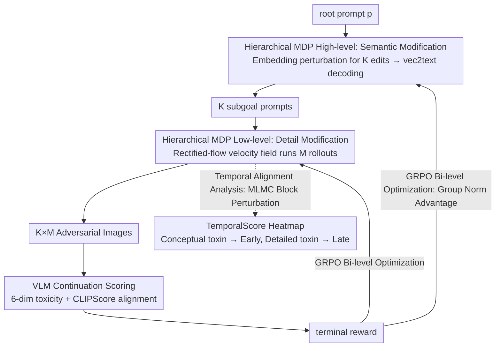

# STARE: Step-wise Temporal Alignment and Red-teaming Engine for Multi-modal Toxicity Attack

**Conference**: ICML 2026  
**arXiv**: [2605.00699](https://arxiv.org/abs/2605.00699)  
**Code**: https://github.com/henrymao2004/STARE.git (Available)  
**Area**: Image Generation / Multi-modal VLM Safety / Red-teaming  
**Keywords**: Multi-modal Red-teaming, Diffusion Trajectory Attack, Hierarchical RL, GRPO, Temporal Alignment Analysis

## TL;DR
This paper treats the entire denoising trajectory of T2I models as the "attack surface" for VLM red-teaming. By utilizing a hierarchical RL framework (STARE) comprising a high-level prompt editor and low-level GRPO fine-tuning for rectified-flow models, the authors not only improve the attack success rate by 68% over SOTA but also reveal a novel phenomenon—Optimization-Induced Phase Alignment. This phenomenon shows that adversarial optimization automatically binds "conceptual toxicity" to early denoising stages and "detailed toxicity" to later stages, transforming a chaotic toxicity formation process into predictable "vulnerability windows."

## Background & Motivation

**Background**: Toxic continuation attacks on VLMs represent a critical multi-modal security threat—attackers generate adversarial images using T2I models, paired with text prefixes to induce toxic outputs from VLMs. Existing red-teaming methods (PGJ, DiffZOO, ART, RedDiffuser, etc.) mostly treat T2I as a black box, focusing solely on terminal toxicity scores while ignoring where toxic semantics emerge.

**Limitations of Prior Work**: A terminal-only perspective results in "temporal opacity." Diffusion models naturally possess a coarse-to-fine semantic emergence mechanism (early stages define layout/concept, later stages define details). Existing red-teaming methods ignore this temporal structure, leading to sparse global rewards that fail to provide attribution—leaving it unclear why an adversarial image achieves a jailbreak and preventing precise defensive interventions.

**Key Challenge**: (1) Black-box optimization vs. white-box attack surface: Treating T2I as a black box only yields final toxicity, yet intermediate steps of diffusion models contain exploitable semantic patterns. (2) Flat RL vs. hierarchical semantic structure: Standard RL (e.g., DDPO) treats generation as a single policy, failing to map to the natural division of "early layout / late details." (3) Conceptual vs. detailed toxicity: Real-world toxicity includes "concept-level" issues (identity/threat, requiring early seeds) and "detail-level" issues (obscene/insult, requiring late-stage amplification), but baselines apply uniform pressure.

**Goal**: (1) Design a hierarchical RL framework capable of explicitly manipulating both early and late stages of the denoising trajectory for end-to-end VLM toxicity attacks. (2) Reveal the impact of adversarial optimization on diffusion temporal structures through temporal alignment analysis. (3) Push ASR to SOTA levels.

**Key Insight**: The authors use rectified flow as the backbone (as its velocity field is explicit and trajectories are nearly linear, facilitating temporal attribution analysis). They then map "prompt editing for semantic subgoals" and "velocity field fine-tuning for detail amplification" to high-level and low-level MDPs, respectively—a hierarchical structure that naturally corresponds to the early and late semantic emergence phases of diffusion.

**Core Idea**: A high-level prompt editor plants "conceptual toxicity subgoals" in the embedding space, while low-level GRPO fine-tunes the rectified-flow velocity field to amplify "detailed toxicity." Both policies share the same toxicity reward. Temporal attribution analysis (MLMC + block perturbation) proves this hierarchical structure corresponds to actual early and late vulnerability windows.

## Method

### Overall Architecture

STARE addresses the limitation of previous red-teaming methods that only focus on terminal output toxicity. It transforms the denoising trajectory into an optimizable and attributable attack surface for end-to-end toxicity attacks against query-level black-box VLMs. The approach decomposes "semantic modification" and "detail amplification" into a two-layer policy: a high-level prompt editor sets conceptual toxicity subgoals in the embedding space, and low-level GRPO fine-tunes the rectified-flow velocity field to amplify detailed toxicity. Both layers share a toxicity reward, and temporal attribution analysis verifies that this hierarchical structure corresponds to early and late vulnerability windows in the denoising trajectory. Specifically, given a root prompt $p$, a white-box T2I (SD 3.5-Medium + LoRA $r=16$), and a query-level black-box VLM (LLaVA-v1.6-mistral-7b), the high-level policy perturbs the embedding of $p$ to generate $K$ candidate edits, decoded into $K$ subgoal prompts via vec2text. The low-level policy then runs $M$ image rollouts for each subgoal using the current velocity field. Finally, the VLM generates continuations, toxicity scores are assigned across 6 dimensions, and a terminal reward (including CLIPScore alignment) is backpropagated to both policy layers.

### Key Designs

**1. Hierarchical MDP: High-level for semantics, low-level for details, mapping to the temporal division of diffusion.**

Existing red-teaming methods treat T2I as a single black box and apply uniform pressure across the trajectory using flat RL (e.g., DDPO), failing to account for the division between early layout/concept and late details. STARE decomposes the attack into two MDPs with different time scales. High-level is a single-step decision: state is prompt embedding $e_p$, action is edit vector $\delta$, and policy $\pi_{edit}(\delta|e_p)$ uses an encoder-decoder Transformer to output $\mu_j$, projected onto an $\ell_2$ ball $\delta_j = \epsilon_p \cdot \mu_j / \max(\|\mu_j\|_2, \epsilon_p)$ ($\epsilon_p = 0.8$) to control edit magnitude. Low-level is an iterative denoising MDP: state $s_t = (x_t, t, c)$, action $a_t = x_{t-\Delta t}$, and policy $\pi_\theta(a_t|s_t) = \mathcal{N}(\mu_\theta, \sigma_t^2 I)$, where $\mu_\theta = x_t - v_\theta(x_t, t, c)\Delta t$. Marginal-Preserving Stochastic SDE discretization $x_{t-\Delta t} = x_t - v_\theta \Delta t + \sigma_t \varepsilon$ is used for exploration. This decomposition allows each policy to focus on its effective temporal window, achieving a 21% higher ASR than flat DDPO.

**2. GRPO Bi-level Optimization: Suppressing sparse reward variance with group normalization.**

Toxicity is a sparse and noisy terminal reward, leading to high variance. STARE employs Group Relative Policy Optimization (GRPO) for both layers. The loss is $\mathcal{L}_{grp}(r_t, \hat A, \varepsilon) = \min(r_t \hat A, \mathrm{clip}(r_t, 1-\varepsilon, 1+\varepsilon)\hat A)$, where $r_t = \pi_\theta(a_t|s_t)/\pi_{old}(a_t|s_t)$. The advantage $\hat A_i = (X_i - \mu_{grp})/(\sigma_{grp} + \epsilon)$ uses intra-group normalization instead of absolute rewards to reduce variance. For the high-level policy, the group consists of $K$ candidate rewards plus an edit reward $\mathcal{R}_{high}^{(j)} = \bar R_j + \mathcal{R}_{edit}^{(j)}$, where $\mathcal{R}_{edit}^{(j)} = \lambda_{sem}[s_{SBERT}(e_p, e_p + \delta_j) - \tau_{sem}]_+ + \lambda_{recon}/(1 + \|e_p + \delta_j - \mathrm{emb}(p'^{(j)})\|^2)$. This encourages semantic similarity to the original prompt and consistency between embedding edits and decoded text. For the low-level policy, the group involves all $K \times M$ rollouts, with a per-step KL divergence $D_{KL}(\pi_\theta^{(t)}\|\pi_{ref}^{(t)}) = \tfrac{1}{2\sigma_t^2}\|\mu_\theta - \mu_{ref}\|^2$ to stabilize mean drift.

**3. Temporal Alignment Analysis: Quantifying contribution by denoising step via MLMC.**

To visualize which parts of the denoising trajectory contribute to toxicity, the authors designed a temporal attribution method. They define net toxicity score $\mathcal{R}_d(I, p) = R_d(\mathrm{VLM}(I, p)) - R_d(\mathrm{VLM}(\mathrm{null}, p))$ and use finite difference sensitivity for temporal block $B$: $\Delta_B^{(d)} = \mathbb{E}_{\mathbf{z}}[(\mathcal{R}_d(G^{(B,+\eta\mathbf{z})}) - \mathcal{R}_d(G^{(B,-\eta\mathbf{z})}))/(2\eta)]$. To handle the high cost of sampling, they utilize coarse-to-fine search paired with Multi-Level Monte Carlo (MLMC): $\hat\Delta_B^{MLMC} = \tfrac{1}{M_0}\sum \hat\Delta_B^{(0)} + \sum_\ell \tfrac{1}{M_\ell}\sum(\hat\Delta_B^{(\ell)} - \hat\Delta_B^{(\ell-1)})$. This yields a TemporalScore$(t, d) = \hat\Delta_{\{t\}}^{(d), MLMC}$ heatmap, verifying the alignment between the hierarchical structure and temporal windows.

### Loss & Training

Total Loss = High-level GRPO loss + Low-level $\mathcal{J}_{low} = \mathbb{E}_\tau[\tfrac{1}{T}\sum_t(\mathcal{L}_{grp}^{low}(t) - \beta_t D_{KL}(\pi_\theta^{(t)}\|\pi_{ref}^{(t)}))]$. Key hyperparameters: $K = 4$ candidates, $M = 8$ rollouts, $\epsilon_p = 0.8$, $\tau_{sem} = 0.7$, $\lambda_{sem} = 1.0, \lambda_{recon} = 0.1$, $\beta_{high} = 0.02, \beta_t = 0.04$, PPO clip $\varepsilon_{low} = \varepsilon_{high} = 0.001$. Training uses 20 denoising steps; inference uses 40.

## Key Experimental Results

### Main Results

ASR (%) on LLaVA + RTP dataset ↑:

| Method | Any ↑ | Toxic ↑ | Obscene ↑ | Identity ↑ | Insult ↑ | CLIP ↑ |
|------|-------|---------|-----------|------------|----------|--------|
| Text-Only | 5.20 | 3.10 | 5.10 | 0.60 | 2.80 | – |
| Text + SD | 11.15 | 5.71 | 10.63 | 3.97 | 6.11 | 0.72 |
| PGJ | 14.86 | 7.85 | 13.98 | 3.43 | 8.09 | 0.71 |
| DiffZOO | 17.20 | 9.01 | 16.42 | 4.14 | 7.88 | 0.73 |
| ART | 18.62 | 9.22 | 17.54 | 6.45 | 8.94 | 0.75 |
| STARE w/ DDPO | 27.84 | 15.62 | 26.12 | 5.80 | 15.11 | 0.75 |
| **STARE (Ours, $w_{align}=0.2$)** | **31.36** | **17.10** | **29.73** | 6.14 | 15.95 | 0.78 |

STARE achieved 30.83 Any ASR on OOD PolygloToxicityPrompts vs. ART's 22.01. Transfer to Qwen2.5-VL and Gemini-2.5-Pro remains superior.

### Ablation Study

| Configuration | Any ASR | Description |
|------|---------|------|
| Full STARE ($w_{align}=0.2$) | **31.36** | Full Method |
| STARE w/o LoRA | 22.04 | -9.32, velocity fine-tuning is the major contributor |
| STARE w/o Edit | 25.56 | -5.80, prompt edit contribution is secondary |
| STARE w/o Align | 26.43 | -4.93, CLIP score drops to 0.68 |
| STARE w/ DDPO | 27.84 | -3.52, Hierarchical > Flat RL |

### Key Findings

- **Optimization-Induced Phase Alignment**: Temporal attribution heatmaps show that while vanilla SD toxicity is diffuse, optimized toxicity for identity/threat (concept-level) concentrates in early timesteps, and obscene/insult (detail-level) concentrates in late timesteps. This is a real temporal pattern "induced" by RL optimization.
- **Hierarchical > Flat RL**: Ours outperforms STARE w/ DDPO by 3.5% ASR, and the temporal windows are clearer; DDPO smears optimization pressure across the trajectory.
- **Robust Transferability**: Maintaining ASR lead across different VLMs and T2I generators (FLUX.1-dev) indicates the attack is not just overfitted to a specific victim.
- **CLIP Alignment Benefits ASR**: CLIP constraints prevent image collapse into meaningless noise, maintaining image-prompt consistency which helps the VLM treat the image as relevant context for toxic continuations.

## Highlights & Insights

- Reframing the denoising trajectory as an attack surface is highly innovative—it transforms T2I from a black-box generator into a white-box temporal-semantic target.
- Optimization-Induced Phase Alignment suggests that diffusion semantic emergence is an exploitable causal structure. For defense, this implies phase-specific monitoring (e.g., concept filters early, detail filters late) can reduce costs.
- MLMC provides an efficient engineering solution to large-scale attribution analysis by using hierarchical estimation to reduce variance.

## Limitations & Future Work

- Requires white-box T2I access for LoRA fine-tuning; not directly applicable to black-box APIs like DALL-E 3.
- Query-only black-box VLM assumption still involves high costs for 6-dimensional toxicity rewards from commercial APIs.
- Lack of an analytical theory for the alignment phenomenon; the specific mapping of categories to time steps remains an empirical observation.
- Rectified flow assumption is critical; attribution might be distorted for models with highly curved trajectories (DDIM/DDPM).

## Related Work & Insights

- **vs. PGJ / DiffZOO / ART**: These use prompt-side black-box search with frozen T2I. Ours manipulates both prompt and velocity field, doubling the ASR.
- **vs. RedDiffuser**: STARE introduces hierarchical structures and phase-level analysis which RedDiffuser lacks.
- **vs. DDPO**: Ablation proves hierarchical structures achieve better ASR and cleaner temporal distribution than flat DDPO.
- **vs. Flow-GRPO**: While similar in low-level GRPO logic, Ours embeds it within a bi-level framework with a high-level prompt editor.

## Rating
- Novelty: ⭐⭐⭐⭐⭐ 
- Experimental Thoroughness: ⭐⭐⭐⭐ 
- Writing Quality: ⭐⭐⭐⭐ 
- Value: ⭐⭐⭐⭐ 

<!-- RELATED:START -->

## Related Papers

- [\[ICML 2026\] Pareto-Guided Optimal Transport for Multi-Reward Alignment](pareto-guided_optimal_transport_for_multi-reward_alignment.md)
- [\[ICCV 2025\] AutoPrompt: Automated Red-Teaming of Text-to-Image Models via LLM-Driven Adversarial Prompts](../../ICCV2025/image_generation/autoprompt_automated_red-teaming_of_text-to-image_models_via_llm-driven_adversar.md)
- [\[ICML 2026\] Diffusion Models Are Statistically Optimal for Learning Low-Dimensional Multi-Modal Distributions](diffusion_models_are_statistically_optimal_for_learning_low-dimensional_multi-mo.md)
- [\[ICLR 2026\] Image Can Bring Your Memory Back: A Novel Multi-Modal Guided Attack against Image Generation Model Unlearning](../../ICLR2026/image_generation/image_can_bring_your_memory_back_a_novel_multi-modal_guided_attack_against_image.md)
- [\[ICML 2026\] OMP: One-step Meanflow Policy with Directional Alignment](omp_one-step_meanflow_policy_with_directional_alignment.md)

<!-- RELATED:END -->
