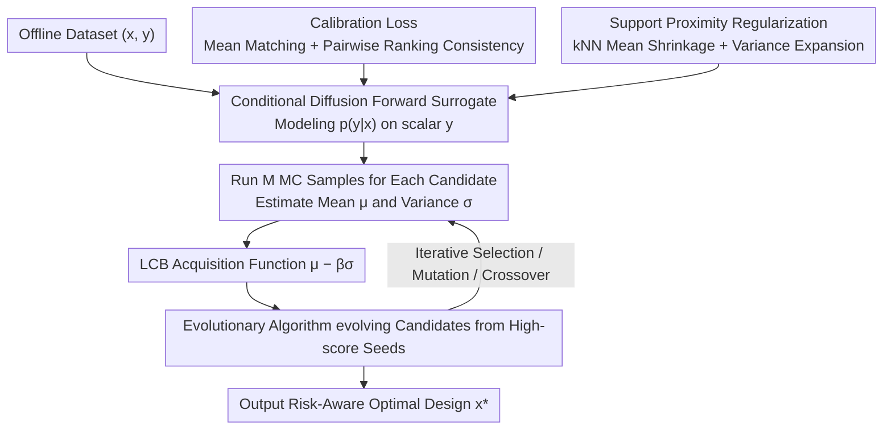

# Support-Proximity Augmented Diffusion Estimation for Offline Black-Box Optimization

**Conference**: ICML 2026  
**arXiv**: [2605.11246](https://arxiv.org/abs/2605.11246)  
**Code**: https://github.com/HarryYoung2018/spade (Available)  
**Area**: Diffusion Models / Offline Black-Box Optimization  
**Keywords**: Offline BBO, Conditional Diffusion Surrogate, kNN Support Regularization, LCB Acquisition Function

## TL;DR
SPADE replaces traditional regression surrogates with a conditional diffusion model to model $p(y\mid\boldsymbol{x})$. By incorporating "mean/ranking calibration" and "kNN support regularization (mean shrinkage + variance expansion)," it implicitly injects data priors into the surrogate, enabling offline black-box optimization to consistently achieve SOTA performance on Design-Bench and LLM data mixture tasks.

## Background & Motivation

**Background**: Offline black-box optimization (offline BBO) aims to find optimal designs using only a static dataset $\mathcal{D}=\{(\boldsymbol{x}_i,y_i)\}$ without querying the true oracle. Mainstream approaches are divided into two categories: inverse methods, which learn $p(\boldsymbol{x}\mid y)$ to sample designs conditioned on high scores, and forward methods, which learn a regression surrogate $f_\theta(\boldsymbol{x})$ followed by gradient ascent or acquisition function search.

**Limitations of Prior Work**: Inverse methods are inherently ill-posed one-to-many mappings, which are difficult to train and prone to mode collapse. Forward methods using deterministic MLPs fail to provide epistemic uncertainty; the optimization process tends to "exploit holes"—once the optimizer finds regions where the surrogate overestimates, it focuses there, leading to results that are completely unreliable in real environments.

**Key Challenge**: A high-quality forward surrogate must simultaneously achieve three goals: distributional expressivity (providing both mean and variance), global accuracy (accurate mean and correct ranking), and inherent conservatism for OOD regions (automatically lowering evaluations far from the data manifold). Existing methods typically satisfy only one of these requirements.

**Goal**: 1) Enable diffusion models to serve as forward surrogates by capturing the full distribution of $p(y\mid\boldsymbol{x})$; 2) Calibrate global means and pairwise rankings within the training objective; 3) Inject prior information into the surrogate without training an auxiliary generative model $p(\boldsymbol{x})$.

**Key Insight**: By decomposing the Bayes formula $p(\boldsymbol{x}\mid y)\propto p(y\mid\boldsymbol{x})\,p(\boldsymbol{x})$, the forward part is modeled via conditional diffusion, and the prior part is handled through non-parametric density estimation using kNN distance. It is theoretically proven that this geometric regularization is "first-order equivalent" to adding $\log p(\boldsymbol{x})$ to the acquisition function.

**Core Idea**: Use conditional diffusion as a forward surrogate + anchor global statistics with calibration loss + inject support priors through kNN-driven mean shrinkage and variance expansion. Finally, perform risk-aware search using LCB and evolutionary algorithms.

## Method

### Overall Architecture
SPADE addresses the difficulty of achieving uncertainty estimation, accurate ranking, and OOD conservatism simultaneously in offline BBO forward surrogates. It replaces deterministic MLPs with a diffusion model conditioned on the design $\boldsymbol{x}$ to model the entire distribution $p(y\mid\boldsymbol{x})$. Two additional losses calibrate global statistics and inject data priors. After training, the optimization phase begins: an evolutionary algorithm evolves a candidate population from high-score seeds in the dataset. For each candidate, mean and variance are estimated via multiple MC sampling runs, and the risk-aware optimal design is selected based on the LCB acquisition function.

### Key Designs

**1. Conditional Diffusion Forward Surrogate: Predictive distribution via 1D scalar diffusion**

Traditional forward surrogates are deterministic MLPs that only provide point estimates, lacking the variance $\sigma$ necessary for risk-aware acquisition functions like LCB or EI. SPADE replaces the surrogate with a DDPM: adding noise to the label $y_0$ according to a variance schedule $\{\beta_t\}$ to obtain $q(y_t\mid y_0)=\mathcal{N}(\sqrt{\bar\alpha_t}y_0,(1-\bar\alpha_t)\mathbf{I})$. A noise prediction network $\epsilon_\theta(y_t,t, \boldsymbol{x})$ conditioned on $\boldsymbol{x}$ is trained using the standard denoising objective $\mathcal{L}_{\text{diff}}=\mathbb{E}\|\epsilon-\epsilon_\theta(y_t,t,\boldsymbol{x})\|_2^2$. During inference, $M$ MC samples $\{y^{(m)}\}$ are generated for the same $\boldsymbol{x}$ to estimate both the predictive mean and variance. Since the diffusion models a 1D scalar $y$ rather than a high-dimensional design, the model remains lightweight while naturally expressing multimodality and heteroscedasticity, making it more scalable than ensembles or BNNs.

**2. Calibration Loss: Anchoring global mean and pairwise ranking in the objective**

Denoising loss alone ensures local distributional fitting but does not guarantee accurate global means or correct "better-than" rankings—which are crucial for BBO. The calibration loss addresses this: first estimating $\hat\mu_\theta(\boldsymbol{x})\approx\frac{1}{M}\sum_m y^{(m)}$ via $M$ MC samples in a mini-batch, then adding two terms: a first-moment matching term $(\hat\mu_\theta(\boldsymbol{x})-y)^2$ to align the mean with ground truth, and a pairwise ranking consistency term $\log(1+\exp\{-s[\hat\mu_\theta(\boldsymbol{x}_i)-\hat\mu_\theta(\boldsymbol{x}_j)]\})$ (calculated only for ordered pairs where $y_i>y_j$, with temperature $s=1$). The latter backpropagates the BBO utility signal—"which design is better"—into the diffusion network, preventing the EA from being misled by misranked means.

**3. Support Proximity Regularization: Geometric kNN replaces generative priors for OOD conservatism**

The most dangerous failure mode for forward surrogates is reward hacking, where the optimizer targets OOD regions overestimated by the surrogate. Instead of training a costly $p(\boldsymbol{x})$ generator as a prior, SPADE uses non-parametric kNN distance as a density proxy: let $R_k(\boldsymbol{x})$ be the distance to the $k$-th nearest neighbor, and define $d(\boldsymbol{x})=\log R_k(\boldsymbol{x})$, such that $-\log\hat p_{\text{knn}}(\boldsymbol{x})\propto d(\boldsymbol{x})$. The regularization consists of two hinge terms: a mean-shrink term $\max(0,\hat\mu_\theta-\mu_{\text{NN}}-\tau(d))$ that pulls the mean toward the neighbors' mean (with increasing force as distance increases), and a variance-floor term $\max(0,\sigma_{\min}(d)-\hat\sigma_\theta)$ that sets a minimum variance that increases with distance. Here $\tau(d)=ad$ and $\sigma_{\min}(d)=a_0+a_1 d$, with default parameters $a=0.02, a_0=0.02, a_1=0.005$ consistent across tasks. The hinge formulation ensures gradients are applied only when "conservatism" constraints are violated. The paper further proves that under LCB acquisition, the regularized function $\widetilde{\mathcal{A}}(\boldsymbol{x})$ is first-order equivalent to adding a $\log p(\boldsymbol{x})$ prior to the utility, equating geometric constraints with the Bayesian posterior $p(\boldsymbol{x}\mid y)\propto p(y\mid\boldsymbol{x})p(\boldsymbol{x})$.

### Loss & Training
The total loss $\mathcal{L}(\theta)=\mathcal{L}_{\text{diff}}+\lambda_1\mathcal{L}_{\text{calib}}+\lambda_2\mathcal{L}_{\text{prox}}$ optimizes denoising, calibration, and support proximity simultaneously. Inference uses LCB $\hat\mu_\theta(\boldsymbol{x})-\beta\hat\sigma_\theta(\boldsymbol{x})$ as the acquisition function. An evolutionary algorithm (EA) initializes a population from high-score seeds in $\mathcal{D}$, performing selection, mutation, and crossover based on LCB scores at each generation, finally outputting $\arg\max_{\boldsymbol{x}\in\mathcal{P}}\text{LCB}(\boldsymbol{x})$.

## Key Experimental Results

### Main Results
Evaluated on Design-Bench (SuperConductor, Ant, D'Kitty, TF8, TF10) and LLM Data Mixture (LLM-DM), reporting the 100th-percentile normalized score among $K=128$ candidates (mean ± SE, 8 seeds).

| Task | $\mathcal{D}(\text{best})$ | Previous SOTA Range | SPADE | Notes |
|------|---------------------------|---------------|-------|------|
| SuperConductor | 0.399 | 0.40~0.55 range | One of the best | Calibration improves ranking |
| Ant Morphology | 0.565 | 0.60~0.90 range | One of the best | High-dimensional continuous control |
| D'Kitty | 0.884 | ~0.90 range | One of the best | High OOD risk |
| LLM-DM | 1.000 | Near upper bound | Competitive/Stabler | LLM data mixture optimization |
| TF8 / TF10 | 0.439 / 0.511 | Discrete design | One of the best | Applicable to discrete spaces |

SPADE ranks first in both mean rank and median rank across these tasks, representing the only method that consistently stays at the top across all six tasks.

### Ablation Study

| Configuration | Key Observation | Description |
|------|---------|------|
| Full SPADE | SOTA or tied in all 6 tasks | All components are essential |
| w/o $\mathcal{L}_{\text{calib}}$ | Ranking errors, EA selects wrong candidates | Lack of global calibration |
| w/o $\mathcal{L}_{\text{prox}}$ | Classic OOD reward hacking, estimates explode | Missing prior constraints |
| w/o Diffusion (MLP) | No $\sigma$, LCB degrades to mean greedy | Loss of risk-awareness |
| kNN replaced by KDE | Performance drops significantly in high dimensions | kNN adaptive bandwidth is more robust |
| LCB replaced by Mean | Highly increased OOD risk | Confirms LCB is the best partner for regularization |

### Key Findings
- $\mathcal{L}_{\text{prox}}$ is the largest contributor to stability: removing it leads to reward hacking in most tasks, reducing scores by 10-30%. It effectively uses geometry to replace generative priors.
- The ranking term in $\mathcal{L}_{\text{calib}}$ is more critical than the moment term, as BBO relies on relative rankings rather than absolute values.
- Denoising steps $T$ have minimal impact (short runs suffice), but the number of MC samples $M$ affects variance estimation accuracy; too few samples increase LCB noise.
- Hyperparameters $a, a_0, a_1$ are universal across tasks, demonstrating the robustness of the kNN geometric prior.

## Highlights & Insights
- Using diffusion as a "forward surrogate" is counter-intuitive but logical: while diffusion usually models $p(\boldsymbol{x}\mid y)$, placing it on $p(y\mid\boldsymbol{x})$ where $y$ is a 1D scalar makes it lightweight while retaining the ability to provide $\sigma$.
- The first-order equivalence theorem equating geometric constraints to Bayesian priors is a powerful conceptual bridge. This indicates that any hinge regularization $\tau(d)$ that grows linearly with $-\log p(\boldsymbol{x})$ acts as a log-prior, a principle applicable to other offline settings (e.g., imitation learning, offline RL).
- The "mean-shrink + variance-floor" pair works synergistically: one lowers $\mu$ while the other raises $\sigma$, causing LCB to "double-discount" in OOD regions, providing superior stability compared to single-term approaches.

## Limitations & Future Work
- Proposition 3.1 provides "motivation" rather than a full algorithmic guarantee; actual behavior is still influenced by the EA, $\beta$, and MC noise.
- kNN may degrade in very high-dimensional spaces (e.g., above hundreds of dimensions) due to distance homogenization. Tasks like protein design might require representation learning or manifold-aware distances.
- $\mathcal{L}_{\text{calib}}$ requires $M$ MC sample runs per step, making training several times slower than pure regression surrogates.
- Optimal LCB coefficient $\beta$ ranges across tasks were not extensively discussed; manual tuning of $\beta$ is still required in practice.

## Related Work & Insights
- **vs DDOM / Inverse Diffusion**: These methods model $p(\boldsymbol{x}\mid y)$ and suffer from ill-posed one-to-many mappings. SPADE follows the forward $p(y\mid\boldsymbol{x})$ route with explicit prior injection, avoiding inverse training difficulties.
- **vs COMs / ROMA (Conservative Regression)**: These use adversarial or penalty terms on MLPs for conservatism but lack variance for LCB. SPADE provides distributional output + kNN geometry for explicit prior injection with Bayesian interpretation.
- **vs GPs / BNNs**: GPs do not scale well to high dimensions; BNN training is expensive and often poorly calibrated. Diffusion with short MC runs strikes a balance between expressivity and scalability.

## Rating
- Novelty: ⭐⭐⭐⭐ Refreshing perspective of moving diffusion from inverse to forward, supported by Bayesian equivalence.
- Experimental Thoroughness: ⭐⭐⭐⭐ Comprehensive coverage of Design-Bench and LLM-DM with full ablations and universal hyperparameters.
- Writing Quality: ⭐⭐⭐⭐ Clear derivations and well-structured pipeline diagrams for both training and optimization phases.
- Value: ⭐⭐⭐⭐ Provides a stable SOTA surrogate paradigm for offline BBO; the kNN-as-prior concept is easily transferable to other conservative offline scenarios.

<!-- RELATED:START -->

## Related Papers

- [\[ICML 2026\] Offline Preference Optimization for Rectified Flow with Noise-Tracked Pairs](offline_preference_optimization_for_rectified_flow_with_noise-tracked_pairs.md)
- [\[ICML 2025\] PPO-MI: Efficient Black-Box Model Inversion via Proximal Policy Optimization](../../ICML2025/image_generation/ppo-mi_efficient_black-box_model_inversion_via_proximal_policy_optimization.md)
- [\[CVPR 2026\] CSF: Black-box Fingerprinting via Compositional Semantics for Text-to-Image Models](../../CVPR2026/image_generation/csf_black-box_fingerprinting_via_compositional_semantics_for_text-to-image_model.md)
- [\[ICLR 2026\] Pareto-Conditioned Diffusion Models for Offline Multi-Objective Optimization](../../ICLR2026/image_generation/pareto-conditioned_diffusion_models_for_offline_multi-objective_optimization.md)
- [\[ICML 2026\] Offline Multi-agent Reinforcement Learning via Sequential Score Decomposition](offline_multi-agent_reinforcement_learning_via_sequential_score_decomposition.md)

<!-- RELATED:END -->
