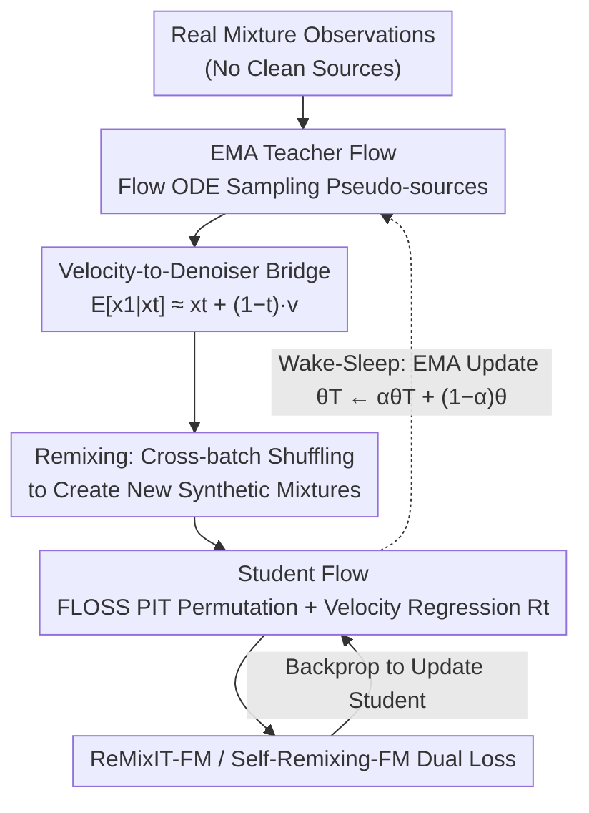

# SURF: Separation via Unsupervised Remixing Flow

**Conference**: ICML 2026  
**arXiv**: [2606.04921](https://arxiv.org/abs/2606.04921)  
**Code**: To be confirmed  
**Area**: Audio & Speech / Source Separation / Generative Models  
**Keywords**: Single-channel source separation, Flow matching, Unsupervised learning, Teacher-student distillation, Wake-Sleep

## TL;DR
SURF combines the supervised flow matching framework FLOSS with the unsupervised ReMixIT / Self-Remixing teacher-student remixing training strategy. This allows a generative flow matching separator to be trained **entirely from mixture observations** (without any clean source samples). It nearly matches the performance of supervised flows on MNIST/CIFAR10 image separation and LibriSpeech / FUSS audio separation, establishing a new unsupervised SOTA.

## Background & Motivation

**Background**: Single-channel source separation (recovering $K$ underlying sources from one mixture) is a highly ill-posed inverse problem. The deep learning era is divided into two factions: discriminative regression (e.g., Conv-TasNet, TF-Locoformer), which maps mixtures directly to sources, and generative models (diffusion / flow matching), which treat separation as conditional generation constrained by a strong clean source prior. The latter recently achieved SOTA performance using FLOSS (Scheibler et al., 2025).

**Limitations of Prior Work**: All generative methods assume that **clean source samples are available** to train the prior. However, in scenarios like bioacoustics, hyperspectral imaging, or gravitational wave detection, recording an isolated source is often impossible. Even when available, the training-test domain shift remains a persistent issue. Unsupervised methods such as MixIT / ReMixIT / Self-Remixing have successfully trained discriminative separators using "teacher estimate → shuffle/remix into new mixture → student recovery" self-supervision, but these are designed for regression-based separators (directly outputting $\hat{x}$). **No prior work has unified this with generative models like flow matching that learn velocity fields.**

**Key Challenge**: The training objective of flow matching is the regression of the velocity field $v_\theta(x_t, t, m)$, whereas ReMixIT-style self-supervised methods aim for direct source regression $\hat{x}$. The semantics of these outputs differ; consequently, injecting PIT (Permutation Invariant Training) and mixture consistency is non-trivial, making simple combination ineffective.

**Goal**: To train a generative flow matching separator like FLOSS **completely from mixture observations** without significant performance degradation.

**Key Insight**: The authors identified a simple identity: given the flow matching path $x_t = (1-t)x_0 + t x_1$ and $\boldsymbol{u}(x,t)=\mathbb{E}[x_1-x_0|x_t,m]$, it follows that $\mathbb{E}[x_1|x_t, m] \approx x_t + (1-t)v_\theta(x_t, t, m)$. This conceptually bridges the velocity field with the "clean source estimate" required by ReMixIT, allowing ReMixIT / Self-Remixing losses to be grafted onto flow models.

**Core Idea**: Use an EMA teacher flow model to generate pseudo-sources → Shuffle and remix across batches to form new synthetic mixtures → Train the student flow using FLOSS logic (PIT for optimal permutation + velocity regression on the chosen path) → EMA update the student back to the teacher. ReMixIT-FM targets teacher pseudo-sources, while Self-Remixing-FM targets the original mixture observations.

## Method

### Overall Architecture
SURF addresses the problem of training a generative flow separator without any clean sources. It utilizes two identical flow matching networks trained via FLOSS: an EMA teacher $v_{\theta_\mathcal{T}}$ responsible for generating pseudo-sources, and a student $v_\theta$ that learns from the remixed mixtures. This grafts the "teacher estimate → remix → student learn" cycle onto flow matching. Both networks are initialized from a regression-based separator pretrained with MixIT.

### Mechanism
A single training step proceeds as follows: Given a batch of real mixtures $\boldsymbol{M}=[\boldsymbol{m}_1,\dots,\boldsymbol{m}_B]$, the **teacher** first samples pseudo-sources $\mathcal{X}\in\mathbb{R}^{BK\times d}$ using the flow ODE. During **remixing**, a permutation $\boldsymbol{\Pi}$ is sampled from $S_{BK}$ to shuffle the pseudo-sources across the batch, yielding $\tilde{\boldsymbol{X}}_1=\boldsymbol{\Pi}\mathcal{X}$, which are summed to form new synthetic mixtures $\tilde{\boldsymbol{M}}=(\boldsymbol{I}_B\otimes\mathbf{1}^\top)\tilde{\boldsymbol{X}}_1$. For the **student**, an FM path is established: the noise end is set as $\tilde{\boldsymbol{X}}_0=\tfrac{1}{K}(\boldsymbol{I}_B\otimes\mathbf{1})\tilde{\boldsymbol{M}}+(\boldsymbol{I}_B\otimes\boldsymbol{P}^\perp)\boldsymbol{Z}$ to ensure mixture consistency. PIT is performed using the student's velocity at $t=0$ to find the optimal permutation $\boldsymbol{\Upsilon}$, defining the interpolation $\tilde{\boldsymbol{X}}_t^{\boldsymbol{\Upsilon}}=(1-t)\tilde{\boldsymbol{X}}_0+t\boldsymbol{\Upsilon}\tilde{\boldsymbol{X}}_1$. The velocity residual $\boldsymbol{R}_t=v_\theta(\tilde{\boldsymbol{X}}_t^{\boldsymbol{\Upsilon}},t,\tilde{\boldsymbol{M}})-(\boldsymbol{\Upsilon}\tilde{\boldsymbol{X}}_1-\tilde{\boldsymbol{X}}_0)$ is computed for the loss functions. After the student updates, the teacher is updated via EMA $\theta_\mathcal{T}\leftarrow\alpha\theta_\mathcal{T}+(1-\alpha)\theta$. **Throughout this process, no clean sources are accessed.**

### Key Designs

**1. Velocity-to-Denoiser Bridge: Connecting Flow to ReMixIT Mathematics**

The challenge is that flow matching learns a velocity field $v_\theta$, while self-supervised losses like ReMixIT require "clean source estimates." The authors align them using the identity: from $\boldsymbol{u}(x,t)=\mathbb{E}[x_1-x_0|x_t,m]$ and the path $x_1-x_0=(x_1-x_t)/(1-t)$, they derive $\mathbb{E}[x_1|x_t,m]=x_t+(1-t)\boldsymbol{u}(x_t,t,m)\approx x_t+(1-t)v_\theta(x_t,t,m)$. Thus, at any $t$, the same model provides both the velocity field and a "time-dependent denoised source estimate," which can be directly plugged into regression-style losses.

**2. ReMixIT-FM and Self-Remixing-FM Dual Losses**

Both losses share the residual $\boldsymbol{R}_t$ but apply different projections. ReMixIT-FM uses the PIT-FM loss $\mathcal{L}_{\text{RM-FM}}=\mathbb{E}\|\boldsymbol{R}_t\|^2$, treating teacher pseudo-sources as ground truth; this provides dense signals but may inherit teacher errors. Self-Remixing-FM requires only that the student's estimates sum back to the original mixture: $\mathcal{L}_{\text{SR-FM}}=\mathbb{E}\|(\boldsymbol{I}_B\otimes\mathbf{1}^\top)\boldsymbol{\Pi}^{-1}\boldsymbol{\Upsilon}^{-1}\boldsymbol{R}_t\|^2$. This avoids direct penalization of pseudo-source errors. Theoretical analysis shows that Self-Remixing effectively decouples self-supervision errors from teacher errors, often performing better in audio tasks.

**3. Wake-Sleep Interpretation + EMA Teacher**

The "Teacher generation → Remix → Student learn → EMA update" cycle is interpreted through the Wake-Sleep framework. The teacher marginal $\bar{p}_{\theta_\mathcal{T}}(\bar{\boldsymbol{x}})$ acts as an implicit prior and the student $p_\theta(\bar{\boldsymbol{x}}|m)$ as an inference network. The Sleep phase (updating the student) is equivalent to maximum likelihood on synthetic pairs, corresponding to ReMixIT. The Wake phase (updating the teacher) ideally requires an aggregate posterior, which is approximated by moving $\theta_\mathcal{T}$ toward $\theta$ via EMA for stability.

### Loss & Training
The joint training objective uses either $\mathcal{L}_{\text{RM-FM}}$ or $\mathcal{L}_{\text{SR-FM}}$. The EMA decay $\alpha$ is a critical hyperparameter. Training starts from a "seed" provided by a MixIT-pretrained regression separator.

## Key Experimental Results

### Main Results

| Dataset | Metric | Ours (SURF-RM) | Prev. Unsupervised SOTA | Supervised Flow Upper Bound |
|--------|------|------|----------|------|
| MNIST 2-source | PSNR ↑ | **37.26** | 23.13 (Self-Remixing) | 37.44 |
| MNIST 2-source | FID ↓ | **19.57** | 28.14 | 19.47 |
| CIFAR10 2-source | PSNR ↑ | **19.73** | 17.51 | 20.38 |
| CIFAR10 2-source | FID ↓ | **14.83** | 28.44 | 9.60 |
| LibriSpeech+FUSS (2 src) | SI-SDR ↑ | 14.98 / **15.23** (SR) | 14.81 (Self-Remixing) | 18.21 |
| FUSS 1-src | SI-SDR ↑ | **32.67** | 19.83 (ReMixIT) | 38.79 |

> **Highlights**: In image separation, SURF improves PSNR from 23 to 37, **matching supervised flows**. On CIFAR10, the FID is reduced from 28 to 14, outperforming BASIS (a diffusion-prior method requiring clean data).

### Ablation Study

| Configuration | MNIST PSNR | Description |
|------|---------|------|
| MixIT (Initial) | 21.90 | Regressive starting point |
| Regression-ReMixIT | 22.81 | Regressive self-supervision |
| SURF (ReMixIT-FM) | **37.26** | Flow + ReMixIT |
| SURF (Self-Remixing-FM) | 37.03 | Flow + Self-Remixing |
| Supervised Flow | 37.44 | Upper bound (requires clean data) |

### Key Findings
- **Flow + Self-supervision** is significantly better than **Regression + Self-supervision** (37 vs 23 PSNR), indicating that the generative prior is crucial for removing regression artifacts.
- ReMixIT-FM and Self-Remixing-FM perform similarly, but Self-Remixing leads slightly on LibriSpeech, consistent with the theory that it decouples teacher errors.
- SURF's CIFAR10 FID is lower than supervised regression (14.83 vs 25.44), confirming the advantage of generative priors in distribution matching.

## Highlights & Insights
- **Velocity-denoiser identity is the key plug**: The identity $\mathbb{E}[x_1|x_t, m]\approx x_t+(1-t)v_\theta$ allows any self-supervised loss relying on "clean source estimates" to be applied to flow/diffusion separators without structural changes.
- **Wake-Sleep Perspective**: Elevates ReMixIT from an engineering heuristic to a standard training paradigm for latent variable generative models, providing a methodological basis for self-training designs.
- **Image Separation as a Benchmark**: Using MNIST/CIFAR10 for source separation provides quantitative metrics like FID/LPIPS that are often clearer than audio metrics like SI-SDR, facilitating better comparison of generative quality.

## Limitations & Future Work
- The theoretical analysis assumes a population limit ($B\to \infty$); finite batch bias is not fully characterized.
- Training depends on a MixIT-pretrained seed; convergence from very poor initialization is not guaranteed.
- A 2-3 dB gap remains between SURF and supervised flows in multi-source (3-4 source) FUSS scenarios, likely due to increased PIT complexity and error accumulation.
- Potential for expansion to other inverse problems (denoising, deblurring, super-resolution) in data-scarce domains like medical imaging.

## Related Work & Insights
- **vs FLOSS (Scheibler et al., 2025)**: SURF adapts FLOSS's PIT-FM structure but replaces clean sources with teacher pseudo-sources/mixtures, effectively acting as an unsupervised version of FLOSS.
- **vs BASIS / Diffusion Prior Separation**: Unlike these methods, SURF does not require clean source data to train the prior, making it applicable to domains like bioacoustics.
- **vs Rozet et al. (2024)**: While both learn unfactorized diffusion priors from mixtures, SURF avoids the heavy computation of unconditional prior modeling by working directly on conditional separators via bootstrapping.

## Rating
- Novelty: ⭐⭐⭐⭐ The velocity-denoiser bridge unlocks the FM + self-supervision pipeline.
- Experimental Thoroughness: ⭐⭐⭐⭐ Covers four benchmarks across images and audio with comparisons to supervised bounds.
- Writing Quality: ⭐⭐⭐⭐ Concepts are well-explained; Algorithm 1 clearly distinguishes loss variations.
- Value: ⭐⭐⭐⭐⭐ Provides a path for training generative separators without clean sources, highly relevant for scientific imaging and bioacoustics.

<!-- RELATED:START -->

## Related Papers

- [\[ICML 2026\] Adversarial Flow Models](adversarial_flow_models.md)
- [\[CVPR 2026\] Cinematic Audio Source Separation Using Visual Cues](../../CVPR2026/image_generation/cinematic_audio_source_separation_using_visual_cues.md)
- [\[ICML 2026\] Stable Velocity: A Variance Perspective on Flow Matching](stable_velocity_a_variance_perspective_on_flow_matching.md)
- [\[ECCV 2024\] Implicit Style-Content Separation using B-LoRA](../../ECCV2024/image_generation/implicit_style-content_separation_using_b-lora.md)
- [\[ICLR 2026\] From Parameters to Behaviors: Unsupervised Compression of the Policy Space](../../ICLR2026/image_generation/from_parameters_to_behaviors_unsupervised_compression_of_the_policy_space.md)

<!-- RELATED:END -->
