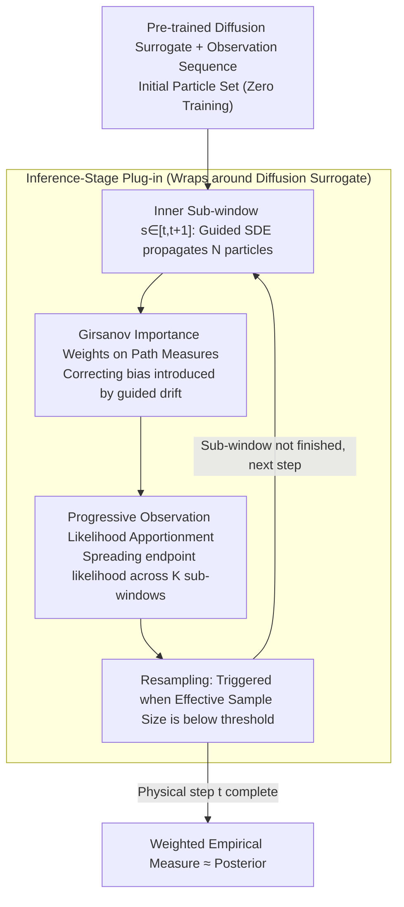

# SURGE: Approximation and Training Free Particle Filter for Diffusion Surrogate

**Conference**: ICML 2026  
**arXiv**: [2605.18745](https://arxiv.org/abs/2605.18745)  
**Code**: None  
**Area**: Scientific Computing / Data Assimilation / Diffusion Model Inference  
**Keywords**: Data Assimilation, Particle Filter, Diffusion Surrogate Model, Girsanov Measure Transformation, Sequential Monte Carlo  

## TL;DR
SURGE treats the guided sampling of diffusion surrogate models as a biased distribution on path measures. It utilizes the Girsanov formula to calculate importance weights for SMC resampling, thereby obtaining an approximation-free data assimilation filter for diffusion surrogates without retraining or approximating the Doob $h$-transform. It consistently outperforms BPF/EnKF/SDA/FlowDAS on Lorenz, Navier-Stokes, and SEVIR weather forecasting tasks.

## Background & Motivation

**Background**: Data Assimilation (DA) integrates "model forecasts" and "sparse noisy observations" to form a posterior of the system state, serving as a core task in fields such as meteorology, oceanography, and seismology. Recently, using diffusion models as "Digital Twins" for conditional transition density $p(x_{t+1}\mid x_t)$ surrogates (e.g., FlowDAS, SDA) has become popular due to their ability to represent high-dimensional complex distributions and generate realistic stochastic evolutions.

**Limitations of Prior Work**: When a new observation $y_{t+1}$ arrives, the mainstream approach is to add the observation likelihood as a guidance term $\lambda(s)\nabla_x \log p(y_{t+1}\mid x_s)$ into the reverse SDE drift, "pushing" samples toward observation-consistent states. However, this guidance only yields an exact posterior when $G=\log h$ matches the Doob $h$-transform. Calculating an exact $h$-transform requires solving a high-dimensional backward Kolmogorov equation, which is nearly impossible. Practical guidance methods are often approximate or heuristic, introducing systematic bias.

**Key Challenge**: The flexibility of diffusion surrogates leads to an intractable posterior score $\nabla_{x_t}\log p_t(x_t\mid y_{1:t})$ (due to the requirement of marginalizing the diffusion forward kernel). It appears difficult to retain diffusion modeling capabilities while achieving approximation-free posterior sampling during the inference phase. Directly applying classical particle filters also encounters the "curse of dimensionality," where weights collapse in high-dimensional spaces.

**Goal**: (1) Correct the bias generated by guided sampling back to the true posterior without modifying pre-trained diffusion surrogates; (2) Maintain numerical stability under high-dimensional, long-sequence settings to mitigate particle degradation; (3) Provide a plug-and-play inference-phase wrapper for existing backbones like FlowDAS and SDA.

**Key Insight**: The authors observe that diffusion sampling generates a **trajectory** rather than a single point over an internal time interval $s\in[t,t+1]$. By viewing "guided diffusion" and "unguided diffusion + observation tilting" as path measures $\mathbb{P}^G$ and $\mathbb{P}(\cdot\mid y_{1:t+1})$, the Radon–Nikodym derivative between them can be expressed in closed form using the Girsanov theorem—providing the necessary bridge to construct unbiased importance weights.

**Core Idea**: SMC resampling is elevated from "terminal particles" to "entire diffusion paths." Weights are derived directly from the Girsanov measure transformation + observation likelihood tilting, combined with "progressive likelihood partitioning" to control weight variance, resulting in an approximation-free particle filter.

## Method

### Overall Architecture
SURGE is an inference-phase filtering loop wrapped around a pre-trained diffusion surrogate. It addresses the contradiction where guided sampling yields biased distributions and the Doob $h$-transform cannot be computed exactly. The key strategy is to treat diffusion sampling within each assimilation step as a path rather than a single point: the outer loop handles assimilation step-by-step along physical time $t=0\to T-1$, while the inner loop slices each diffusion sampling interval $s\in[t,t+1]$ into $K$ sub-windows $[s_k,s_{k+1}]$. Within these windows, $N$ particle trajectories are propagated simultaneously, and the Girsanov weight between path measures is used to reweight the "biased paths generated by guided diffusion" back to the true posterior path.

In an inner sub-window, each particle undergoes **propagation**: it moves forward by $\Delta s$ using a guided SDE (Eq. 4), where the drift term is the diffusion network $v_\theta$ plus the likelihood guidance $\Sigma(s)\nabla_x G(x_s, s\mid y_{t+1})$, and the diffusion term is $\Sigma^{1/2}(s)\mathrm{d}W_s$. Then comes **weighting**: importance weight increments $\beta_t^{(i)}$ for this segment are calculated via the Girsanov formula with progressive likelihoods and multiplied into $w_{t+s_k}^{(i)}$. Finally, **resampling**: after normalizing weights, the effective sample size $\widehat{N}_{\text{eff}} = 1/\sum_i (\tilde w^{(i)})^2$ is checked. If it falls below a threshold $c$, Categorical resampling is performed, and weights are reset to $1/N$. At the end of each physical step, the weighted empirical measure $\sum_i \tilde w_{t+1}^{(i)} \delta_{x_{t+1}^{G,(i)}}$ serves as an approximation-free estimate of the posterior $p(x_{t+1}\mid y_{1:t+1})$.

### Key Designs

**1. Girsanov Importance Weights on Path Measures: Automatically Correcting Guidance Bias**

Traditional particle filters only apply weighting at the endpoint $x_{t+1}$ using $p(y_{t+1}\mid x_{t+1})$, failing to correct internal path deviations accumulated during approximate guidance. Achieving unbiased guidance would require a guidance potential equal to the Doob $h$-transform—an intractable high-dimensional backward Kolmogorov equation. SURGE addresses this by viewing the guided diffusion segment as path measure $\mathbb{P}^G$ and the true posterior as $\mathbb{P}(\cdot\mid y_{1:t+1})$. Using the Radon–Nikodym chain rule $\frac{\mathrm{d}\mathbb{P}(\cdot\mid y_{1:t+1})}{\mathrm{d}\mathbb{P}^G(\cdot\mid y_{1:t+1})} = \frac{\mathrm{d}\mathbb{P}(\cdot\mid y_{1:t+1})}{\mathrm{d}\mathbb{P}(\cdot\mid y_{1:t})} \cdot \frac{\mathrm{d}\mathbb{P}(\cdot\mid y_{1:t})}{\mathrm{d}\mathbb{P}^G(\cdot\mid y_{1:t})}$, the weights are split: the first part $\propto p(y_{t+1}\mid x_{t+1})$ is the classical observation tilting, while the second part is derived in closed form via the Girsanov theorem as $\exp\bigl(-\int_0^1 \Sigma^{1/2}(s)\nabla_x G \cdot \mathrm{d}W_s - \tfrac12\int_0^1 \|\Sigma^{1/2}(s)\nabla_x G\|^2 \mathrm{d}s\bigr)$, specifically offsetting the bias from the guided drift. By elevating to path space, $G$ is no longer required to be the Doob $h$-transform; any heuristic guidance is automatically corrected by these weights, transforming an intractable "exact $h$-transform" problem into a feasible "SMC expectation estimation" problem.

**2. Progressive Observation Likelihood Apportionment: Mitigating Weight Collapse in High Dimensions**

In high-dimensional state spaces, weights in classical particle filters $\propto p(y\mid x)$ typically collapse (most become 0, only a few remaining 1), known as the curse of dimensionality. SURGE addresses this by apportioning the total log-likelihood $\log p(y_{t+1}\mid x_{t+1})$ along the internal time $s\in[0,1]$ into $K$ sub-windows. In weight formula (6), the one-time endpoint likelihood is replaced by progressive terms $s_{k+1}\log p(y_{s_{k+1}}\mid x_{s_{k+1}}^{(i),G}) - s_k\log p(y_{s_k}\mid x_{s_k}^{(i),G})$. When $\Delta s$ is small, the likelihood difference between adjacent steps is also small, leading to smooth weight variations in each window and controllable resampling variance. Mathematically, the sum of these progressive terms is equivalent to a single end-point $\log p(y_{t+1}\mid x_{t+1})$. This essentially spreads the "cost" of importance sampling across multiple small payments, maintaining the effective sample size above threshold $c$, similar to Annealed Importance Sampling (AIS).

**3. Inference-Stage Plug-and-Play: Zero Training and Multi-Backbone Compatibility**

Training diffusion surrogates is computationally expensive, often requiring days of GPU time for weather or fluid fields. SURGE is designed to perform corrections only during the inference phase, without touching the original model weights. As shown in Algorithm 1, it only requires $v_\theta$ from a pre-trained diffusion surrogate and guidance $G$ (e.g., $\Sigma(s)\nabla_x G = \lambda(s)\nabla_x \log p(y\mid x_s)$) from the chosen backbone. It utilizes Euler–Maruyama discretization for the guided SDE and triggers resampling based on ESS. Consequently, it acts as a wrapper for methods like FlowDAS or SDA, benefiting from backbone updates without compatibility issues. The extra overhead primarily involves running $N$ diffusion trajectories in parallel per physical step (approximately an $N$-fold increase in computation, with $N=20$ in experiments).

## Key Experimental Results

### Main Results
Evaluations cover three systems: low-dimensional chaotic ODE (Lorenz 63), high-dimensional SPDE (forced incompressible Navier-Stokes), and real atmospheric data (SEVIR VIL weather forecasting), all using FlowDAS as the SOTA baseline.

| Dataset | Metric | FlowDAS | + SURGE | Gain |
|--------|------|---------|---------|------|
| Lorenz 63 (15 steps, obs $\arctan(x)$) | RMSE ↓ | 0.0545 | **0.0502** | -7.9% |
| Lorenz 63 | $W_1$ ↓ | 0.0388 | **0.0363** | -6.4% |
| NS Super-resolution ($8^2\to128^2$) | KES-RE ↓ | 0.401 | **0.317** | -20.9% |
| NS Super-resolution | RMSE ↓ | 1.018 | **0.851** | -16.4% |
| NS Sparse Recovery (5%→100%) | KES-RE ↓ | 0.543 | 0.278 | -48.8% |
| SEVIR Weather (10% obs) | RMSE ↓ | 0.0657 | **0.0513** | -21.9% |
| SEVIR | CSI($\tau_{40}$) ↑ | 0.4044 | **0.4541** | +12.3% |

In NS sparse recovery, the SDA backbone outperformed FlowDAS (KES-RE 0.231 vs 0.543), yet SDA+SURGE further reduced it to **0.207**, demonstrating that SURGE improvements are orthogonal to the choice of backbone.

### Ablation Study
While the paper does not present an "incremental removal" ablation, value validation is provided via comparison across backbones.

| Configuration | Lorenz RMSE | NS SR KES-RE | Description |
|------|-------------|---------------|------|
| BPF (Classical PF $N=20$) | 0.0625 | 0.490 | Endpoint weighting only, severe collapse |
| EnKF | 0.0624 | 0.551 | Gaussian approximation, fails in non-linear scenarios |
| SDA (Score-based diffusion DA) | 0.0589 | 0.473 | Guided but no SMC correction |
| SDA + SURGE | 0.0555 | 0.417 | Adding SURGE to the same backbone |
| FlowDAS | 0.0545 | 0.401 | Flow matching guidance |
| FlowDAS + SURGE | **0.0502** | **0.317** | Full method |

### Key Findings
- Consistent improvements across different backbones (SDA, FlowDAS) demonstrate that the gain stems from "path-space SMC correction" rather than specific model tuning.
- Improvements are most significant in extremely sparse scenarios (5% NS obs, 10% SEVIR obs, Lorenz $\arctan(x)$), as inaccurate guidance provides more room for SURGE correction.
- BPF performs significantly worse than EnKF on high-dimensional NS (RMSE 1.143 vs 0.847), reproducing the "collapse of particle filters in high dimensions"; SURGE bypasses this by embedding SMC into the diffusion internal time, performing small-step resampling throughout the generative process.
- In long-range autoregressive rollouts (100 steps for NS), SURGE's energy spectrum error remains close to the ground truth, whereas FlowDAS eventually diverges, indicating Girsanov correction stabilizes long-term trajectories.

## Highlights & Insights
- **Path space is the correct level of abstraction**: Instead of treating guidance bias as "sampling error," this work treats it as a Radon–Nikodym derivative between path measures, providing a elegant closed-form weight—a successful application of stochastic calculus tools to generative model inference.
- **Girsanov weights transform "approximate guidance" into an "unbiased estimator"**: Any heuristic guidance can be used in $G$, and the weights will automatically offset its bias. This converts the intractable problem of "executing Doob $h$-transforms" into the solvable task of "estimating expectations with SMC."
- **Progressive likelihood is a vital accelerator for high-dimensional SMC**: Slicing log-likelihoods into $K$ sub-steps is essentially an application of Annealed Importance Sampling (AIS) within diffusion time. This can be generalized to any task injecting observation signals into generative trajectories, such as conditional video generation or constrained molecular dynamics.

## Limitations & Future Work
- Computational cost scales linearly with the number of particles $N$. The experiments only tested $N=20$; whether ESS can be maintained without collapse for large-scale geophysical models (DOF $\sim 10^9$) remains unverified.
- Performance is "intrinsically linked to the base model's quality." If the diffusion surrogate is physically biased, SURGE can only approach the backbone's upper bound and cannot correct fundamental model deficiencies.
- The gradient of the guidance potential $\nabla_x G$ must be computable and well-defined, which is challenging for black-box observation operators (e.g., complex radar forward models).
- Lacks a full ablation of "progressive vs. one-time likelihood" to quantify the stability gains of the partitioning technique across different $K$.
- Missing stress tests for extremely small $N$ (e.g., $N=4$) and very long physical ranges (e.g., $T>1000$).

## Related Work & Insights
- **vs FlowDAS (Chen et al., 2025b)**: FlowDAS uses stochastic interpolant guidance but results in a biased distribution; SURGE wraps FlowDAS in SMC to provide an unbiased version. Experiments confirm FlowDAS bias is effectively corrected.
- **vs DEFT (Denker et al., 2024)**: Such methods learn a network to approximate the Doob $h$-function, which involves training and remains approximate. SURGE requires zero training and uses resampling for correction.
- **vs Classical BPF / EnKF**: BPF collapses in high dimensions due to endpoint weighting; EnKF distortedly enforces Gaussianity. SURGE maintains the non-linear diffusion prior while avoiding dimensionality disasters via path-space partitioning.
- **Insight**: The combination of path measure + Girsanov + SMC can be extended to any "guided generation to unbiased posterior" task—such as CFG correction in text/image generation, policy correction in RL, or molecular conformation generation under constraints.

## Rating
- Novelty: ⭐⭐⭐⭐ Systematically combines Girsanov path weights with diffusion DA; clear concept though SMC + diffusion is not entirely new.
- Experimental Thoroughness: ⭐⭐⭐⭐ Covers Lorenz, NS, and SEVIR; compares against 4 baselines; independent component ablation is slightly limited.
- Writing Quality: ⭐⭐⭐⭐ Rigorous math and clear notation; minor typos in individual formulas (e.g., $\log p(x_{s_k}\mid \cdot)$).
- Value: ⭐⭐⭐⭐⭐ High value for deployment in Earth sciences and climate modeling as it is a zero-training, cross-backbone plug-in.

<!-- RELATED:START -->

## Related Papers

- [\[ICML 2026\] Simple Approximation and Derivative Free Inference-Time Scaling for Diffusion Models via Sequential Monte Carlo on Path Measures](simple_approximation_and_derivative_free_inference-time_scaling_for_diffusion_mo.md)
- [\[ICML 2026\] AdaEraser: Training-Free Object Removal via Adaptive Attention Suppression](adaeraser_training-free_object_removal_via_adaptive_attention_suppression.md)
- [\[ICML 2026\] Speculative Coupled Decoding for Training-Free Lossless Acceleration of Autoregressive Visual Generation](speculative_coupled_decoding_for_training-free_lossless_acceleration_of_autoregr.md)
- [\[CVPR 2026\] TAP: A Token-Adaptive Predictor Framework for Training-Free Diffusion Acceleration](../../CVPR2026/image_generation/tap_a_token-adaptive_predictor_framework_for_training-free_diffusion_acceleratio.md)
- [\[CVPR 2026\] Efficient and Training-Free Single-Image Diffusion Models](../../CVPR2026/image_generation/efficient_and_training-free_single-image_diffusion_models.md)

<!-- RELATED:END -->
