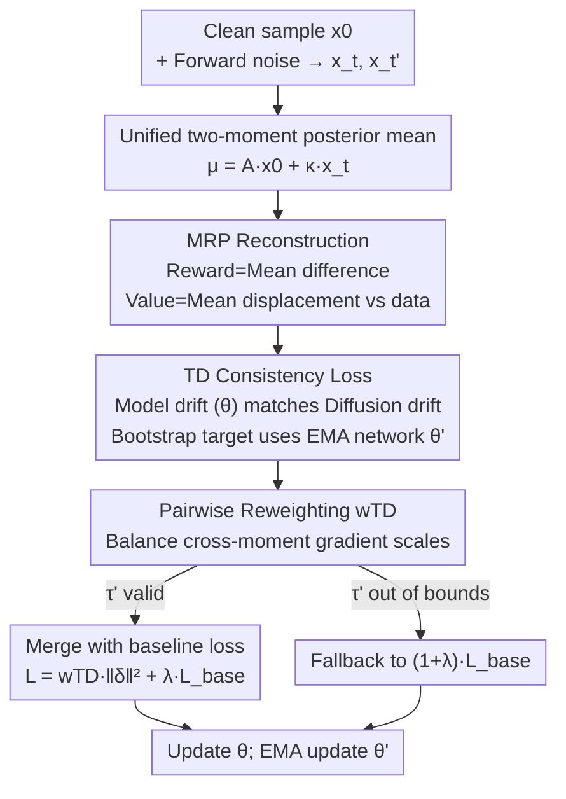

# Temporal Difference Learning for Diffusion Models

**Conference**: ICML2026  
**arXiv**: [2606.15048](https://arxiv.org/abs/2606.15048)  
**Code**: https://github.com/StephenYing/Temporal_Difference_Learning_for_Diffusion_Models  
**Area**: Diffusion Models / Image Generation  
**Keywords**: Diffusion Models, Temporal Difference, Reinforcement Learning, Cross-time Consistency, Few-step Sampling  

## TL;DR
The paper reformulates the diffusion denoising process as a Markov Reward Process (MRP) and treats training as policy evaluation in reinforcement learning. It proposes a Temporal Difference (TD) objective that enforces the model's "multi-step drift" along the denoising trajectory to match the true diffusion drift. As a plug-and-play regularizer added to baseline losses like EDM or Consistency Training, it significantly improves FID, particularly in few-step sampling (low NFE) scenarios.

## Background & Motivation
**Background**: Diffusion models are standard tools for high-fidelity image/audio generation. Despite advances in samplers (DDIM, DPM-Solver, UniPC) and training acceleration (Progressive Distillation, Consistency Learning), the dominant **training paradigm** still optimizes only single-moment reconstruction or noise prediction losses, aligning denoising targets at a single time step (or an adjacent pair).

**Limitations of Prior Work**: Single-moment objectives **do not explicitly require** that predictions at different noise levels form a "temporally consistent" trajectory under the known forward corruption process. This cross-time mismatch accumulates along the denoising path, which is particularly fatal when the sampler uses only a few steps (low NFE, Number of Function Evaluations)—as local errors do not have enough steps to be averaged out.

**Key Challenge**: Diffusion training is essentially a multi-step sequential decision problem (predictions at different time steps must be **multi-step consistent**), but existing losses only guarantee **local accuracy**, providing no constraints on whether multi-step rollouts are self-consistent.

**Goal**: To introduce a training regularizer that enforces cross-time consistency without changing the base generator's characterization, introducing additional generators, or relying on task-specific rewards, thereby improving generation quality at a fixed NFE.

**Key Insight**: View the denoising trajectory as an MRP in RL, where denoising training corresponds to **policy evaluation**. By defining "advancing along the trajectory" through rewards and returns, classical Temporal Difference (TD) learning can be used to approximate the value function. The essence of TD is "bootstrapping"—using the estimate of a subsequent step to constrain a prior one—which naturally enforces cross-step consistency.

**Core Idea**: Use the **difference in posterior means** between two adjacent (or $k$-step separated) moments as the "true drift" in the TD error, requiring the "model drift" predicted by the network to match it. Unlike Consistency Models (CM) which require the reconstruction itself to be consistent over time, this method requires the **amount of change** between posterior means to match the true diffusion drift.

## Method

### Overall Architecture
The method reformulates diffusion training as policy evaluation in RL and uses the TD error as a regularizer. The unifying tool is the linear form of the "two-moment posterior mean": for any $\tau < t$,

$$\boldsymbol{\mu}_\tau^{\text{true}}(\boldsymbol{x}_t,\boldsymbol{x}_0) = A_{t,\tau}\,\boldsymbol{x}_0 + \kappa_{t,\tau}\,\boldsymbol{x}_t,$$

where $\boldsymbol{x}_0$ is a clean sample, $\boldsymbol{x}_t$ is a sample at noise level $t$, and the coefficients $(A_{t,\tau},\kappa_{t,\tau})$ have closed-form solutions across DDPM / DDIM / VP-SDE / VE-SDE / EDM / CM families, allowing discrete and continuous time to be expressed identically. The workflow is: given a clean sample $\boldsymbol{x}_0$ and forward noise addition, define an MRP that moves backward from $t=T$ to $t=0$, where the reward is the posterior mean difference and the value is the displacement of the posterior mean relative to the data; construct a TD target using bootstrapping with an EMA target network, requiring model drift to match true diffusion drift; perform sample-level pairwise reweighting to stabilize cross-moment gradient scales; finally, merge the weighted TD loss with the baseline loss (EDM or CT) using coefficient $\lambda$, updating the main network $\theta$ and performing EMA updates on the target network $\theta'$.

### Key Designs

**1. Reformulating Denoising as a Markov Reward Process: Closed-form Rewards and Values**

The limitation is that single-moment losses lack the language of "cross-step consistency." The paper constructs a finite-horizon MRP $(\mathcal{X}, r_t, P_t, T)$, where the state space is the data space (images), and it moves backward from $t=T$ to $t=0$ to match diffusion time notation. The key is defining the reward as the **difference between two adjacent posterior means** (vector-valued): $\boldsymbol{r}_{t-1} := \boldsymbol{\mu}_{t-1}^{\text{true}}(\boldsymbol{x}_t,\boldsymbol{x}_0) - \boldsymbol{\mu}_{t-2}^{\text{true}}(\boldsymbol{x}_{t-1},\boldsymbol{x}_0)$, and the transition kernel as the diffusion forward posterior $q(\boldsymbol{x}_{t-1}\mid\boldsymbol{x}_t,\boldsymbol{x}_0)$. Under this definition, returns and values collapse into concise closed forms: $\boldsymbol{g}_t\mid\boldsymbol{x}_0 = \boldsymbol{\mu}_{t-1}^{\text{true}}(\boldsymbol{x}_t,\boldsymbol{x}_0)-\boldsymbol{x}_0$, and value $\boldsymbol{v}_t(\boldsymbol{x}_t) = \boldsymbol{\mu}_{t-1}^{\text{true}}(\boldsymbol{x}_t,\boldsymbol{x}_0)-\boldsymbol{x}_0$, i.e., the "displacement of the posterior mean relative to clean data." $\boldsymbol{x}_0$ acts as an episode-level context (conditioning) throughout the derivation, sampled from the data distribution during training. This step is the foundation of the method: translating abstract "trajectory consistency" into a learnable value function in RL.

**2. TD Consistency Loss + EMA Bootstrapping: Matching Model Drift with Diffusion Drift**

With the value function established, TD learning can be applied. The value is approximated using a preconditioned denoiser $\boldsymbol{v}_{\theta,t}(\boldsymbol{x}_t) := \boldsymbol{\mu}_{\theta,t-1}(\boldsymbol{x}_t)-\boldsymbol{x}_0$, where $\boldsymbol{\mu}_{\theta,t-1}(\boldsymbol{x}_t)=A_{t,t-1}\boldsymbol{x}_{\theta,0}(\boldsymbol{x}_t;t)+\kappa_{t,t-1}\boldsymbol{x}_t$ is provided by the model $\boldsymbol{x}_{\theta,0}$ predicting $\boldsymbol{x}_0$. The bootstrap target uses a **fixed-parameter EMA target network** $\theta'$ (stop-gradient) to estimate the value of the next state. Substituting the reward definition, the TD error decomposes into the difference between two drifts:

$$\boldsymbol{\delta}_t = \underbrace{[\boldsymbol{\mu}_{t-1}^{\text{true}}(\boldsymbol{x}_t,\boldsymbol{x}_0)-\boldsymbol{\mu}_{t-2}^{\text{true}}(\boldsymbol{x}_{t-1},\boldsymbol{x}_0)]}_{\text{One-step Diffusion Drift}} - \underbrace{[\boldsymbol{\mu}_{\theta,t-1}(\boldsymbol{x}_t)-\boldsymbol{\mu}_{\theta',t-2}(\boldsymbol{x}_{t-1})]}_{\text{One-step Model Drift}}.$$

The TD(0) objective is $\mathcal{L}_{\mathrm{TD(0)}}=\mathbb{E}\|\boldsymbol{\delta}_t\|_2^2$. Intuitively: wherever the true mean moves in this step, the model must move in the same direction and magnitude, thereby forcing consistency between adjacent steps. The paper further uses $k$-step returns as bootstrap targets to obtain $\mathcal{L}_{\mathrm{TD}}^{(k)}$ (matching drift over $k$ steps). A clever degradation occurs: when $t \le k$, the entire return is known and bootstrapping is unnecessary; the TD loss automatically **degrades to posterior mean matching** (i.e., DDPM-style loss). In practice, even when $t > k$, the TD loss is merged with the baseline loss $\mathcal{L}_{\mathrm{TD+DDPM}}^{(k)}=\mathcal{L}_{\mathrm{TD}}^{(k)}+\lambda\mathcal{L}_{\mathrm{DDPM}}$ to accelerate convergence; otherwise, $(1+\lambda)\mathcal{L}_{\mathrm{DDPM}}$ is used to maintain scale. This is the fundamental difference from Consistency Models: CM requires the reconstruction itself to be consistent over time, while this method requires the **amount of change between means** to match the true diffusion drift.

**3. Unified Two-Moment Form: Handling Discrete and Continuous Time**

Individual formulas for discrete (DDPM/DDIM) and continuous (VP/VE/EDM/CM) systems would be fragmented. Using the linear form of the two-moment posterior mean, continuous time only requires selecting two indices $t, t' \in [0, T]$, each inducing earlier moments $\tau < t$ and $\tau' < t'$ of the true posterior mean. By setting $\tau' < t' < \tau < t$, span $k := t - t'$, and stride $\Delta := t - \tau < k$, the discrete TD error is translated to the continuous version $\mathcal{L}_{\mathrm{TD}}^{\mathrm{cont}}$. When $\tau'$ falls outside the valid time window (noise level below the sampler lower bound), it similarly degrades to mean matching, falling back to the baseline loss. This makes TD a general-purpose module that can be attached to any continuous-time baseline predicting $\boldsymbol{x}_0$ (EDM, CT).

**4. Sample-level Pairwise Reweighting: Balancing Gradient Scales across Moment Pairs**

Loss scales corresponding to different $(t, t')$ vary dramatically, causing certain moment pairs to dominate the gradient. The paper derives reweighting from a norm inequality: the TD error is written as $\boldsymbol{\delta}_{t,t'}=\mathcal{B}\,\boldsymbol{e}_{t,t'}$ (where $\boldsymbol{e}$ is the normalized error relative to the original network $F_\theta$). From $\|\boldsymbol{\delta}_{t,t'}\|_2^2 \le \|\mathcal{B}\|_2^2 \|\boldsymbol{e}_{t,t'}\|_2^2$, the pairwise weight under EDM parameterization is derived:

$$w_{\mathrm{TD}}^{\mathrm{EDM}}(t,t') = \frac{1}{A_{t,\tau}^2 c_{\mathrm{out}}^{\mathrm{EDM}}(t)^2 + A_{t',\tau'}^2 c_{\mathrm{out}}^{\mathrm{EDM}}(t')^2},$$

such that $w_{\mathrm{TD}}\|\boldsymbol{\delta}\|_2^2 \le \|\boldsymbol{e}\|_2^2$, normalizing the loss scale to a magnitude that does not drift with time indices. A similar weight $w_{\mathrm{TD}}^{\mathrm{CT}}(t,t')=1/(A_{t,\tau}^2+A_{t',\tau'}^2)$ is derived for CT parameterization. Ablations prove this reweighting is necessary—FID significantly worsens if replaced with constant weights (unweighted).

### Loss & Training
General Recipe (Algorithm 1): Sample $\boldsymbol{x}_0$ and a noise index $t$, first calculating baseline loss $\mathcal{L}_{\text{base}}$ (EDM or CT). If $t \le N-1-k-\Delta$ (i.e., $\tau'$ is valid), calculate TD error $\boldsymbol{\delta}_{t,t'}$, weight it as $\mathcal{L}_{\mathrm{wTD}}$, and total loss $\mathcal{L}=\mathcal{L}_{\mathrm{wTD}}+\lambda\mathcal{L}_{\text{base}}$. Otherwise, $\mathcal{L}=(1+\lambda)\mathcal{L}_{\text{base}}$. Perform gradient descent to update $\theta$ and EMA update $\theta'$. TD time indices are parameterized via the EDM noise grid $\sigma(i)$ and paired as $t'=t+k$, $\tau=t+\Delta, \tau'=\tau+k$, enabled only when $\sigma(\tau') \in [\sigma_{\min}, \sigma_{\max}]$. Default values: $\Delta=0.25, k=1, \lambda=0.5$ (TD+EDM).

## Key Experimental Results

### Main Results
Sampling uses probability-flow ODE + Heun integrator, $\textit{NFE}=2\times\text{steps}-1$, reporting last-15% FID-50k (lower is better). TD+EDM matches or exceeds the EDM baseline in medium few-step intervals (12–18 steps), with comprehensive dominance on FFHQ across steps:

| Dataset | Steps | TD+EDM | EDM |
|--------|------|--------|-----|
| Cond. CIFAR-10 (32²) | 12 | **2.270** | 2.365 |
| Cond. CIFAR-10 (32²) | 18 | **2.129** | 2.170 |
| AFHQv2 (64²) | 15 | **3.554** | 3.588 |
| AFHQv2 (64²) | 18 | **3.386** | 3.402 |
| FFHQ (64²) | 9 | **7.463** | 7.829 |
| FFHQ (64²) | 15 | **3.564** | 3.695 |
| FFHQ (64²) | 18 | **3.246** | 3.370 |

TD+CT also improves FID in one-step sampling (steps=1, NFE=1): AFHQv2 from 12.97 → 12.87, and FFHQ from 19.45 → **15.93** (significant improvement).

### Ablation Study
Last-15% FID-50k on CIFAR-10 with a small UNet and 3 seeds (default $\Delta=0.25, k=1, \lambda=0.5$):

| Configuration | steps=12 | steps=15 | steps=18 | Description |
|------|---------|---------|---------|------|
| Unweighted TD (Constant) | 11.059 | 10.589 | 10.435 | Significantly worse without reweighting |
| Weighted $w_{\mathrm{TD}}$ (Full) | **10.224** | **9.755** | **9.751** | Full method |
| EDM Baseline | 10.576 | 10.201 | 9.978 | Baseline control |

$\lambda$ scanning shows small $\lambda$ (0.01–0.5) is optimal and stable. Stride $\Delta \in \{1/2, 1/3, 1/4, 1/5\}$ shows minimal difference under fixed step budgets, indicating robustness to this hyperparameter.

### Key Findings
- **Pairwise reweighting is the critical piece**: Switching to constant weights results in FID degradation across all step budgets (e.g., steps=12 drops from 10.224 to 11.059), indicating that cross-moment gradient balancing is indispensable.
- **Greater gains in few-step sampling**: TD's advantage is most pronounced at low NFEs—aligning multi-step drifts makes the model more robust to the large discretization intervals inherent in few-step sampling.
- **Robust hyperparameters, small $\lambda$ preferred**: Performance is stable in the low $\lambda$ range and insensitive to $\Delta$, requiring no fine-tuning for deployment.
- **Controllable overhead**: TD+EDM increases training time by approximately 40% (45.7→64.7 s/tick) and GPU memory by +6% due to the target network. TD+CT adds negligible overhead as CT already utilizes a target network.

## Highlights & Insights
- **The reward definition "Posterior Mean Difference = True Drift"** is the most ingenious step: it collapses the MRP return and value into the displacement of the posterior mean relative to data, translating abstract trajectory consistency into matchable drift.
- **Clear distinction from Consistency Models**: While CM constrains the reconstruction itself to be consistent, this method constrains the **amount of change** (drift) between means to be consistent—addressing consistency at the "velocity/drift" level rather than "position" level, which is more effective for few-step sampling.
- **Reweighting derived from norm inequalities** rather than arbitrary assignment ensures the loss scale is theoretically tied to normalized error across time indices, which ablations prove is necessary.
- High portability: As a plug-and-play training regularizer, it can be attached to various baselines (DDPM/DDIM/EDM/CT) without modifying the original model parameterization, making it friendly for work looking to add consistency constraints to existing diffusion training.

## Limitations & Future Work
- **Additional compute and memory overhead**: TD+EDM requires maintaining and updating an EMA target network, increasing training time by ~40%; though argued as "not significant," it remains a cost for large-scale training.
- **Limited evaluation scale**: Experiments are concentrated on datasets like CIFAR-10 / AFHQv2 / FFHQ at 32²–64² resolution, without validation on higher resolutions or large-scale text-to-image models. Ablations used smaller UNets to save compute.
- **Variable improvement gains**: On AFHQv2, TD+EDM comparisons with the baseline are mixed at certain step budgets (e.g., slightly trailing at steps=12), with more stable gains seen in FFHQ and few-step scenarios.
- Future work: Extending TD consistency to high-resolution/conditional generation, combined with distillation or higher-order solvers, to verify the limit of "drift-level consistency" gains under extreme few-step (1–4 steps) regimes.

## Related Work & Insights
- **vs Consistency Models (CM, Song et al. 2023)**: CM requires $f_\theta$ to provide a **consistent reconstruction** across adjacent moments; Ours requires the **posterior mean change** to match the true diffusion drift—a drift-level constraint acting as a regularizer atop the baseline.
- **vs Diffusion RL Fine-tuning (DDPO / DPOK / Adjoint Matching)**: These treat denoising as an MDP using policy gradients to optimize external rewards (aesthetics, alignment); Ours performs **self-policy evaluation** on the denoising process without task-specific rewards, aiming to improve generation quality for fixed NFEs.
- **vs Few-step Generator Redesign (Shortcut Models / MeanFlow)**: These redesign generators or parameterizations (conditioned on step size, learning average velocity fields) for few-step generation; Ours is complementary—retaining the base objective and adding a TD regularizer for strong cross-time consistency without altering the generator.
- **vs Temporal Difference Flows / $\gamma$-model**: Those link TD to flow training or infinite-horizon predictive distributions; Ours focuses on standard diffusion/consistency training, applying TD directly to the mean drift matching of the denoising trajectory.

## Rating
- Novelty: ⭐⭐⭐⭐ Reformulating denoising as MRP policy evaluation and using posterior mean difference as reward is a novel and self-consistent perspective.
- Experimental Thoroughness: ⭐⭐⭐⭐ Three datasets × multiple step counts + thorough ablations on weighting/$\lambda$/$\Delta$, though resolution and model scale are limited.
- Writing Quality: ⭐⭐⭐⭐ Clear unification of discrete/continuous forms, logical derivation, and well-articulated differences from CM.
- Value: ⭐⭐⭐⭐ Plug-and-play with clear gains in few-step sampling; highly practical for the diffusion training community.

<!-- RELATED:START -->

## Related Papers

- [\[ICLR 2026\] Temporal Concept Dynamics in Diffusion Models via Prompt-Conditioned Interventions](../../ICLR2026/image_generation/temporal_concept_dynamics_in_diffusion_models_via_prompt-conditioned_interventio.md)
- [\[CVPR 2025\] Finite Difference Flow Optimization for RL Post-Training of Text-to-Image Models](../../CVPR2025/image_generation/finite_difference_flow_optimization_for_rl_post-training_of_text-to-image_models.md)
- [\[ICML 2026\] Diffusion Models Are Statistically Optimal for Learning Low-Dimensional Multi-Modal Distributions](diffusion_models_are_statistically_optimal_for_learning_low-dimensional_multi-mo.md)
- [\[ICML 2026\] A Diffusive Classification Loss for Learning Energy-based Generative Models](a_diffusive_classification_loss_for_learning_energy-based_generative_models.md)
- [\[CVPR 2026\] VideoCoF: Unified Video Editing with Temporal Reasoner](../../CVPR2026/image_generation/videocof_unified_video_editing_with_temporal_reasoner.md)

<!-- RELATED:END -->
