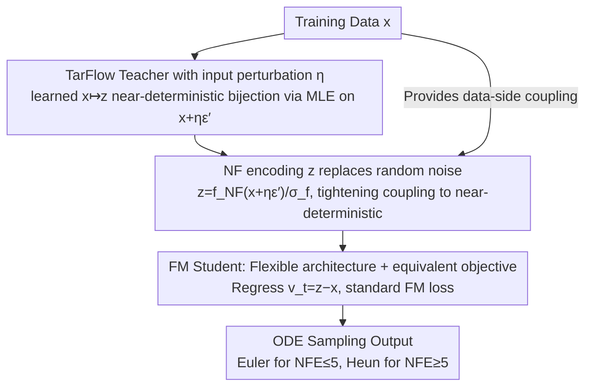

# The Coupling Within: Flow Matching via Distilled Normalizing Flows

**Conference**: ICML 2026  
**arXiv**: [2603.09014](https://arxiv.org/abs/2603.09014)  
**Code**: https://github.com/apple/ml-nfm  
**Area**: Diffusion Models / Generative Models / Flow Matching  
**Keywords**: Flow Matching, Normalizing Flow, coupling, distillation, TarFlow

## TL;DR
This paper introduces Normalized Flow Matching (NFM), which utilizes the "accurate deterministic data-to-noise bijection" produced by a pre-trained TarFlow (an autoregressive normalizing flow) as the noise-data coupling for Flow Matching. This advances FM's convergence speed and low-step FID to new levels while significantly exceeding the inference speed of the teacher NF model.

## Background & Motivation

**Background**: Flow Matching (FM) has become a mainstream training paradigm for large-scale generative models, using $x_t=(1-t)x+t\epsilon$ for linear interpolation between data and noise, followed by regressing the velocity $v_t=\epsilon-x$. A critical design choice for performance is the "noise-data coupling." Independent coupling is the simplest but suffers from slow training and high inference curvature; thus, OT-based coupling (e.g., SD-FM) has become a primary direction for improvement.

**Limitations of Prior Work**: OT-based methods are essentially prepocessing techniques based on geometric distances and are model-agnostic; they do not truly exploit "model-learnable data representations." Conversely, another line of research — Normalizing Flows (NF), specifically the recent TarFlow — can directly learn a data $\leftrightarrow$ Gaussian bijection. Theoretically, once this pairing is determined, velocity regression should have zero error and sampling could occur in a single step, yet NF autoregressive sampling remains prohibitively slow.

**Key Challenge**: FM inference is fast but its coupling is coarse; NF coupling is perfect but its sampling is slow. Both sides possess structural shortcomings, and previous work has rarely integrated them.

**Goal**: (i) Replace random or OT coupling in FM with pairings learned by NF (which are near-bijections) to provide a more "aligned" training pair for the student model; (ii) Verify that this "distillation of NF into FM" can both accelerate FM convergence and outperform the teacher NF in terms of FID.

**Key Insight**: The authors view NF as a "learned, model-dependent approximation of optimal transport." Even if the NF mapping is not OT-optimal in a likelihood sense (limited by network capacity), it remains a high-quality coupling as long as it consistently maps each data point to a specific Gaussian representation.

**Core Idea**: During training of the FM student, the noise term $\epsilon$ is replaced by the encoding of the data from a pre-trained NF teacher $z_{\epsilon'}=f_{\text{NF}}(x+\eta\epsilon',c)/\sigma_f$, and the velocity target is updated to $v_t=z_{\epsilon'}-x$, keeping other FM procedures intact.

## Method

### Overall Architecture
NFM aims to resolve the "coarse noise-data coupling" in Flow Matching by replacing the random noise endpoint with an encoding from a pre-trained Normalizing Flow (NF) teacher. The process follows two stages: first, a TarFlow teacher $f_{\text{NF}}$ is trained via maximum likelihood to learn a near-deterministic invertible $x\mapsto z$ mapping; second, the teacher is frozen, and a standard FM student $g$ (of arbitrary architecture, not necessarily invertible) is trained, changing its training pairs from $(x,\epsilon)$ to $(x,z_{\epsilon'})$. The student retains standard FM training formulas, samplers, guidance, and time schedules, allowing it to be integrated into existing FM codebases with zero overhead.

### Key Designs

**1. TarFlow Teacher with Input Perturbation $\eta$: Maintaining Smoothness and Controlling Noise Levels**

TarFlow is chosen as the teacher because it is an autoregressive flow implemented with Transformers, performing patch-by-patch generation within each meta-block. It offers strong invertibility and image quality competitive with diffusion models — at the cost of extremely slow sampling, which NFM bypasses via the student model. During teacher training, the input is not clean $x$ but $x'=x+\eta\epsilon'$. NFM retains this $\eta$ as it serves dual roles: it ensures $z$ remains smooth over small data neighborhoods (avoiding collapse into a purely deterministic hard mapping to maintain some stochasticity), and it implicitly compresses the maximum noise level seen by the FM student to $\sim\eta/(1+\eta)$. Thus, $\eta$ acts as a "knob" for the strength of coupling determinism: larger $\eta$ causes $z$ values for different images to converge, making the coupling "softer" (optimal FID at higher NFE); smaller $\eta$ makes the coupling "harder," performing better in low-step sampling.

**2. Replacing Random Noise with Teacher-Generated $z$: Tightening Many-to-Many Mappings into Near-Deterministic Pairings**

The most difficult phase for FM learning is at large $t$, where the conditional variance of the interpolation point $x_t=(1-t)x+t\epsilon$ is high. The velocity target $v_t=\epsilon-x$ conveys little more than the difference between endpoints, causing a single $x_t$ to potentially correspond to various target directions, leading to high gradient noise and curved ODE trajectories. NFM solves this by pairing data not with random noise, but with a teacher-locked, near-Gaussian encoding $z_{\epsilon'}=f_{\text{NF}}(x+\eta\epsilon',c)/\sigma_f$, where $\sigma_f^2=\mathbb{E}[f_{\text{NF}}(x+\eta\epsilon',c)^2]$ normalizes the output to unit variance. This ensures that the mapping from "specific $z \to$ specific $x$" significantly reduces $\text{Var}(v_t\mid x_t,t)$, directly resulting in straighter paths (curvature $\kappa$ drops from 0.0386 in FM to 0.0181) and improved FID in low-step sampling. Notably, converting the teacher's perturbation to FM variance-preserving coordinates, $\eta=0.05$ corresponds to a maximum FM noise of $t \approx 0.0476$, far below the standard $t=1$, meaning the student operates in a "gentle noise" regime from the start.

**3. Flexible Student Architecture + Equivalent FM Objective: Unlocking Faster-than-Teacher Inference**

By replacing $\epsilon$ with $z_{\epsilon'}$, the FM velocity regression and time weighting remain unchanged. Consequently, student $g$ requires no invertibility constraints and can be a standard ViT/CNN (SiT-XL is used). The student is trained with a standard FM loss:

$$\mathcal{L}_{\text{FM}}=\big\|g\big((1-t)x+tz_{\epsilon'},\,c,\,t\big)-(z_{\epsilon'}-x)\big\|_2^2$$

During inference, Euler is used for NFE $\le 5$ and Heun for NFE $\ge 5$, with a $t^2$ time schedule. Because no new hyperparameters are introduced and the existing pipeline is untouched, and since invertibility constraints are removed, student sampling is orders of magnitude faster than the autoregressive TarFlow — a structural reason why the "student outperforms the teacher in speed and quality."

### Loss & Training
The student is trained using $\mathcal{L}_{\text{FM}}$ above. Class labels are randomly dropped with probability $p=0.1$ to support classifier-free guidance, and time $t$ is sampled from $\text{lognorm}(-0.2, 1)$. The teacher is trained on 512 MiB samples (~420 epochs), while the student is trained on only 256 MiB (~210 epochs), indicating that the student outperforms the teacher with half the training budget.

## Key Experimental Results

### Main Results

| Dataset / Teacher / NFE | FM | SD-FM | NFM (256 MiB) | NFM vs FM |
|-------------------------|----|-------|---------------|-----------|
| ImageNet64, SiT-XL/4, 31| 2.57 | 2.68 | 1.78 | -0.79 |
| ImageNet64, 15 | 4.80 | 3.15 | 2.15 | -2.65 |
| ImageNet64, 7 | 13.01 | 6.41 | 3.23 | -9.78 |
| ImageNet64, Euler-5 | 21.05 | 12.18 | 3.92 | -17.13 |
| ImageNet256, SiT-XL/2, 31| 2.30 | – | 2.29 | -0.01 |
| ImageNet256, 7 | 12.41 | – | 3.43 | -8.98 |

The student’s FID reaches 1.78 on ImageNet64, outperforming the TarFlow teacher with equivalent parameters (FID=1.98); on ImageNet256, NFM (FID 2.29) significantly outperforms the teacher (FID 3.96).

### Ablation Study

| Configuration / Phenomenon | Result | Description |
|----------------------------|--------|-------------|
| Heun(t²), 31 NFE | FM 2.57 → NFM 1.78 | NFM advantage remains stable at large NFE |
| Euler(t), 128 NFE Curvature $\kappa$ | FM 0.0386 / SD-FM 0.0289 / NFM 0.0181 | NFM paths are significantly straighter |
| Heun, 5 NFE | 17.56 → 9.29 → 4.01 | NFM shows maximum relative gain at very low NFE |
| Large $\eta$ vs Small $\eta$ | Larger $\eta$ brings $z$ closer across images | Weaker "near-determinism" worsens low-step FID |

### Key Findings
- **Student outperforming teacher**: Attributed to the combination of "near-deterministic pairing + flexible architecture + EMA." The teacher is bottlenecked by invertibility constraints, while the student fits the data better without them.
- **Surprising $z$-space structure**: The $z$ projections for the same image under different $\eta\epsilon'$ are not mutual nearest neighbors; instead, different images under the same noise are closer. This suggests NF entangles "image identity" and "noise vectors" deeply, yet NFM still works, implying the FM student learns endpoint correspondence rather than neighborhood structure.
- **Gain Distribution**: At NFE = 7, NFM reduces FM’s FID to 1/4 and SD-FM’s by 50%, covering areas where SD-FM’s OT coupling is insufficient.

## Highlights & Insights
- Viewing NF as a "learned OT approximation" provides a powerful perspective: the value of OT lies in "pairing" rather than "geometric optimality." NFM proves that geometric optimality is unnecessary if pairings are deterministic enough.
- The dual nature of "FM distilled by NF" acts as both distillation (NF $\to$ FM) and a hybrid (NF + FM), resulting in a rare instance where the student is both faster and better than the teacher.
- The method requires no changes to standard FM training, sampling, or guidance, making it extremely easy to adopt in engineering pipelines.

## Limitations & Future Work
- High-quality NF teachers are expensive to pre-train; a poor teacher FID could limit the student, and the boundary of "teacher quality required" remains unexplored.
- Experiments are restricted to ImageNet64/256 and class-conditional generation. Scaling to text-to-image, video, or high resolution (1024+) remains an open question for TarFlow.
- The counter-intuitive $z$-space structure is not fully understood, which may pose long-term risks for distillation stability.
- NFM is not inherently incompatible with OT methods like SD-FM; combining them is suggested but not yet implemented.

## Related Work & Insights
- **vs SD-FM / OT-CFM**: While both modify coupling, OT methods approximate discrete optimal transport, while NFM uses a learned deterministic map. NFM shows significantly better performance on ImageNet256, especially at low NFE.
- **vs DiffFlow / DiNof**: Unlike prior works that co-train NF and diffusion, NFM uses a simpler "frozen teacher, student distillation" route.
- **vs Consistency Models / Rectified Flow**: CM and RF aim to shorten ODE paths. NFM improves paths from the source by "improving endpoints," halving curvature $\kappa$.
- **vs General Distillation** (Progressive Distillation, etc.): Traditional distillation mimics sampling trajectories; NFM trains on FM objectives with a new distribution, offering better generalization without per-NFE alignment.

## Rating
- **Novelty**: ⭐⭐⭐⭐ A fresh and natural perspective treating NF as a coupling source for FM.
- **Experimental Thoroughness**: ⭐⭐⭐⭐ Comprehensive analysis across NFE, solvers, $\eta$, and curvature.
- **Writing Quality**: ⭐⭐⭐⭐ Clear reasoning with honest reporting of counter-intuitive $z$-space phenomena.
- **Value**: ⭐⭐⭐⭐ Provides a low-cost FID improvement for existing FM models, particularly effective in the practical low-step sampling regime.

<!-- RELATED:START -->

## Related Papers

- [\[AAAI 2026\] Flowing Backwards: Improving Normalizing Flows via Reverse Representation Alignment](../../AAAI2026/image_generation/flowing_backwards_improving_normalizing_flows_via_reverse_representation_alignme.md)
- [\[CVPR 2026\] Learning Straight Flows: Variational Flow Matching for Efficient Generation](../../CVPR2026/image_generation/learning_straight_flows_variational_flow_matching_for_efficient_generation.md)
- [\[ICML 2026\] Stable Velocity: A Variance Perspective on Flow Matching](stable_velocity_a_variance_perspective_on_flow_matching.md)
- [\[CVPR 2026\] Bidirectional Normalizing Flow: From Data to Noise and Back](../../CVPR2026/image_generation/bidirectional_normalizing_flow_from_data_to_noise_and_back.md)
- [\[ICLR 2026\] SESaMo: Symmetry-Enforcing Stochastic Modulation for Normalizing Flows](../../ICLR2026/image_generation/sesamo_symmetry-enforcing_stochastic_modulation_for_normalizing_flows.md)

<!-- RELATED:END -->
## Related Papers

- [\[AAAI 2026\] Flowing Backwards: Improving Normalizing Flows via Reverse Representation Alignment](../../AAAI2026/image_generation/flowing_backwards_improving_normalizing_flows_via_reverse_representation_alignme.md)
- [\[ICML 2026\] Stable Velocity: A Variance Perspective on Flow Matching](stable_velocity_a_variance_perspective_on_flow_matching.md)
- [\[CVPR 2026\] Learning Straight Flows: Variational Flow Matching for Efficient Generation](../../CVPR2026/image_generation/learning_straight_flows_variational_flow_matching_for_efficient_generation.md)
- [\[CVPR 2026\] Bidirectional Normalizing Flow: From Data to Noise and Back](../../CVPR2026/image_generation/bidirectional_normalizing_flow_from_data_to_noise_and_back.md)
- [\[ICML 2025\] Normalizing Flows are Capable Generative Models](../../ICML2025/image_generation/normalizing_flows_are_capable_generative_models.md)

<!-- RELATED:END -->
