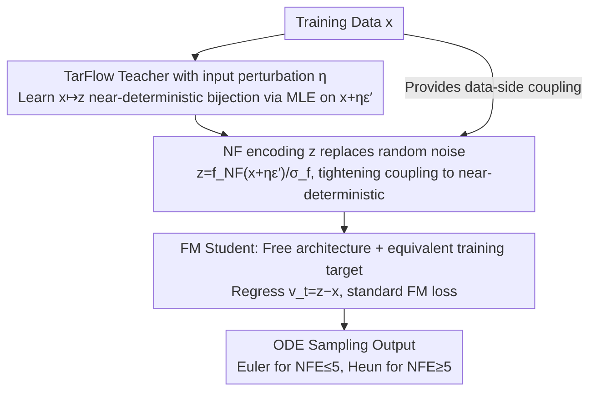

# The Coupling Within: Flow Matching via Distilled Normalizing Flows

**Conference**: ICML 2026  
**arXiv**: [2603.09014](https://arxiv.org/abs/2603.09014)  
**Code**: https://github.com/apple/ml-nfm  
**Area**: Diffusion Models / Generative Models / Flow Matching  
**Keywords**: Flow Matching, Normalizing Flow, coupling, distillation, TarFlow

## TL;DR
This paper proposes NFM (Normalized Flow Matching), which leverages the "accurate deterministic data $\to$ noise bijection" generated by a pre-trained TarFlow (an autoregressive Normalizing Flow, NF) as the noise-data coupling for Flow Matching. This advances FM convergence speed and few-step FID to new levels while achieving inference speeds several orders of magnitude faster than the teacher NF.

## Background & Motivation

**Background**: Flow Matching (FM) has become a mainstream training paradigm for large-scale generative models. It uses $x_t=(1-t)x+t\epsilon$ to linearly interpolate data and noise, and regresses the velocity $v_t=\epsilon-x$. During inference, an ODE solver is used to invert $x_1 \sim \mathcal{N}(0,I)$ back to $x_0$. A key design determining performance is the "noise-data coupling." Independent coupling is the simplest but leads to slow training and high inference curvature; thus, OT-based coupling (e.g., SD-FM) has become a primary direction for improvement.

**Limitations of Prior Work**: OT-based methods are essentially geometric distance-based, model-agnostic pre-processing techniques. They do not truly utilize the "data representation learned by the model." Meanwhile, another line of work—Normalizing Flow (NF), specifically the recent TarFlow—can directly learn a bijection between data and Gaussian space. Theoretically, once a coupling is fixed, velocity regression has zero error and sampling can be done in one step; however, NF autoregressive sampling is prohibitively slow.

**Key Challenge**: FM has fast inference but coarse coupling; NF has perfect coupling but slow sampling. Both have structural weaknesses, and few prior works have integrated them.

**Goal**: (i) Replace random/OT coupling in FM with NF-learned (near-bijective) coupling to provide "aligned" training pairs for the FM student; (ii) verify that this "distillation of NF to FM" can accelerate FM convergence and outperform the teacher NF in FID.

**Key Insight**: The authors view NF as a "learned, model-dependent approximation of optimal transport." Even if the NF mapping is not OT-optimal in a likelihood sense (constrained by network capacity), it suffices as a high-quality coupling as long as it stably maps each data point to a specific Gaussian representation.

**Core Idea**: When training the FM student, the noise end $\epsilon$ is replaced with the encoding $z_{\epsilon'}=f_{\text{NF}}(x+\eta\epsilon',c)/\sigma_f$ produced by a pre-trained NF teacher. The velocity target is changed to $v_t=z_{\epsilon'}-x$, while the rest of the FM pipeline remains unchanged.

## Method

### Overall Architecture
NFM aims to solve the issue of "coarse noise-data coupling" in Flow Matching by replacing the random noise end with an encoding from a pre-trained Normalizing Flow (NF) teacher. The process consists of two stages: first, a TarFlow teacher $f_{\text{NF}}$ is trained via maximum likelihood to learn a near-deterministic invertible mapping $x \mapsto z$; second, the teacher is frozen, and a standard FM student $g$ (arbitrary architecture, not necessarily invertible) is trained using pairs $(x, z_{\epsilon'})$ instead of $(x, \epsilon)$. The student's training formula, sampler, guidance, and time scheduling all follow standard FM. The only modification is the substitution of the noise end with the teacher-provided $z_{\epsilon'}$, allowing it to be integrated into any existing FM codebase with zero cost.

### Key Designs

**1. TarFlow Teacher with Input Perturbation $\eta$: Smoothing and Noise Level Control**

TarFlow is chosen as the teacher because it is an autoregressive flow implemented via Transformer, where patches are generated autoregressively within meta-blocks. It offers strong invertibility and image quality comparable to diffusion models, at the cost of slow sampling—a bottleneck NFM bypasses via the student. During teacher training, the input is $x'=x+\eta\epsilon'$ rather than clean $x$. NFM retains this $\eta$ as it serves two purposes: it ensures $z$ remains smooth over a small neighborhood of the data (avoiding degradation into a purely deterministic hard mapping and preserving some stochasticity), and it implicitly suppresses the maximum noise level seen by the FM student to $\sim\eta/(1+\eta)$. Thus, $\eta$ acts as a knob for "coupling determinism": a larger $\eta$ makes $z$ for different images closer (softer coupling), with optimal FID occurring at higher NFE; a smaller $\eta$ yields "harder" coupling, performing better under low-step sampling.

**2. Replacing Random Noise with $z$ from the NF Teacher: Tightening Many-to-Many Mappings**

FM is particularly difficult to learn at large $t$, where the conditional variance of the interpolant $x_t=(1-t)x+t\epsilon$ is high. The velocity target $v_t=\epsilon-x$ conveys little more than the "endpoint difference," leading to various target directions for the same $x_t$, which results in high gradient noise and curved ODE trajectories. NFM's solution is to couple data with a teacher-locked, near-Gaussian encoding $z_{\epsilon'}=f_{\text{NF}}(x+\eta\epsilon',c)/\sigma_f$, where $\sigma_f^2=\mathbb{E}[f_{\text{NF}}(x+\eta\epsilon',c)^2]$ normalizes the teacher output to unit variance. This ensures that $z$ collectively approximates $\mathcal{N}(0,I)$, allowing the student to start from standard Gaussian noise during sampling. Since each $x$ is tied to a near-deterministic $z$, the "specific $z \to$ specific $x$" mapping significantly reduces $\text{Var}(v_t\mid x_t,t)$. This results in straighter paths (experimental curvature $\kappa$ drops from 0.0386 in FM to 0.0181) and improved FID for few-step sampling. Notably, converting $\eta=0.05$ to FM's variance-preserving coordinates yields a maximum noise level of $t=\eta/(1+\eta)\approx0.0476$, far below the standard FM's $t=1$, meaning the student operates in a "mild noise" regime from the start.

**3. Architectural Freedom + Equivalent Training Target: Order-of-Magnitude Faster Inference**

After substituting $\epsilon$ with $z_{\epsilon'}$, the FM velocity regression along linear interpolation and the time weighting remain unchanged. Consequently, the student $g$ requires no invertibility constraints and can be a standard ViT/CNN (SiT-XL is used). This allows the student to be smaller than TarFlow and use flexible inference steps. The student is trained using a standard FM loss:

$$\mathcal{L}_{\text{FM}}=\big\|g\big((1-t)x+tz_{\epsilon'},\,c,\,t\big)-(z_{\epsilon'}-x)\big\|_2^2$$

During inference, Euler is used for NFE $\le 5$ and Heun for NFE $\ge 5$, with a squared time schedule $t^2=\{1,(1-\delta t)^2,\ldots\}$. Because it introduces no new hyperparameters, preserves existing pipelines, and removes invertibility constraints, the student sampling speed is several orders of magnitude faster than the autoregressive TarFlow teacher—a structural reason why NFM can produce a student that is both "faster and better."

### Loss & Training
The student is trained using $\mathcal{L}_{\text{FM}}$ as defined above. Class labels are randomly dropped with probability $p=0.1$ to support classifier-free guidance, and time $t$ follows a $\text{lognorm}(-0.2, 1)$ distribution. In terms of scale, the teacher is trained on 512 MiB samples (~420 epochs), while the student is trained on only 256 MiB (~210 epochs), meaning the student outperforms the teacher with half the training budget.

## Key Experimental Results

### Main Results

| Dataset / Teacher / NFE | FM | SD-FM | NFM (256 MiB) | NFM vs FM |
|----------------------|----|-------|---------------|-----------|
| ImageNet64, SiT-XL/4, 31 | 2.57 | 2.68 | 1.78 | -0.79 |
| ImageNet64, 15 | 4.80 | 3.15 | 2.15 | -2.65 |
| ImageNet64, 7 | 13.01 | 6.41 | 3.23 | -9.78 |
| ImageNet64, Euler-5 | 21.05 | 12.18 | 3.92 | -17.13 |
| ImageNet256, SiT-XL/2, 31 | 2.30 | – | 2.29 | -0.01 |
| ImageNet256, 7 | 12.41 | – | 3.43 | -8.98 |

The student FID reaches 1.78 on ImageNet64, outperforming the TarFlow teacher (FID=1.98) with equivalent parameters. On ImageNet256, NFM (FID 2.29) shows a significant gap over the teacher (FID 3.96).

### Ablation Study

| Configuration / Phenomenon | Result | Description |
|------------|------|------|
| Heun(t²), 31 NFE | FM 2.57 → NFM 1.78 | NFM advantage stable even at high NFE |
| Euler(t), 128 NFE Curvature $\kappa$ | FM 0.0386 / SD-FM 0.0289 / NFM 0.0181 | NFM paths are significantly straighter |
| Heun, 5 NFE | 17.56 → 9.29 → 4.01 | NFM gains are largest under few-step sampling |
| Large $\eta$ vs Small $\eta$ | Higher $\eta$ brings different $z$ closer | Weaker determinism degrades low-step FID |

### Key Findings
- **Student FID Outperforms Teacher**: Attributed to the combination of near-deterministic coupling, flexible student architecture, and EMA. The teacher is limited by invertibility constraints, whereas the student has no such restriction and fits better.
- **Unexpected $z$-space Structure**: The $z$ projections for the same image under different $\eta\epsilon'$ are not nearest neighbors; instead, different images under the same noise are closer. This suggests NF entangles "image identity" and "noise vectors" deeply in $z$-space. Despite this, NFM works, showing the student learns mapping endpoints rather than neighborhood structures.
- **Distribution of Gains**: At NFE = 7, NFM reduces FID to 1/4 of FM and 50% of SD-FM, effectively covering regions where OT coupling in SD-FM is insufficient.

## Highlights & Insights
- Viewing NF as a "model-learned approximation of OT" is an insightful perspective. The core value of OT is "coupling" rather than "geometric optimality." NFM proves that geometric optimality is secondary to coupling determinism.
- The distillation (NF $\to$ FM) results in a student that is orders of magnitude faster than the teacher, representing a rare case where the student is both faster and superior in quality.
- The method does not alter FM training formulas, samplers, guidance, or scheduling, making the engineering integration cost extremely low.

## Limitations & Future Work
- A high-quality NF teacher is still required, and training one is expensive. If the teacher's FID is poor, the student may be limited; the "lower bound" of teacher quality is not explored.
- Experiments were restricted to ImageNet64/256 with class conditioning. Text-to-image or video scenarios haven't been verified, and the stability of TarFlow in those settings remains an open question.
- The counter-intuitive $z$-space structure is not fully understood, which might pose long-term stability issues for distillation.
- NFM is not inherently contradictory to OT methods like SD-FM; combining them is a suggested future direction but not yet empirically verified.

## Related Work & Insights
- **vs SD-FM / OT-CFM**: Both modify coupling, but while OT methods approximate discrete optimal transport, NFM uses a learned deterministic map. NFM performs significantly better on ImageNet256, particularly at low NFE.
- **vs DiffFlow / DiNof**: These works jointly train NF and diffusion. NFM adopts a simpler "frozen teacher, student distillation" route.
- **vs Consistency Models / Rectified Flow**: CM and RF aim to shorten ODE paths. NFM focuses on "better endpoints," reducing path curvature ($\kappa$ halved in experiments) at the source.
- **vs General Distillation**: Traditional distillation mimics sampling trajectories. NFM trains the student on the target distribution's FM directly, requiring no NFE-wise alignment and offering better generalization.

## Rating
- **Novelty**: ⭐⭐⭐⭐ Using NF as a coupling source for FM is a refreshing and natural perspective.
- **Experimental Thoroughness**: ⭐⭐⭐⭐ Comprehensive analysis across NFE, solvers, $\eta$, and curvature.
- **Writing Quality**: ⭐⭐⭐⭐ Clear reasoning with honest reporting of counter-intuitive $z$-space phenomena.
- **Value**: ⭐⭐⭐⭐ Provides a low-cost FID improvement for existing FM models, especially effective in practical few-step deployment.

<!-- RELATED:START -->

## Related Papers

- [\[AAAI 2026\] Flowing Backwards: Improving Normalizing Flows via Reverse Representation Alignment](../../AAAI2026/image_generation/flowing_backwards_improving_normalizing_flows_via_reverse_representation_alignme.md)
- [\[ICML 2026\] Stable Velocity: A Variance Perspective on Flow Matching](stable_velocity_a_variance_perspective_on_flow_matching.md)
- [\[ICML 2025\] Normalizing Flows are Capable Generative Models](../../ICML2025/image_generation/normalizing_flows_are_capable_generative_models.md)
- [\[ICML 2026\] AG-REPA: Causal Layer Selection for Representation Alignment in Audio Flow Matching](ag-repa_causal_layer_selection_for_representation_alignment_in_audio_flow_matchi.md)
- [\[ICML 2026\] Path-Coupled Bellman Flows for Distributional Reinforcement Learning](path-coupled_bellman_flows_for_distributional_reinforcement_learning.md)

<!-- RELATED:END -->
