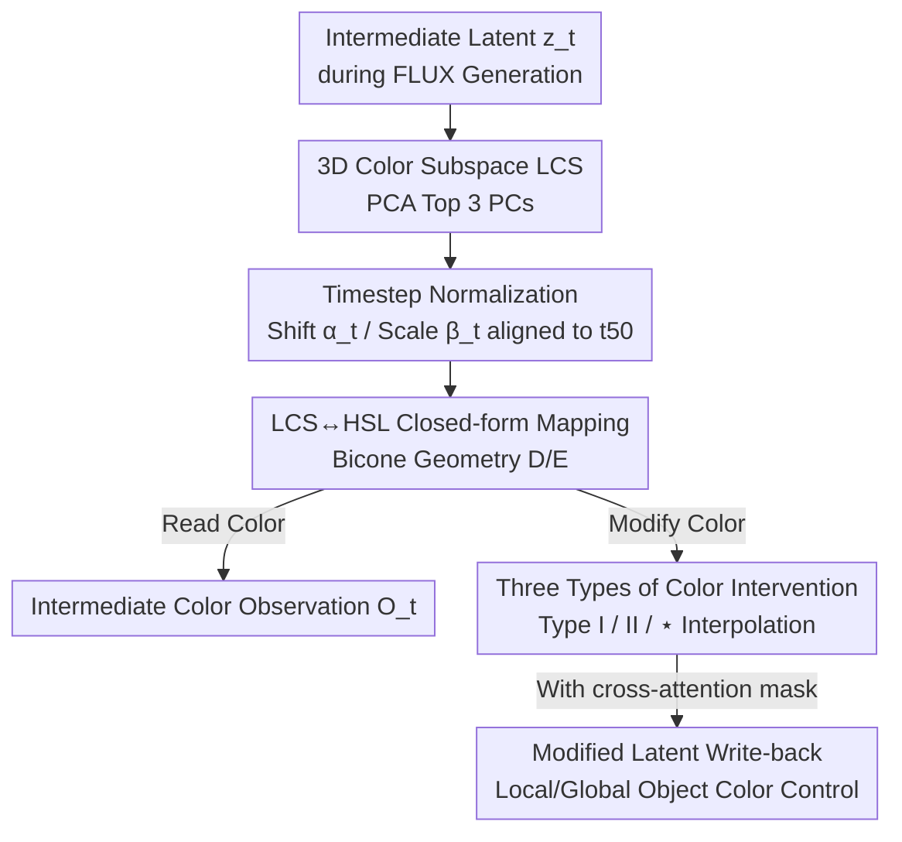

# The Latent Color Subspace: Emergent Order in High-Dimensional Chaos

**Conference**: ICML2026  
**arXiv**: [2603.12261](https://arxiv.org/abs/2603.12261)  
**Code**: https://github.com/ExplainableML/LCS  
**Area**: Diffusion Models / Image Generation / Mechanistic Interpretability  
**Keywords**: Flow Matching, FLUX, VAE Latent Space, Color Control, Training-free Intervention

## TL;DR
The authors discover that "color" occupies only a three-dimensional subspace (Latent Color Subspace, LCS) within the VAE latent space of FLUX.1. Its geometry closely mirrors the bicone of the HSL color model. Based on this, they propose a **completely training-free, pure closed-form latent space transformation** method that can both "read out" the emergent colors during generation and precisely modify specific objects to a target color.

## Background & Motivation
**Background**: Text-to-Image (T2I) models have evolved from diffusion to Flow Matching (FM). Models like FLUX and SD3.5 perform denoising/velocity field integration in a compressed VAE latent space, achieving high quality and text consistency.

**Limitations of Prior Work**: To achieve fine-grained control over generation (e.g., "change this parrot to blue"), the mainstream approach is to train additional modules like ControlNet, IP-Adapter, or learn a set of color prompts. These methods add control by stacking extra models or training, increasing system complexity without **improving understanding of how color is encoded inside the model**, making it difficult to establish trust in the system.

**Key Challenge**: Controllability and interpretability are artificially separated—controllable models are not understood, and understood models are not controllable. The root cause lies in the black-box nature of T2I, which adds two layers of complexity: the sequential denoising process and its operation in a high-dimensional, nearly unreadable VAE latent space.

**Goal**: Instead of adding modules, this work seeks to **first understand how FLUX represents color**, the most fundamental image component, and verify that this understanding satisfies two properties: (1) accuracy, faithfully reflecting the colors emerging in the final image; and (2) causality, allowing active intervention to change colors.

**Key Insight**: The authors fed 400 solid-color images uniformly sampled from HSV into the FLUX VAE encoder. By performing PCA on the patch-averaged latent vectors, they surprisingly found that **the first 3 principal components explain 100% of the variance**—color information is strictly compressed into a 3D subspace.

**Core Idea**: This 3D subspace is named LCS. The authors demonstrate its geometric structure is a bicone corresponding to Hue/Saturation/Lightness. By incorporating the dynamics of "how FM sequences move within this subspace," they implement training-free color observation and intervention using a set of closed-form geometric transformations.

## Method

### Overall Architecture
The method consists of two parts: **Analysis** (revealing the static geometry of LCS and FM temporal dynamics) and **Application** (observation and intervention based on this understanding). The input is a standard FLUX generation process (noise $\mathbf{z}_0$ integrated via velocity field $\mathbf{v}_\theta(\mathbf{z},t)$ to a clean latent), and the output is either an "intermediate readable color map" or a "color-modified final image." All operations occur within the 3D subspace defined by the projection matrix $\mathbf{B}\in\mathbb{R}^{d\times 3}$, bypassing the 50-million-parameter VAE decoder.

The pipeline is summarized as: solid-color images calibrate the LCS subspace and HSL geometry → 26 monochromatic images calibrate distribution drift/scaling statistics for each timestep → these calibrations normalize any intermediate latent to the final-step coordinate system → closed-form $D/E$ mappings convert between LCS↔HSL → read out colors or write back latents after applying color interventions.

### Key Designs

**1. Latent Color Subspace: Color Compressed into a 3D Bicone**

To address the barrier of "unreadable VAE latent space," the authors focus only on "where color resides." Encoding $N=400$ solid-color images and averaging patches yields $\bar{\mathbf{z}}^n\in\mathbb{R}^d$. After centering, PCA shows that the first 3 principal components $\mathbf{B}$ explain $100\%$ of the variance. Projecting latents into this subspace gives coordinates $\bar{\mathbf{c}}^n=\mathbf{B}^\top(\bar{\mathbf{z}}^n-\boldsymbol{\mu})\in\mathbb{R}^3$, revealing a highly regular geometric structure: the first dimension spans Lightness, and the second and third dimensions form a circle (Hue as angle, Saturation as radius), overall forming a bicone. This discovery collapses "high-dimensional chaos" into an analytically meaningful low-dimensional structure—and similar organizations were found in SD3.5, FLUX.2, and Qwen-Image VAEs.

**2. FM Temporal Statistical Calibration: Reading Intermediate Latents**

LCS geometry is defined at the final step (clean latent). However, during generation, patches "grow" from mid-grey to the final color, and the distribution expands over time. Applying HSL mapping directly to $t<50$ would be inaccurate. The authors estimate two statistics for each timestep $t$: shift $\boldsymbol{\alpha}_t=\frac{1}{N}\sum_i \bar{\mathbf{z}}_t^i$ and per-axis scale $\boldsymbol{\beta}_t=\frac{1}{N}\sum_i|\bar{\mathbf{z}}_t^i-\boldsymbol{\alpha}_t|$ using 26 monochromatic images. Any intermediate coordinate is first normalized to the final $t_{50}$ coordinate system:

$$\hat{\mathbf{c}}_i=\frac{\mathbf{c}_i-\boldsymbol{\alpha}_t}{\boldsymbol{\beta}_t}\odot\boldsymbol{\beta}_{50}+\boldsymbol{\alpha}_{50}$$

Normalizing before applying static mapping ensures accuracy. This explicit modeling of "color emergence over time" is key to reading/modifying colors mid-generation.

**3. LCS↔HSL Closed-form Bidirectional Mapping: Geometric Intuition to Analytical Formulas**

To make LCS usable, a bidirectional mapping between LCS coordinates $\mathbf{c}$ and HSL $(h,s,l)$ is required. The authors construct an approximate bijection using only 8 anchors (6 hues + Black/White). **Decoder $D$ (LCS→HSL)**: Using the achromatic axis $\mathbf{a}=\mathbf{w}-\mathbf{b}$, lightness is the projection length $l=\|\mathrm{proj}_{\mathbf{a}}(\mathbf{c}-\mathbf{b})\|/\|\mathbf{a}\|$; hue is calculated by projecting onto the circle defined by hue anchors and performing angular interpolation $h=\theta_k+\alpha(\theta_{k+1}-\theta_k)$; saturation is the distance to the achromatic axis divided by the maximum reachable distance at that lightness, $s=\frac{\|\mathbf{c}-\mathbf{c}_L\|}{R(1-|2l-1|)}$. **Encoder $E$ (HSL→LCS)** reverses this using spherical interpolation for hue directions $\mathbf{d}_H=\frac{\sin((1-\alpha)\psi)}{\sin\psi}\mathbf{d}_k+\frac{\sin(\alpha\psi)}{\sin\psi}\mathbf{d}_{k+1}$. This closed-form mapping requires no learned parameters.

**4. Three Types of Color Intervention + Temporal Interpolation**

The difficulty of color modification lies in "when and how"—the meaning of FM stages differs. At late timesteps, patch colors are fixed; one must maintain relationships between patches and perform closed-form transformations within LCS (rotation for hue, contraction for saturation, shift along the BW axis for lightness). At early timesteps, colors haven't formed, and coordinates are an unstructured cloud; rotation is ineffective. Here, **global uniform shifts** are needed. The authors design two interventions: **Type I** shifts directly in LCS $\hat{\mathbf{c}}_i'=\hat{\mathbf{c}}_i+(\mathbf{c}^*-\bar{\mathbf{c}})$ (destroys texture in late stages); **Type II** decodes to HSL, shifts, and encodes back (too weak in early stages). They interpolate both using a temporal coefficient $\gamma_t$ from the FM scheduler into **Type ⋆**: $\hat{\mathbf{C}}^{\star}=\gamma_t\hat{\mathbf{C}}'+(1-\gamma_t)\hat{\mathbf{C}}''$. The "golden window" at steps 8–10 allows color integration while preserving texture. Combined with object masks from cross-attention (Seg4Diff, transformer layer 18), they can target specific objects.

### An Example: Changing a Rubik's Cube
Using the prompt "a photo of a rubik's cube on a table": at intermediate step $t$, project current latents into LCS to get coordinates $\mathbf{C}$; normalize them to $t_{50}$ using step 2 statistics, then decode per-patch HSL via $D$ to obtain the "intended color map" $O_t$. This map is nearly identical to a VAE-decoded image but uses zero decoder parameters. To change color, a Type ⋆ intervention is applied at step 9: given target $\mathbf{y}^*=(h^*,s^*,l^*)$, an interpolated shift is applied to masked Rubik's cube patches. The final image shows the cube accurately changed to the target color, with reflections and shadows adjusted self-consistently by the base model.

## Key Experimental Results

### Main Results
Observation Accuracy (Color prediction error CIEDE2000 $\Delta E_{00}$, lower is better; compared with direct VAE decoding):

| Dataset | Evaluation | Method | t=20 | t=50 (Final) |
|--------|---------|------|------|------|
| Objects | Pixel-wise | $O_t$ (Ours, no decoder) | 20 | 12 |
| Objects | Pixel-wise | VAE Decode | 15 | 0 |
| Walls | Mean pixel | $O_t$ (Ours, no decoder) | 7 | 7 |
| Walls | Mean pixel | VAE Decode | 19 | 5 |

Ours achieves $\Delta E_{00}\le 12$ on both datasets at the final step. For mean evaluation, it remains $\le 13$ for all $t>0$, even **outperforming direct VAE decoding at early timesteps** because it utilizes global latent statistics, whereas VAEs are trained only for final-step latents.

Color Intervention Precision (Mechanism-only, no prompt modification):

| Color Injection Method | GenEval Acc ↑ | Precise(plain) $\Delta E_{00}$ ↓ | Precise(plain) $\Delta H$ ↓ |
|--------------|---------------|------|------|
| None (No color specified) | 9% | 39 | 88° |
| Prompt (Color in prompt) | 79% | 20 | 24° |
| LCS (⋆, global, Ours) | 72% | 11 | 8° |
| LCS (⋆, local, Ours) | 68% | — | — |

Using only mechanism intervention **without changing the prompt**, GenEval color accuracy rises from 9% to 72%, nearing the 79% achieved by prompts. On precise tests, color/hue error is actually **superior** to prompt-based methods.

### Ablation Study

| Configuration | Phenomenon | Explanation |
|------|------|------|
| Type I (Direct LCS Shift) | Late stage (t=10/50) texture destroyed; color looks "painted over" | Too late to only shift |
| Type II (Via HSL Shift) | Early stage (t=3) has almost no effect on various final images | Too early for HSL mapping |
| Type ⋆ (Interpolation, t=8–10) | Color integrates while preserving fine texture | Selected final solution |

### Key Findings
- **LCS existence is the anchor of the paper**: The fact that the top 3 PCs explain 100% of variance justifies all subsequent closed-form operations.
- **Temporal calibration is key to "intermediate reading/modification"**: Normalizing $\boldsymbol{\alpha}_t/\boldsymbol{\beta}_t$ is necessary to apply HSL mapping correctly at $t<50$.
- **Timing is more important than the intervention type**: Shifting early and rotating/contracting late is essential. Steps 8–10 are the "golden window."
- **Cross-architecture generalization**: Similar LCS organizations in SD3.5 / FLUX.2 / Qwen-Image suggest this is a general phenomenon of FM-VAE models.

## Highlights & Insights
- **"Understand before control" paradigm**: Instead of stacking extra models, control emerges directly from mechanistic understanding of internal representations—training-free, closed-form, and interpretable.
- **100% variance in 3D** is a striking result, showing that the "color" semantic dimension in high-dimensional latent space is hightly structured and analytically modelable.
- **Bicone = HSL** is an elegant geometric correspondence that aligns engineering color models with model internals. Intuition: other low-dimensional semantics (e.g., brightness, spatial position) might inhabit similar analytical subspaces.
- **Reading color without a 50M-parameter decoder** has direct value for efficient monitoring or early-stopping in generation pipelines.

## Limitations & Future Work
- **Scope limited to color**: The method relies on color being 3D and bicone-shaped. Generalization to shape, texture, or layout is unknown.
- **Dependence on internal attention masks**: Local color control uses Seg4Diff to extract masks from cross-attention, which limits intervention feasibility at very early steps where attention is unstable.
- **Narrow intervention window**: Type ⋆ is primarily effective at steps 8–10; being too early or late causes integration issues or texture destruction.
- **Approximated bijection**: $D/E$ are based on geometric assumptions and 8-anchor approximations; errors at extreme saturation/lightness require further discussion.
- Future work: Extending the "subspace + geometric mapping" framework to more controllable attributes.

## Related Work & Insights
- **vs ControlNet / IP-Adapter / Prompt learning**: These increase complexity without improving understanding; Ours is training-free and interpretable but currently limited to color.
- **vs SAE / Attention-based intervention**: Similar in finding steerable directions, but this work provides a closed subspace with analytical geometry (bicone/HSL) rather than learned sparse directions.
- **vs Concurrent VAE color analysis (Arias et al., 2025)**: While they also analyze VAE color latents, they lack prediction, intervention, and FM temporal analysis; this work completes the "read + modify + temporal" framework.

## Rating
- Novelty: ⭐⭐⭐⭐⭐ Proving color occupies an analytical 3D bicone subspace in FLUX VAE and performing training-free control.
- Experimental Thoroughness: ⭐⭐⭐⭐ Both qualitative and quantitative, plus cross-VAE validation; however, precise control benchmarks are still limited in scale.
- Writing Quality: ⭐⭐⭐⭐ Clear geometric derivations and diagrams; dense but logically consistent.
- Value: ⭐⭐⭐⭐⭐ A beautiful example of "understanding-driven control" for both controllable generation and mechanistic interpretability.

<!-- RELATED:START -->

## Related Papers

- [\[CVPR 2026\] Toward Diffusible High-Dimensional Latent Spaces: A Frequency Perspective](../../CVPR2026/image_generation/toward_diffusible_high-dimensional_latent_spaces_a_frequency_perspective.md)
- [\[ICML 2026\] Order within Chaos: Capturing Intrinsic Energy Anomalies for AI-Manipulated Image Forgery Localization](order_within_chaos_capturing_intrinsic_energy_anomalies_for_ai-manipulated_image.md)
- [\[ICML 2026\] OcclusionFormer: Arranging Z-Order for Layout-Grounded Image Generation](occlusionformer_arranging_z-order_for_layout-grounded_image_generation.md)
- [\[ICML 2026\] Esoteric Language Models: A Family of Any-Order Diffusion LLMs](esoteric_language_models_a_family_of_any-order_diffusion_llms.md)
- [\[CVPR 2026\] When Local Rules Create Global Order: Self-Organized Representation Learning for Latent Diffusion Models](../../CVPR2026/image_generation/when_local_rules_create_global_order_self-organized_representation_learning_for_.md)

<!-- RELATED:END -->
