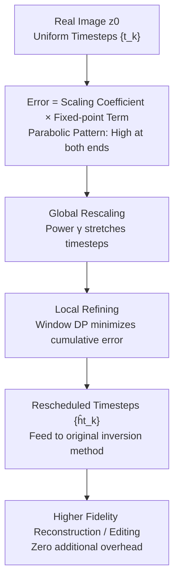

# Timestep Rescheduling in Diffusion Inversion

**Conference**: ICML2026  
**arXiv**: [2606.15389](https://arxiv.org/abs/2606.15389)  
**Code**: To be confirmed  
**Area**: Diffusion Models / Image Generation & Editing  
**Keywords**: Diffusion Inversion, DDIM, Timestep Scheduling, Dynamic Programming, Image Editing

## TL;DR
The authors discover that diffusion inversion error strongly depends on timestep size and follows a "high at both ends, low in the middle" parabolic distribution across timestep indices. They propose TRDI, a training-free, zero-overhead non-uniform timestep scheduler. TRDI first performs global timestep stretching and subsequently employs dynamic programming for local rearrangement, concentrating computational resources on segments with higher errors. It serves as a plug-and-play plugin to consistently improve reconstruction and editing precision across various inversion methods.

## Background & Motivation
**Background**: Diffusion inversion aims to map a real image $\mathbf{z}_0$ back to the Gaussian latent space noise $\mathbf{z}_T$, ensuring that denoising from $\mathbf{z}_T$ faithfully reconstructs the original image—a cornerstone for image reconstruction and editing. DDIM treats reverse diffusion as solving an ODE, providing deterministic and efficient approximate inversion.

**Limitations of Prior Work**: DDIM inversion approximations introduce errors at each step that **accumulate along the timesteps**, particularly evident in few-step settings, leading to reconstruction distortion and decreased editing fidelity. Existing improvements almost exclusively focus on using fixed-point iteration to repeatedly solve the inversion equation and suppress **single-step local errors** (e.g., ReNoise, GNRI, AIDI).

**Key Challenge**: All these methods **only focus on the local error within each step, completely ignoring how the timesteps themselves are selected and arranged**. Most inversion pipelines still use uniform timestep sampling from 0 to $T$. The impact of timestep distribution and spacing on overall inversion fidelity has remained a blind spot (while timestep scheduling has been studied in diffusion sampling and training, it is nearly unexplored in inversion).

**Goal**: Systematically characterize how timestep selection affects inversion error and design a scheduling strategy that adaptively rearranges timesteps within a fixed inference step budget to minimize global cumulative error.

**Key Insight**: The authors theoretically rewrite the large-step inversion error as a **fixed-point problem with a scaling coefficient**: Error = Scaling Coefficient $c_{\bm{\alpha}}(t,\Delta t)$ × Single-step fixed-point term $\Delta\epsilon_\theta$. The scaling coefficient **depends only on the noise schedule and timesteps**, independent of specific content. Visualizing this coefficient reveals a clear pattern: **Larger step sizes result in larger errors; for a fixed step size, the error follows a parabolic trend—higher at the extremes (minimum and maximum timesteps) and lower in the middle**.

**Core Idea**: Given the known error distribution, **computational budget should be reallocated according to the error density**: use dense small steps in high-error regions and sparse large steps in low-error regions, rather than uniform sampling.

## Method

### Overall Architecture
TRDI (Timestep Rescheduling in Diffusion Inversion) is a **timestep rescheduling plugin** designed to wrap around existing inversion methods. It does not modify inversion equations, ODE solvers, or parameters, nor does it increase computational cost; it only redetermines the positions of the $K$ timesteps within a fixed budget.

The process consists of two sequential stages: first, a power transformation for **global rescaling** to stretch the uniform timesteps toward high-error regions; second, a **window-based Dynamic Programming (DP) for local refining** to search for optimal locations that minimize cumulative error within small windows around each timestep. The input is any (usually uniform) timestep sequence, and the output is the rescheduled $\{\hat{t}_k\}_{k=1}^K$, which is directly fed into the original inversion method.

### Key Designs

**1. Rewriting large-step inversion error as "Scaling Coefficient × Single-step Fixed-point Problem": Identifying the error source**

To rearrange timesteps, one must understand the error's nature. Standard DDIM inversion approximates the implicit $\mathbf{z}_t$ using $\mathbf{z}_{t-1}$ at the network input, introducing cumulative error. The authors generalize a single step to a large step $\Delta t$ and define the additional error as $\delta(\mathbf{z}_t,t,\Delta t)=\|\mathbf{z}_t^{(\Delta t)}-\mathbf{z}_t^{(1)}\|$ (assuming single-step inversion is most accurate). By expanding intermediate transitions, this error is formulated as a **scaled fixed-point problem**:

$$\delta(\mathbf{z}_t,t,\Delta t)=\big\|\,c_{\bm{\alpha}}(t,\Delta t)\,\big(\epsilon_\theta(\mathbf{z}_t,t,p)-\epsilon_\theta(\mathbf{z}_{t-1},t-1,p)\big)\,\big\|$$

Where the scaling coefficient $c_{\bm{\alpha}}(t,\Delta t)=\sqrt{\alpha_t}\,\Delta\psi(\alpha_{t-1},\Delta t-1)$ depends only on the noise schedule $\bm{\alpha}=\{\alpha_t\}$ and timesteps. The term $\Delta\epsilon_\theta$ is the well-studied local fixed-point term. Under the assumption that the model is well-trained and outputs approximate standard Gaussian noise, $\Delta\epsilon_\theta$ follows a standard Gaussian distribution, allowing the **magnitude of the scaling coefficient to serve as a proxy for the error magnitude**. This is the theoretical pivot: it isolates "content-dependent, hard-to-control" errors into a **quantifiable, timestep-dependent term that can be optimized**. From an ODE perspective, this treats DDIM trajectories as discretizations of a probability-flow ODE, where non-uniform timesteps alter the accumulation of local discretization defects.

**2. Global Rescaling: Shifting timesteps toward high-error regions via power transformation**

Visualizing $c_{\bm{\alpha}}(t,\Delta t)$ reveals two patterns: larger step sizes increase error, and for a fixed step size, the error follows a parabolic curve relative to the timestep index (high at small indices, decreasing rapidly, then rising again near $T$). The intuition is to avoid large steps where error is high and use fewer, larger steps where error is low. Furthermore, because errors accumulated in early steps significantly affect model outputs at later timesteps, **high sensitivity must be maintained in the early stages**. Thus, the authors first apply a global power rescaling: given uniform timesteps $t_k=t_1+(t_K-t_1)\frac{k-1}{K-1}$, they are rewritten as:

$$t_k=t_1+(t_K-t_1)\left(\frac{k-1}{K-1}\right)^{\gamma}$$

The hyperparameter $\gamma$ controls the stretching: $\gamma=1$ remains unchanged; $\gamma>1$ expands timesteps toward the early stage (denser early steps); $\gamma<1$ increases density toward the end. This **coarse-grained adjustment** shifts the distribution in a reasonable direction before local refining. Ablations show $\gamma=1.05$ is optimal.

**3. Local Refining: Window DP searching for precise locations to minimize cumulative error**

Global rescaling is a broad adjustment and cannot optimize each timestep precisely. The authors introduce a **sliding window of length $2d+1$ with Dynamic Programming**. Define a cost map $\mathbf{E}[k,t]$ representing the "minimum cumulative error when the $k$-th step lands on timestep index $t$." It is initialized as $\mathbf{E}[1,t]=c_{\bm{\alpha}}(t,t)$ and updated recursively:

$$\mathbf{E}[k,t]=\min_{h=t_{k-1}-d}^{t_{k-1}+d}\Big\{\mathbf{E}[k-1,h]+c_{\bm{\alpha}}(t,t-h)\Big\}$$

This finds the transition that minimizes "previous cumulative error + current transition error $c_{\bm{\alpha}}(t,t-h)$" among candidates $h$ in the previous window, with an optimal precursor recorder $\mathbf{R}[k,t]$. After filling the cost map, the optimal path $\{\hat{t}_k\}$ is backtracked from $\hat{t}_K=\arg\min_t \mathbf{E}[K,t]$. Since scaling coefficients are analytical, the DP requires no network forward passes, resulting in **zero additional inference overhead**. A larger window $d$ increases the search space and potential gain.

### Loss & Training
TRDI is **completely training-free and parameter-free**. It does not fine-tune the diffusion model or learn new modules; it purely rearranges timesteps during inference. It is an off-the-shelf enhancement that seamlessly integrates into pipelines like DDIM, ReNoise, NPI, and GNRI.

## Key Experimental Results

### Main Results: Image Reconstruction (MSCOCO, SD v1.5)

| Inversion Method | PSNR↑ | SSIM(×10²)↑ | LPIPS(×10³)↓ |
|---------|-------|-------------|--------------|
| DDIM | 20.07 | 65.11 | 193.97 |
| DDIM w/ Ours | 20.21 (+0.70%) | 65.73 (+0.95%) | 187.85 (−3.16%) |
| ReNoise | 22.35 | 69.46 | 166.27 |
| ReNoise w/ Ours | 22.67 (+1.43%) | 70.42 (+1.38%) | 157.30 (−5.39%) |
| NPI | 20.82 | 66.22 | 182.01 |
| NPI w/ Ours | 21.08 (+1.25%) | 67.05 (+1.25%) | 175.41 (−3.63%) |
| GNRI | 22.14 | 69.72 | 147.02 |
| GNRI w/ Ours | 22.32 (+0.81%) | 70.39 (+0.96%) | 141.33 (−3.87%) |

### Image Editing (PIE-Bench, SDXL / SDXL Turbo, selected)

| Model/Method | Structure Dist.(×10³)↓ | PSNR↑ | LPIPS(×10³)↓ | MSE(×10⁴)↓ |
|----------|------------------------|-------|--------------|------------|
| SDXL DDIM | 19.43 | 26.26 | 89.24 | 39.94 |
| SDXL DDIM w/ Ours | 15.63 (−24.31%) | 26.53 | 84.20 (−5.99%) | 37.89 (−5.41%) |
| SDXL NPI | 19.43 | 26.26 | 89.04 | 39.91 |
| SDXL NPI w/ Ours | 16.36 (−18.77%) | 26.54 | 83.13 (−7.11%) | 37.74 (−5.75%) |
| SDXL Turbo DDIM | 85.55 | 18.36 | 185.10 | 198.04 |
| SDXL Turbo DDIM w/ Ours | 70.64 (−17.43%) | 19.03 (+3.65%) | 166.52 (−11.16%) | 170.54 (−16.13%) |
| SDXL Turbo GNRI | 32.06 | 22.18 | 124.92 | 88.48 |
| SDXL Turbo GNRI w/ Ours | 23.63 (−35.67%) | 23.39 (+5.17%) | 110.13 (−13.43%) | 67.76 (−30.58%) |

### Ablation Study (SDXL, 50 steps, Δt=20, DDIM baseline)

| γ | d | Struct.Dist.↓ | PSNR↑ | LPIPS↓ | SSIM(×10²)↑ |
|---|---|---------------|-------|--------|-------------|
| 1.00 | 0 | 19.43 | 26.26 | 89.24 | 86.27 |
| 1.10 | 0 | 17.33 | 26.26 | 98.16 | 85.74 |
| 1.05 | 0 | 17.07 | 26.45 | 88.49 | 86.36 |
| 0.90 | 0 | 23.11 | 26.14 | 85.31 | 86.37 |
| 1.05 | 2 | 17.05 | 26.26 | 93.66 | 85.93 |
| 1.05 | 5 | 16.39 | 26.38 | 89.25 | 86.25 |
| 1.05 | 8 | 15.63 | 26.53 | 84.20 | 86.60 |
| 1.05 | 10 | 15.68 | 26.84 | 77.06 | 87.17 |

### Key Findings
- **Global Rescaling and Local DP are complementary**: $\gamma=1.05$ ($d=0$) reduces Structure Distance from 19.43 to 17.07; adding $d=8$ further reduces it to 15.63.
- **$\gamma$ cannot be excessively large**: $\gamma=1.10$ performs worse than $1.05$ (LPIPS increases to 98.16), and $\gamma=0.90$ is even worse, suggesting a narrow optimal range for early-stage encryption.
- **Larger window $d$ yields higher gains**: Increasing $d$ from 0 to 8/10 monotonically improves most metrics by granting DP more degrees of freedom with zero network overhead.
- **Maximum gains on few-step / accelerated models**: On SDXL Turbo with GNRI, Structure Distance drops by 35.67% and MSE by 30.58%, confirming that rescheduling provides the most benefit where error accumulation is most severe.

## Highlights & Insights
- **Isolating analytical scheduling error from uncontrollable content error**: The core theoretical contribution is proving that inversion error is a product of a timestep-dependent scaling factor and a local fixed-point term. This provides a clear, calculable objective for timestep optimization.
- **Zero-overhead "Free Lunch"**: Since the scaling factor is analytical and DP does not involve the network, TRDI enhances existing methods without adding parameters or inference costs.
- **Parabolic error distribution as a clean empirical insight**: The discovery that errors are high at the ends and low in the middle directly informs the intuition for dense ends and sparse middle scheduling.
- **Orthogonality with existing methods**: As a scheduler-level modification, TRDI is orthogonal to methods like EDICT/BDIA (equation modification) or ReNoise/GNRI (fixed-point solving), allowing for combined usage.

## Limitations & Future Work
- **Reliance on specific assumptions**: The proxy validity depends on "single-step inversion accuracy" and "standard Gaussian model outputs," which may deviate for poorly trained models or out-of-distribution images.
- **Hyperparameter sensitivity**: $\gamma$ and window width $d$ must be tuned according to the model and step budget, with $\gamma$ having a narrow optimal range.
- **DP memory/complexity**: The cost map $\mathbf{E}\in\mathbb{R}^{K\times T}$ and window $d$ determine the search volume; while not increasing network costs, extremely large $d$ may increase DP indexing and memory overhead.
- **Future directions**: Adaptive selection of $\gamma$ and $d$ based on noise schedule; extending the proxy to other deterministic solvers like Euler/Heun; integration with stochastic inversion methods.

## Related Work & Insights
- **vs. Fixed-point Iteration (ReNoise / GNRI / AIDI)**: These suppress **local single-step error**, while TRDI optimizes **global timestep distribution**. They are orthogonal and can be combined.
- **vs. Exact/Invertible Inversion (EDICT / BDIA / ExactDPM)**: These replace inversion formulas or solvers. TRDI maintains the underlying solver family and only rearranges discrete steps within a fixed budget.
- **vs. Schedule Your Edit (Lin et al. 2024)**: The latter **redesigns the noise schedule** itself, whereas TRDI rearranges timesteps within a given schedule, making it easier to plug and play with lighter constraints.
- **vs. Stochastic Inversion (DDPM-style)**: These achieve near-exact reconstruction but require many steps and large latent storage; TRDI focuses on few-step deterministic inversion with zero extra cost.

## Rating
- Novelty: ⭐⭐⭐⭐⭐ First systematic study of timestep scheduling in inversion with a clean "scaling factor × fixed-point" decomposition.
- Experimental Thoroughness: ⭐⭐⭐⭐ Covers reconstruction and editing across multiple baselines and models (SD1.5/SDXL/Turbo); clear ablations, though lacks large-scale cross-validation with more few-step samplers.
- Writing Quality: ⭐⭐⭐⭐ Logical flow from theory to implementation; intuitive illustrations, though some DP details are brief.
- Value: ⭐⭐⭐⭐⭐ Training-free, zero-overhead, and plug-and-play; consistently enhances a whole class of existing inversion methods.

<!-- RELATED:START -->

## Related Papers

- [\[ICML 2026\] Watch Your Step: Information Injection in Diffusion Models via Shadow Timestep Embedding](watch_your_step_information_injection_in_diffusion_models_via_shadow_timestep_em.md)
- [\[ECCV 2024\] Beta-Tuned Timestep Diffusion Model](../../ECCV2024/image_generation/beta-tuned_timestep_diffusion_model.md)
- [\[CVPR 2026\] RebRL: Reinforcing Discrete Visual Diffusion Models with Rebalanced Timestep Credits](../../CVPR2026/image_generation/rebrl_reinforcing_discrete_visual_diffusion_models_with_rebalanced_timestep_cred.md)
- [\[CVPR 2026\] CTCal: Rethinking Text-to-Image Diffusion Models via Cross-Timestep Self-Calibration](../../CVPR2026/image_generation/ctcal_rethinking_text-to-image_diffusion_models_via_cross-timestep_self-calibrat.md)
- [\[ICCV 2025\] Timestep-Aware Diffusion Model for Extreme Image Rescaling](../../ICCV2025/image_generation/timestep-aware_diffusion_model_for_extreme_image_rescaling.md)

<!-- RELATED:END -->
