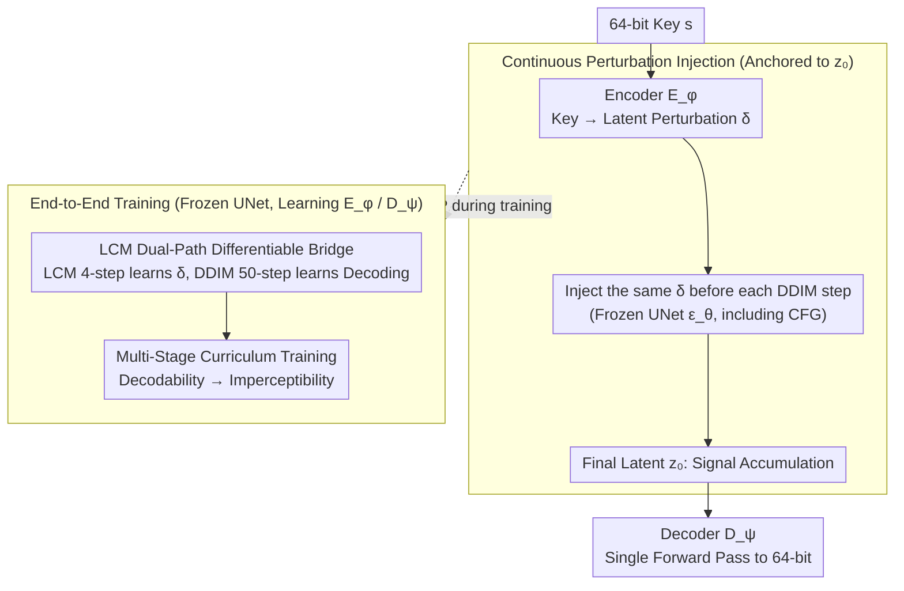

# Transferable Multi-Bit Watermarking Across Frozen Diffusion Models via Latent Consistency Bridges

**Conference**: ICML2026  
**arXiv**: [2603.20304](https://arxiv.org/abs/2603.20304)  
**Code**: To be confirmed  
**Area**: AI Safety / Diffusion Model Watermarking  
**Keywords**: Multi-bit Watermarking, Frozen Diffusion Models, Latent Space Perturbation, LCM Differentiable Bridge, Cross-Model Transferability

## TL;DR
DiffMark continuously injects a learned latent space perturbation $\delta$ into each denoising step of a frozen diffusion model, allowing the watermark signal to accumulate in the final latent variable $z_0$. By utilizing a Latent Consistency Model (LCM) as a differentiable training bridge to bypass the backpropagation of 50 DDIM steps, the scheme achieves a 64-bit decoding in 16.4 ms via a single forward pass, while remaining plug-and-play across models without retraining.

## Background & Motivation
**Background**: Current mainstream diffusion model watermarking follows two paths: (1) sampling-based (Tree-Ring / RingID / Shallow Diffuse), which embeds watermarks into the initial noise $z_T$ or intermediate latents and relies on DDIM inversion for 50 steps to "retrieve" the noise for detection; (2) fine-tuning-based (Stable Signature / AquaLoRA), which binds watermarks to model weights by fine-tuning the UNet or using LoRA, followed by a lightweight decoder to extract multiple bits in one pass.

**Limitations of Prior Work**: Sampling-based inversion detection requires running the UNet for $N=50$ steps per image, which is unaffordable for platform-level throughput; most support only 0-bit detection (presence/absence) and cannot perform user attribution. Furthermore, changing keys for each image requires regenerating noise patterns. Fine-tuning-based methods support multi-bit single-pass decoding, but the watermark is strictly tied to a specific checkpoint. Each new SD variant requires retraining, making unified governance impossible in the open-source diffusion ecosystem.

**Key Challenge**: Regulation requires a "cross-model, attributable, and platform-verifiable" watermark infrastructure. Existing methods sacrifice either "latency/bitrate" or "model transferability," failing to satisfy both simultaneously. The root cause lies in anchoring watermarks to $z_T$ (forcing inversion) or UNet weights (forcing retraining).

**Goal**: (i) Extract $L$ bits in a single forward pass at the detector without $N$-step inversion; (ii) Ensure the watermark is transparent to the frozen UNet, allowing a single encoder-decoder pair to be used across the SD family; (iii) Support arbitrary keys for each image without retraining.

**Key Insight**: The authors observe that since cumulative perturbations are amplified along the denoising trajectory and ultimately reside in $z_0$, there is no need to hide the watermark in $z_T$. Instead, it can be continuously injected as a "constant additive perturbation $\delta$" before each denoising step. This allows the decoder to inspect only $z_0$, eliminating the need for inversion. Since $\delta$ depends only on a lightweight encoder $E_\phi(s)$, it is decoupled from UNet weights, naturally supporting cross-model use and per-image keys.

**Core Idea**: Redefine the watermark from a "pattern in noise" or "fingerprint in weights" to a "constant latent perturbation $\delta$ added at every denoising step." An LCM is used to compress the 50-step DDIM process into a 4-step differentiable path to backpropagate gradients for $\delta$, enabling the end-to-end learning of an encoder-decoder pair while keeping the UNet completely frozen.

## Method

### Overall Architecture
DiffMark addresses the question of "where to hide the watermark." Instead of $z_T$ (requiring 50-step inversion) or UNet weights (requiring retraining), it uses a constant perturbation $\delta$ added to the latent variable at each step, allowing the signal to accumulate into the final $z_0$. At inference, given a 64-bit key $s$, a lightweight encoder maps it to $\delta = E_\phi(s)$. Standard DDIM proceeds as usual, with $\delta$ added at each step. Finally, the lightweight decoder extracts the key from $z_0$ in a single forward pass. During training, since 50-step DDIM is non-differentiable, an LCM is introduced as a short, differentiable "gradient bridge" parallel to the real DDIM path to learn the encoder-decoder pair.

### Key Designs

**1. Continuous Perturbation Injection: Anchoring the Watermark to $z_0$ instead of $z_T$**

The pain point of sampling-based methods is writing the watermark into $z_T$, which forces 50-step DDIM inversion for detection, a bottleneck for platform throughput. The authors invert this: cumulative perturbations amplify along the trajectory and settle in $z_0$. Thus, the watermark is encoded as an additive latent perturbation $\delta = E_\phi(s) \in \mathbb{R}^{4\times h\times w}$. At each DDIM step, the current latent is replaced by $\tilde z_{t_k} = z_{t_k} + \delta$ before being fed into the frozen $\epsilon_\theta$ (including CFG), followed by the standard update $z_{t_{k+1}} = \sqrt{\bar\alpha_{t_{k+1}}}\frac{\tilde z_{t_k} - \sqrt{1-\bar\alpha_{t_k}}\hat\epsilon_{t_k}}{\sqrt{\bar\alpha_{t_k}}} + \sqrt{1-\bar\alpha_{t_{k+1}}}\hat\epsilon_{t_k}$. The decoder simply takes $z_0$ from the VAE encoder and performs a single forward pass, reducing inversion costs to zero. To ensure $\tilde z_{t_k}$ stays within the UNet distribution, a magnitude loss $\mathcal{L}_{mag} = (\sigma(\delta) - \sigma_{target})^2$ and KL divergence $\mathcal{L}_{KL}$ are applied to the encoder output, enforcing $\|\delta\| \ll \|z_T\|$. Since $\delta$ depends only on the key and not the image content, per-image keys are supported natively.

**2. LCM Dual-Path Differentiable Bridge: End-to-End Learning on Frozen UNet**

To learn the encoder end-to-end, gradients must pass through the 50-step DDIM chain back to $\delta$, which is infeasible due to memory and stability constraints. The 4-step distillation of LCM provides a "short differentiable approximation": the LCM path pushes $\delta$ to $z_0^{lcm}$ in $K=4$ steps. The backward chain $\mathcal{L}_{lcm} \to D_\psi \to z_0^{lcm} \to 4\,\text{LCM steps} \to \delta \to E_\phi$ is fully differentiable, passing gradients through the UNet without updating it. Since LCM fidelity is lower than DDIM, relying only on LCM would degrade decoder performance on the real inference distribution. Thus, a parallel DDIM path is used: $N=50$ steps of standard sampling yield a high-fidelity $z_0^{ddim}$. A stop-gradient is applied to $\delta$, and the per-step injection is scaled to $\delta/N$ to match the cumulative volume of the LCM path. The loss $\mathcal{L}_{ddim} = \mathcal{L}_{CE}(D_\psi(z_0^{ddim}), s)$ only updates the decoder. In summary, the LCM path teaches the encoder "where to place $\delta$," while the DDIM path teaches the decoder "how to read it from real $z_0$." Since the UNet is only used for gradients, the trained $(E_\phi, D_\psi)$ can be used with any SD-family model at zero cost.

**3. Multi-Stage Curriculum Training: Decodability First, Imperceptibility Second**

Reconstruction requires $\|\delta\|$ to be large enough, while imperceptibility requires $\|\delta\| \to 0$. Optimizing these jointly causes the imperceptibility term to suppress $\delta$ to zero before the watermark signal is established. The solution is an activation gate $g_i(t) = \mathbb{1}[t \geq \tau_i]$ for each loss. The reconstruction group $\mathcal{G}_{rec} = \{\mathcal{L}_{lcm}, \mathcal{L}_{ddim}\}$ and imperceptibility group $\mathcal{G}_{imp} = \{\mathcal{L}_{lafid}, \mathcal{L}_{prvl}, \mathcal{L}_{freq}, \mathcal{L}_{neg}\}$ are scheduled such that $\max_{i \in \mathcal{G}_{rec}} \tau_i \leq \min_{j \in \mathcal{G}_{imp}} \tau_j$. The total loss is $\mathcal{L}(t) = \sum_i g_i(t) \cdot w_i(t) \cdot \mathcal{L}_i$. Here, $\mathcal{L}_{lafid}$ constrains $z_0$ offset in latent space, $\mathcal{L}_{prvl}$ scatters watermark energy, $\mathcal{L}_{freq}$ pushes perturbations to high frequencies, and $\mathcal{L}_{neg}$ applies negative entropy to non-watermarked images to keep decoder output uniform, suppressing false positives. This "decoding then concealment" sequence is the only stable path for training such adversarial objectives.

### Loss & Training
During pre-training, the encoder-decoder pair is trained independently of the DM for 50,000 steps using $\mathcal{L}_{CE}$ (per-bit cross-entropy) and an orthogonality loss $\mathcal{L}_{orth} = \frac{1}{B(B-1)}\sum_{i \neq j} \frac{\langle\delta_i, \delta_j\rangle_F}{\|\delta_i\|_F \|\delta_j\|_F}$ (batch 64, AdamW, encoder lr $3 \times 10^{-4}$, decoder lr $1 \times 10^{-4}$). This ensures different keys map to orthogonal perturbations robust to $\delta + \epsilon$ noise. This is followed by 10,000 steps of joint fine-tuning with SD v1.5 + LCM_Dreamshaper_v7 ($K=4$) (batch 16, encoder lr $5 \times 10^{-5}$, decoder lr $3 \times 10^{-4}$, linear warmup for 500 steps followed by linear decay to $10^{-6}$), with losses in $\mathcal{G}_{rec}$ and $\mathcal{G}_{imp}$ activated via curriculum gating. Inference uses standard 50-step DDIM with zero extra overhead relative to the original model.

## Key Experimental Results

### Main Results
Evaluation against 6 baselines (StegaStamp / Stable Signature / AquaLoRA / Tree-Ring / RingID / Shallow Diffuse) on DiffusionDB across accuracy, consistency, and quality metrics:

| Method | Type | Plug&Play | Bits | Bit Acc | TPR@0.1%FPR | PSNR↑ | FID↓ | CLIP-FID↓ |
|------|------|-----------|------|---------|-------------|-------|------|-----------|
| StegaStamp | Post-proc | ✗ | 100 | 0.9994 | 1.0 | 11.34 | 54.82 | 10.26 |
| Stable Signature | FT | ✗ | 48 | 0.9950 | 0.9900 | 16.23 | 46.81 | 4.61 |
| AquaLoRA | FT | ✗ | 48 | 0.9355 | 0.9910 | 20.59 | 32.32 | 1.98 |
| Tree-Ring | Sampling | ✓ | 0 | — | 1.0 | 11.02 | 47.09 | 4.65 |
| RingID | Sampling | ✓ | 11 | — | 1.0 | 10.74 | 47.18 | 4.77 |
| Shallow Diffuse | Sampling | ✓ | 0 | — | 1.0 | 11.01 | 43.37 | 4.10 |
| **DiffMark** | Sampling | ✓ | **64** | 0.9381 | 1.0 | 11.01 | **38.07** | **2.20** |

**Cross-Model Transferability**: Trained only on SD 1.5 and tested zero-shot on SD-2.1 / DreamShaper 8 / Realistic Vision 5.1 / OpenJourney v4. Bit accuracy remained stable at 93.3–95.5%, proving the encoder-decoder generalizes across the SD family. **Detection Latency**: DiffMark achieves 16.4 ms/img on an L40S GPU, compared to 754.9 ms for Tree-Ring, 753.2 ms for RingID, and 239.8 ms for Shallow Diffuse (a $45\times$ speedup). **User Attribution**: The 64-bit capacity achieves 100% Top-1 accuracy for $10^6$ users and remains $\geq$ 99.97% for $10^8$ users.

### Ablation Study

| Configuration | Key Finding | Description |
|------|---------|------|
| K=2 / 4 / 8 LCM steps | Results reported at K=4; K=2 has faster convergence/lower VRAM with similar accuracy. | K=2 is suggested as the optimal default; increasing K provides no dividend and lengthens gradient paths. |
| L=48 / 64 / 128 / 256 bit | L=128 training collapsed at step 600; $\mathcal{L}_{orth}$ failed to maintain diversity. | L=64 is the sweet spot for quality-capacity; L=256 causes LPIPS to surge to 0.508. |
| Random vs Fixed key (DiffMark) | BER distributions were nearly identical. | Generalizes to the full $2^{64}$ key space without local interpolation. |
| Random vs Fixed key (AquaLoRA) | BER surged from 6.42% to 28.16%. | Highlights overfitting of fine-tuning methods to training keys. |
| Robustness (13 Attack Types) | Mean TPR@0.1%FPR = 0.70. Full 1.00 for Brightness/Contrast/JPEG/Erase and Regen-Diff. | Near zero for Rotation / Blur / Random Crop / Adv-KLVAE8. |

### Key Findings
- The LCM path serves as a "gradient bridge" rather than a "sampler": ablation shows K=2 is sufficient, and more steps only slow down training. This validates that the encoder learns where to place $\delta$ and doesn't require LCM to generate high-quality images.
- Delays to imperceptibility losses via curriculum training are critical; joint activation from the start results in $\mathcal{L}_{imp}$ suppressing $\|\delta\|$ to zero.
- Latent watermarking systematically fails against geometric transforms (rotation/crop/blur) and gray-box adversarial attacks on the VAE. This is a structural limitation of the paradigm, not unique to DiffMark.
- 64-bit capacity allows for 99.97% Top-1 attribution at a scale of $10^8$ users, a critical threshold for "watermarking as governance infrastructure."

## Highlights & Insights
- The conceptual shift of "anchoring the watermark to $z_0$ instead of $z_T$" simultaneously solves latency, key flexibility, and cross-model transferability—points that were previously considered independent trade-offs.
- Using LCM as a "differentiable short path for training + DDIM as a high-fidelity long path for inference" is a versatile template for handling non-differentiable large models requiring end-to-end modular learning. This can be transferred to any scenario requiring learnable adapters on frozen large models.
- The "decoding first, concealment second" sequence in curriculum training reveals a general rule: when training adversarial objectives, a stable attractor for the "hard goal" (decodability) must be established before introducing "soft goals" (imperceptibility).
- Section 5 maps technical results directly to specific regulatory acts (EU AI Act / C2PA / California SB-53). Linking 64-bit decoding, transferability, and per-image keys to "user attribution," "ecosystem governance," and "post-audit" requirements is a rare and valuable policy-to-technology bridging.

## Limitations & Future Work
- **Ours' Limitations**: Complete failure under rotation, blur, random cropping, and gray-box adversarial attacks targeting the VAE. Since these attacks disrupt the latent representation $z_0 = \mathcal{E}(x) \cdot f_s$ at the VAE encoder stage, the decoder receives invalid input.
- **Observed Limitations**: (i) Cross-model testing was limited to the SD 1.x/2.x family; transferability to SDXL / SD3 / Flux / DiT remains unverified. (ii) Whether the "per-step constant $\delta$" assumption holds for very short trajectories (e.g., SDXL Turbo 1-4 steps) is unknown. (iii) The 64-bit key space is fixed after training; supporting variable lengths would require retraining.
- **Future Directions**: (i) Incorporating a joint spatial-frequency invariant transform (e.g., log-polar) before injecting $\delta$ to mitigate geometric attacks. (ii) Using time-dependent perturbations $\delta_t = E_\phi(s, t)$ to inject stronger signals in later steps for short-trajectory models. (iii) Training a VAE-robust adapter to defend against gray-box attacks.

## Related Work & Insights
- **vs Tree-Ring / RingID / Shallow Diffuse (sampling-based)**: These hide watermarks in $z_T$, necessitating 50-step DDIM inversion. DiffMark uses per-step injection, allowing detection via a single VAE encode and decoder forward. DiffMark trades a slight bit accuracy decrease (0.938 vs TPR=1.0) for a $45\times$ reduction in latency and multi-bit capability.
- **vs Stable Signature / AquaLoRA (fine-tuning-based)**: These modify UNet weights or use LoRA, tying the watermark to a specific checkpoint. DiffMark's single encoder-decoder pair generalizes across 4 unseen SD models with 93.3–95.5% accuracy. AquaLoRA's BER surge under random keys exposes an overfitting issue that DiffMark avoids by design.
- **vs StegaStamp (post-generation pixel watermark)**: StegaStamp performs post-processing on generated content, which severely compromises quality (PSNR 11.34, CLIP-FID 10.26). DiffMark embeds during generation, yielding superior quality without needing independent modules outside the pipeline.
- **Insights**: The use of LCM as a "differentiable gradient bridge" is not limited to watermarking. Any task requiring an end-to-end conditional module on a frozen diffusion model (e.g., condition encoders for controllable generation, reward heads for alignment) can adopt this dual-path template to avoid memory explosion during backpropagation.

## Rating
- Novelty: ⭐⭐⭐⭐ The combination of "anchoring to $z_0$" and "LCM training bridge" is elegant and redefines the problem boundaries.
- Experimental Thoroughness: ⭐⭐⭐⭐ 3 datasets × 6 baselines × 13 attacks × 4 cross-model tests, plus detailed ablations on LCM steps and bits.
- Writing Quality: ⭐⭐⭐⭐⭐ Sec. 5's mapping of tech to policy is exceptionally clear.
- Value: ⭐⭐⭐⭐⭐ $45\times$ speedup + transferability + per-image keys makes diffusion watermarking deployable as platform-level infrastructure for the first time.

<!-- RELATED:START -->

## Related Papers

- [\[ICML 2026\] Discrete Diffusion Samplers and Bridges: Off-Policy Algorithms and Applications in Latent Spaces](discrete_diffusion_samplers_and_bridges_off-policy_algorithms_and_applications_i.md)
- [\[ICLR 2026\] Guidance Watermarking for Diffusion Models](../../ICLR2026/image_generation/guidance_watermarking_for_diffusion_models.md)
- [\[CVPR 2026\] Scaling Multi-Identity Consistency for Image Customization via Multi-to-Multi Matching Paradigm](../../CVPR2026/image_generation/scaling_multi-identity_consistency_for_image_customization_via_multi-to-multi_ma.md)
- [\[ICLR 2026\] DiffSDA: Unsupervised Diffusion Sequential Disentanglement Across Modalities](../../ICLR2026/image_generation/diffsda_unsupervised_diffusion_sequential_disentanglement_across_modalities.md)
- [\[ICML 2026\] Latent Diffusion Pretraining for Crystal Property Prediction](latent_diffusion_pretraining_for_crystal_property_prediction.md)

<!-- RELATED:END -->
