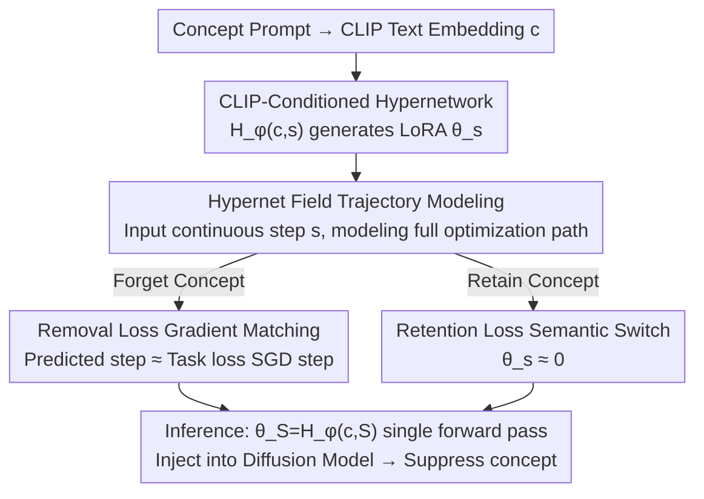

# UnHype: CLIP-Guided Hypernetworks for Dynamic LoRA Unlearning

**Conference**: ICML 2026  
**arXiv**: [2602.03410](https://arxiv.org/abs/2602.03410)  
**Code**: Yes (Note: See the code on GitHub, specific address TBD)  
**Area**: Image Generation / Diffusion Model Concept Unlearning  
**Keywords**: Machine Unlearning, Diffusion Models, Hypernetworks, LoRA, CLIP Conditioning

## TL;DR
UnHype utilizes a hypernetwork with CLIP text embeddings as input to dynamically generate LoRA weights at inference time—generating LoRAs that suppress a concept when encountered while generating near-zero LoRAs for normal concepts. This transforms static unlearning (training one LoRA per concept) into amortized unlearning (on-the-fly adapter generation), supporting both Stable Diffusion and Flux.

## Background & Motivation
**Background**: Large-scale text-to-image diffusion models can be misused to generate harmful content. Consequently, "machine unlearning"—selectively erasing a specific concept without damaging overall generation capabilities—has become a research focal point. LoRA (Low-Rank Adaptation) is widely used for concept unlearning due to its parameter efficiency; by injecting low-rank matrices $\Delta W=BA$ into attention or feed-forward layers, specific model behaviors can be modified by training only a small subset of parameters.

**Limitations of Prior Work**: Existing LoRA unlearning methods suffer from three major issues. First, **static global modification**: Once a LoRA is merged into the model, it affects every forward pass regardless of the input prompt, often leading to "collateral damage" for semantically adjacent concepts (e.g., erasing "cat" may degrade "feline"). Second, **lack of contextual flexibility**: Fixed weights adapt poorly to compositional and context-dependent prompts. Third, **non-scalability for multiple concepts**: While training one LoRA per concept is relatively cheap, erasing 100 celebrities requires 100 independent training runs, each with its own tuning and checkpoint storage, creating a practical bottleneck.

**Key Challenge**: The fundamental issue is that "unlearning" is treated as a one-time, **static fine-tuning** specific to a single concept. Static weights cannot simultaneously erase a target precisely and remain transparent to other concepts, nor can they be reused across multiple concepts. To break this contradiction, unlearning behavior must become a dynamic process that is **conditioned on input and generated on-the-fly**.

**Goal**: (1) Enable LoRA weights to change dynamically based on input, remaining idle for non-target concepts; (2) Generalize to synonyms or related concepts not seen during training; (3) Amortize training across multiple concepts instead of $N$ independent runs.

**Key Insight**: The authors introduce a **hypernetwork**—a network that generates weights for another network—conditioned on the CLIP embedding of a concept to "spit out" corresponding LoRA weights. However, naive training faces an obstacle: learning the mapping $H_\phi(c)\to\theta_c$ requires (concept, target LoRA) paired data, and constructing such data requires pre-training individual LoRAs—exactly the bottleneck this work aims to eliminate.

**Core Idea**: Drawing inspiration from Hypernet Fields, instead of directly learning "concept → final weight," the hypernetwork models the **entire optimization trajectory** $H_\phi(c,s)$ (where $s$ is a continuous optimization step). The local gradient of the hypernetwork is supervised by the gradient of the task loss, thereby **completely eliminating the need for pre-computed final weights** $\theta_S$.

## Method

### Overall Architecture
The core of UnHype is a hypernetwork $H_\phi$ implemented as an MLP. It takes two inputs: the 768-dimensional CLIP text embedding $c$ and a continuous unlearning step $s \in [0,S]$, outputting a complete set of LoRA weights $\theta_s=H_\phi(c,s)$. In Stable Diffusion, LoRA is added to cross-attention layers; in Flux, it is applied to value projections and output transformations.

During training, two losses teach $H_\phi$ a "semantic switch" behavior: for concepts to be forgotten, it generates LoRA that pushes the denoising prediction away from that concept (**removal loss**, achieved via gradient matching); for concepts to be retained, it generates weights near zero (**retention loss**, preventing catastrophic forgetting). At inference, the final weights $\theta_S=H_\phi(c,S)$ are generated in a single forward pass: if $c$ is safe, $\theta_S \approx 0$ and the model generates normally; if $c$ is a forbidden concept, $\theta_S$ suppresses it to produce alternative images (e.g., "cat" → a forest). This "CLIP-conditioned + trajectory modeling" design allows a single training session to be amortized across multiple concepts and generalize to unseen synonyms.

### Key Designs

**1. Hypernet Field Trajectory Modeling: Bypassing "Paired Data" via Continuous Steps**

A naive approach would learn $H_\phi(c)\to\theta_c$, but obtaining (concept, target LoRA) pairs creates a bottleneck. Instead, the authors use Hypernet Fields: adding a continuous time-step input $s$ to the hypernetwork to model the **entire optimization trajectory** toward $\theta_S$. The output $\theta_s=H_\phi(c,s)$ represents the parameter state at step $s$. Crucially, the hypernetwork can be trained by aligning its **local gradient** $\nabla_s H_\phi$ with the **task loss gradient** $\nabla_{\theta} \mathcal{L}$, without needing pre-calculated endpoint weights $\theta_S$. Intuitively, the hypernetwork learns "how to navigate the gradient field of the unlearning task" rather than "what the endpoint looks like."

**2. Removal Loss Gradient Matching: Aligning Hypernetwork Steps with SGD Steps**

This implements the trajectory idea. Each training step samples a "forget" concept $c$ and a random step $s\sim\mathcal{U}(0,S)$. The hypernetwork's numerical gradient ("predicted step") $\Delta\theta_{pred}=H_\phi(c,s+1)-H_\phi(c,s)$ is supervised to match the analytical gradient of the task loss ("target step") $\Delta\theta_{task}=-\eta\nabla_{\theta_s}\mathcal{L}_{task}$ via MSE:

$$\mathcal{L}_{remove}=\big\|(H_\phi(c,s+1)-H_\phi(c,s))+\eta\nabla_{\theta_s}\mathcal{L}_{task}\big\|_2^2$$

The task loss $\mathcal{L}_{task}$ follows the "guided regression" logic from UnGuide: constructing a target prediction $\epsilon_{target}$ that is pushed away from the forget concept $c$ toward an anchor concept $c_m$ (e.g., "cat" → "forest"), such that $\mathcal{L}_{task}=\mathbb{E}\big[\|\epsilon_{\theta_s+\theta^*}(z_t,t,c)-\epsilon_{target}\|_2^2\big]$. Gradient matching turns unlearning into a process where the hypernetwork's trajectory slope matches the unlearning gradient field everywhere.

**3. Retention Loss Semantic Switch: Keeping Weights Zero for Non-target Concepts**

Removal loss alone would degrade other concepts. Retention loss enforces that when $H_\phi$ is conditioned on a "retain" concept $c_{retain}$, it outputs zero weights for all steps $s$. This is implemented by penalizing deviations from the initial zero state $\theta_0=H_\phi(c_{retain},0)$:

$$\mathcal{L}_{retain}=\mathbb{E}_{c_{retain},s}\big[\|H_\phi(c_{retain},s)-H_\phi(c_{retain},0)\|_2^2\big]$$

This simple loss trains the hypernetwork to act as a **semantic switch**: feeding a safe concept yields $\theta_s\approx 0$ (no model change), while a forbidden concept activates the suppression. The total loss is $\mathcal{L}_{final}=\lambda_{remove}\mathcal{L}_{remove}+\lambda_{retain}\mathcal{L}_{retain}$.

**4. CLIP Conditioning + Multi-concept Amortization: Generalizing to Synonyms**

Using CLIP text embeddings as conditioning instead of discrete concept IDs provides two benefits. First, **Generalization**: CLIP maps semantically similar words to nearby vectors, allowing the hypernetwork to generate reasonable suppressive LoRAs for unseen synonyms. Second, **Amortization**: Traditional methods require 100 training runs for 100 celebrities; UnHype covers multiple concepts in a single training session. While training cost for a single concept is comparable to standard LoRA, the efficiency **scales specifically in multi-concept scenarios**. At inference, SD injects $\theta_S$ only into the conditional CFG branch, while Flux applies it to the entire sampling process.

### Loss & Training
Total objective: $\mathcal{L}_{final}=\lambda_{remove}\mathcal{L}_{remove}+\lambda_{retain}\mathcal{L}_{retain}$. The hypernetwork is trained for 300 steps. SD 1.4 uses 50 denoising steps and a guidance scale of 7.5. The unlearning gradient field is implicitly approximated through the gradient matching of the removal loss.

## Key Experimental Results

### Main Results
On Stable Diffusion 1.4 and Flux.1 [dev], the method was tested on object erasure, celebrity erasure, and nudity erasure. Object erasure (CIFAR-10 classes) used metrics: erasure efficacy $\text{Acc}_e\downarrow$, specificity $\text{Acc}_s\uparrow$, and generalization $\text{Acc}_g\downarrow$ (residues on synonyms), combined via harmonic mean $\text{H}_o\uparrow$.

| Method (Avg. 3 classes) | $\text{Acc}_e\downarrow$ | $\text{Acc}_s\uparrow$ | $\text{Acc}_g\downarrow$ | $\text{H}_o\uparrow$ |
|---|---|---|---|---|
| UCE | 19.05 | 98.52 | 29.08 | 81.24 |
| ESD-u | 12.98 | 88.66 | 14.17 | 86.96 |
| MACE | 9.14 | 96.73 | 12.01 | 91.68 |
| **UnHype** | **6.61** | **96.20** | **7.67** | **93.85** |
| SD v1.4 (Orig) | 98.14 | 98.69 | 84.90 | — |

UnHype leads in erasure efficacy, synonym generalization, and the overall score $\text{H}_o$. Fig. 4 shows baselines fail to suppress semantically related words, while UnHype maps synonyms to neutral concepts.

### Nudity Erasure (I2P Benchmark, NudeNet threshold 0.6, lower is better)

| Method | NudeNet Total ↓ | FID ↓ | CLIP ↑ |
|---|---|---|---|
| MACE | 111 | 13.42 | 29.41 |
| SAeUron | 18 | 14.37 | 30.89 |
| STEREO | 9 | 15.70 | 30.23 |
| **UnHype** | **8** | **13.45** | **31.43** |
| SD v1.4 (Orig) | 743 | 14.10 | 31.34 |

### Key Findings
- **Clean erasure without quality loss**: On SD, UnHype reduced nudity detection from 743 to 8 (98.9% reduction), while maintaining FID and CLIP scores superior to the original SD. Most methods sacrifice quality; UnHype slightly improves it.
- **Efficient training**: Achieving these results required ~3 hours of training, compared to 24+ hours for SAeUron. Nudity detection is 6x lower than EraseAnything.
- **Synonym generalization via CLIP conditioning**: $\text{Acc}_g$ (residue on synonyms) dropped from 84.90 in the baseline to 7.67, significantly better than MACE (12.01).
- **Architecural Generality**: The same framework is effective on both SD (CFG injection) and Flux (direct sampling intervention).

## Highlights & Insights
- **Paradigm shift from "Static Fine-tuning" to "Amortized Generation"**: Instead of storing one LoRA per concept, training a hypernetwork to generate adapters on-the-fly provides scalability for multi-concept scenarios.
- **Gradient matching in Hypernet Fields**: Modeling the optimization trajectory $\nabla_s H_\phi$ vs $\nabla_\theta \mathcal{L}$ allows training without "gold standard" weights, resolving the catch-22 of requiring pre-trained LoRAs as data.
- **Semantic Switch via Minimalist Retention Loss**: Enforcing zero weights for safe concepts effectively ensures transparency without needing external segmentation tools (like Grounded-SAM in MACE).
- **Free generalization from CLIP embeddings**: The continuous semantic space naturally grants synonyms similar suppressive behaviors.

## Limitations & Future Work
- **Efficiency gains limited to multi-concept**: The authors acknowledge that training costs for a few concepts are comparable to standard LoRA fine-tuning; the benefit manifests in large-scale concept sets.
- **Dependence on target concept $c_m$**: Pushing toward a hand-selected neutral concept (e.g., "forest") affects image quality and erasure completeness; sensitivity to $c_m$ and $\gamma$ remains under-explored.
- **Adversarial Robustness**: Evaluations focused on standard prompts and I2P. Robustness against adversarial prompts or "jailbreaking" embeddings that might trick the hypernetwork remains to be seen.
- **Future directions**: Making mapping concepts learnable/conditioned, adding regularization to hypernetwork outputs for adversarial robustness, or extending semantic switches to fine-grained strength control.

## Related Work & Insights
- **vs UnGuide (Polowczyk et al. 2025)**: UnGuide learns fixed LoRAs with dynamic guidance; UnHype adopts its task loss but replaces fixed LoRAs with hypernetwork generation for amortization and generalization.
- **vs MACE (Lu et al. 2024)**: MACE uses two LoRAs and Grounded-SAM for spatial erasure; UnHype is cleaner, using a semantic switch without external positioning tools.
- **vs ESD / FMN / UCE**: These apply static global modifications (via CFG or attention edits) and often damage neighboring concepts; UnHype's dynamic weights improve specificity.
- **vs Hypernet Fields (Hedlin et al. 2025)**: This work ports the "trajectory modeling + gradient matching" principle to diffusion unlearning as a concrete application in safety and control.

## Rating
- Novelty: ⭐⭐⭐⭐⭐ First use of hypernetworks + gradient matching for amortized diffusion unlearning.
- Experimental Thoroughness: ⭐⭐⭐⭐ Covers various tasks and multiple architectures; adversarial logic needs more depth.
- Writing Quality: ⭐⭐⭐⭐ Clear logic chain: Motivation-Obstacle-Solution.
- Value: ⭐⭐⭐⭐⭐ Extremely practical for large-scale concept erasure deployments.

<!-- RELATED:START -->

## Related Papers

- [\[CVPR 2026\] ChimeraLoRA: Multi-Head LoRA-Guided Synthetic Datasets](../../CVPR2026/image_generation/chimeralora_multi-head_lora-guided_synthetic_datasets.md)
- [\[ICML 2026\] DGS-Net: Distillation-Guided Gradient Surgery for CLIP Fine-Tuning in AI-Generated Image Detection](dgs-net_distillation-guided_gradient_surgery_for_clip_fine-tuning_in_ai-generate.md)
- [\[CVPR 2026\] BiMotion: B-spline Motion for Text-guided Dynamic 3D Character Generation](../../CVPR2026/image_generation/bimotion_b-spline_motion_for_text-guided_dynamic_3d_character_generation.md)
- [\[ICML 2026\] A Unified Framework for Diffusion Model Unlearning with f-Divergence](a_unified_framework_for_diffusion_model_unlearning_with_f-divergence.md)
- [\[ICLR 2026\] MOLM: Mixture of LoRA Markers](../../ICLR2026/image_generation/molm_mixture_of_lora_markers.md)

<!-- RELATED:END -->
