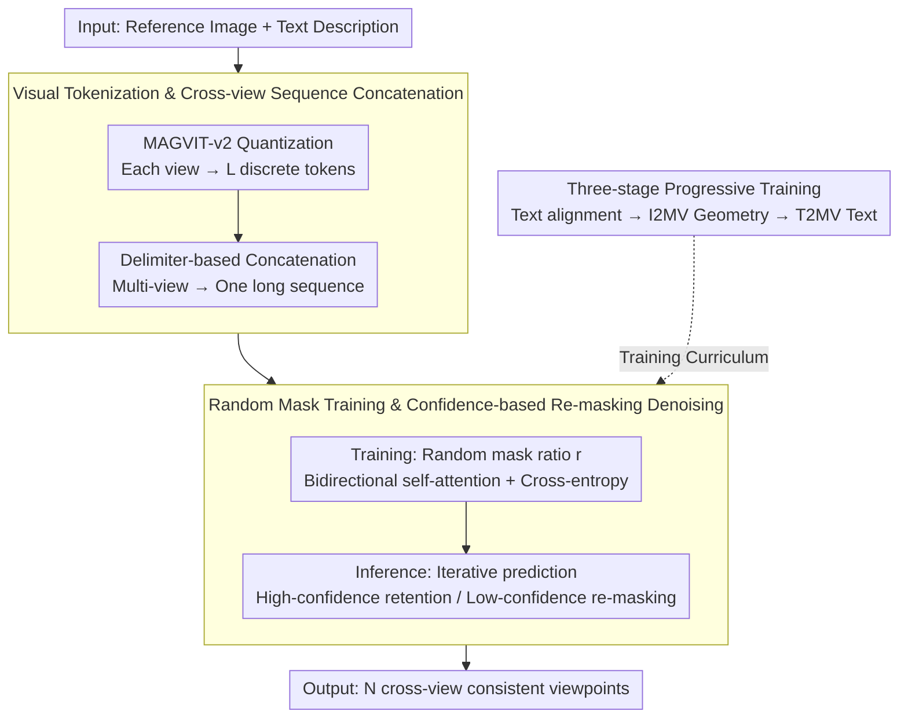

# ViewMask-1-to-3: Multi-View Consistent Image Generation via Multimodal Discrete Diffusion Models

**Conference**: ICML 2026  
**arXiv**: [2512.14099](https://arxiv.org/abs/2512.14099)  
**Code**: TBC  
**Area**: Image Generation / Diffusion Models  
**Keywords**: Discrete Diffusion, Multi-view Generation, Visual Tokenization, Mask Prediction

## TL;DR
By utilizing discrete diffusion models and visual tokenization, multi-view generation is reformulated as a discrete sequence prediction task. A simple random masking strategy combined with self-attention naturally achieves cross-view consistency, significantly outperforming continuous diffusion methods.

## Background & Motivation

**Background**: The field of multi-view generation has long been dominated by continuous diffusion methods—geometry-aware approaches based on 3D representations (NeRF, 3D Gaussians), camera-conditioned diffusion models, and image-editing style multi-view generators. These methods rely on explicit 3D priors or complex cross-view synchronization mechanisms.

**Limitations of Prior Work**: Continuous diffusion methods require explicit camera parameters or fine-grained geometric constraints to ensure view consistency, and independent generation per view is prone to inconsistencies in details and textures. Text-to-multi-view (T2MV) requires using a T2I model to generate a reference image before multi-view expansion, resulting in a lengthy workflow.

**Key Challenge**: There is a trade-off between geometric consistency and generation flexibility—strengthening 3D constraints improves consistency but limits diversity; pure 2D methods are flexible but struggle to naturally encode cross-view relationships.

**Goal**: To explore the potential of discrete diffusion models in multi-view generation and establish a unified text-visual framework.

**Key Insight**: Discrete diffusion (masked token prediction) has proven effective in multimodal understanding and generation (e.g., LLaDA). Advantages include faster inference (parallel decoding), natural fusion of text and visual tokens, and alignment with LLMs.

**Core Idea**: Multi-view generation is reformulated as a discrete sequence modeling problem. Each viewpoint is represented as a sequence of visual tokens generated by MAGVIT-v2. Through iterative token prediction via masked diffusion, a simple random masking strategy and bidirectional self-attention naturally induce cross-view consistency.

## Method

### Overall Architecture

ViewMask addresses the long-standing problem in multi-view generation where geometric consistency and generation flexibility are difficult to balance: continuous diffusion either relies on explicit 3D priors and camera parameters to lock consistency or generates viewpoints independently leading to detail drift. This work moves the entire task to the discrete domain—first quantizing each view into a string of discrete visual tokens using MAGVIT-v2, then concatenating multiple viewpoints into a long sequence with delimiters. Thus, "generating multi-view" becomes "token prediction on a masked sequence." Consistency is no longer enforced via hard geometric constraints but naturally emerges through bidirectional self-attention, allowing tokens from different viewpoints to reference each other. The model is trained progressively across three stages (pre-training alignment, image-to-multi-view, and text-to-multi-view). During inference, it starts from a fully masked target sequence and gradually restores it through iterative prediction and re-masking.

### Key Designs

**1. Visual Tokenization & Cross-view Sequence Concatenation: Compressing Multiple Views into a Unified Sequence**

The pain point lies in the difficulty of information flow when multi-view relationships are handled per-view via continuous features. This work uses MAGVIT-v2 to encode each image $I_i \in \mathbb{R}^{H \times W \times 3}$ into a discrete token sequence of length $L$, with a vocabulary size of $|\mathcal{V}| = 2^{18}$. Special tokens ([SOI], [EOI]) are used to concatenate multiple viewpoints—in the I2MV task, the reference view and three target views are encoded together. This ensures I2MV and T2MV share the same sequence format, minimizing structural differences. More importantly, bidirectional self-attention allows information to flow between tokens of all views directly, encoding cross-view relationships into a single attention field rather than relying on external synchronization.

**2. Random Mask Training & Confidence-based Re-masking Denoising: Emergent Consistency via Attention**

This is the core mechanism for inducing cross-view consistency. During training, the mask ratio is sampled from $r \sim \text{Uniform}(0,1)$, and part of the target tokens are randomly replaced with [MASK]. Supervision occurs only on masked positions via cross-entropy loss: $\mathcal{L}_{CE} = -\sum_{i=1}^{3}\sum_{j \in \mathcal{M}_i}\log P(v_j^{(i)}|s_{\setminus\mathcal{M}})$. To predict missing tokens, the model must reference unmasked tokens from other views, forcing bidirectional self-attention to utilize cross-view cues. Inference uses confidence-based iterative denoising: each step retains high-confidence predictions and re-masks low-confidence tokens, with a scheduler (cosine, linear, or quadratic) determining the mask ratio for the next step. Cosine scheduling proved most stable.

**3. Three-stage Progressive Training: From Alignment to Geometry then Text Conditioning**

Directly learning multi-view consistency in one stage lacks foundational token understanding. This work uses a three-stage curriculum. Stage 1 performs multimodal pre-training on 1.2M image-text pairs to establish text-visual alignment. Stage 2 fine-tunes I2MV on 180K 3D objects (Objaverse + HSSD) using 8-frame orbital sequences to ingest explicit geometric constraints. Stage 3 trains T2MV on Objaverse enhanced with Cap3D descriptions, introducing text conditioning to extend the application range to text-only inputs. All stages share the same sequence and token space.

## Key Experimental Results

### Main Results

| Method | Architecture | GSO-PSNR↑ | GSO-SSIM↑ | 3D-FUTURE-PSNR↑ | 3D-FUTURE-SSIM↑ | Avg. Rank |
|------|------|-----------|-----------|-----------------|-----------------|----------|
| Zero-1-to-3 | 2D Continuous Diffusion | 18.82 | 0.8294 | 17.05 | 0.8163 | 5.2 |
| Zero-1-to-3 XL | 2D Continuous Diffusion | 19.68 | 0.8381 | 18.47 | 0.8337 | 3.0 |
| ViVid-1-to-3 | 2D Continuous Diffusion | 19.80 | 0.8566 | 18.32 | 0.8437 | 3.3 |
| **ViewMask-1-to-3** | **2D Discrete Diffusion** | **20.61** | **0.8561** | **19.99** | **0.8650** | **1.3** |

### 3D Reconstruction Consistency

| Method | GSO-CD↓ | GSO-IoU↑ | 3D-FUTURE-CD↓ | 3D-FUTURE-IoU↑ |
|------|---------|---------|---------------|----------------|
| Zero-1-to-3 | 0.0163 | 0.5665 | 0.0113 | 0.5005 |
| ViVid-1-to-3 | 0.0163 | 0.5841 | 0.0105 | 0.5246 |
| **ViewMask-1-to-3** | **0.0149** | **0.5847** | **0.0106** | **0.5315** |

### Key Findings
- **Mask Scheduling Strategy**: Cosine (PSNR 18.10) outperforms linear/quadratic schedulers, which tend to lock in incorrect tokens early and cause hallucinations.
- **High-view Generalization**: Ours generalizes beyond the training token budget (e.g., to 8 views), validating the robustness of discrete sequence modeling.
- **3D-FUTURE Gain**: IoU on 3D-FUTURE improved by 10.6% compared to the strongest continuous baseline.

## Highlights & Insights
- **Elegance of Paradigm Shift**: Understanding multi-view generation as discrete sequence prediction removes the need for explicit 3D geometric constraints. Simple random masking and bidirectional attention naturally induce consistency.
- **Unified Multimodal Framework**: A shared token embedding space naturally fuses text, reference images, and target views, seamlessly unifying I2MV and T2MV tasks.
- **Breakthrough over Continuous Diffusion**: An average rank of 1.3 is significantly superior to Prev. SOTA (Zero-1-to-3 XL at 3.0).
- **Balancing Efficiency and Quality**: Masked diffusion supports parallel prediction, with 20 iterations being sufficient to reach SOTA quality.

## Limitations & Future Work
- Fixed-elevation training data may limit generalization to extreme viewing angles.
- Resolution bottleneck—currently validated only at 256×256.
- Limited richness in T2MV text conditions—currently derived only from Cap3D.
- Future work: Multi-resolution tokenization, enhanced data diversity, more refined confidence evaluation, and integration with 3D priors.

## Related Work & Insights
- **vs Zero-1-to-3 / Zero-1-to-3 XL**: 2D continuous diffusion with camera parameter encoding generates views independently; ViewMask uses discrete token serialization to naturally encode multi-view relationships.
- **vs TRELLIS / 3D-aware methods**: Explicit 3D representations are computationally complex; ViewMask achieves superior geometric consistency via simple masking and attention without explicit 3D modeling.
- **vs Discrete Diffusion Baselines (LLaDA-V)**: First systematic application of this paradigm to multi-view generation.

## Rating
- Novelty: ⭐⭐⭐⭐⭐  First systematic exploration of discrete diffusion for multi-view generation.
- Experimental Thoroughness: ⭐⭐⭐⭐⭐  Dual datasets, multi-dimensional metrics, complete ablation, and scalability verification.
- Writing Quality: ⭐⭐⭐⭐⭐  Clear logic with a well-structured three-stage training strategy.
- Value: ⭐⭐⭐⭐⭐  Resets the SOTA for multi-view generation and provides a new perspective for visual generation tasks via discrete modeling.

<!-- RELATED:START -->

## Related Papers

- [\[CVPR 2026\] InstructMix2Mix: Consistent Sparse-View Editing Through Multi-View Model Personalization](../../CVPR2026/image_generation/instructmix2mix_consistent_sparse-view_editing_through_multi-view_model_personal.md)
- [\[ICML 2026\] Divide and Conquer: Reliable Multi-View Evidential Learning for Deepfake Detection](divide_and_conquer_reliable_multi-view_evidential_learning_for_deepfake_detectio.md)
- [\[CVPR 2026\] Correspondence-Attention Alignment for Multi-View Diffusion Models](../../CVPR2026/image_generation/correspondence-attention_alignment_for_multi-view_diffusion_models.md)
- [\[ECCV 2024\] M2D2M: Multi-Motion Generation from Text with Discrete Diffusion Models](../../ECCV2024/image_generation/m2d2m_multi-motion_generation_from_text_with_discrete_diffusion_models.md)
- [\[ECCV 2024\] PanoFree: Tuning-Free Holistic Multi-view Image Generation with Cross-view Self-Guidance](../../ECCV2024/image_generation/panofree_tuning-free_holistic_multi-view_image_generation_with_cross-view_self-g.md)

<!-- RELATED:END -->
