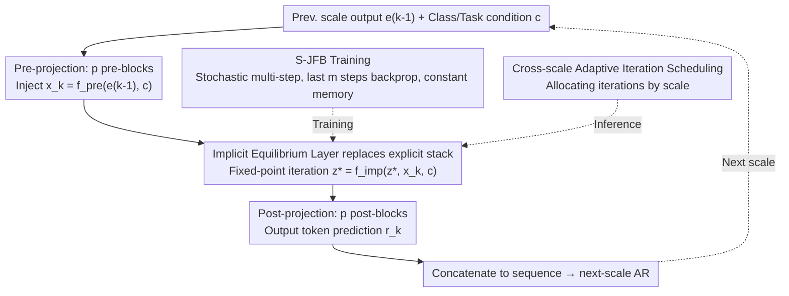

# Visual Implicit Autoregressive Modeling

**Conference**: ICML 2026  
**arXiv**: [2605.01220](https://arxiv.org/abs/2605.01220)  
**Code**: https://github.com/mobiushy/VIAR  
**Area**: Image Generation / Autoregressive Generation / Implicit Deep Models  
**Keywords**: VAR, Deep Equilibrium, Jacobian-Free Backprop, Next-scale prediction, Adaptive Inference

## TL;DR
This paper integrates Deep Equilibrium (DEQ) implicit fixed-point layers into the next-scale autoregressive framework of VAR. By employing Stochastic Jacobian-Free Backpropagation to achieve constant memory training, it compresses the 2 billion parameters of VAR-d30 to 770 million. At inference time, the iteration count for each scale acts as an "adjustable knob"—maintaining ImageNet-256 FID 2.16/sFID 8.07 while reducing peak memory on a single 4090 GPU from 19.24GB to 8.53GB and increasing throughput from 15.16 to 32.08 img/s.

## Background & Motivation

**Background**: The two mainstream paradigms of image generation are diffusion and AR (Autoregressive). VAR (Tian et al. 2024) shifts image AR from next-token to **next-scale prediction**—generating multi-scale token maps from coarse to fine. Each scale is predicted in parallel, reducing the total attention cost from $O(n^6)$ to $O(n^4)$ while preserving spatial locality, making it one of the most effective AR image generation paradigms.

**Limitations of Prior Work**: VAR still utilizes a **deeply stacked explicit Transformer** within each scale (e.g., 30 layers in VAR-d30). This presents three engineering challenges: (1) massive parameter counts, with the d30 model reaching 2 billion parameters; (2) training memory that scales linearly with depth due to activations and optimizer states; (3) fixed computational depth of 30 for every scale, preventing adaptive resource allocation—even though the largest (high-resolution) scale is the true bottleneck for KV cache and latency.

**Key Challenge**: Model depth is both the "source of quality" and the "source of overhead," but they are coupled in the VAR paradigm—improving quality requires increasing depth, which inevitably leads to higher memory and latency. Furthermore, Figure 3 indicates that at the largest scale, the cosine similarity exceeds 0.98 after 5 iterations and approaches 0.999 after 10, implying that **deep stacking at high-resolution scales results in redundant computation**.

**Goal**: To replace the "fixed depth stack" in VAR with a module "equivalent to infinite depth but with adjustable iteration counts," while preserving next-scale parallelism and spatial locality.

**Key Insight**: Deep Equilibrium Models (DEQ) provide exactly this property—replacing deep stacks with an implicit fixed-point layer $z^* = f(z^*, x)$. Combined with Jacobian-Free Backprop (JFB), which backpropagates only through the final steps, the **training memory is decoupled from "equivalent depth."** During inference, the iteration count becomes an adjustable knob, allowing a single trained model to simulate networks of various depths.

**Core Idea**: Replace the "first $p$ blocks + deep stack + last $p$ blocks" structure of VAR with "first $p$ blocks + **one implicit equilibrium layer** + last $p$ blocks." Shallow transformers are retained at the front and back as interfaces, while the fixed-point iteration in the middle assumes the role of an "infinitely deep" network. The iteration count for each scale can be scheduled independently.

## Method

### Overall Architecture
The workflow of VIAR at each scale $k$ is as follows: (1) Input Injection: $p=5$ pre-blocks project the previous scale output $e_{k-1}$ into $x_k = f_{\text{pre}}(e_{k-1}, c)$; (2) Implicit Equilibrium: Initializing from $z^0 = x_k$, the system iteratively computes $z^{t+1} = f_{\text{imp}}(\text{Proj}([z^t, x_k]), c)$ until it reaches the fixed point $z_k^*$; (3) Post-Projection: $\hat{r}_k = f_{\text{post}}(z_k^*, c)$ uses $p=5$ post-blocks to output token predictions. The factorization of the next-scale autoregressive process $p(r_1,\cdots,r_K) = \prod_k p(r_k|r_{<k})$ remains consistent with VAR, and the VAE tokenizer reuses the multi-scale VQVAE from VAR and is frozen.

### Key Designs

**1. Replacing Explicit Stacks with Implicit Equilibrium Layers: Turning "Depth" from an Architecture Hyperparameter into an Inference Knob**

The bottleneck of VAR is the middle stack, where 20+ layers of explicit Transformers are hardcoded into the architecture, with depth determining quality, memory, and latency. VIAR collapses these layers into a single fixed-point operator with shared parameters: defining a contractive mapping $f_{\text{imp}}(z, x, c)$, implemented as a Transformer block with an input injection projection $\text{Proj}([z, x_k])$, and solving for the fixed point $z_k^* = f_{\text{imp}}(z_k^*, x_k, c)$. Crucially, this single trained block can be iterated any number of times during inference—the model's "equivalent depth" at test time is determined by iterations rather than fixed during training. This reduces middle stack parameters by 93.3% (overall 61.6% total parameter reduction) and enables multi-depth deployment with a single model. The resource benefits are directly reflected in memory: Figure 6 shows parameter/gradient memory at approximately 2.87GB (VIAR) vs. 7.49GB (VAR-d30), with optimizer states at 5.74GB vs. 14.98GB.

**2. Stochastic Jacobian-Free Backprop (S-JFB): Stable Gradients under Constant Memory**

If an implicit fixed-point layer were fully unrolled, it would fail to store intermediate activations, whereas pure 1-step JFB introduces excessive bias. S-JFB employs a stochastic multi-step compromise: each training step first samples $n \sim U\{0, N\}$ "gradient-free" iterations to push $z$ closer to the fixed point, then samples $m \sim U\{1, M\}$ "with-gradient" iterations, backpropagating only through the last $m$ steps. The gradient is approximated as $\partial \mathcal{L}/\partial \theta_{\text{imp}} \approx \sum_k (\partial \mathcal{L}_k/\partial \hat{z}_k) \cdot (\partial \hat{z}_k/\partial \theta_{\text{imp}})|_{\text{last } m}$. The paper defaults to $N=10, M=12$. Standard backpropagation is used for the front and back shallow blocks, while only the implicit block uses S-JFB. This approximates the true gradient in expectation while maintaining constant memory. The authors note that $m$ cannot be too large: when the operator's local Lipschitz constant is high, an excessively large $m$ destabilizes training; the sweet spot lies at a moderate $m$.

**3. Cross-scale Adaptive Iteration Scheduling: Distributing Iterations as Computational Budget**

Computational allocation across scales in VAR is uneven—high-resolution scales have the largest KV cache and parallel token counts but actually converge the fastest (Figure 3 shows $>0.98$ cosine similarity in 5 iterations for the largest scale). VIAR treats the iteration count for each scale as a schedulable resource: under a total budget $\mathcal{C} = \sum_k (p_{\text{pre}} + c_k + p_{\text{post}})$, various schedules $\{c_k\}$ can be chosen—Constant $\text{Con.}_{(c,c)}$, Decreasing $\text{Dec.}_{(a,b)}$ (coarse scales $a$ times, fine scales $b$ times), or Adaptive thresholding $\|G(z) - z\|_2 \le \tau_k$. Since high resolutions converge rapidly, their iterations can be aggressively compressed to reallocate compute. A counter-intuitive discovery is that when high resolutions have not yet converged, increasing iterations for coarse scales leads to continuous FID improvements, suggesting that global structure influences detail quality more than detail self-iteration—providing much more flexibility than fixed depths during training.

### Loss & Training
Standard next-scale cross-entropy $\mathcal{L} = -\sum_k \log p_\theta(\hat{r}_k|r_{<k})$. Implicit layers utilize S-JFB, while shallow layers use standard backpropagation. Global batch size 512, lr 8e-5; other optimizers and schedulers follow VAR. The tokenizer is frozen. The backbone utilizes the VQVAE from the 2B parameter VAR-d30 with the custom pre/imp/post structure.

## Key Experimental Results

### Main Results
ImageNet 256×256 class-conditional generation, comparing FID/sFID/IS/Precision/Recall with 50K samples.

| Model | FID ↓ | sFID ↓ | IS ↑ | Pre ↑ | Rec ↑ | #Params | Inference Memory |
|------|-------|--------|------|-------|-------|---------|----------|
| VAR-d30 (cfg=2.0) | 2.05 | 8.86 | 328.5 | 0.82 | 0.59 | 2010M | 19.24GB |
| VAR-d30 (cfg=1.5) | 2.08 | 8.82 | 306.8 | 0.82 | 0.59 | 2010M | 19.24GB |
| VIAR (cfg=2.0) | 2.35 | **7.92** | **330.7** | **0.83** | 0.58 | **770.9M** | 11.16GB |
| VIAR (cfg=1.5) | **2.16** | 8.07 | 300.1 | 0.81 | 0.59 | **770.9M** | 11.16GB |

Ours uses only 38.4% of the parameters (770.9M vs 2010M), with FID dropping only 0.08 (2.16 vs 2.08), while sFID is improved (7.92 vs 8.86), implying even better spatial structure.

### Ablation Study
Comparison of throughput and memory on a single 4090 GPU (varying schedule aggressiveness, s1 is most conservative, s4 is most aggressive):

| Method | FID ↓ | sFID ↓ | Memory (GB) ↓ | Throughput (img/s) ↑ |
|------|-------|--------|------|----------|
| VAR | 2.08 | 8.82 | 19.24 | 15.16 |
| VIAR_s1 | 2.16 | 8.07 | 11.16 | 21.50 |
| VIAR_s2 | 2.22 | 8.08 | 9.60 | 26.92 |
| VIAR_s3 | 2.27 | 8.02 | 9.40 | 28.12 |
| VIAR_s4 | 2.43 | 8.28 | **8.53** | **32.08** |

The most aggressive s4 achieves 2.1× speedup + 2.26× memory reduction, with only a 0.35 FID regression.

Cross-scale scheduling (coarse-to-fine iterations):

| Schedule | FID ↓ | sFID ↓ | IS ↑ |
|------|-------|--------|------|
| Dec.(20, 5) | 2.18 | 8.04 | 299.2 |
| Dec.(20, 10) | 2.16 | 8.07 | 294.8 |
| Dec.(10, 5) | 2.22 | 8.08 | 303.4 |
| Con.(20, 20) | 2.16 | 8.17 | 294.8 |
| Con.(5, 5) | 2.27 | 8.02 | 307.1 |
| Con.(10, 10) | **2.16** | 8.07 | 300.1 |

### Key Findings
- **More iterations at coarse scales > More iterations at fine scales**: When fine scales have not converged, increasing coarse scale iterations improves FID more effectively (Dec.(20,5) vs Con.(5,5)), suggesting global structure is the bottleneck for detailed quality.
- **Constant Training Memory**: Figure 6 shows that VIAR memory remains almost flat as "equivalent depth" increases (plateau ~2.87GB), while VAR memory scales linearly with depth.
- **Enhanced Zero-shot Editing**: Figure 7 shows smoother boundary blending and sharper details in in-painting and class-conditional editing for VIAR; the authors attribute this to the "long-range context aggregation" of implicit layers being more stable than fixed depths.
- **Extremely Fast Fixed-Point Convergence**: Cosine similarity reaches 0.985 in 5 iterations and 0.999 in 10 for the largest scale, providing the physical basis for saving iterations.

## Highlights & Insights
- Successfully implemented DEQ for large-scale generative tasks—whereas previous DEQ works were mostly demos for classification or optical flow, VIAR proves for the first time that "implicit layers can replace deep stacks without degradation" in ImageNet-level AR image generation, which has more engineering than theoretical significance.
- **"Train once, infer many depths"**: A single trained VIAR model can run different iteration counts across different hardware budgets, essentially providing a family of "small-medium-large" models for free; this elasticity is a luxury for edge deployment.
- The concept of treating "depth vs. computation" as a continuous knob can be transferred to diffusion (as seen in Bai & Melas-Kyriazi 2024), middle layers of long-context LLMs, or even neural rendering.
- The conclusion regarding cross-scale compute redistribution (coarse scales are more important) contradicts intuition—instinctively, high-resolution scales are more information-dense and should require more compute, but experiments show they converge faster while coarse scales set the tone for global structure. This finding is valuable for all "hierarchical generation" architectures.

## Limitations & Future Work
- The main FID result of 2.16 is slightly inferior to VAR-d30's 2.05, and the authors did not verify if VIAR maintains these parameter ratios on larger models (d36+); the stability of DEQ at larger scales remains an open question.
- S-JFB is a biased estimator; although stable in experiments, it theoretically requires specific Lipschitz properties for $f_{\text{imp}}$. The paper does not provide convergence guarantees or theoretical analysis of local stability.
- Testing was restricted to ImageNet 256×256; performance on 512×512 or text-to-image (e.g., swapping to LlamaGen / MAR backbones) is unknown. Whether DEQ iteration counts surge with resolution is the true test.
- The adaptive $\tau$ threshold control is only sketched in the paper without systematic ablation; the design of a controller for "when to stop" in production is still a gap.
- Although iterations are adjustable during inference, each iteration still requires a pass through the Transformer block; optimizations such as FlashAttention/Triton to further reduce latency were not discussed.

## Related Work & Insights
- **vs VAR (Tian et al. 2024)**: The direct baseline. It keeps the next-scale paradigm unchanged and replaces the middle stack with an implicit layer, making it a "plug-in" modification; most subsequent VAR works (CAR, speculative VAR) can be seamlessly integrated.
- **vs Fixed-Point Diffusion (Bai & Melas-Kyriazi 2024)**: They insert DEQ layers into the diffusion denoiser for compute redistribution across timesteps. VIAR applies the same logic to spatial scales, making them complementary rather than competitive.
- **vs Pokle et al. 2022 (Diffusion trajectory as DEQ)**: Coarser granularity, solving the entire reverse trajectory at once; VIAR is DEQ within a single scale, allowing for finer-grained adjustments.
- **vs Collaborative Decoding (Chen et al. 2025b) / Cached-token Pruning (Guo et al. 2025)**: These are acceleration schemes for the decoding side of VAR (saving KV cache or parallel decoding), which are orthogonal to VIAR's "structural" acceleration and can theoretically be combined.

## Rating
- Novelty: ⭐⭐⭐⭐ — Grafting DEQ onto VAR is a first, and the engineering of JFB is solid; however, the combination of DEQ and AR is not a brand-new concept in NLP/diffusion.
- Experimental Thoroughness: ⭐⭐⭐⭐ — Main results + 5 types of scheduling + training memory curves + zero-shot editing + convergence analysis are provided; lacks scaling for larger models and 512×512 verification.
- Writing Quality: ⭐⭐⭐⭐ — Figure 1 summarizes resource savings effectively, and the methodology section is clear with formulas; however, the S-JFB algorithm description might have a high barrier for readers unfamiliar with DEQ.
- Value: ⭐⭐⭐⭐⭐ — "Train once, infer many depths" + "61.6% parameter reduction" + "minimal FID drop" provides real industrial value, significant for edge deployment and elastic inference.

<!-- RELATED:START -->

## Related Papers

- [\[AAAI 2026\] HACK: Head-Aware KV Cache Compression for Efficient Visual Autoregressive Modeling](../../AAAI2026/image_generation/head-aware_kv_cache_compression_for_efficient_visual_autoreg.md)
- [\[ICLR 2026\] MVAR: Visual Autoregressive Modeling with Scale and Spatial Markovian Conditioning](../../ICLR2026/image_generation/mvar_visual_autoregressive_modeling_with_scale_and_spatial_markovian_conditionin.md)
- [\[CVPR 2026\] Depth Adaptive Efficient Visual Autoregressive Modeling](../../CVPR2026/image_generation/depthvar_depth_adaptive_var.md)
- [\[ICML 2026\] Compression as Adaptation: Implicit Visual Representation with Diffusion Foundation Models](compression_as_adaptation_implicit_visual_representation_with_diffusion_foundati.md)
- [\[ICLR 2026\] Visual Autoregressive Modeling for Instruction-Guided Image Editing](../../ICLR2026/image_generation/visual_autoregressive_modeling_for_instruction-guided_image_editing.md)

<!-- RELATED:END -->
