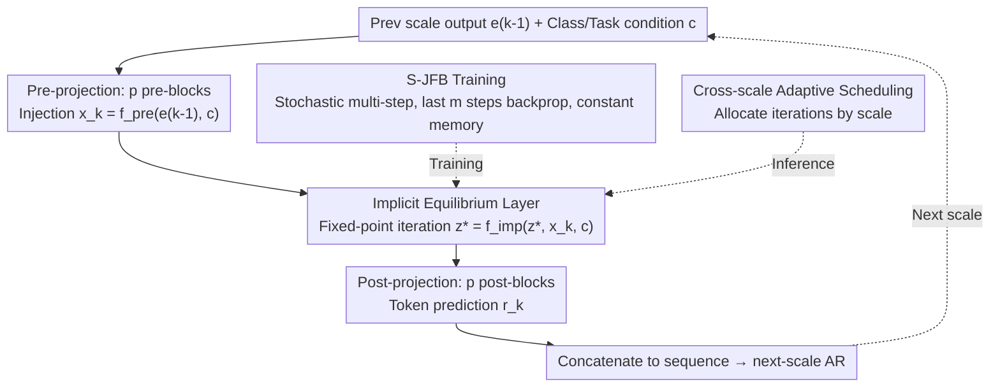

# Visual Implicit Autoregressive Modeling

**Conference**: ICML 2026  
**arXiv**: [2605.01220](https://arxiv.org/abs/2605.01220)  
**Code**: https://github.com/mobiushy/VIAR  
**Area**: Image Generation / Autoregressive Generation / Implicit Deep Models  
**Keywords**: VAR, Deep Equilibrium, Jacobian-Free Backprop, Next-scale prediction, Adaptive Inference

## TL;DR
This paper integrates Deep Equilibrium (DEQ) implicit fixed-point layers into the next-scale autoregressive framework of VAR. By utilizing Stochastic Jacobian-Free Backpropagation to achieve constant-memory training, the authors compress the 2 billion parameters of VAR-d30 to 770 million. At inference, the number of iterations per scale becomes a "tunable knob"—maintaining an FID of 2.16 and sFID of 8.07 on ImageNet-256, while reducing the peak memory on a single 4090 from 19.24GB to 8.53GB and increasing throughput from 15.16 to 32.08 img/s.

## Background & Motivation

**Background**: The two mainstream paradigms in image generation are diffusion and AR (Autoregressive). VAR (Tian et al. 2024) shifted image AR from next-token to **next-scale prediction**, generating multi-scale token maps from coarse to fine. Parallel prediction within each scale reduces the total attention complexity from $O(n^6)$ to $O(n^4)$ while preserving spatial locality, making it one of the strongest AR image generation paradigms.

**Limitations of Prior Work**: VAR still employs a **deeply stacked explicit Transformer** within each scale (e.g., 30 layers in VAR-d30). This introduces three engineering challenges: (1) High parameter count (2 billion for the d30 model); (2) Training memory grows linearly with depth due to activations and optimizer states; (3) Computational depth is fixed at 30 for every scale, preventing adaptive compute allocation based on scale size—even though the largest scale (high resolution) is the primary bottleneck for KV cache and latency.

**Key Challenge**: Model depth is both the "source of quality" and the "source of cost." In the VAR paradigm, these are coupled—achieving high quality requires depth, which necessitates high memory and latency. Figure 3 shows that on the largest scale, the cosine similarity exceeds 0.98 after 5 iterations and approaches 0.999 after 10, implying that **deep stacking on high-resolution scales is actually over-computation**.

**Goal**: Replace the "fixed depth stack" of VAR with a module "equivalent to infinite depth but with adjustable iterations," while maintaining next-scale parallelism and spatial locality.

**Key Insight**: Deep Equilibrium Models (DEQ) provide exactly this property—replacing deep stacks with an implicit fixed-point layer $z^* = f(z^*, x)$. Combined with Jacobian-Free Backprop (JFB), which backpropagates only through the final steps, it **decouples training memory from "effective depth."** During inference, the number of iterations becomes a tunable knob, allowing a single trained model to simulate networks of various depths.

**Core Idea**: Replace the configuration of "first p blocks + deep stack + last p blocks" with "first p blocks + **one implicit equilibrium layer** + last p blocks." Shallow Transformers are retained as interfaces, while the fixed-point iteration handles the "infinite depth" in the middle. The number of iterations for each scale can be independently scheduled.

## Method

### Overall Architecture
The workflow of VIAR for each scale $k$ is: (1) Input injection: use $p=5$ pre-blocks to project the previous scale output $e_{k-1}$ into $x_k = f_{\text{pre}}(e_{k-1}, c)$; (2) Implicit equilibrium: initialize from $z^0 = x_k$ and iterate $z^{t+1} = f_{\text{imp}}(\text{Proj}([z^t, x_k]), c)$ until the fixed point $z_k^*$ is reached; (3) Post-projection: $\hat{r}_k = f_{\text{post}}(z_k^*, c)$ uses $p=5$ post-blocks to output token predictions. The factorization of the next-scale autoregression $p(r_1,\cdots,r_K) = \prod_k p(r_k|r_{<k})$ remains consistent with VAR, and the VAE tokenizer reuses the frozen multi-scale VQVAE from VAR.

### Key Designs

**1. Replacing Explicit Stacks with Implicit Equilibrium Layers: Tuning "Depth" at Inference**

The bottleneck of VAR is the middle stack, which hardcodes 20+ layers of explicit Transformers, tying depth to both quality and cost. VIAR folds this stack into a single weight-tied fixed-point operator: defining a contractive mapping $f_{\text{imp}}(z, x, c)$, implemented as a Transformer block plus an input injection projection $\text{Proj}([z, x_k])$, and solving for the fixed point $z_k^* = f_{\text{imp}}(z_k^*, x_k, c)$. The key advantage is that this single trained block can be iterated any number of times during inference—the "effective depth" is determined at test time. This reduces middle stack parameters by 93.3% (61.6% overall reduction) and enables multi-depth deployment with a single model. The resource gains are evident in memory usage: Figure 6 shows parameter/gradient memory of ~2.87GB (VIAR) vs 7.49GB (VAR-d30), and optimizer states of 5.74GB vs 14.98GB.

**2. Stochastic Jacobian-Free Backprop (S-JFB): Stable Gradients in Constant Memory**

Fully unrolling the fixed-point layer consumes excessive memory, while pure 1-step JFB introduces high bias. S-JFB strikes a compromise using stochastic multi-steps: each training step first samples $n \sim U\{0, N\}$ "no-gradient" iterations to bring $z$ close to the fixed point, then samples $m \sim U\{1, M\}$ "gradient" iterations, backpropagating only through the last $m$ steps. The gradient approximation is $\partial \mathcal{L}/\partial \theta_{\text{imp}} \approx \sum_k (\partial \mathcal{L}_k/\partial \hat{z}_k) \cdot (\partial \hat{z}_k/\partial \theta_{\text{imp}})|_{\text{last } m}$. Default values are $N=10, M=12$. Standard backprop is used for shallow blocks, while S-JFB is applied only to the implicit block, approaching the true gradient in expectation while maintaining constant memory.

**3. Cross-scale Adaptive Iteration Scheduling: Allocating Iterations as Compute Budget**

Computational allocation in VAR across scales is uneven—high-resolution scales have the largest KV cache and token count but converge fastest (Figure 3 shows $>0.98$ cosine similarity in 5 iterations). VIAR treats the number of iterations per scale as a schedulable resource: given a total budget $\mathcal{C} = \sum_k (p_{\text{pre}} + c_k + p_{\text{post}})$, different schedules $\{c_k\}$ are chosen—Constant $\text{Con.}_{(c,c)}$, Decreasing $\text{Dec.}_{(a,b)}$ (more iterations for coarse scales, fewer for fine), or adaptive threshold control $\|G(z) - z\|_2 \le \tau_k$. Since high resolutions converge rapidly, compute can be reallocated to coarse scales. A counter-intuitive finding: increasing iterations for coarse scales improves FID even when fine scales haven't converged, suggesting global structure is more critical for quality than local self-iteration.

### Loss & Training
Standard next-scale cross-entropy is used: $\mathcal{L} = -\sum_k \log p_\theta(\hat{r}_k|r_{<k})$. Implicit layers use S-JFB, and shallow layers use standard backprop. Global batch size 512, lr 8e-5, with other optimizers/schedulers following VAR. The tokenizer is frozen. The base utilizes the VQVAE from the 2B-parameter VAR-d30 with the custom pre/imp/post architecture.

## Key Experimental Results

### Main Results
ImageNet $256 \times 256$ class-conditional generation, comparing FID/sFID/IS/Precision/Recall using 50K samples.

| Model | FID ↓ | sFID ↓ | IS ↑ | Pre ↑ | Rec ↑ | #Params | Inference Memory |
|------|-------|--------|------|-------|-------|---------|----------|
| VAR-d30 (cfg=2.0) | 2.05 | 8.86 | 328.5 | 0.82 | 0.59 | 2010M | 19.24GB |
| VAR-d30 (cfg=1.5) | 2.08 | 8.82 | 306.8 | 0.82 | 0.59 | 2010M | 19.24GB |
| VIAR (cfg=2.0) | 2.35 | **7.92** | **330.7** | **0.83** | 0.58 | **770.9M** | 11.16GB |
| VIAR (cfg=1.5) | **2.16** | 8.07 | 300.1 | 0.81 | 0.59 | **770.9M** | 11.16GB |

VIAR uses only 38.4% of the parameters (770.9M vs 2010M), with an FID drop of only 0.08 (2.16 vs 2.08), while achieving better sFID (7.92 vs 8.86), indicating superior spatial structure.

### Ablation Study
Throughput and memory comparison on a single 4090 (varying schedule aggressiveness, s1 being conservative, s4 most aggressive):

| Method | FID ↓ | sFID ↓ | Memory (GB) ↓ | Throughput (img/s) ↑ |
|------|-------|--------|------|----------|
| VAR | 2.08 | 8.82 | 19.24 | 15.16 |
| VIAR_s1 | 2.16 | 8.07 | 11.16 | 21.50 |
| VIAR_s2 | 2.22 | 8.08 | 9.60 | 26.92 |
| VIAR_s3 | 2.27 | 8.02 | 9.40 | 28.12 |
| VIAR_s4 | 2.43 | 8.28 | **8.53** | **32.08** |

The most aggressive s4 achieves $2.1\times$ speedup and $2.26\times$ memory reduction with an FID loss of only 0.35.

Cross-scale scheduling (Coarse-Fine iterations):

| Schedule | FID ↓ | sFID ↓ | IS ↑ |
|------|-------|--------|------|
| Dec.(20, 5) | 2.18 | 8.04 | 299.2 |
| Dec.(20, 10) | 2.16 | 8.07 | 294.8 |
| Dec.(10, 5) | 2.22 | 8.08 | 303.4 |
| Con.(20, 20) | 2.16 | 8.17 | 294.8 |
| Con.(5, 5) | 2.27 | 8.02 | 307.1 |
| Con.(10, 10) | **2.16** | 8.07 | 300.1 |

### Key Findings
- **Coarse Iteration > Fine Iteration**: When fine scales have not converged, increasing coarse scale iterations improves FID more effectively (Dec.(20,5) vs Con.(5,5)), implying global structure is the bottleneck for detail quality.
- **Constant Training Memory**: Figure 6 shows VIAR memory usage remains nearly constant as "effective depth" increases (plateauing at ~2.87GB), whereas VAR memory scales linearly.
- **Enhanced Zero-shot Editing**: Figure 7 demonstrates smoother boundary fusion and sharper details in in-painting and editing, attributed to the "long-range context aggregation" of implicit layers.
- **Rapid Fixed-point Convergence**: Cosine similarity reaches 0.985 in 5 steps and 0.999 in 10 steps for the largest scale.

## Highlights & Insights
- Successfully proves DEQ on large-scale generation—while DEQ was previously used for classification or optical flow demos, VIAR is the first to prove that "implicit layers can replace deep stacks without performance loss" on ImageNet-level AR generation.
- **"Train Once, Infer at Multiple Depths"**: A single trained VIAR model can run different iteration counts based on hardware budgets, effectively providing a family of small/medium/large models for free.
- The concept of "depth vs. computation" as a continuous knob can be transferred to diffusion, long-context LLM layers, or neural rendering.
- The conclusion on cross-scale compute reallocation (coarse scales are more important) is counter-intuitive and serves as a valuable reference for all hierarchical generation architectures.

## Limitations & Future Work
- The main FID (2.16) is slightly behind VAR-d30 (2.05). It remains unverified if VIAR maintains this ratio for larger models (d36+). DEQ stability at scale is still an open question.
- S-JFB is a biased estimator; although stable in experiments, it theoretically requires specific Lipschitz properties for $f_{\text{imp}}$, and no formal convergence proof is provided.
- Evaluation was limited to ImageNet $256 \times 256$; performance at $512 \times 512$ or in text-to-image (e.g., LlamaGen base) is unknown.
- The adaptive $\tau$ threshold control is only sketched and lacks a systematic ablation.
- While iterations are adjustable, each still requires a full Transformer block pass; the potential for FlashAttention-style optimizations remains undiscussed.

## Related Work & Insights
- **vs VAR (Tian et al. 2024)**: The direct baseline. VIAR is a "plug-and-play" modification replacing the middle stack with an implicit layer.
- **vs Fixed-Point Diffusion (Bai & Melas-Kyriazi 2024)**: They used DEQ for compute reallocation across timesteps; VIAR applies this to spatial scales.
- **vs Collaborative Decoding / Cached-token Pruning**: These are decoding-side acceleration methods, which are orthogonal to VIAR's "structure-side" acceleration.

## Rating
- Novelty: ⭐⭐⭐⭐ — First to bridge DEQ and VAR with robust engineering.
- Experimental Thoroughness: ⭐⭐⭐⭐ — Comprehensive results/schedules/memory curves; lacks scaling to larger models.
- Writing Quality: ⭐⭐⭐⭐ — Clear figures and motivation; algorithm description for S-JFB is somewhat dense.
- Value: ⭐⭐⭐⭐⭐ — Significant industrial value for edge deployment and elastic inference.

<!-- RELATED:START -->

## Related Papers

- [\[AAAI 2026\] HACK: Head-Aware KV Cache Compression for Efficient Visual Autoregressive Modeling](../../AAAI2026/image_generation/head-aware_kv_cache_compression_for_efficient_visual_autoreg.md)
- [\[ICLR 2026\] MVAR: Visual Autoregressive Modeling with Scale and Spatial Markovian Conditioning](../../ICLR2026/image_generation/mvar_visual_autoregressive_modeling_with_scale_and_spatial_markovian_conditionin.md)
- [\[ICML 2026\] Compression as Adaptation: Implicit Visual Representation with Diffusion Foundation Models](compression_as_adaptation_implicit_visual_representation_with_diffusion_foundati.md)
- [\[ICLR 2026\] Visual Autoregressive Modeling for Instruction-Guided Image Editing](../../ICLR2026/image_generation/visual_autoregressive_modeling_for_instruction-guided_image_editing.md)
- [\[CVPR 2026\] FVAR: Next-Focus Prediction for Visual Autoregressive Modeling](../../CVPR2026/image_generation/fvar_next-focus_prediction_for_visual_autoregressive_modeling.md)

<!-- RELATED:END -->
