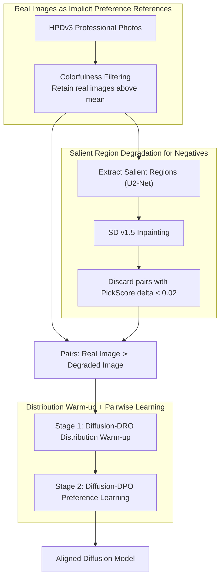

# When Preference Labels Fall Short: Aligning Diffusion Models from Real Data

**Conference**: ICML2026  
**arXiv**: [2605.19839](https://arxiv.org/abs/2605.19839)  
**Code**: https://cwyxx.github.io/RealAlign  
**Area**: Image Generation  
**Keywords**: Diffusion models, preference alignment, real images, Diffusion-DPO, data curation

## TL;DR
This paper argues that preference labels consisting of generated images tend to guide models toward "relatively better but still flawed" samples. It proposes automatically constructing preference signals using real images and their controllable degraded versions. By using only 512 pairs of samples, it aligns SD-1.5 and SD-3.5-M, achieving performance that is comparable to or supplements Diffusion-DPO / FlowGRPO.

## Background & Motivation
**Background**: Text-to-image diffusion models typically learn likelihood through large-scale image-text pairs, followed by a preference alignment stage to make outputs more consistent with human aesthetics, realism, and prompts. Methods such as Diffusion-DPO and FlowGRPO, which introduce human preferences, reward models, or pairwise comparisons into diffusion model post-training, have become a primary route for improving generation quality.

**Limitations of Prior Work**: Mainstream preference datasets are often constructed by sampling images from one or more generative models and then having humans label which one is better. This preference is relative: the selected image may simply have fewer flaws than the other while still possessing local artifacts, unnatural colors, or stylistic biases. If a model optimizes for such signals over the long term, it may learn the "generator bias within the preference data" rather than approaching truly high-quality images.

**Key Challenge**: Preference alignment aims to teach the model what a good image is, but binary labels between two generated images do not sufficiently define an absolute reference for "good." When both images are poor, preference labels only tell the model which is "less bad," making it difficult to provide stable anchors for realism, structural consistency, and semantic alignment.

**Goal**: The authors aim to reduce reliance on human preference annotations by automatically constructing preference supervision from existing real images, verifying whether such supervision can independently align diffusion models or serve as a complementary post-training stage for existing preference methods.

**Key Insight**: Real images from photography platforms or high-quality datasets naturally contain human choices regarding composition, semantics, and realism. The paper treats real images as positive samples and generates negative samples through localized controllable degradation, deriving preference signals from the differences between real images and their flawed versions.

**Core Idea**: Instead of having humans compare two generated images, real images are treated as "implicit preference references." The diffusion model is first pulled toward the real image distribution, followed by DPO-style pairwise learning between real and locally degraded images.

## Method
The proposed method is a data-centric alignment framework for diffusion models. It does not invent new diffusion samplers or replace the DPO objective but instead redesigns the source of preference signals: starting from professional real photos in HPDv3, it utilizes filtering, salient region perturbation, and two-stage training to transform human visual preferences implicit in real data into optimizable supervision.

### Overall Architecture
First, professional photos from HPDv3 are selected as candidate positive samples, with visually flat or low-contrast images filtered out using a colorfulness metric. Next, for each real image, U2-Net is used to identify salient regions, which are then redrawn using a prompt-conditioned SD v1.5 Inpainting model. Since the inpainting model introduces flaws in local texture, structure, or semantics, the original and redrawn images form a preference pair where the "real reference is superior to the degraded version." Finally, training is conducted in two steps: Stage 1 utilizes a distribution-level objective similar to Diffusion-DRO to pull the model closer to the real image distribution; Stage 2 starts from the Stage 1 model and employs Diffusion-DPO for fine-grained preference learning between real and degraded images.

This workflow is characterized by supervision signals derived entirely from real data and automatic perturbations, requiring no human comparison labels. The authors also verify that real data supervision is complementary to traditional preference supervision by using it as a plug-in post-training step after Diffusion-DPO or FlowGRPO.

### Key Designs

**1. Real Images as Implicit Preference References: Using professional photos as absolute quality anchors**

A chronic issue in preference alignment is that the "winning" sample in a preference pair is itself a generated image, which might only be slightly better than its counterpart while still carrying generator style biases and local flaws. Long-term learning from such samples leads the model to inherit these defects. This paper changes the supervision source by taking positive samples directly from HPDv3 professional photography and filtering out visually flat, low-contrast images via colorfulness metrics. These real photos naturally encapsulate human choices in composition, semantics, and realism, representing the absolute target distribution the model should approximate, thereby providing a stable anchor that does not inherit generative artifacts.

**2. Salient Region Degradation for Negatives: Concentrating differences on quality dimensions**

Having only positive samples is insufficient; DPO-style learning requires paired negative samples to define what should be penalized. Instead of using a different image as a negative (where excessive variance might lead the model to learn irrelevant changes), this paper performs localized degradation on the same real image. U2-Net identifies salient regions, which are then redrawn by a prompt-conditioned SD v1.5 Inpainting model. Due to the limited expressiveness of the inpainting model, the redrawn area typically degrades in texture, structure, or semantics. Consequently, the original and redrawn images form a pair where the layout and semantics remain largely consistent, but the "real reference ≻ degraded version." To ensure clear signals, pairs with a PickScore difference of less than 0.02 are discarded. This ensures that the degradation affects only local areas and aligns with preference-related dimensions like visual fidelity and text-alignment.

**3. Distribution Warm-up + Pairwise Learning: Closing the distribution gap before fine-grained alignment**

Applying DPO directly to "real vs. degraded" pairs yields limited results because the model's starting point is too far from the real image distribution, making pairwise optimization unstable across disparate distributions. Thus, the process is split into two steps: Stage 1 uses a distribution-level objective (Diffusion-DRO style) to train a reward model that distinguishes real images from current policy generations, then updates the policy to minimize this discriminability and pull the model toward the real distribution (using a margin to avoid over-optimizing correctly ordered samples). Stage 2 then starts from this warmed-up model, using Diffusion-DPO on real and degraded image pairs for fine-grained preference learning to increase the likelihood of real images and decrease that of degraded ones, while using a KL constraint to prevent distribution drift. Ablations confirm that Stage 1 alone is effective, but the combination of both stages yields the best results.

### Loss & Training
Training utilizes LoRA. SD-1.5 uses rank 4 and scaling 4; SD-3.5-M uses rank 32 and scaling 64. Stage 1 employs the Diffusion-DRO objective, training the reward/policy models to distinguish real images from current generated images, with a margin to avoid over-optimizing correctly ranked samples; learning rates are $1e^{-4}$ for 1600 steps (SD-1.5) and $2e^{-4}$ for 3200 steps (SD-3.5-M). Stage 2 uses the Diffusion-DPO objective with real images $x_0^w$ as positives and degraded images $x_0^l$ as negatives, with a learning rate of $2.56e^{-6}$ for 1000 steps (SD-1.5) and 500 steps (SD-3.5-M).

## Key Experimental Results

### Main Results
The paper trains on SD-1.5 and SD-3.5-M, evaluating on Pick-a-Pic v2, DrawBench, and Parti-Prompts. Metrics include PickScore, ImageReward, UnifiedReward, HPSv3, DeQA, and LAION aesthetic score.

| Model / Dataset | Method | Training Data | PickScore | ImageReward | HPSv3 | DeQA | Aes |
|---------------|------|----------|-----------|-------------|-------|------|-----|
| SD-1.5 / Pick-a-Pic v2 | Base | None | 20.65 | 0.16 | 5.98 | 3.70 | 5.48 |
| SD-1.5 / Pick-a-Pic v2 | Diffusion-DPO | 851k pairs | 21.03 | 0.33 | 6.80 | 3.78 | 5.59 |
| SD-1.5 / Pick-a-Pic v2 | Ours | 512 pairs | 21.04 | 0.38 | 7.33 | 3.96 | 5.64 |
| SD-3.5-M / DrawBench | Base | None | 22.42 | 0.79 | 10.03 | 4.09 | 5.44 |
| SD-3.5-M / DrawBench | Diffusion-DPO | 851k pairs | 22.70 | 0.97 | 10.79 | 3.96 | 5.44 |
| SD-3.5-M / DrawBench | Ours | 512 pairs | 22.80 | 1.08 | 12.77 | 4.26 | 5.55 |
| SD-3.5-M / Parti-Prompts | Base | None | 22.54 | 1.11 | 8.97 | 4.00 | 5.60 |
| SD-3.5-M / Parti-Prompts | Ours | 512 pairs | 22.90 | 1.27 | 10.66 | 4.20 | 5.73 |

### Ablation Study
The two-stage strategy is the most critical component ablation. Results show that Stage 2 alone yields minimal gains, Stage 1 alone provides significant improvement, and the combination of both is optimal.

| Stage 1 Warm-up | Stage 2 Learning | PickScore | HPSv3 | DeQA | Aes | Note |
|------------------|------------------|-----------|-------|------|-----|------|
| ✗ | ✗ | 20.65 | 5.98 | 3.70 | 5.48 | SD-1.5 base |
| ✗ | ✓ | 20.74 | 6.11 | 3.93 | 5.52 | DPO on constructed pairs directly; limited gain |
| ✓ | ✗ | 20.87 | 6.83 | 3.75 | 5.57 | Real distribution warm-up contributes more |
| ✓ | ✓ | 21.04 | 7.33 | 3.96 | 5.64 | Full method is best |

| Generalization Analysis | Result | Explanation |
|----------|------|------|
| Non-photorealistic Anime, vs SD-3.5-M | 73.33% win rate | Real image signals improve composition and semantic consistency across domains |
| Non-photorealistic Concept-Art, vs Diffusion-DPO | 66.67% win rate | Still provides complementary benefits to existing preference methods |
| DPG-Bench SD-1.5 | Base 62.84, Ours 64.38 | Improvement in dense prompt following |
| DPG-Bench SD-3.5-M | Base 83.40, Ours 85.43 | Effective on larger models |

### Key Findings
- Using only 512 pairs of preference samples constructed from real data, SD-1.5 achieves metrics comparable to or better than Diffusion-DPO trained on 851k pairs; notably, HPSv3 increases from 5.98 to 7.33.
- On SD-3.5-M, the real data preference signal significantly improves HPSv3 from 10.03 to 12.77, demonstrating effectiveness on larger models.
- Real data supervision can be applied after Diffusion-DPO or FlowGRPO to further enhance performance, suggesting it addresses the data source dimension rather than competing with specific optimization algorithms.
- Increasing data from 256 to 512 pairs shows clear benefits, but further increases show diminishing returns, highlighting that sample quality and curation are more critical than scale.

## Highlights & Insights
- The paper articulates the "deficiency of preference labels" concretely: the issue is not necessarily the DPO objective, but that the positive samples in generated preference pairs may carry their own artifacts and style biases.
- Real images are not treated as standard supervised data but are used to construct comparable preference pairs via local degradation, focusing the learning signal on interpretable quality differences.
- The two-stage training design is simple yet well-founded: addressing the distance between real and generative distributions before fine-grained DPO.
- The paper provides a data curation perspective for image generation alignment: before scaling up human preference labels, one should ensure the positive and negative samples truly express the visual standards the model is intended to learn.

## Limitations & Future Work
- Positive samples are primarily professional photos; while experiments show transferability to Anime and Concept-Art, further validation is needed for abstract art, medical imaging, or design diagrams.
- Negative samples are produced by an inpainting model, limiting degradation types to the model's capabilities; if flaws are too uniform, the model might learn specific perturbation patterns.
- Quantitative evaluation relies heavily on automatic metrics; the user study involved only 18 participants and 60 prompts, which is relatively small in scale.
- The method currently depends on image-caption pairs and salient region detection; future work could explore preference construction in video diffusion, 3D generation, or multimodal editing.

## Related Work & Insights
- **vs Diffusion-DPO**: While Diffusion-DPO relies on large-scale human preference pairs, this work retains the DPO optimization form but shifts the source to real vs. degraded images, reducing annotation costs.
- **vs FlowGRPO**: FlowGRPO improves alignment via reward models and group optimization; this work notes that reward models also inherit biases from generated samples, allowing real data supervision to serve as a post-training patch.
- **vs ImageReward / PickScore**: Reward models provide differentiable preference signals but may induce stylistic homogenization; real data supervision emphasizes realism, structure, and semantic consistency.
- **Insight**: The "positive sample quality" in alignment data might be more important than the quantity of preference labels. Future RLHF/RLAIF for generative models should consider using real or expert data as absolute anchors.

## Rating
- Novelty: ⭐⭐⭐⭐☆ Constructing preference signals from real images is intuitive and effective; the primary contribution lies in data curation and the stage-wise training combination.
- Experimental Thoroughness: ⭐⭐⭐⭐☆ Covers two SD models, multiple metrics, user studies, and ablations; the scale of human evaluation could be further expanded.
- Writing Quality: ⭐⭐⭐⭐☆ Motivation and experimental narrative are clear without overcomplicating the method; assumes some background in diffusion alignment.
- Value: ⭐⭐⭐⭐⭐ Highly insightful for practical image generation alignment, especially where human preference labels are scarce but high-quality real images are available.

<!-- RELATED:START -->

## Related Papers

- [\[AAAI 2026\] Margin-aware Preference Optimization for Aligning Diffusion Models without Reference](../../AAAI2026/image_generation/margin-aware_preference_optimization_for_aligning_diffusion_models_without_refer.md)
- [\[CVPR 2025\] Calibrated Multi-Preference Optimization for Aligning Diffusion Models](../../CVPR2025/image_generation/calibrated_multi-preference_optimization_for_aligning_diffusion_models.md)
- [\[CVPR 2026\] Towards Fine-Grained Attribution: Instance-Aware Preference Optimization for Aligning Diffusion Models](../../CVPR2026/image_generation/towards_fine-grained_attribution_instance-aware_preference_optimization_for_alig.md)
- [\[ICLR 2026\] AlignTok: Aligning Visual Foundation Encoders to Tokenizers for Diffusion Models](../../ICLR2026/image_generation/aligntok_aligning_visual_foundation_encoders_to_tokenizers_for_diffusion_models.md)
- [\[NeurIPS 2025\] When Are Concepts Erased From Diffusion Models?](../../NeurIPS2025/image_generation/when_are_concepts_erased_from_diffusion_models.md)

<!-- RELATED:END -->
