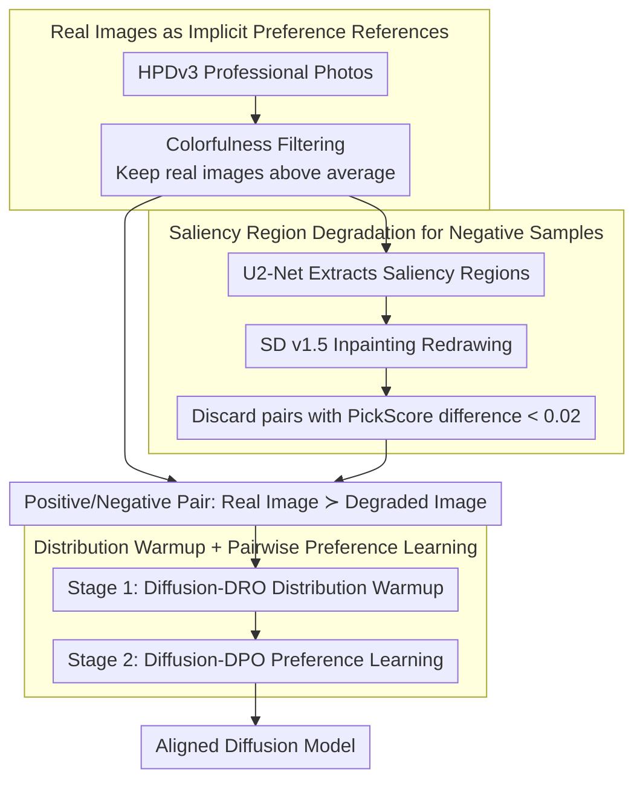

# When Preference Labels Fall Short: Aligning Diffusion Models from Real Data

**Conference**: ICML2026  
**arXiv**: [2605.19839](https://arxiv.org/abs/2605.19839)  
**Code**: https://cwyxx.github.io/RealAlign  
**Area**: Image Generation  
**Keywords**: Diffusion Models, Preference Alignment, Real Images, Diffusion-DPO, Data Curation

## TL;DR
This paper argues that preference labels consisting of generated images tend to lead models toward "relatively better but still flawed" samples. It proposes using real images and their controllably degraded versions to automatically construct preference signals. By using only 512 pairs of samples, it aligns SD-1.5 and SD-3.5-M, achieving results that are comparable or complementary to Diffusion-DPO / FlowGRPO.

## Background & Motivation
**Background**: Text-to-image diffusion models typically learn likelihood through large-scale image-text pairs first, followed by a preference alignment stage to make outputs better conform to human aesthetics, realism, and prompt consistency. Methods like Diffusion-DPO and FlowGRPO have become major routes for improving generation quality by introducing human preferences, reward models, or pairwise comparisons into post-training.

**Limitations of Prior Work**: Mainstream preference datasets are often sampled from one or more generative models, followed by human annotation of which image is better. This preference is relative: the selected image might just have slightly fewer flaws than the other while still possessing local artifacts, unnatural colors, or stylistic biases. If a model optimizes this signal over the long term, it may learn the "generator bias in the preference data" rather than approaching truly high-quality images.

**Key Challenge**: Preference alignment aims to teach the model what a "good" image is, but a binary label between two generative images cannot fully define the absolute reference for "goodness." When both images are poor, preference labels only tell the model which one is "less bad," making it difficult to provide stable anchors for realism, structural consistency, and semantic alignment.

**Goal**: The authors aim to reduce reliance on manual preference annotations by automatically constructing preference supervision from existing real images. They verify whether this supervision can independently align diffusion models and serve as a complementary post-training stage for existing preference methods.

**Key Insight**: Real images from photography platforms or high-quality datasets naturally contain human choices regarding composition, semantics, and realism. The paper treats real images as positive samples and generates negative samples through local controllable degradation, allowing the preference signal to come from the difference between real images and their flawed versions.

**Core Idea**: Instead of having humans compare two generated images, real images are treated as an "implicit preference reference." The diffusion model is first pulled toward the real image distribution, and then DPO-style pairwise learning is performed using real images and locally degraded images.

## Method
The proposed method can be understood as a data-centric alignment framework for diffusion models. It does not invent new diffusion samplers or replace the DPO objective but focuses on redesigning the source of preference signals. Starting from professional real photos in HPDv3, it transforms implicit human visual preferences in real data into optimizable supervision through filtering, saliency region perturbation, and two-stage training.

### Overall Architecture
First, the paper selects professional photos from HPDv3 as candidate positive samples and filters out visually flat or low-contrast images using colorfulness scores. Next, U2-Net is used to identify saliency regions in each real image, which are then redrawn using a prompt-conditioned SD v1.5 Inpainting model. Since the inpainting model introduces flaws in local texture, structure, or semantics, the original image and the redrawn image form a preference pair where "real reference is superior to the degraded version." Finally, training is conducted in two steps: Stage 1 utilizes a distribution-level objective similar to Diffusion-DRO to pull the model closer to the real image distribution; Stage 2 starts from the Stage 1 model and performs fine-grained preference learning between real and degraded images using Diffusion-DPO.

The characteristic of this workflow is that the supervision signal comes entirely from real data and automatic perturbations, requiring no manual comparison labels. The authors also verify that real-data supervision is complementary to traditional preference supervision by using it as a plug-in post-training step after Diffusion-DPO or FlowGRPO.

### Key Designs

**1. Real Images as Implicit Preference References: Using Professional Photos as Absolute Quality Anchors**

An old problem in preference alignment is that the "winning" sample in a preference pair is itself a generated image, which might only be slightly better than its counterpart. It still carries the generator's stylistic bias and local flaws. Training on it for a long duration means the model inherits these generator defects. This paper changes the source of supervision—directly taking positive samples from professional photography in HPDv3 and filtering out visually flat, low-contrast images using colorfulness. Only samples above the average are kept as representatives of "preference regions." These real photos naturally contain human choices in composition, semantics, and realism, making them closer to the absolute target distribution the model truly wants to approximate, rather than "choosing the better of two bad images." This provides a stable anchor for alignment that does not inherit generative artifacts.

**2. Saliency Region Degradation for Negative Samples: Focusing Differences on the Quality Dimension**

Having positive samples is not enough; DPO-style learning requires paired negative samples to define "what should be suppressed." Instead of finding another random image as a negative example (which introduces too much variance), this paper performs local degradation on the same real image. It first uses U2-Net to identify the saliency region and then uses a prompt-conditioned SD v1.5 Inpainting model to redraw that area. Due to the limited expressiveness of the inpainting model, the redrawn area typically degrades in texture, structure, or semantics. Consequently, the original image and the redrawn image form a pair where "real reference ≻ degraded version," while the overall layout and semantics remain largely aligned. To ensure a clear signal, the authors discard pairs where the PickScore difference is less than 0.02. In this way, degradation only affects local areas, and the differences fall precisely on preference-related dimensions like visual fidelity and text-image alignment, making the supervision neither vague nor overly intense.

**3. Distribution Warmup + Pairwise Preference Learning: Closing the Distribution Gap before Fine-grained Alignment**

Directly feeding "real image vs. degraded image" into DPO immediately often yields limited results because the model's starting point is too far from the real image distribution, making pairwise optimization on drastically different distributions unstable. Thus, the paper employs two steps: Stage 1 uses a distribution-level objective in the style of Diffusion-DRO, training a reward model to distinguish between real images and current policy-generated images, then updating the policy to reduce this separability and pull the model overall closer to the real distribution (using a margin to avoid over-optimizing already ordered samples). Only in Stage 2 does the model start from this warmed-up state to perform fine-grained preference learning on real/degraded image pairs using Diffusion-DPO. This increases the likelihood of real images while decreasing that of degraded images, with a KL constraint to prevent distribution drift. Ablations confirm the necessity of this sequence: Stage 2 alone provides small gains, while Stage 1 alone provides significant improvement, but combining both is optimal.

### Loss & Training
Training utilizes LoRA. SD-1.5 uses rank 4 and scaling 4; SD-3.5-M uses rank 32 and scaling 64. Stage 1 uses the Diffusion-DRO objective, training the reward/policy models to distinguish real images from current policy generations and avoiding over-optimization via a margin. For SD-1.5, the learning rate is $1e^{-4}$ for 1600 steps; for SD-3.5-M, it is $2e^{-4}$ for 3200 steps. Stage 2 uses the Diffusion-DPO objective, where the positive sample is the real image $x_0^w$ and the negative sample is the degraded image $x_0^l$. The learning rate is $2.56e^{-6}$, with SD-1.5 trained for 1000 steps and SD-3.5-M for 500 steps.

## Key Experimental Results

### Main Results
The paper trains on SD-1.5 and SD-3.5-M and evaluates on Pick-a-Pic v2, DrawBench, and Parti-Prompts. Metrics include PickScore, ImageReward, UnifiedReward, HPSv3, DeQA, and LAION aesthetic score.

| Model / Dataset | Method | Training Data | PickScore | ImageReward | HPSv3 | DeQA | Aes |
|---------------|------|----------|-----------|-------------|-------|------|-----|
| SD-1.5 / Pick-a-Pic v2 | Base | None | 20.65 | 0.16 | 5.98 | 3.70 | 5.48 |
| SD-1.5 / Pick-a-Pic v2 | Diffusion-DPO | 851k pairs | 21.03 | 0.33 | 6.80 | 3.78 | 5.59 |
| SD-1.5 / Pick-a-Pic v2 | Ours | 512 pairs | 21.04 | 0.38 | 7.33 | 3.96 | 5.64 |
| SD-3.5-M / DrawBench | Base | None | 22.42 | 0.79 | 10.03 | 4.09 | 5.44 |
| SD-3.5-M / DrawBench | Diffusion-DPO | 851k pairs | 22.70 | 0.97 | 10.79 | 3.96 | 5.44 |
| SD-3.5-M / DrawBench | Ours | 512 pairs | 22.80 | 1.08 | 12.77 | 4.26 | 5.55 |
| SD-3.5-M / Parti-Prompts | Base | None | 22.54 | 1.11 | 8.97 | 4.00 | 5.60 |
| SD-3.5-M / Parti-Prompts | Ours | 512 pairs | 22.90 | 1.27 | 10.66 | 4.20 | 5.73 |

### Ablation Study
The two-stage strategy is the most important component ablation in the paper. Results show that doing only Stage 2 yields minimal gains, while doing only Stage 1 provides significant improvement. Combining both stages yields the best results.

| Stage 1 Warmup | Stage 2 Preference | PickScore | HPSv3 | DeQA | Aes | Note |
|------------------|------------------|-----------|-------|------|-----|------|
| ✗ | ✗ | 20.65 | 5.98 | 3.70 | 5.48 | SD-1.5 base |
| ✗ | ✓ | 20.74 | 6.11 | 3.93 | 5.52 | DPO on constructed pairs directly, limited gain |
| ✓ | ✗ | 20.87 | 6.83 | 3.75 | 5.57 | Real distribution warmup contributes more |
| ✓ | ✓ | 21.04 | 7.33 | 3.96 | 5.64 | Full method is best |

| Generalization Analysis | Result | Explanation |
|----------|------|------|
| Non-realistic Anime, vs SD-3.5-M | 73.33% win rate | Real image signals improve composition and semantic consistency, transferring beyond realism |
| Non-realistic Concept-Art, vs Diffusion-DPO | 66.67% win rate | Remains complementary to existing preference methods |
| DPG-Bench SD-1.5 | Base 62.84, Ours 64.38 | Improvement in dense prompt following |
| DPG-Bench SD-3.5-M | Base 83.40, Ours 85.43 | Equally effective on larger models |

### Key Findings
- Using only 512 pairs of preference samples constructed from real data, SD-1.5 achieves metrics comparable to or better than Diffusion-DPO trained on 851k pairs, with HPSv3 notably increasing from 5.98 to 7.33.
- On SD-3.5-M, the real-data preference signal significantly boosts HPSv3 from 10.03 to 12.77, proving the method is not only effective for small models.
- Real-data supervision can be applied after Diffusion-DPO or FlowGRPO to yield further improvements, indicating it complements the data source dimension rather than competing with specific alignment algorithms.
- Increasing the data volume from 256 to 512 showed significant gains, but further increases showed diminishing returns. The paper emphasizes that sample quality and curation are more critical than pure scaling.

## Highlights & Insights
- The paper articulates the "shortcomings of preference labels" concretely: the issue is not necessarily the DPO objective, but that the positive samples in generated preference pairs may carry their own artifacts and stylistic biases.
- Real images are not treated as traditional supervised data but are used to construct comparable preference pairs through local degradation, focusing the learning signal on interpretable quality differences.
- The design of two-stage training is simple yet logical: first bridging the distance between real and generative distributions, then performing fine-grained DPO. Ablation results strongly support this sequence.
- This paper provides a data-curation perspective on diffusion model alignment: rather than infinitely scaling human preferences, one should first ask if the positive/negative samples truly express the visual standards the model is expected to learn.

## Limitations & Future Work
- Positive samples mainly come from professional photography. Although experiments show transferability to Anime and Concept-Art, further validation is needed for abstract art, medical imaging, design diagrams, and other non-photographic domains.
- Negative samples are generated by an inpainting model, so degradation types are limited by that model's capabilities. If negative samples have mono-style defects, the model might learn specific perturbation patterns.
- Automated metrics remain the primary basis for quantification; the user study involved only 18 participants and 60 prompts, which is a relatively small scale.
- The method currently relies on image-caption pairs and saliency region detection. Future work could explore real-data preference construction in video diffusion, 3D generation, or multi-modal editing.

## Related Work & Insights
- **vs Diffusion-DPO**: Diffusion-DPO relies on large-scale human preference pairs. Ours retains the DPO optimization form but replaces the source of preference pairs with real and degraded images, reducing annotation costs.
- **vs FlowGRPO**: FlowGRPO improves alignment through reward models and group optimization. Ours points out that reward models also inherit biases from generated samples, so real-data supervision acts as a post-training patch.
- **vs ImageReward / PickScore Rewards**: Reward models provide differentiable or optimizable preference signals but may induce stylistic homogenization. Supervision constructed from real images emphasizes realism, structure, and semantic consistency.
- **Insight**: The "positive sample quality" in alignment data might be more important than the quantity of preference labels. When developing future RLHF/RLAIF for generative models, real data or high-quality expert data should be considered as anchors.

## Rating
- Novelty: ⭐⭐⭐⭐☆ The idea of constructing preference signals from real images is intuitive but effective; the key contribution lies in the data curation and two-stage training combination.
- Experimental Thoroughness: ⭐⭐⭐⭐☆ Covers two SD models, multiple metrics, user studies, and detailed ablations; the scale of real-user evaluation could be further expanded.
- Writing Quality: ⭐⭐⭐⭐☆ The motivation and experimental narrative are clear, and the method is not over-complicated. Some formulas follow Diffusion-DRO/DPO, requiring a background in diffusion alignment.
- Value: ⭐⭐⭐⭐⭐ Highly insightful for practical image generation alignment, especially in scenarios where human preference labels are scarce but high-quality real images are available.

<!-- RELATED:START -->

## Related Papers

- [\[AAAI 2026\] Margin-aware Preference Optimization for Aligning Diffusion Models without Reference](../../AAAI2026/image_generation/margin-aware_preference_optimization_for_aligning_diffusion_models_without_refer.md)
- [\[CVPR 2025\] Calibrated Multi-Preference Optimization for Aligning Diffusion Models](../../CVPR2025/image_generation/calibrated_multi-preference_optimization_for_aligning_diffusion_models.md)
- [\[CVPR 2026\] Towards Fine-Grained Attribution: Instance-Aware Preference Optimization for Aligning Diffusion Models](../../CVPR2026/image_generation/towards_fine-grained_attribution_instance-aware_preference_optimization_for_alig.md)
- [\[ICLR 2026\] AlignTok: Aligning Visual Foundation Encoders to Tokenizers for Diffusion Models](../../ICLR2026/image_generation/aligntok_aligning_visual_foundation_encoders_to_tokenizers_for_diffusion_models.md)
- [\[AAAI 2026\] Rethinking Direct Preference Optimization in Diffusion Models](../../AAAI2026/image_generation/rethinking_direct_preference_optimization_in_diffusion_models.md)

<!-- RELATED:END -->
