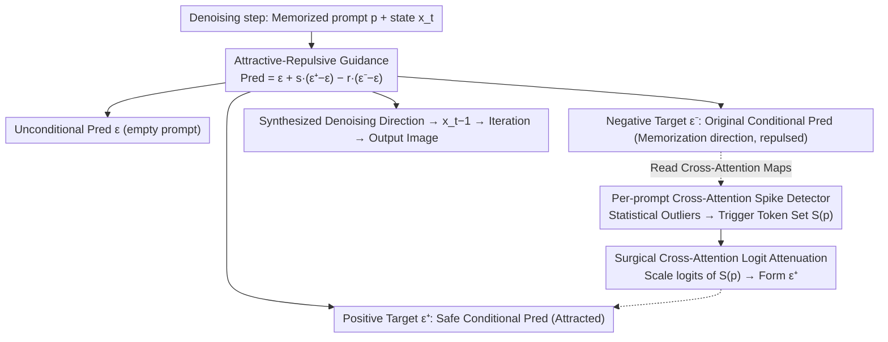

# You Don't Need All That Attention: Surgical Memorization Mitigation in Text-to-Image Diffusion Models

**Conference**: ICML2026  
**arXiv**: [2603.00133](https://arxiv.org/abs/2603.00133)  
**Code**: https://github.com/kairanzhao/GUARD  
**Area**: Image Generation / Diffusion Models / Memorization Mitigation  
**Keywords**: Text-to-Image Diffusion Models, Training Data Memorization, Inference-time Mitigation, cross-attention, GUARD  

## TL;DR
This paper proposes GUARD, an inference-time framework for mitigating memorization in text-to-image diffusion models. By introducing "repulsion" from the original memorized prompt and "attraction" toward a safe conditional prediction into the standard classifier-free guidance, and instantiating the positive target through dynamic cross-attention spike detection and attenuation, GUARD reduces the replication of training images while maintaining image quality and prompt alignment.

## Background & Motivation
**Background**: Text-to-image diffusion models have been shown to replicate certain images from their training sets under specific prompts, posing risks to privacy and copyright. Existing mitigation methods are generally categorized into three types: training-time prevention, finetuning/unlearning, and inference-time intervention.

**Limitations of Prior Work**: Training-time methods require control over the original training process, yet many applications rely on open-source or commercial pre-trained models. Unlearning requires additional fine-tuning for the forget set, which is costly and potentially unstable. Existing inference-time methods often only scale conditional components, modify initial noise, or apply fixed processing to tokens like EOT/padding, making it difficult to cover both verbatim and template memorization simultaneously.

**Key Challenge**: Forcefully suppressing prompt conditional signals may reduce the replication of training samples, but image semantics and quality degrade concurrently. Conversely, fixed token attention redistribution fails to capture the actual tokens triggering memorization across different prompts. This paper aims to solve the problem of "precisely suppressing memorization triggers during inference while preserving prompt-related generation capabilities."

**Goal**: The authors aim to design an inference-time method that requires no weight modifications, no retraining, and no prior knowledge of the training process. It should dynamically locate memorization-related cross-attention spikes for each prompt and pull the generation trajectory away from memorized samples during the standard denoising process.

**Key Insight**: The paper re-analyzes the cross-attention distributions of memorized vs. non-memorized prompts. It observes that in verbatim memorization, EOT often shows strong spikes, but other tokens can be even sharper. In template memorized cases, EOT is not necessarily the primary issue. Therefore, fixed EOT attenuation is unreliable, and per-prompt statistical detection is required.

**Core Idea**: The inference-time guidance is formulated as attractive-repulsive dynamics: repulsion moves away from the conditional prediction of the original memorized prompt, while attraction points toward a safe conditional prediction derived from dynamic attention spike attenuation.

## Method
GUARD does not train a new diffusion model but modifies the noise prediction composition at each denoising step. It retains the unconditional prediction and computes two types of conditional predictions: a standard conditional prediction from the original prompt (acting as a negative target) and a spike-attenuated conditional prediction (acting as a positive target).

### Overall Architecture
Standard classifier-free guidance formulates noise prediction as the unconditional prediction plus the difference between prompt-conditional and unconditional predictions. GUARD adds two forces to this formula: it uses weight $s$ to attract toward the positive conditional prediction $\epsilon_\theta^+$ and weight $r$ to repulse the original memorized conditional prediction $\epsilon_\theta^-$. Intuitively, if the original prompt pulls the trajectory toward a training image, repulsion subtracts this direction; however, merely moving away degrades quality, so a positive target is needed to provide an alternative direction that remains prompt-aligned but less memorized.

The specific instance in this paper is called CA-in-GUARD. It first reads cross-attention maps from the original conditional branch to automatically identify the set of spike tokens $S(p)$ for the current prompt, then scales the attention logits of these tokens in the positive branch to obtain the spike-attenuated conditional prediction. In implementation, the unconditional, original conditional, and spike-attenuated conditional predictions can be batched into a single U-Net forward pass to minimize overhead.

### Key Designs
**1. Attractive-Repulsive Guidance: Moving away from memorization without quality collapse**: The general framework of GUARD rewrites the noise prediction assembly of standard classifier-free guidance (CFG) to resolve the dilemma of suppressing memorization versus maintaining image integrity. The final noise prediction is defined as $$\hat{\epsilon}=\epsilon_\theta(x_t,e_\phi)+s\,(\epsilon_\theta^+(x_t,e_p)-\epsilon_\theta(x_t,e_\phi))-r\,(\epsilon_\theta^-(x_t,e_p)-\epsilon_\theta(x_t,e_\phi))$$: where $\epsilon_\theta^-$ is the standard conditional prediction of the original prompt (negative target, repulsed with weight $r$), and $\epsilon_\theta^+$ is the safely processed positive target (attracted with weight $s$). Repulsion alone collapses generation quality, necessitating a simultaneous alternative direction that fits the prompt but no longer points to the training image. Decoupling attraction and repulsion into two independent forces allows for separate tuning of "memorization mitigation strength" and "quality preservation."

**2. Per-prompt Cross-Attention Spike Detector: Dynamically locating trigger tokens**: Where should the positive target intervene? The paper analyzes cross-attention distributions and finds that while the EOT token often has strong spikes in verbatim memorization, other tokens often have higher spikes. In template memorization, EOT might not even be the main factor. Thus, fixed processing of EOT/padding as done in Ren et al. is insufficient and potentially harmful. GUARD adopts per-prompt statistical outlier detection: it calculates the maximum attention mass $M_i$ across spatial queries for each token from the original conditional branch, standardizes it as $Z_i=(M_i-\mu)/\sigma$, and includes tokens exceeding a threshold $\tau$ in set $S(p)$. This set may contain EOT or any prompt-specific tokens, adapting dynamically to the prompt and denoising step.

**3. Surgical Cross-Attention Logit Attenuation: Suppressing abnormal spikes to create safe positive targets**: Once the trigger positions $S(p)$ are identified, the positive target for GUARD is constructed. In selected U-Net cross-attention modules, a multiplicative scaling $\ell'_{q,i}=\ell_{q,i}\cdot\alpha$ is applied to the attention logits for $i\in S(p)$ before the softmax operation, yielding a conditional prediction $\epsilon_\theta^+$ that "follows the prompt but no longer excessively relies on memorization-triggering tokens." By default, this is applied only in down/mid blocks to avoid quality degradation in late up blocks. Logit attenuation is a more refined "surgical" intervention compared to crude operations like token deletion or zeroing out attention, as it preserves the remaining normal attention patterns.

### Loss & Training
This method involves no training loss and does not update model weights. The primary hyperparameters are the attention spike threshold $\tau$, attenuation factor $\alpha$, and GUARD repulsion strength $r$. The authors performed a grid search for different architectures and memorization types, adopting a quality-constrained selection strategy: among configurations where CLIP degradation does not exceed 15% of the reference value, the setting with the lowest SSCD is prioritized.

## Key Experimental Results

### Main Results
Experiments used 500 memorized prompts identified by Webster, covering SD v1.4 and SD v2.0. Both verbatim and template memorization were evaluated for SD v1.4, while SD v2.0 focused on template memorization. Memorization levels were measured by SSCD, and quality by CLIP and FID.

| Setting | Method | SSCD↓ | CLIP↑ | FID↓ | Description |
|------|------|-------|-------|------|------|
| SD v1.4 verbatim | No mitigation | 0.875 | 0.346 | 243.056 | Original model highly replicates training images |
| SD v1.4 verbatim | Wen et al. | 0.115 | 0.267 | 162.848 | Strong baseline |
| SD v1.4 verbatim | Ren et al. | 0.113 | 0.258 | 164.638 | Fixed CA processing method |
| SD v1.4 verbatim | CA attenuation | 0.109 | 0.282 | 164.660 | Dynamic spike attenuation outperforms Ren |
| SD v1.4 verbatim | CA-in-GUARD | 0.079 | 0.266 | 158.115 | Lowest SSCD, best FID |
| SD v1.4 template | Han et al. | 0.479 | 0.188 | 210.839 | Prev. SOTA in this setting |
| SD v1.4 template | CA-in-GUARD | 0.517 | 0.186 | 210.983 | Close to prev. SOTA, more stable overall |
| SD v2.0 template | Wen et al. | 0.260 | 0.183 | 188.914 | Strong baseline |
| SD v2.0 template | CA attenuation | 0.193 | 0.184 | 245.850 | Significant SSCD reduction but worse FID |
| SD v2.0 template | CA-in-GUARD | 0.193 | 0.183 | 212.727 | Maintains low SSCD while mitigating FID degradation |

### Ablation Study
Key analyses include the independent effect of CA attenuation, the combined effect of GUARD, and side effects on non-memorized prompts. The following table summarizes the most illustrative comparisons.

| Analysis | Contrast | Key Metric | Conclusion |
|--------|------|----------|------|
| Fixed EOT vs. Dynamic Spike | Ren et al. vs. CA attenuation on SD v2.0 template | SSCD 0.356 vs. 0.193 | Processing only EOT/padding misses trigger tokens in template memorization |
| Sufficiency of Positive Target | CA attenuation vs. CA-in-GUARD on SD v1.4 verbatim | SSCD 0.109 vs. 0.079, FID 164.660 vs. 158.115 | Repulsion and spike-attenuated attraction work synergistically |
| Quality-Memorization Trade-off | CA attenuation vs. CA-in-GUARD on SD v2.0 template | FID 245.850 vs. 212.727 | GUARD mitigates quality damage caused by pure attention attenuation |
| Robustness on Non-memorized Prompts | No mitigation vs. CA attenuation on SD v1.4 | SSCD 0.071 vs. 0.069, CLIP 0.299 vs. 0.298 | Virtually no significant negative impact on non-memorized prompts |
| Robustness on Non-memorized Prompts | No mitigation vs. CA attenuation on SD v2.0 | SSCD 0.074 vs. 0.072, CLIP 0.322 vs. 0.320 | Suggests the method does not strictly require prior knowledge of which prompts are memorized |

### Key Findings
- Template memorization is more challenging than verbatim memorization. Many prior methods effective on SD v1.4 verbatim degrade significantly when moved to template settings or SD v2.0.
- CA spikes do not equal EOT spikes. The paper's attention analysis explains why fixed token rules like Ren et al. fail in template settings.
- The advantage of CA-in-GUARD is not just the lowest SSCD, but its stability across architectures, memorization types, and quality metrics. The authors also report strong performance across different samplers, step counts, CFG scales, DINO retrieval metrics, and SD v3.0.

## Highlights & Insights
- The GUARD formula is highly interpretable: the memorized conditional prediction is the negative target, and the attenuated conditional prediction is the positive target. This more clearly defines what the generation trajectory should move away from and toward compared to simply "tuning a hyperparameter."
- The dynamic spike detector transforms manual rules from prior work into a prompt-level statistical test, which is particularly suitable for long-tail prompts and template memorization where trigger tokens are not fixed.
- The revisions to the evaluation protocol are significant: looking only at low-memorization examples overestimates safety. Reporting verbatim and template cases separately exposes the hidden weaknesses of many methods.

## Limitations & Future Work
- GUARD is an inference-time mitigation and does not delete memorized information from model weights. A white-box attacker might still extract memorized data through other means.
- The method requires an additional conditional branch and attention hooks. Although batched forward passes reduce overhead, it may not be as direct as standard CFG when deployed in highly optimized or closed-source inference engines.
- Hyperparameter tuning depends on the architecture and memorization type; how to automatically select $\tau, \alpha, r$ in production systems remains an engineering challenge.
- Current experiments center on the Stable Diffusion series and image similarity metrics. Future research is needed for larger multimodal models, video diffusion models, and more rigorous definitions of copyright/privacy risks.

## Related Work & Insights
- **vs. training-time memorization mitigation**: Training-time methods try to prevent memorization from being written into weights but require control over training. GUARD accepts that weights may already contain memorized data and only prevents its manifestation on the inference trajectory.
- **vs. diffusion unlearning**: Unlearning requires fine-tuning for forget sets and can be unstable. GUARD does not modify weights and is suitable for rapid deployment, though it cannot counter white-box extraction threats.
- **vs. CA redistribution (Ren et al.)**: Ren et al. applies fixed processing to EOT/padding/BOT. CA-in-GUARD uses per-prompt spike detection to find true anomalous positions, making it more robust against template memorization.
- **vs. initial noise adjustment (Han et al.)**: Han et al. attempts to escape memorization basins from a sample-time perspective. GUARD directly modifies the conditional prediction direction at each step; the two could potentially be combined.

## Rating
- Novelty: ⭐⭐⭐⭐☆ The combination of the GUARD framework and dynamic CA spike attenuation is clear and explains why prior CA methods were unstable.
- Experimental Thoroughness: ⭐⭐⭐⭐⭐ Covers SD v1.4/v2.0, verbatim/template, main metrics, trade-offs, non-memorized prompts, and additional robustness analyses.
- Writing Quality: ⭐⭐⭐⭐☆ Motivation and mechanism explanations are thorough, and the evaluation protocol is detailed. The volume of tables and appendices requires careful cross-referencing for full replication details.
- Value: ⭐⭐⭐⭐☆ Directly relevant to copyright and privacy risks in T2I deployment, especially for scenarios where retraining or fine-tuning is unfeasible.

<!-- RELATED:START -->

## Related Papers

- [\[CVPR 2026\] Low-Resolution Editing is All You Need for High-Resolution Editing](../../CVPR2026/image_generation/low-resolution_editing_is_all_you_need_for_high-resolution_editing.md)
- [\[NeurIPS 2025\] FairImagen: Post-Processing for Bias Mitigation in Text-to-Image Models](../../NeurIPS2025/image_generation/fairimagen_post-processing_for_bias_mitigation_in_text-to-image_models.md)
- [\[NeurIPS 2025\] Aligning Text to Image in Diffusion Models is Easier Than You Think](../../NeurIPS2025/image_generation/aligning_text_to_image_in_diffusion_models_is_easier_than_you_think.md)
- [\[ICML 2026\] Balancing Fidelity and Diversity in Diffusion Models via Symmetric Attention Decomposition: Hopfield Perspective](balancing_fidelity_and_diversity_in_diffusion_models_via_symmetric_attention_dec.md)
- [\[CVPR 2026\] Attention, May I Have Your Decision? Localizing Generative Choices in Diffusion Models](../../CVPR2026/image_generation/attention_may_i_have_your_decision_localizing_generative_choices_in_diffusion_mo.md)

<!-- RELATED:END -->
