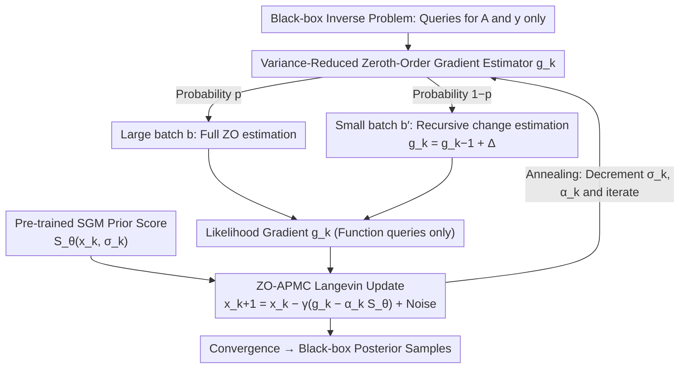

# Zeroth-Order Non-Log-Concave Sampling with Variance Reduction and Applications to Inverse Problems

**Conference**: ICML2026  
**arXiv**: [2605.30573](https://arxiv.org/abs/2605.30573)  
**Code**: None  
**Area**: Optimization / Sampling Algorithms / Black-box Inverse Problems  
**Keywords**: Zeroth-order sampling, non-log-concave distribution, variance reduction, Langevin Monte Carlo, inverse problems  

## TL;DR
This paper proposes a zeroth-order Langevin sampling method with variance reduction, replacing the $O(d)$ function queries per step with intermittent large-batch estimates and recursive small-batch updates. It extends the method to ZO-APMC, utilizing pre-trained score-based priors for posterior sampling with convergence guarantees in black-box inverse problems where only forward model queries are available.

## Background & Motivation
**Background**: Sampling from an unnormalized density $\pi \propto \exp(-f)$ is a fundamental tool in machine learning, Bayesian inference, and inverse problems. If $\nabla f$ is accessible, Langevin Monte Carlo can iterate along the score of the target distribution; if only function values can be queried, a common practice is to construct zeroth-order gradient estimators using finite differences or random directions.

**Limitations of Prior Work**: Zeroth-order estimators suffer from high variance in high dimensions. To ensure sufficient accuracy in gradient estimation, naive batched ZO-LMC typically requires a batch size that grows linearly with the dimension $d$. In high-dimensional problems such as MRI, black hole imaging, and PDE inversion, this translates to massive forward model calls and memory overhead. More critically, existing theories primarily cover strongly log-concave targets, whereas the actual posteriors associated with score-based generative priors are often non-log-concave and multimodal.

**Key Challenge**: Black-box inverse problems most urgently require posterior sampling to express uncertainty, yet black-box forward operators often lack available gradients, pseudo-inverses, or differentiable implementations. Direct zeroth-order estimation is prohibitively expensive, while heuristic black-box posterior samplers lack non-asymptotic convergence guarantees. This work aims to simultaneously address the requirements of "computational feasibility" and "theoretical convergence."

**Goal**: First, establish non-asymptotic theory for zeroth-order sampling under non-log-concave targets; second, design a variance-reduced estimator requiring only constant function queries per step; third, embed this estimator into an annealed posterior sampler with SGM priors to enable sampling in black-box inverse problems like MRI, black hole imaging, and Navier-Stokes using only forward evaluations.

**Key Insight**: The authors borrow the concept of "stationary point analysis" from non-convex optimization, treating the relative Fisher information in sampling as the gradient norm of the KL divergence in Wasserstein space. That is, rather than forcing the target to be log-concave, it is proven that the time-averaged distribution approaches the target distribution in terms of FI or TV distance.

**Core Idea**: Instead of re-estimating the zeroth-order gradient with a large batch at every step, the algorithm occasionally refreshes a large-batch estimate and uses small batches to estimate the change in gradients during other steps, leveraging the fact that adjacent Langevin iterations are highly correlated.

## Method
The methodology consists of two layers: the base layer is variance-reduced ZO-LMC for sampling from non-log-concave target distributions; the application layer is ZO-APMC, which combines this estimator with annealed score-based priors to solve posterior sampling in black-box inverse problems.

### Overall Architecture
The fundamental problem involves querying the potential $f(x)$ without the ability to compute $\nabla f(x)$. A naive zeroth-order estimator computes $\tilde{\nabla} f_\mu(x,u)=((f(x+\mu u)-f(x))/\mu)u$ along a random direction $u \sim \mathcal{N}(0,I)$, then integrates it into LMC updates. This paper replaces the estimator rather than the LMC structure: a recursive $g_k$ estimates the gradient of the smoothed potential $\nabla f_\mu(x_k)$, followed by the update $x_{k+1}=x_k-\gamma g_k+\sqrt{2}(B_{(k+1)\gamma}-B_{k\gamma})$.

In inverse problems, observations satisfy $y=A(x)+\xi$, where $A$ is accessible only as a black box. The posterior can be written as the product of likelihood and prior; the likelihood score is estimated via zeroth-order methods, and the prior score is approximated by a pre-trained SGM $S_\theta(x,\sigma)$. ZO-APMC simultaneously uses $g_k$ and a weighted score prior at each annealing step, forming $x_{k+1}=x_k-\gamma(g_k-\alpha_k S_\theta(x_k,\sigma_k))+$ Langevin noise.

### Key Designs
**1. Variance-Reduced Zeroth-Order Gradient Estimator: Trading Iteration Correlation for Computation**: To suppress variance, naive zeroth-order estimators require batch sizes that scale linearly with the dimension $d$, leading to massive forward calls in high-dimensional problems like MRI. This design addresses this bottleneck: with probability $p$, a full zeroth-order estimate is computed with batch size $b$; with probability $1-p$, the previous estimate $g_{k-1}$ is reused, and only a small batch $b'$ is used to estimate the gradient change between adjacent steps $\tilde{\nabla}f_\mu(x_k,u)-\tilde{\nabla}f_\mu(x_{k-1},u)$. Since adjacent Langevin iterates are typically close, the variance of this difference is much smaller than that of the direct gradient estimate. Essentially, it replaces "re-estimating the absolute gradient every step" with "intermittent refreshing + tracking gradient changes," utilizing the strong correlation between iterates to achieve $O(1)$ function queries per step, making the batch size independent of the dimension.

**2. Characterizing Non-Log-Concave Sampling Convergence via Relative Fisher Information (Theoretical Pillar)**: Non-log-concave distributions are often multimodal, causing traditional strong convexity or strong log-concave analyses to fail. The authors adopt the "stationary point analysis" philosophy from non-convex optimization, treating the relative Fisher information $\mathrm{FI}(\nu\|\pi)$ as the gradient norm of the KL divergence in Wasserstein space—analogous to using gradient norms to define stationary points in optimization. Theorem 1 proves that reaching an $\varepsilon$-relative FI error for the time-averaged distribution requires $O(d^7 L_m^4/\varepsilon^4)$ iterations, but with $O(1)$ function queries per step. If the target further satisfies a Poincaré inequality, this can be converted into guarantees in squared TV distance. FI provides an intermediate metric that expresses "score alignment" and derives TV convergence, representing the first non-asymptotic convergence characterization for zeroth-order non-log-concave sampling.

**3. ZO-APMC Black-Box Posterior Sampling: Enabling SGM Priors for Non-Differentiable Forward Operators**: Powerful SGM priors typically assume access to forward model gradients. However, in reality, forward operators are often non-differentiable, closed-source, or PDE simulators. ZO-APMC embeds the aforementioned variance-reduced zeroth-order estimator into an annealed posterior sampling framework: the likelihood is defined by the black-box forward operator and observations, with its gradient estimated by $g_k$, while the prior score is provided by a pre-trained SGM $S_\theta(x_k,\sigma_k)$. The update rule is $x_{k+1}=x_k-\gamma(g_k-\alpha_k S_\theta(x_k,\sigma_k))+$ Langevin noise. The annealing schedule simultaneously decays the prior smoothing scale $\sigma_k$ and the weight $\alpha_k$, allowing the sampler to escape low-probability plateaus under a smoothed prior before gradually emphasizing the true likelihood. This allows non-differentiable or simulator-based forward operators to utilize a Bayesian reconstruction framework with convergence guarantees.

### Loss & Training
This work does not train new generative models; experiments use existing or custom-trained SGM priors. Key hyperparameters for the algorithm include step size $\gamma$, ZO smoothing parameter $\mu$, refresh probability $p$, large/small batch sizes $b, b'$, and the annealing schedule $\alpha_k=\max\{\alpha_0\rho_1^k,1\}$, $\sigma_k=\max\{\sigma_0\rho_2^k,\sigma_{min}\}$. In theory, these parameters are set to scale with the number of iterations and dimensions to balance zeroth-order estimation bias, estimation variance, and Langevin discretization error.

## Key Experimental Results

### Main Results
The authors first verify FI convergence in toy experiments, then compare black-box posterior samplers on MRI, black hole imaging, and Navier-Stokes inversion. MRI and black hole imaging provide complete quantitative tables. In Navier-Stokes, ZO-APMC is stable in visual quality, with NRMSE close to DPG but not consistently outperforming EnKG/DPG.

| Task | Metric | ZO-APMC | Strongest Black-box Baseline | Gradient-available Reference | Conclusion |
|------|------|---------|-------------------|--------------|------|
| Toy FI convergence | FI | Approaches 0 for p=1/0.75/0.5; unstable for p=0.3 | N/A | APMC | Under fixed cost per step $pb=10$, multiple sets reach FI < 0.01 within 2000 iterations. |
| MRI reconstruction | PSNR / SSIM / NRMSE | 35.29 / 0.966 / 2.28e-2 | DPG: 32.17 / 0.953 / 5.4e-2 | APMC: 36.55 / 0.973 / 1.99e-2 | Best overall among black-box methods, close to gradient-based APMC. |
| Black-hole imaging | PSNR / blurred PSNR | 26.71 / 32.86 | Forward-GSG: 26.21 / 31.47 | APMC: 26.23 / 31.32 | ZO-APMC leads black-box baselines in PSNR and measurement consistency. |
| Navier-Stokes inverse | NRMSE / flow quality | Comparable to DPG | EnKG / DPG | No gradient baseline | Provides clearer convergence explanation though not best in all metrics. |

### Ablation Study
The core analysis focuses on the trade-off between $p, b, b'$ and performance/cost for black-box methods. The following table summarizes quantitative comparisons in MRI and black hole imaging, demonstrating the practical efficacy of variance-reduced zeroth-order estimation in high-dimensional settings.

| Scenario | Method | PSNR | SSIM / blurred PSNR | Error Metric | Description |
|------|------|------|---------------------|----------|------|
| MRI | PnPDM | 30.81 | SSIM 0.946 | MSE 8.46e-4 | Gradient-based baseline, lower quality than ZO-APMC. |
| MRI | DPS | 34.38 | SSIM 0.965 | MSE 4.07e-4 | Close to ZO-APMC, but still 0.91 dB lower. |
| MRI | APMC | 36.55 | SSIM 0.973 | MSE 2.55e-4 | Gradient-based upper bound reference. |
| MRI | ZO-APMC | 35.29 | SSIM 0.966 | MSE 3.29e-4 | Uses function queries only, approaches APMC. |
| Black-hole | Forward-GSG | 26.21 | blurred PSNR 31.47 | $\chi^2_{cph}=6.77$ | Strong black-box baseline. |
| Black-hole | Central-GSG | 21.63 | blurred PSNR 23.73 | $\chi^2_{cph}=80.31$ | Central differences did not provide stable improvement. |
| Black-hole | ZO-APMC | 26.71 | blurred PSNR 32.86 | $\chi^2_{cph}=5.42$ | Best PSNR and measurement fitting. |

### Key Findings
- There is a clear trade-off in the refresh probability $p$: very small $p$ reduces total function evaluations but exacerbates error propagation, with instability observed at $p=0.3$ in toy experiments; $p=0.5$ is more balanced.
- In MRI, ZO-APMC with $p=0.2, b=10^4, b'=10^3$ approaches the performance of the gradient-based APMC on 256x256 high-dimensional images, suggesting that the theoretical polynomial complexity is conservative and the method is practical.
- Nonlinear forward models in black hole imaging highlight the black-box advantage: ZO-APMC does not rely on differentiable forward operators yet outperforms heuristic methods like GSG, DPG, and EnKG in closure phase/amplitude error.

## Highlights & Insights
- This paper transplants variance reduction ideas from zeroth-order optimization into sampling but does not simply copy them; it specifically handles the coupling of Langevin discretization error and ZO smoothing bias, which is precisely where sampling is more complex than optimization.
- Using relative Fisher information to bridge non-convex optimization and non-log-concave sampling is highly insightful. It allows the analysis of whether a sampling algorithm approaches the target distribution to mirror analysis of whether optimization approaches a stationary point, while retaining meaning at the probability distribution level.
- The practical value of ZO-APMC lies in extending SGM priors from solvers requiring forward gradients to truly black-box simulators or proprietary systems. This approach can transition to medical devices, climate/fluid simulations, industrial modeling, and closed-source physics engines.

## Limitations & Future Work
- The theoretical complexity has a $d^7$ dependence on dimension, which is very conservative; while experimental results are better, a significant gap remains between theory and practice.
- Assumption 1 requires the potential function to be globally Lipschitz, which is unnatural for many common distributions. The authors acknowledge this condition is better suited for practical settings with compact domains, normalization, or gradient clipping.
- ZO-APMC does not consistently outperform EnKG/DPG on Navier-Stokes, indicating that convergence guarantees do not always equate to empirical optimality across all tasks. Future work should systematically study performance under different forward operators, noise levels, and prior mismatches.
- High-resolution image experiments still require relatively large batches (e.g., $b=10^4, b'=10^3$ in MRI), which may become a bottleneck when deployed to expensive simulators.

## Related Work & Insights
- **vs Roy et al.'s ZO-LMC**: Early ZO-LMC primarily analyzed strongly log-concave targets and required batch sizes to grow with dimension; this work shifts to non-log-concave targets and utilizes variance reduction to reduce average function queries per step to a constant level.
- **vs APMC / DPS / PnPDM**: These posterior samplers depend on forward model gradients or differentiable structures in many settings; ZO-APMC sacrifices some efficiency for broader applicability and convergence guarantees with truly black-box forward operators.
- **vs GSG / DPG / EnKG**: These black-box methods are based on heuristic approximations and can be competitive or stronger in some tasks; the advantage of ZO-APMC lies in integrating hyperparameters, annealing, and sampling error into a unified theoretical framework.

## Rating
- Novelty: ⭐⭐⭐⭐☆ Effectively combines variance-reduced zeroth-order estimation, non-log-concave sampling theory, and SGM for inverse problems.
- Experimental Thoroughness: ⭐⭐⭐⭐☆ Covers toy, MRI, black hole imaging, and PDE inversion, though ablation focuses more on parameter sensitivity than large-scale simulator cost analysis.
- Writing Quality: ⭐⭐⭐⭐☆ The theoretical main line is clear and the motivation is well-justified; formulas are dense, presenting some entry barriers for those without a sampling background.
- Value: ⭐⭐⭐⭐☆ Highly valuable for black-box Bayesian inverse problems, particularly in scenarios where forward models are non-differentiable or proprietary.

<!-- RELATED:START -->

## Related Papers

- [\[ICCV 2025\] FlowDPS: Flow-Driven Posterior Sampling for Inverse Problems](../../ICCV2025/image_generation/flowdps_flow-driven_posterior_sampling_for_inverse_problems.md)
- [\[ICML 2026\] Saving Foundation Flow-Matching Priors for Inverse Problems](saving_foundation_flow-matching_priors_for_inverse_problems.md)
- [\[NeurIPS 2025\] NPN: Non-Linear Projections of the Null-Space for Imaging Inverse Problems](../../NeurIPS2025/image_generation/npn_non-linear_projections_of_the_null-space_for_imaging_inverse_problems.md)
- [\[ICML 2026\] Stable Velocity: A Variance Perspective on Flow Matching](stable_velocity_a_variance_perspective_on_flow_matching.md)
- [\[ICML 2026\] Stage-wise Distortion-Perception Traversal in Zero-shot Inverse Problems with Diffusion Models](stage-wise_distortion-perception_traversal_in_zero-shot_inverse_problems_with_di.md)

<!-- RELATED:END -->
