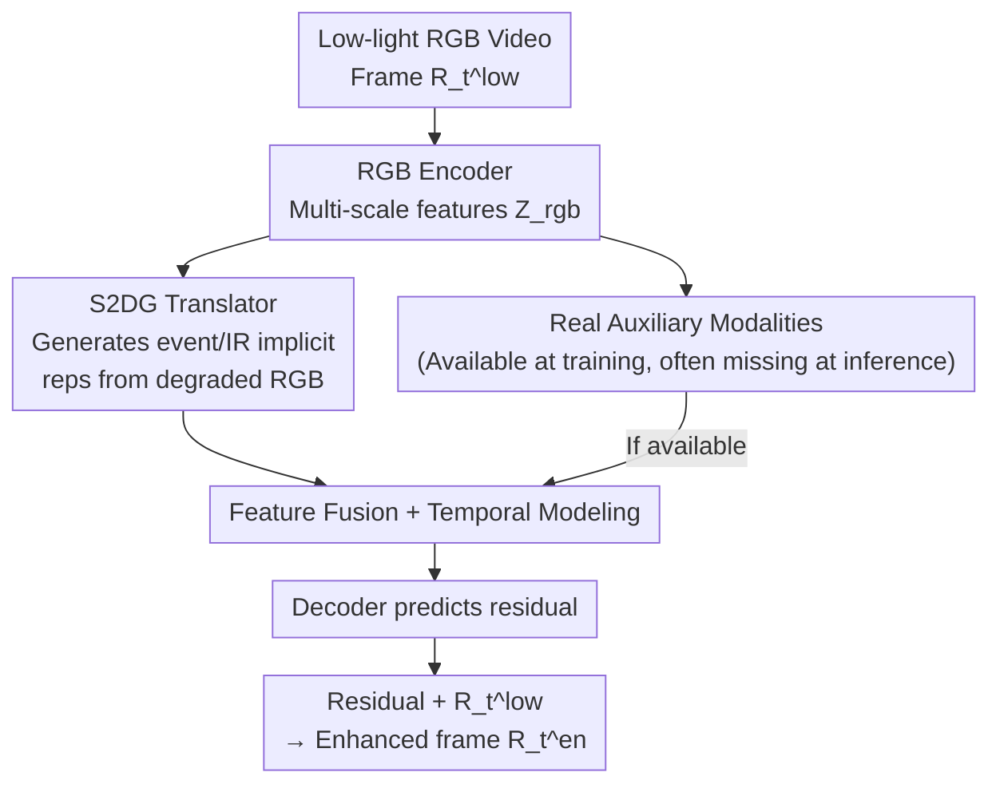

# AnyMod-LLVE: Low-Light Video Enhancement with Modality-Agnostic Inference

**Conference**: ICML2026  
**arXiv**: [2606.11186](https://arxiv.org/abs/2606.11186)  
**Code**: Project page (The paper states "Code and models available", but no specific link is provided)  
**Area**: Image/Video Restoration  
**Keywords**: Low-light video enhancement, missing modalities, implicit modality generation, frequency-domain gating, multi-modal pre-training

## TL;DR
Addressing the issue where "multi-modal low-light video enhancement collapses when event streams or infrared auxiliary modalities are unavailable during inference," AMNet utilizes a Spatial-Spectral Dual-Gated (S2DG) Translator to generate implicit representations of auxiliary modalities from degraded low-light RGB inputs. Combined with large-scale synthetic multi-modal pre-training, this allows stable enhancement regardless of modality availability during testing—achieving SOTA with RGB-only inference, with further gains when auxiliary modalities are provided.

## Background & Motivation
**Background**: Mainstream low-light video enhancement (LLVE) approaches fall into two categories. One is RGB-only, relying on Retinex/illumination decomposition (RetinexFormer, Cai et al.) and temporal consistency modeling (STCD, Xu et al.) for brightening and denoising. The other involves recent multi-modal methods (EvLight, EvLight++) that introduce event streams or infrared (IR) images to provide complementary motion dynamics and structural priors, showing significantly stronger detail recovery.

**Limitations of Prior Work**: Multi-modal methods operate under a strong implicit assumption: auxiliary modalities must be present during both training and inference. However, event and IR cameras require extra hardware, meticulous calibration, and strict spatio-temporal synchronization. In real-world deployments, high-quality multi-modal data is often unavailable or partially corrupted. Once an auxiliary modality is missing at inference, existing multi-modal models experience a massive performance drop, resulting in poor deployability.

**Key Challenge**: The desire to use multi-modal information during training (as it is beneficial) conflicts with the necessity of being robust to missing modalities during inference. A compromise is "using generative models to explicitly complete missing modalities at test time," but invoking generative models during inference introduces significant latency, making them impractical for real-time scenarios.

**Goal**: To develop a unified framework capable of inference under any combination of available modalities—utilizing auxiliary modalities when present and remaining self-sufficient otherwise—without invoking expensive generative models during inference.

**Key Insight**: Rather than treating auxiliary modalities as "required inputs," they should be viewed as "implicit supports inferable from RGB." The challenge lies in the fact that low-light RGB itself is severely degraded; local textures and sharp edges are fragile and often submerged in sensor noise, making it difficult to extract reliable multi-modal cues from such inputs.

**Core Idea**: Utilize a frequency analysis-driven dual-gated translator to identify and extract "sparse but useful high-frequency details that survive low-light observations" and translate them into implicit representations of auxiliary modalities. Large-scale pre-training on synthetic multi-modal data is used to learn these cross-modal correspondences as priors.

## Method

### Overall Architecture
AMNet receives a low-light video sequence $\{R_t^{low}\}_{t=1}^{T}$ and outputs an enhanced video $\{R_t^{en}\}_{t=1}^{T}$. During training, event streams $\{\mathcal{E}_t\}$ and infrared images $\{I_t\}$ are available, while they may be missing during inference.

Each frame $R_t^{low}\in\mathbb{R}^{H\times W\times 3}$ is first processed by an RGB encoder to extract multi-scale features $\mathcal{Z}_t^{rgb}$, serving as the foundational representation for enhancement and modality generation. If auxiliary modalities are available during training, the event stream is converted into an event voxel grid $E_t\in\mathbb{R}^{H\times W\times B}$ and the IR image is represented as a single channel $I_t\in\mathbb{R}^{H\times W\times 1}$, with both processed by modality-specific encoders. The core component, the S2DG Translator, learns the correspondence between RGB and auxiliary modalities: when a modality is missing, it generates a corresponding implicit auxiliary representation from RGB features. Subsequently, RGB features are fused with (real or generated) auxiliary features and sent to a temporal modeling module to capture inter-frame dependencies. Finally, the decoder predicts a residual map, which is added to $R_t^{low}$ to obtain the output $R_t^{en}$.

### Key Designs

**1. Modality-Agnostic Inference: Treating auxiliary modalities as optional cues rather than required inputs**

This design directly addresses the "collapse when modalities are missing" pain point. AMNet no longer treats event streams/IR as mandatory inputs at test time but models them as "implicit supports inferrable from RGB." Specifically, when auxiliary modalities are available, the framework ingests explicit signals and extracts structural information; when missing, AMNet generates a modality-specific implicit representation $\hat{Z}_t^m$ to replace real features during decoding (e.g., $\hat{R}_{t,en}^{r}=\mathcal{D}(Z_t^{rgb},\hat{Z}_t^{ir},\hat{Z}_t^{evt})$). Thus, the same network covers any combination of "full modality / event-only / IR-only / all missing." Since the implicit representation is obtained via a lightweight translator's forward pass, it avoids the latency associated with expensive generative models used in explicit completion schemes.

**2. S2DG Translator: Distilling reliable high-frequency cues from degraded RGB (IADS + FBS Dual Gating)**

This is the technical core, solving the problem: "how to select credible high-frequency cues to translate into auxiliary modalities when details in low-light RGB are sparse and noise-polluted." S2DG places two gates—one in the spatial domain and one in the spectral domain—working in series.

The first is the **Illumination-Aware Detail Selector (IADS)**, which weights high-frequency details in the spatial domain based on illumination reliability. It first decomposes RGB features into low-frequency and high-frequency components:

$$Z_{low}=\mathrm{AvgPool}(Z_t^{rgb}),\qquad Z_{high}=Z_t^{rgb}-Z_{low}.$$

$Z_{low}$ captures global illumination distribution, while $Z_{high}$ contains local detail responses mixed with noise. Based on $Z_{low}$, it predicts a spatial reliability map $M_{spatial}=\sigma(\mathrm{Conv}_{1\times 1}(Z_{low}))$, then re-weights the high-frequency components: $\tilde{Z}_{high}=Z_{high}\odot M_{spatial}$, thereby suppressing high-frequency components in poorly lit regions dominated by noise.

The second is the **Frequency-Band Selector (FBS)**, which further preserves and strengthens useful frequency bands while inhibiting noise-dominated responses in the spectral domain. It performs a channel-wise 2D FFT on $\tilde{Z}_{high}$ to obtain $F_{freq}=\mathcal{F}(\tilde{Z}_{high})$, predicts a spectral gate $G_{spec}=\sigma(\mathrm{Conv}(F_{freq}))$ and a spectral scaling factor $S_{spec}=\tanh(\mathrm{Conv}(F_{freq}))$, and jointly modulates the spectral features: $F_{out}=F_{freq}\odot G_{spec}\odot(1+S_{spec})$, followed by an inverse FFT back to the spatial domain: $\hat{Z}_{high}=\mathcal{F}^{-1}(F_{out})$. Finally, global context that might have been suppressed by selective gating is recovered via a residual: $\hat{Z}_t^m=\hat{Z}_{high}+Z_{low}$. This $\hat{Z}_t^m$ serves as the implicit representation for the given auxiliary modality. Each auxiliary modality uses an independent S2DG for modality-specific generation. This is effective because it does not attempt to "create something from nothing" to recover all details, but explicitly prioritizes the credible high-frequency parts that survive low light, avoiding the amplification of noise as signal.

**3. Large-Scale Synthetic Multi-modal Pre-training: Learning cross-modal correspondences as priors**

Paired multi-modal LLVE data is extremely scarce, making it difficult to learn reliable cross-modal correspondences through direct supervision alone. This design leverages generative models to create pseudo-multi-modal data: using v2e to synthesize event streams from RGB and ThermalGen for IR images, with source data coming from diverse video sets like segmentation and super-resolution. Paired normal-light/low-light RGB is then generated via physical degradation models (illumination sampled uniformly between 10%–50%, plus 1%–10% long-tail extremely dark cases). Pre-training S2DG on this pseudo-multi-modal data allows it to learn RGB $\leftrightarrow$ auxiliary modality correspondences as a prior, which continues to benefit downstream RGB-only fine-tuning. Notably, synthesis is used only on the training side; since invoking generative models at inference would introduce latency, modality absence remains a real concern during testing, highlighting the value of modality-agnostic inference.

### Loss & Training
The total objective consists of three terms: $\mathcal{L}_{total}=\lambda_1\mathcal{L}_{rec}^{full}+\lambda_2\mathcal{L}_{rec}^{miss}+\lambda_3\mathcal{L}_{dt}$.

- **Full-Modality Reconstruction** $\mathcal{L}_{rec}^{full}$: Decodes frames using all real modalities and computes an $\ell_1$ pixel loss + SSIM structural loss against the normal-light reference frame: $\mathcal{L}_{rec}^{full}=\mathcal{L}_p+\lambda_s\mathcal{L}_s$.
- **Missing-Modality Simulation** $\mathcal{L}_{rec}^{miss}$: During training, all combinations of auxiliary modality availability $m\subset\{\text{ir},\text{evt}\}$ (event-only, IR-only, none, etc.) are enumerated. Enhanced frames for each combination are supervised by the same reconstruction loss: $\mathcal{L}_{rec}^{miss}=\sum_m \mathcal{L}_{rec}^m(\hat{R}_{t,en}^m,R_t^{gt})$, forcing the model to produce high-quality frames even with incomplete auxiliary info.
- **Feature Distillation** $\mathcal{L}_{dt}$: Aligns generated implicit representations $\hat{Z}_t^m$ with real modality features $Z_t^m$ by calculating the $\ell_2$ distance between normalized features, using stop-gradient on the real branch: $\mathcal{L}_{dt}=\sum_m \lambda_m\big\|\hat{Z}_t^m/\|\hat{Z}_t^m\|_2 - \mathrm{sg}(Z_t^m/\|Z_t^m\|_2)\big\|_2^2$.

Training uses AdamW (initial learning rate $2\times10^{-4}$, cosine scheduler + 5 warm-up epochs) with $128\times128$ crops and a clip length of 8. Pre-training is distributed across 4 A800 GPUs, while downstream fine-tuning uses a single A800 with a batch size of 32.

## Key Experimental Results

### Main Results
Under the RGB-only setting (no auxiliary modalities provided during inference), AMNet leads across three real-world LLVE datasets:

| Dataset | Metric | Ours | Prev. SOTA (STCD) | Gain |
|--------|------|------|----------------|------|
| DID | PSNR / SSIM | 31.57 / 0.95 | 30.10 / 0.93 | +1.47 dB / +0.02 |
| SDSD-Indoor | PSNR / SSIM | 29.03 / 0.92 | 28.93 / 0.88 | +0.10 dB / +0.04 |
| SDSD-Outdoor | PSNR / SSIM | 26.37 / 0.84 | 26.32 / 0.82 | +0.05 dB / +0.02 |

On the multi-modal SDE dataset, compared to event-dependent multi-modal methods (e.g., EvLight++): AMNet outperforms them even when using only RGB (R); performance further increases when providing events (R+E), IR (R+I), or both (R+E+I):

| Inference Modality | SDE-Indoor PSNR/SSIM | SDE-Outdoor PSNR/SSIM |
|----------|----------------------|------------------------|
| EvLight++ (R+E) | 22.67 / 0.779 | 23.34 / 0.768 |
| AMNet (R, RGB-only) | 23.04 / 0.816 | 23.75 / 0.775 |
| AMNet (R+E) | 23.22 / 0.827 | 23.88 / 0.791 |
| AMNet (R+E+I) | 23.25 / 0.828 | 23.91 / 0.791 |

In zero-shot (no fine-tuning) comparisons against restoration foundation models (FoundIR, DarkIR, etc.), AMNet achieves 25.07/0.93 on DID, 22.27/0.87 on SDSD-Indoor, and 21.43/0.74 on SDSD-Outdoor, significantly outperforming them (e.g., DarkIR achieves only 19.62/0.82 on DID), demonstrating that large-scale multi-modal pre-training markedly enhances generalization.

### Ablation Study
Ablation of the two S2DG sub-modules (DID dataset, PSNR/SSIM):

| IADS | FBS | DID | SDSD-Indoor | SDSD-Outdoor |
|------|-----|-----|-------------|--------------|
| ✗ | ✗ | 29.85 / 0.93 | 28.31 / 0.91 | 25.93 / 0.81 |
| ✓ | ✗ | 30.30 / 0.93 | 28.60 / 0.91 | 26.05 / 0.81 |
| ✗ | ✓ | 30.95 / 0.94 | 29.20 / 0.92 | 26.25 / 0.82 |
| ✓ | ✓ | 31.57 / 0.95 | 29.03 / 0.92 | 26.37 / 0.84 |

Ablation of pre-training data scale (0% $\to$ 100%): PSNR on DID rises from 29.78 to 31.57, while the L2 distance between generated representations and real modalities (Event/IR) drops from 0.328/0.314 to 0.289/0.277.

### Key Findings
- **FBS contributes more than IADS**: Enabling only FBS raises DID PSNR to 30.95, while only IADS reaches 30.30; the two are complementary, reaching 31.57 when both are enabled. This indicates that spectral selection is the primary driver for picking credible high-frequency cues, with spatial illumination gating serving as a secondary support.
- **Pre-training: More and more "realistic" is better**: As pre-training data increases from 0% to 100%, downstream RGB-only performance rises monotonically, and the L2 distance between generated implicit representations and real modality features drops monotonically—validating that large-scale synthetic multi-modal pre-training indeed learns more accurate cross-modal correspondences.
- **Minimal drop with missing modalities**: From full R+E+I to RGB-only, the SDE-Indoor PSNR only drops from 23.25 to 23.04 ($\sim$0.21 dB), which is far superior to the performance collapse observed in existing multi-modal methods when modalities are missing.

## Highlights & Insights
- **Shifting from explicit generation to implicit translation for missing modalities**: This is the most clever step—it retains the benefits of multi-modal information while avoiding the latency of running generative models during inference, finding a truly deployable balance between accuracy and utility.
- **Spectral analysis as a "Detail Filter"**: Rather than greedily attempting to recover all details in low light, the model acknowledges that details are sparse and prioritizes surviving credible high-frequency components. The dual-gating of FBS+IADS implements this intuition, a strategy transferable to any restoration task where inputs are degraded and signal must be picked from noise.
- **Pragmatic use of synthetic data**: The authors clearly recognize that invoking generative models during inference is impractical. Thus, synthesis is used only to expand training scale and bake cross-modal correspondences into the model as a prior—this "generous in training, austere in inference" design philosophy is worth emulating.

## Limitations & Future Work
- The quality of implicit representations depends on the quality of synthetic multi-modal data (v2e, ThermalGen); the gap between synthetic and real distributions will propagate downstream. While L2 distance is used as a metric, failure modes in extreme scenarios are not deeply explored.
- PSNR gains on SDSD relative to the previous SOTA are small (0.05–0.10 dB), with major gains concentrated in DID and zero-shot settings; the advantage of the method is not uniform across all datasets.
- Gains for IR come from synthetic (not real) IR inputs; the upper bound for performance when real IR is missing is not fully validated on true IR test sets.
- Potential improvements: Upgrade the selection of "surviving high frequencies" from heuristic gating to learnable uncertainty modeling, or introduce confidence estimation for generated implicit representations to dynamically determine fusion weights.

## Related Work & Insights
- **vs. EvLight / EvLight++ (Multi-modal LLVE)**: These treat event streams as mandatory inference inputs and collapse when they are missing; AMNet treats auxiliary modalities as optional cues and uses S2DG to substitute missing information, with RGB-only results even outperforming their full-modality results.
- **vs. LLVE-SEG (Explicit Synthesis of Missing Modalities)**: LLVE-SEG explicitly generates missing modalities during inference, introducing significant computation and latency; AMNet follows an implicit representation route requiring only a single lightweight translator pass, offering better inference practicality.
- **vs. RetinexFormer / STCD (RGB-only LLVE)**: These are limited by the information degradation of low-light RGB itself; AMNet distills structural priors from auxiliary modalities into the RGB branch via multi-modal pre-training, breaking the information ceiling of pure RGB.

## Rating
- Novelty: ⭐⭐⭐⭐ Converting missing modality completion from explicit generation to implicit translation + spectral gating for detail filtering is novel and practical.
- Experimental Thoroughness: ⭐⭐⭐⭐ Complete evaluation across three real datasets, multi-modal/RGB-only/zero-shot/ablation; however, gains on some datasets are small and real IR validation is insufficient.
- Writing Quality: ⭐⭐⭐⭐ Clear motivation and methodology, complete formulas, and well-supported figures/tables.
- Value: ⭐⭐⭐⭐ Directly addresses deployment pain points for multi-modal methods, holding practical significance for real low-light scenarios like autonomous driving and surveillance.

<!-- RELATED:START -->

## Related Papers

- [\[ECCV 2024\] Unrolled Decomposed Unpaired Learning for Controllable Low-Light Video Enhancement](../../ECCV2024/image_restoration/unrolled_decomposed_unpaired_learning_for_controllable_low-light_video_enhanceme.md)
- [\[ECCV 2024\] Towards Real-world Event-guided Low-light Video Enhancement and Deblurring](../../ECCV2024/image_restoration/towards_real-world_event-guided_low-light_video_enhancement_and_deblurring.md)
- [\[CVPR 2026\] Bi-Bridge: Bidirectional Diffusion Bridges for Low-Light Image Enhancement](../../CVPR2026/image_restoration/bi-bridge_bidirectional_diffusion_bridges_for_low-light_image_enhancement.md)
- [\[CVPR 2026\] Multinex: Lightweight Low-light Image Enhancement via Multi-prior Retinex](../../CVPR2026/image_restoration/multinex_lightweight_low-light_image_enhancement_via_multi-prior_retinex.md)
- [\[CVPR 2026\] MR. Illuminate: Zero-Shot Low-Light Image Enhancement with Diffusion Prior](../../CVPR2026/image_restoration/mr_illuminate_zero-shot_low-light_image_enhancement_with_diffusion_prior.md)

<!-- RELATED:END -->
