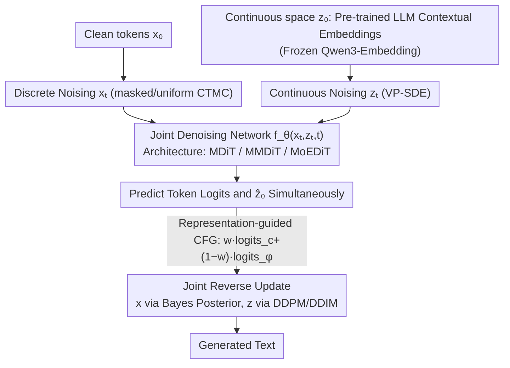

# Coevolutionary Continuous Discrete Diffusion: Make Your Diffusion Language Model a Latent Reasoner

**Conference**: ICML 2026  
**arXiv**: [2510.03206](https://arxiv.org/abs/2510.03206)  
**Code**: https://github.com/zhouc20/CCDD (Available)  
**Area**: Diffusion Language Models / Latent Reasoning / Multi-modal Diffusion  
**Keywords**: Diffusion LM, Latent Reasoning, Joint Continuous-Discrete Diffusion, Looped Transformer, CFG

## TL;DR
This paper systematically compares continuous diffusion, discrete masked diffusion, and looped transformers across the dimensions of expressivity and trainability. It proves that "continuous diffusion" is strictly more expressive than discrete diffusion and can simulate looped transformers, but its practical performance is limited by decoding and representation space. Consequently, the paper proposes **CCDD (Coevolutionary Continuous Discrete Diffusion)**—diffusion performed simultaneously on the discrete token space and the contextual embedding space of a pre-trained LLM, with a single model for joint denoising. CCDD reduces perplexity by 25-35% compared to MDLM on LM1B/OWT and outperforms MDLM with 256 steps using only 8 sampling steps.

## Background & Motivation
**Background**: Language modeling is currently dominated by autoregressive LLMs. Non-autoregressive approaches fall into two categories: continuous diffusion language models (CDM, SDE/PF-ODE, early but weak) and discrete diffusion language models (DDM, notably masked diffusion like MDLM/SEDD, which recently surpassed CDM). Simultaneously, there is a "latent reasoning" path: looped transformers (LT) and continuous CoT, which theoretically break the expressivity upper bound of transformers in $\mathsf{TC^0}$.

**Limitations of Prior Work**: (1) LT is theoretically strong but lacks intermediate supervision, leading to severe OOD issues during rollout compared to training, making it hard to use practically; (2) CDM should theoretically be stronger but is outperformed by DDM in practice, which the authors attribute to a triple trainability issue: "excessive decision space, poor embedding space, and complex decoding combinations"; (3) Although masked DDM is trainable, quantizing logits into tokens at each step loses uncertainty memory across steps and sacrifices self-correction capabilities.

**Key Challenge**: The fundamental trade-off between **expressive power upper bounds $\leftrightarrow$ practical trainability**. Continuous representations preserve complete information for reasoning but are difficult to train and decode; discrete representations provide clear training objectives but suffer from information bottlenecks.

**Goal**: To construct a unified framework that combines (a) the high expressivity of continuous CDM (covering LT), (b) the good trainability of discrete DDM, (c) the semantic priors of pre-trained LLM embeddings, and (d) flexible NFE sampling, without sacrificing any component.

**Key Insight**: Redefine "language diffusion" in a **joint multi-modal space** of $\mathcal{X} \times \mathcal{Z}$—where discrete tokens provide an easily decodable "skeleton" and contextual embeddings from pre-trained LLMs provide smooth, information-rich "flesh." Two sets of noise are injected in parallel, and a single network denoises them simultaneously.

**Core Idea**: Use a joint CTMC × SDE process combining "discrete token diffusion + continuous contextual embedding diffusion" for language modeling. The continuous part handles latent reasoning memory across steps, while the discrete part ensures high-confidence decoding.

## Method

### Overall Architecture
CCDD addresses the old contradiction where "continuous diffusion has the strongest expressivity but is the hardest to train" by moving language diffusion to a joint multi-modal space of $\mathcal{X} \times \mathcal{Z}$: discrete tokens $x$ provide a decodable, strongly supervised "skeleton," while continuous contextual embeddings $z$ provide smooth, information-rich "flesh" capable of preserving probability history across steps. During the forward process, independent noise is injected into clean data $(x_0, z_0)$—$x_t \sim \text{Cat}(\eta_t x_0 + (1-\eta_t)\pi_t)$ follows a masked/uniform CTMC, and $z_t \sim \mathcal{N}(\alpha_t z_0, \sigma_t^2 I)$ follows a VP-SDE. In the reverse process, a single network $f_\theta(x_t, z_t, t)$ intakes both noisy states to predict token logits and embedding $\hat{x}_{0,\theta}, \hat{z}_{0,\theta}$. They are then updated according to their respective modalities (DDPM/DDIM for $z$, and Bayes posterior eq. (8) for $x$). The training objective is a weighted sum of the two ELBOs: $\mathcal{L}_{\text{CCDD}} = \gamma_{\text{cont}} \mathcal{L}_{\text{cont}} + \gamma_{\text{disc}} \mathcal{L}_{\text{disc}}$.

### Key Designs

**1. Joint Continuous-Discrete Diffusion Process: One Network Running CTMC and SDE**

Addressing the conflicting pain points of DDM (quantizing logits into tokens every step loses uncertainty memory) and CDM (decoding tokens from continuous space leads to combinatorial explosion), CCDD designs the forward process as a fully separable product $q_t(x_t,z_t|x_0,z_0) = q_t^{\text{disc}}(x_t|x_0)\, q_t^{\text{cont}}(z_t|z_0)$ for simple noise injection. However, the reverse process is defined as $p_\theta(x_s,z_s|x_t,z_t) = p_\theta^{\text{disc}}(x_s|x_t,z_t)\, p_\theta^{\text{cont}}(z_s|x_t,z_t)$—where each factor depends on both inputs (Remark 4.1). This "independent forward + coupled reverse" formulation is proven to be asymptotically equivalent in expressivity to a fully coupled reverse kernel as step size $\to 0$ (Theorem B.19), while greatly simplifying parameterization. Thus, the continuous path handles "memory and planning across steps"—retaining logit geometry rather than quantizing at each step (Lemma B.9 proves that the "logits→sample→embed" pipeline in DDM is a hard information bottleneck)—while the discrete path provides "high-confidence decoding."

**2. Using Pre-trained LLM Contextual Embeddings as Continuous Space: Curing the "Poor Embedding" Root Cause of CDM**

The authors attribute the failure of CDM to a "huge decision space, poor embedding space, and complex decoding combinations." "Poor embeddings" are identified as the key bottleneck. Therefore, $z_0$ is not a newly learned embedding but is frozen from **contextual embeddings of the final layers of Qwen3-Embedding-0.6B** (hidden dim 32, after normalization). The core ablation in Figure 2 compares the 0-th layer (close to token-wise lookup) and the 28-th layer (fully contextualized) as generation targets. The former has the lowest reconstruction cross-entropy (easy decoding) but the highest MSE (hard generation); the latter is the opposite. Intermediate layers (12-th, 20-th) achieve a balance, leading to the selection of contextualized layers. Table 1 compares simplex vs. token-wise $\mathbb{R}^d$ vs. contextualized $\mathbb{R}^d$, concluding that contextualized embeddings are optimal across dimensionality, smoothness, and decoding ambiguity (the latter being mitigated by the discrete branch). Theoretically, Proposition E.1 proves that token-wise embedding with dimension $d\le V$ is no more expressive than simplex and creates a discrete codebook generation target unfriendly to CDM. Contextual embeddings provide a smooth target and carry pre-trained semantic priors, acting as a built-in "proxy representation guidance" (akin to REPA, Yu 2024). This allows CCDD to match MDLM's 1000k-step PPL in just 40k steps, achieving a 25× training speedup.

**3. Representation-guided Classifier-Free Guidance and Three Multi-modal Architectures**

To adjust the influence of continuous $z$ during inference, CCDD treats it as a "self-generated representation condition" for CFG. During training, $z_t$ is zeroed out with probability $p_{\text{drop}}$, enabling the model to learn both conditional ($z$ present) and unconditional ($z$ zero) forwards. During sampling, they are mixed: $\text{logits} = w\cdot\text{logits}_c + (1-w)\cdot\text{logits}_\phi$. Higher guidance scale $w$ strengthens continuous reasoning (ablation shows $w=1.5$ reduces Gen NLL from 9.06 to 8.25 compared to $w=0$). Three architectures are proposed: **MDiT** adds $x_t, z_t$ embeddings directly into the DiT (25% PPL drop with zero extra parameters); **MMDiT** uses dual-stream cross-attention (best results at 2x parameters); and **MoEDiT** uses MoE to route different modalities to specific experts, achieving the best cost-performance ratio.

### Loss & Training
The loss is a weighted sum of the ELBO for both modalities using $x_0$-prediction. The network is an adapted DiT from SEDD with rotary embeddings, and a hidden dimension of 32 aligned with Qwen3-Embedding. Training used a sequence length of 128 for LM1B and 512 for OWT, both trained for 1M steps with a batch size of 512 (33B / 131B tokens respectively). Since PPL between Qwen-2 and GPT-2 tokenizers is not directly comparable, all baselines were retrained using Qwen-2 for alignment.

## Key Experimental Results

### Main Results
Comparison of PPL on LM1B and OWT, with parameters aligned to the MDLM 92.1M baseline:

| Dataset | Model | Params | Training tokens | Val PPL ↓ | Gain vs. MDLM |
|--------|------|------|------------|-----------|-----------|
| LM1B | MDLM (reimpl.) | 92.1M | 33B | ≤39.17 | — |
| LM1B | **CCDD-MDiT w/ Qwen3** | 92.1M | 33B | ≤29.22 | **-25.4%** |
| LM1B | CCDD-MoEDiT w/ Qwen3 | 104M | 33B | ≤28.50 | -27.2% |
| LM1B | CCDD-MMDiT w/ Qwen3 | 216M | 33B | ≤25.76 | -34.2% |
| OWT (Qwen-2) | MDLM (reimpl.) | 92.1M | 131B | ≤33.78 | — |
| OWT (Qwen-2) | CCDD-MoEDiT w/ Qwen3 | 104M | 131B | ≤21.90 | **-35.2%** |
| OWT (GPT-2) | MDLM (reimpl.) | 92.1M | 131B | ≤27.39 | — |
| OWT (GPT-2) | CCDD-MoEDiT w/ RoBERTa | 104M | 131B | ≤24.56 | -10.3% |
| OWT (GPT-2) | GIDD+ (reimpl.) | 92.1M | 131B | ≤25.82 | -5.7% |

Comparison of 6M models on Sudoku / 3-SAT / Countdown reasoning tasks:

| Task | GPT2(6M) | Llama-7B | MDM(20 steps) | LT(2 layers) | LT(3 layers) | **CCDD(2 steps)** | **CCDD(3 steps)** |
|------|----------|----------|-----------|----------|----------|---------------|---------------|
| Sudoku | 16.2 | 27.1 | 99.9 | 100.0 | 100.0 | **100.0** | **100.0** |
| 3-SAT | 73.1 | — | 87.0 | 91.3 | — | **91.9** | — |
| Countdown | 31.9 | 41.1 | 52.0 | 60.6 | 68.2 | **67.8** | **73.7** |

### Ablation Study

| Configuration | Val PPL / Metric | Description |
|------|---------------|------|
| Qwen3-Embedding layer 0 (token-wise) | Min token CE, Max rep MSE | Easy to decode, hard to generate |
| Qwen3-Embedding layer 28 (contextualized) | Max token CE, Min rep MSE | Easy to generate, requires discrete branch for decoding |
| Qwen3-Embedding middle layers | Balanced losses | Balanced configuration used in final model |
| CCDD w=0 (joint) | Gen NLL 9.06 | Already surpasses MDLM (9.19) |
| CCDD w=1 (discrete-only forward) | Gen NLL 8.38 | Significant CFG boost |
| CCDD w=1.5 | Gen NLL 8.25 | Inference guidance further improves results |
| CCDD 8 steps | Better than MDLM 256 steps | **16× sampling acceleration** |

### Key Findings
- **Disruptive Advantage in Few-step Sampling**: CCDD at 8 steps outperforms MDLM at 256 steps. This is a direct dividend of the continuous part's ability to model joint distributions and support ODE sampling, whereas DDMs are restricted to SDE sampling requiring many steps for uniformity.
- **25× Training Efficiency**: On LM1B, CCDD reaches MDLM’s 1000k-step PPL in just 40k steps, demonstrating that pre-trained LLM embeddings provide powerful representation regularization.
- **CCDD 2 steps ≈ Best LT Depth**: Sudoku/3-SAT are solved by CCDD in 2 steps, and CCDD in 3 steps surpasses the 3-layer LT score on Countdown, verifying the hypothesis that the continuous path performs cross-step reasoning.
- **Architecture Sensitivity**: MDiT (zero extra parameters) already provides a 25% PPL drop, suggesting the performance stems from the joint diffusion design rather than parameter counts; MMDiT/MoEDiT are incremental.

## Highlights & Insights
- **Unified Perspective**: The theoretical conclusions that "CDM ⊋ DDM" and "CDM simulates LT" place the previously independent paths (continuous diffusion / discrete diffusion / looped transformer) on a single expressivity ladder, identifying continuous diffusion as the upper bound and trainability as the hurdle.
- **Three-factor Decomposition of Trainability**: Identifying "large decision space, poor embeddings, and complex decoding" as the root causes is insightful. It directly led to using pre-trained LLM contextual embeddings for the embedding issue and the discrete branch for the decoding issue.
- **CFG-as-representation-guidance**: The integration of continuous representations with classifier-free guidance—random zeroing during training and enhancement during inference—is a paradigm that could extend to other "primary + auxiliary modality" tasks (e.g., code generation + AST).
- **8 Steps vs. 256 Steps**: This is more industrially significant than PPL gains. Sampling speed is the bottleneck for Diffusion LMs, and CCDD provides a systematic solution: reduce NFE by using a more expressive continuous branch rather than just a new sampler.
- **Theory-Experiment Synergy**: Theorem 3.2 and Prop 3.4 provide the "why," Figure 2 explains the selection of contextualized layers, and Table 6 validates theoretical predictions. The paper is remarkably self-consistent.

## Limitations & Future Work
- **Reliance on External Pre-trained Embeddings**: Performance is tied to Qwen3-Embedding quality. With a weaker encoder (RoBERTa), the gain drops from 35% to ~10%. If no suitable pre-trained embedder is available (e.g., low-resource languages), this approach degrades.
- **Small Experimental Scale**: 92M-216M parameters are much smaller than modern LLMs. Pre-training was only done on 1B-level datasets; the scaling laws for 3.2B or 7B scales remain unknown.
- **Overhead of Joint Diffusion on Long Sequences**: While efficient, joint input and CFG require double forwards, making the per-step cost roughly 2×. The paper lacks a wall-clock comparison with AR LLMs at equivalent FLOPs.
- **Loss of Discrete Self-Correction**: Masked DDM sacrifices self-correction for trainability. CCDD also uses a masked discrete process; the authors do not discuss using uniform DDM with the continuous branch to regain this capability.

## Related Work & Insights
- **vs. MDLM / SEDD (Masked DDM)**: This paper proves these models are strictly weaker than CDM in expressivity. Adding a continuous branch maintains their trainability while breaking their upper bound.
- **vs. Continuous DLM (SED, Score Diffusion)**: The authors diagnose that CDM failed due to "poor embedding space" and point to pre-trained LLM embeddings as the solution.
- **vs. Looped Transformer / Universal Transformer**: Since CDM can simulate LT and provides intermediate supervision, the authors suggest CDM as a replacement for LT in latent reasoning—opening a new diffusion-based direction for reasoning.
- **vs. DiT / MM-DiT / MoE**: CCDD successfully migrates vision diffusion architectures to language diffusion with significant gains.
- **vs. REPA / RCG (Rep-guided Diffusion)**: CCDD transplants the core idea of using pre-trained encoder representations as a guidance signal from vision to language.

## Rating
- Novelty: ⭐⭐⭐⭐⭐ Joint CTMC × SDE diffusion is a paradigm-level structure that unifies several independent research lines.
- Experimental Thoroughness: ⭐⭐⭐⭐ Complete comparison across datasets, architectures, CFG, and reasoning tasks, though scaling and wall-clock experiments are missing.
- Writing Quality: ⭐⭐⭐⭐⭐ Extremely high readability with a logical closed-loop from motivation to theory to experiments.
- Value: ⭐⭐⭐⭐⭐ Proposes a viable path for Diffusion LMs to surpass AR LLMs in reasoning. The few-step sampling is practically significant and likely to become a standard baseline for future DLM work.

<!-- RELATED:START -->

## Related Papers

- [\[ICML 2026\] Consistent Diffusion Language Models](consistent_diffusion_language_models.md)
- [\[ICML 2026\] Plan for Speed: Dilated Scheduling for Masked Diffusion Language Models](plan_for_speed_dilated_scheduling_for_masked_diffusion_language_models.md)
- [\[CVPR 2026\] Language-Guided One-Step Diffusion Model for Nighttime Flare Removal](../../CVPR2026/image_restoration/language-guided_one-step_diffusion_model_for_nighttime_flare_removal.md)
- [\[ICML 2026\] PODiff: Latent Diffusion in Proper Orthogonal Decomposition Space for Scientific Super-Resolution](podiff_latent_diffusion_in_proper_orthogonal_decomposition_space_for_scientific_.md)
- [\[ICML 2026\] Measurement-Consistent Langevin Corrector for Stabilizing Latent Diffusion Inverse Problem Solvers](measurement-consistent_langevin_corrector_for_stabilizing_latent_diffusion_inver.md)

<!-- RELATED:END -->
