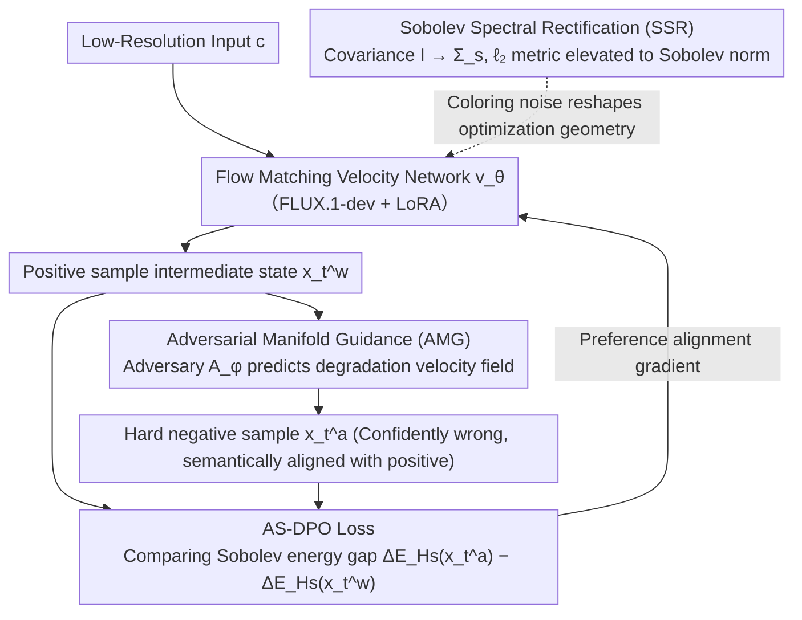

# Coloring the Noise: Adversarial Sobolev Alignment for Faithful Image Super Resolution

**Conference**: ICML 2026  
**arXiv**: [2605.23264](https://arxiv.org/abs/2605.23264)  
**Code**: https://github.com/wafer-bob/ASASR  
**Area**: Image Restoration  
**Keywords**: Image Super-Resolution, Sobolev Space, DPO Alignment, Adversarial Learning, Spectral Consistency  

## TL;DR

ASASR achieves the optimal balance between perceptual quality and structural fidelity in super-resolution by replacing the Flow Matching noise prior from isotropic Gaussian to Sobolev spectral coloring noise, combined with adversarial manifold guidance to generate hard negative samples, constructing the AS-DPO framework.

## Background & Motivation

**Background**: Image super-resolution (SR) methods based on large-scale generative priors (Diffusion Models / Flow Matching) can synthesize realistic textures, but a fundamental contradiction remains between generation quality and faithful restoration—models tend to "hallucinate" high-frequency details that are visually plausible but structurally incorrect.

**Limitations of Prior Work**: Existing methods (e.g., StableSR, SeeSR, DiffBIR) rely on supervised training paradigms for pixel-level alignment on synthetic degradation data. This leads to two issues: (1) Models overfit artificial degradation assumptions and fail to generalize to real-world degradation; (2) Optimization based on the $\ell_2$ norm imposes uniform weights across all frequencies, failing to distinguish between real high-frequency details and artifacts. Introducing DPO to the SR field is a potential alignment path, but standard DPO uses isotropic Gaussian parametrization, whose flat spectral prior severely mismatches the inherent spectral decay characteristics of natural images.

**Key Challenge**: The $\ell_2$ objective of standard DPO assigns unit weight to all frequency components in the frequency domain $\|\boldsymbol{\gamma}_\theta\|_2^2 = \frac{1}{MN}\sum_{\boldsymbol{k}} 1 \cdot \|\hat{\boldsymbol{\gamma}}_\theta[\boldsymbol{k}]\|^2$, completely ignoring the statistical property that the power spectral density of natural images decays with frequency. This results in the model's inability to effectively penalize artifacts in high-frequency regions.

**Goal**: To design a theory-driven framework that optimizes super-resolution in a geometric space aligned with the spectral characteristics of natural images, while providing informative negative samples to drive alignment learning.

**Key Insight**: The authors observe that the power spectral density of natural images follows a $1/f$ decay law, and the Sobolev space $H^s(\Omega)$ happens to encode this decay constraint through frequency-dependent weighting $(1+\|\boldsymbol{\omega}\|^2)^s$. Replacing the noise covariance matrix from $\mathbf{I}$ with a Sobolev spectral operator $\boldsymbol{\Sigma}_s$ naturally elevates the optimization metric from $\ell_2$ to the Sobolev norm.

**Core Idea**: Use Sobolev spectral coloring noise instead of isotropic Gaussian noise to reshape the DPO optimization geometry, and generate worst-case Sobolev gradients as hard negative samples using a parameterized adversary based on the Riesz representation theorem, achieving frequency-aware preference alignment.

## Method

### Overall Architecture

ASASR treats super-resolution as a frequency-aware preference alignment problem: taking a low-resolution image $\boldsymbol{c}$ ($256\times256$) as input and outputting a $4\times$ SR result ($1024\times1024$). The core is to align the optimization geometry of Flow Matching with the spectral decay characteristics of natural images. The training follows two steps—first training the velocity network $\boldsymbol{v}_\theta$ under Sobolev spectral coloring noise, then performing preference alignment using the AS-DPO loss, where critical hard negative samples are generated online by an adversarial network $\mathcal{A}_\phi$. The backbone employs FLUX.1-dev, fine-tuned via LoRA ($r=16, \alpha=16$).

### Key Designs

**1. Sobolev Spectral Rectification (SSR): Upgrading optimization metric from $\ell_2$ to frequency-weighted norm**

The $\ell_2$ objective of standard DPO treats all frequencies equally, so high-frequency artifacts receive no extra penalty. SSR replaces the covariance matrix of the Flow Matching transition kernel from the identity matrix $\mathbf{I}$ with a structured spectral operator $\boldsymbol{\Sigma}_s = \mathcal{F}^{-1}\mathrm{diag}((1+\|\boldsymbol{\omega}\|_2^2)^{-s})\mathcal{F}$. Since Gaussian likelihood is governed by the Mahalanobis distance, the corresponding precision matrix $\boldsymbol{\Sigma}_s^{-1}$ amplifies high-frequency components, causing the log-likelihood ratio to naturally shift from a difference in $\ell_2$ norms to a difference in Sobolev norms $\log\frac{p_\theta}{p_{\mathrm{ref}}}\propto -(\|\boldsymbol{\gamma}_\theta\|_{H^s}^2 - \|\boldsymbol{\gamma}_{\mathrm{ref}}\|_{H^s}^2)$. This effectively lifts DPO optimization from a flat Euclidean space to a Sobolev Riemannian manifold—the weighting $(1+\|\boldsymbol{\omega}\|^2)^s$ perfectly encodes the $1/f$ spectral decay prior of natural images. Consequently, high-frequency errors are automatically penalized more heavily, achieved solely by changing the covariance matrix without altering the network architecture.

**2. Adversarial Manifold Guidance (AMG): Online generation of "confidently wrong" hard negative samples**

Standard DPO lacks informative negative samples—static sample pairs fail to capture subtle structural distortions in SR, and T2I preference datasets provide negatives that are not spatially aligned due to semantic layout differences. AMG trains a parameterized adversary $\mathcal{A}_\phi$ specifically to learn the model's typical reconstruction failure modes: starting from a positive intermediate state $\boldsymbol{x}_t^w$, the adversary predicts a velocity field that guides the trajectory toward a degradation estimate $\widehat{\boldsymbol{x}}_1^a = \boldsymbol{x}_t^w + (1-t)\cdot\boldsymbol{v}_\phi(\boldsymbol{x}_t^w, t, \boldsymbol{c})$, then uses the same noise realization $\boldsymbol{x}_0$ to project back onto the flow state. This ensures that the negative samples are semantically aligned with the positives, differing only in the "truthfulness of details." It can be theoretically proven that this optimal perturbation is equivalent to the Sobolev gradient direction $\boldsymbol{\delta}_t^* = -\varepsilon_t \frac{\boldsymbol{\Sigma}_s \nabla_{\boldsymbol{x}}\mathcal{J}_{L^2}}{\sqrt{\langle\nabla_{\boldsymbol{x}}\mathcal{J}_{L^2}, \boldsymbol{\Sigma}_s\nabla_{\boldsymbol{x}}\mathcal{J}_{L^2}\rangle}}$. Instead of simply maximizing the loss, it mimics model confidence (minimizing $\ell_2$ residual energy) while deviating from the true trajectory, specifically exposing the model's "wrongly confident" blind spots, making it more informative than random perturbations.

**3. AS-DPO Loss: Unifying spectral geometry and adversarial negatives into one objective**

The final loss integrates the adversarial negative samples $\boldsymbol{x}_t^a$ generated by AMG with the Sobolev energy gap $\Delta\mathcal{E}_{H^s}$ from SSR: $\mathcal{L}_{\text{AS-DPO}}(\theta) = -\mathbb{E}[\log\sigma(\beta[\Delta\mathcal{E}_{H^s}(\boldsymbol{x}_t^a, \boldsymbol{c}) - \Delta\mathcal{E}_{H^s}(\boldsymbol{x}_t^w, \boldsymbol{c})])]$. Based on the Riesz representation theorem, it can be proven that the adversarial perturbation is equivalent to the worst-case Sobolev gradient, pushing optimization along tangent spaces that are "plausible but perceptually failed." SSR and AMG are coupled here: AMG provides realism-oriented alignment signals, while SSR provides frequency-aware geometric constraints, ensuring that alignment does not come at the cost of reconstruction fidelity—a fact confirmed by ablation studies.

### Loss & Training

The training data for the adversarial network $\mathcal{A}_\phi$ comes from the inference outputs of Real-ESRGAN, SeeSR, and SUPSR on a 25% random subset of DIV2K/LSDIR/RealSR/DRealSR to cover a diverse range of artifact modes. The main model is optimized using AdamW with a learning rate of $1\times10^{-5}$, while the adversary uses $5\times10^{-5}$. The Sobolev index is empirically set to $s=1.5$—the optimal balance point between structural fidelity and texture realism.

## Key Experimental Results

### Main Results

Compared against 11 SOTA methods on synthetic (DIV2K-Val, LSDIR-Val) and real-world datasets (RealSR, DrealSR). Taking DIV2K-Val as an example:

| Method | PSNR↑ | SSIM↑ | LPIPS↓ | MANIQA↑ | MUSIQ↑ | CLIPIQA+↑ |
|------|-------|-------|--------|---------|--------|-----------|
| BSRGAN | 20.36 | 0.5637 | 0.3899 | 0.3097 | 54.51 | 0.5641 |
| Real-ESRGAN | 21.11 | 0.5870 | 0.3147 | 0.3726 | 61.24 | 0.6126 |
| StableSR | 19.93 | 0.5528 | 0.3016 | 0.4224 | 66.30 | 0.6702 |
| SeeSR | 20.46 | 0.5411 | 0.3325 | 0.5187 | 70.59 | 0.7222 |
| DreamClear | 19.79 | 0.5137 | 0.3206 | 0.4878 | 60.66 | 0.6356 |
| DP2O-SR | 19.60 | 0.5064 | 0.3130 | 0.5810 | 70.58 | 0.7142 |
| **ASASR** | **20.60** | **0.6171** | **0.2784** | **0.6519** | **71.40** | **0.7521** |

Downstream task evaluation (OCR / Object Detection / Instance Segmentation / Semantic Segmentation):

| Task | Metric | GT | LQ | SeeSR | DreamClear | DP2O-SR | **ASASR** |
|------|------|-----|------|-------|------------|---------|-----------|
| OCR | Recall↑ | 50.32 | 3.81 | 29.33 | 36.78 | 40.03 | **45.91** |
| Detection | AP_b↑ | 48.32 | 12.53 | 28.06 | 28.04 | 33.51 | **35.62** |
| Instance Seg. | AP_m↑ | 42.52 | 11.03 | 23.98 | 24.20 | 29.22 | **30.98** |
| Semantic Seg. | mIoU↑ | 49.39 | 25.18 | 39.11 | 39.16 | 41.54 | **43.33** |

### Ablation Study

| Configuration | LPIPS↓ | MANIQA↑ | MUSIQ↑ | Recall↑ | AP_b↑ | mIoU↑ |
|------|--------|---------|--------|---------|-------|-------|
| Full (Sobolev + Adversarial DPO) | **0.2784** | **0.6519** | **71.40** | **45.91** | **35.62** | **43.33** |
| Euclidean Guidance (w/o SSR) | 0.3115 | 0.6184 | 67.25 | 41.64 | 34.18 | 42.15 |
| DPO w/ Supervised Data (w/o AMG) | 0.3109 | 0.6047 | 68.82 | 40.16 | 32.49 | 40.26 |
| Only Supervised Learning | 0.3135 | 0.6012 | 69.15 | 40.33 | 31.95 | 39.85 |

### Key Findings

- SSR contributes most: After removing SSR, LPIPS deteriorated from 0.2784 to 0.3115, and MANIQA dropped from 0.6519 to 0.6184, proving that frequency-aware geometry is the core of performance enhancement.
- Significant coupling effect between AMG and SSR: Using DPO with supervised data alone has limited effect, but combined with SSR, mIoU jumped from 40.26 to 43.33, indicating that AMG requires frequency-aware geometric constraints to work effectively.
- Sobolev index $s=1.5$ is the optimal choice: When $s \geq 2$, excessive smoothing leads to decreased perceptual quality; when $s < 1$, spectral constraints are insufficient.
- In user studies, the Top-1 selection rate reached 91.1% (50 participants, 64 test images).

## Highlights & Insights

- **Noise Coloring Concept**: Replacing the isotropic Gaussian noise of Flow Matching with spectral coloring noise is an extremely elegant operation—it does not change the network architecture, but elevates $\ell_2$ optimization to Sobolev norm optimization just by modifying the covariance matrix, with a natural and fluent theoretical derivation.
- **Adversarial Philosophy**: AMG does not simply maximize loss; instead, it minimizes $\ell_2$ residual energy (mimicking model confidence) while deviating from the true trajectory. This "blind spot exposure" strategy generates more informative hard negative samples than random perturbations.
- **Transferable Combination of Spectral Coloring + Adversarial Guidance**: The idea of reshaping optimization geometry into a frequency-aware space via SSR can be directly applied to other inverse problems (denoising, deblurring, compression artifact removal). AMG's counterfactual negative sample generation strategy is also transferable to any generation task requiring preference alignment.

## Limitations & Future Work

- Training requires 8 H800 GPUs, involving high computational costs; inference still requires multi-step ODE solving, lacking real-time performance.
- The training of the adversarial network depends on outputs from existing SR baseline models as artifact proxies; if the failure modes of baseline models are not diverse enough, it may limit the generalization of AMG.
- The Sobolev index $s$ requires manual adjustment; future work could explore adaptive spectral weighting strategies.
- Validated only on $4\times$ SR; arbitrary scales or extreme degradation scenarios have not been explored.

## Related Work & Insights

- **DP2O-SR** (Wu et al., 2025): Heuristic DPO based on aggregated IQA metrics, lacking theoretical foundation; ASASR provides a rigorous mathematical framework via Sobolev geometry.
- **FaithDiff** (Chen et al., 2024): Emphasizes fidelity but does not address the spectral alignment issue.
- **SeeSR / SUPSR**: Use semantic/textual guidance to enhance controllability but are still limited by the spectral bias of the $\ell_2$ training paradigm.

<!-- RELATED:START -->

## Related Papers

- [\[ICLR 2026\] Are Deep Speech Denoising Models Robust to Adversarial Noise?](../../ICLR2026/image_restoration/are_deep_speech_denoising_models_robust_to_adversarial_noise.md)
- [\[CVPR 2026\] Spectral Super-Resolution via Adversarial Unfolding and Data-Driven Spectrum Regularization](../../CVPR2026/image_restoration/spectral_super-resolution_via_adversarial_unfolding_and_data-driven_spectrum_reg.md)
- [\[ICLR 2026\] Improved Adversarial Diffusion Compression for Real-World Video Super-Resolution](../../ICLR2026/image_restoration/improved_adversarial_diffusion_compression_for_real-world_video_super-resolution.md)
- [\[CVPR 2025\] AdcSR: Adversarial Diffusion Compression for Real-World Image Super-Resolution](../../CVPR2025/image_restoration/adversarial_diffusion_compression_for_real-world_image_super-resolution.md)
- [\[ICML 2026\] Semi-Supervised Neural Super-Resolution for Mesh-Based Simulations](semi-supervised_neural_super-resolution_for_mesh-based_simulations.md)

<!-- RELATED:END -->
