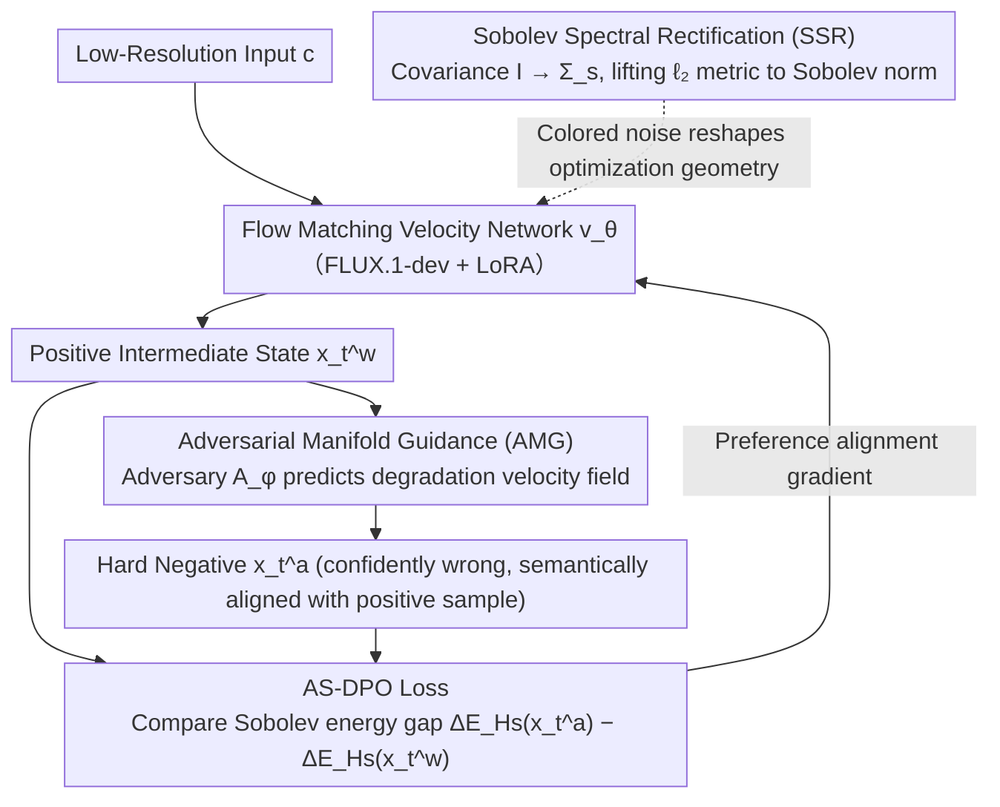

# Coloring the Noise: Adversarial Sobolev Alignment for Faithful Image Super Resolution

**Conference**: ICML 2026  
**arXiv**: [2605.23264](https://arxiv.org/abs/2605.23264)  
**Code**: https://github.com/wafer-bob/ASASR  
**Area**: Image Restoration  
**Keywords**: Image Super-Resolution, Sobolev Space, DPO Alignment, Adversarial Learning, Spectral Consistency  

## TL;DR

ASASR achieves an optimal balance between perceptual quality and structural fidelity in super-resolution by replacing the isotropic Gaussian noise prior in Flow Matching with Sobolev spectral colored noise and constructing the AS-DPO framework combined with adversarial manifold guidance for hard negative samples.

## Background & Motivation

**Background**: Image super-resolution (SR) methods based on large-scale generative priors (Diffusion Models / Flow Matching) can synthesize realistic textures, but a fundamental conflict remains between generative quality and faithful restoration—models tend to "hallucinate" visually plausible but structurally incorrect high-frequency details.

**Limitations of Prior Work**: Existing methods (e.g., StableSR, SeeSR, DiffBIR) rely on supervised training paradigms with pixel-level alignment on synthetic degradation data. This leads to two issues: (1) models overfit to artificial degradation assumptions and fail to generalize to real-world degradation; (2) $\ell_2$-norm-based optimization imposes uniform weights across all frequencies, failing to distinguish between true high-frequency details and artifacts. Introducing DPO to the SR domain is a potential alignment path, but standard DPO uses isotropic Gaussian parametrization, whose flat spectral prior severely mismatches the inherent spectral decay characteristics of natural images.

**Key Challenge**: The $\ell_2$ objective of standard DPO assigns unit weight to all frequency components in the frequency domain: $\|\boldsymbol{\gamma}_\theta\|_2^2 = \frac{1}{MN}\sum_{\boldsymbol{k}} 1 \cdot \|\hat{\boldsymbol{\gamma}}_\theta[\boldsymbol{k}]\|^2$. It completely ignores the statistical property of natural image power spectral density decaying with frequency, resulting in the model's inability to effectively penalize artifacts in high-frequency regions.

**Goal**: Design a theory-driven framework to align SR optimization in a geometric space consistent with natural image spectral characteristics, while providing informative hard negative samples to drive alignment learning.

**Key Insight**: The author observes that the power spectral density of natural images follows a $1/f$ decay law, and the Sobolev space $H^s(\Omega)$ encodes this decay constraint through frequency-dependent weighting $(1+\|\boldsymbol{\omega}\|^2)^s$. By replacing the noise covariance matrix from $\mathbf{I}$ with a Sobolev spectral operator $\boldsymbol{\Sigma}_s$, the optimization metric can be naturally lifted from $\ell_2$ to the Sobolev norm.

**Core Idea**: Reshape DPO optimization geometry using Sobolev spectral colored noise instead of isotropic Gaussian noise, and generate worst-case Sobolev gradients as hard negative samples using a parameterized adversary based on the Riesz Representation Theorem to achieve frequency-aware preference alignment.

## Method

### Overall Architecture

ASASR treats super-resolution as a frequency-aware preference alignment problem: taking a low-resolution image $\boldsymbol{c}$ ($256\times256$) as input and outputting a $4\times$ SR result ($1024\times1024$). The core is to align the optimization geometry of Flow Matching with the spectral decay characteristics of natural images. Training proceeds in two steps—first training the velocity network $\boldsymbol{v}_\theta$ under Sobolev spectral colored noise, then performing preference alignment with AS-DPO loss, where critical hard negative samples are generated online by an adversarial network $\mathcal{A}_\phi$. The backbone employs FLUX.1-dev, fine-tuned via LoRA ($r=16, \alpha=16$).

### Key Designs

**1. Sobolev Spectral Rectification (SSR): Upgrading the optimization metric from $\ell_2$ to a frequency-weighted norm**

The $\ell_2$ objective of standard DPO treats all frequencies equally, so high-frequency artifacts receive no extra penalty. SSR replaces the covariance matrix of the Flow Matching transition kernel from the identity matrix $\mathbf{I}$ with a structured spectral operator $\boldsymbol{\Sigma}_s = \mathcal{F}^{-1}\mathrm{diag}((1+\|\boldsymbol{\omega}\|_2^2)^{-s})\mathcal{F}$. Since Gaussian likelihood is governed by Mahalanobis distance, the corresponding precision matrix $\boldsymbol{\Sigma}_s^{-1}$ amplifies high-frequency components, making the log-likelihood ratio naturally change from an $\ell_2$ norm difference to a Sobolev norm difference $\log\frac{p_\theta}{p_{\mathrm{ref}}}\propto -(\|\boldsymbol{\gamma}_\theta\|_{H^s}^2 - \|\boldsymbol{\gamma}_{\mathrm{ref}}\|_{H^s}^2)$. This lifts DPO optimization from a flat Euclidean space to a Sobolev Riemannian manifold—the $(1+\|\boldsymbol{\omega}\|^2)^s$ weighting precisely encodes the $1/f$ spectral decay prior of natural images, automatically imposing higher penalties on high-frequency errors without changing the network architecture.

**2. Adversarial Manifold Guidance (AMG): Online generation of "confidently wrong" hard negative samples**

Standard DPO lacks informative negative samples—static sample pairs fail to capture subtle structural distortions in SR, and T2I preference datasets cannot provide spatially aligned negative samples due to semantic layout differences. AMG trains a parameterized adversary $\mathcal{A}_\phi$ specifically to learn the model's typical reconstruction failure modes: starting from the positive intermediate state $\boldsymbol{x}_t^w$, the adversary predicts a velocity field that guides the trajectory toward a degraded estimate $\widehat{\boldsymbol{x}}_1^a = \boldsymbol{x}_t^w + (1-t)\cdot\boldsymbol{v}_\phi(\boldsymbol{x}_t^w, t, \boldsymbol{c})$, and then projects back to the flow state using the same noise realization $\boldsymbol{x}_t^a$. This ensures the negative sample is semantically aligned with the positive sample, differing only in "detail authenticity." Theoretically, this optimal perturbation is equivalent to the Sobolev gradient direction $\boldsymbol{\delta}_t^* = -\varepsilon_t \frac{\boldsymbol{\Sigma}_s \nabla_{\boldsymbol{x}}\mathcal{J}_{L^2}}{\sqrt{\langle\nabla_{\boldsymbol{x}}\mathcal{J}_{L^2}, \boldsymbol{\Sigma}_s\nabla_{\boldsymbol{x}}\mathcal{J}_{L^2}\rangle}}$. It does not simply maximize loss but mimics model confidence (minimizing $\ell_2$ residual energy) while deviating from the true trajectory, specifically exposing the model's "erroneously confident" blind spots.

**3. AS-DPO Loss: Integrating spectral geometry and adversarial negatives into one objective**

The final loss integrates the adversarial negative samples $\boldsymbol{x}_t^a$ generated by AMG with the Sobolev energy gap $\Delta\mathcal{E}_{H^s}$ from SSR: $\mathcal{L}_{\text{AS-DPO}}(\theta) = -\mathbb{E}[\log\sigma(\beta[\Delta\mathcal{E}_{H^s}(\boldsymbol{x}_t^a, \boldsymbol{c}) - \Delta\mathcal{E}_{H^s}(\boldsymbol{x}_t^w, \boldsymbol{c})])]$. According to the Riesz Representation Theorem, the adversarial perturbation is equivalent to the worst-case Sobolev gradient, advancing optimization along the tangent space of "plausible but perceptual failures." SSR and AMG are coupled here: AMG provides realism-oriented alignment signals, while SSR provides frequency-aware geometric constraints, ensuring alignment does not come at the cost of reconstruction fidelity.

### Loss & Training

Training data for the adversarial network $\mathcal{A}_\phi$ comes from inference outputs of Real-ESRGAN, SeeSR, and SUPSR on a random 25% subset of DIV2K/LSDIR/RealSR/DRealSR to cover diverse artifact patterns. The main model uses the AdamW optimizer with a learning rate of $1\times10^{-5}$, and the adversary uses $5\times10^{-5}$. The Sobolev index is empirically set to $s=1.5$—the optimal balance point between structural fidelity and texture realism.

## Key Experimental Results

### Main Results

Evaluated against 11 SOTA methods on synthetic (DIV2K-Val, LSDIR-Val) and real-world datasets (RealSR, DrealSR). For DIV2K-Val:

| Method | PSNR↑ | SSIM↑ | LPIPS↓ | MANIQA↑ | MUSIQ↑ | CLIPIQA+↑ |
|------|-------|-------|--------|---------|--------|-----------|
| BSRGAN | 20.36 | 0.5637 | 0.3899 | 0.3097 | 54.51 | 0.5641 |
| Real-ESRGAN | 21.11 | 0.5870 | 0.3147 | 0.3726 | 61.24 | 0.6126 |
| StableSR | 19.93 | 0.5528 | 0.3016 | 0.4224 | 66.30 | 0.6702 |
| SeeSR | 20.46 | 0.5411 | 0.3325 | 0.5187 | 70.59 | 0.7222 |
| DreamClear | 19.79 | 0.5137 | 0.3206 | 0.4878 | 60.66 | 0.6356 |
| DP2O-SR | 19.60 | 0.5064 | 0.3130 | 0.5810 | 70.58 | 0.7142 |
| **ASASR** | **20.60** | **0.6171** | **0.2784** | **0.6519** | **71.40** | **0.7521** |

Downstream task (OCR / Object Detection / Instance Segmentation / Semantic Segmentation) evaluation:

| Task | Metric | GT | LQ | SeeSR | DreamClear | DP2O-SR | **ASASR** |
|------|------|-----|------|-------|------------|---------|-----------|
| OCR | Recall↑ | 50.32 | 3.81 | 29.33 | 36.78 | 40.03 | **45.91** |
| Detection | AP_b↑ | 48.32 | 12.53 | 28.06 | 28.04 | 33.51 | **35.62** |
| Instance Seg. | AP_m↑ | 42.52 | 11.03 | 23.98 | 24.20 | 29.22 | **30.98** |
| Semantic Seg. | mIoU↑ | 49.39 | 25.18 | 39.11 | 39.16 | 41.54 | **43.33** |

### Ablation Study

| Configuration | LPIPS↓ | MANIQA↑ | MUSIQ↑ | Recall↑ | AP_b↑ | mIoU↑ |
|------|--------|---------|--------|---------|-------|-------|
| Full (Sobolev + Adversarial DPO) | **0.2784** | **0.6519** | **71.40** | **45.91** | **35.62** | **43.33** |
| Euclidean Guidance (w/o SSR) | 0.3115 | 0.6184 | 67.25 | 41.64 | 34.18 | 42.15 |
| DPO w/ Supervised Data (w/o AMG) | 0.3109 | 0.6047 | 68.82 | 40.16 | 32.49 | 40.26 |
| Only Supervised Learning | 0.3135 | 0.6012 | 69.15 | 40.33 | 31.95 | 39.85 |

### Key Findings

- SSR is the primary contributor: Removing SSR deteriorates LPIPS from 0.2784 to 0.3115 and MANIQA from 0.6519 to 0.6184, proving that frequency-aware geometry is the core of performance gains.
- Significant coupling effect between AMG and SSR: Using DPO with supervised data alone yields limited results, but combining it with SSR jumps mIoU from 40.26 to 43.33, indicating that AMG requires frequency-aware geometric constraints to work effectively.
- Sobolev index $s=1.5$ is the optimal choice: $s \geq 2$ causes over-smoothing and perceptual quality drops, while $s < 1$ provides insufficient spectral constraints.
- In user studies, the Top-1 selection rate reached 91.1% (50 participants, 64 test images).

## Highlights & Insights

- **Noise Coloring Concept**: The operation of replacing isotropic Gaussian noise in Flow Matching with spectral colored noise is elegant—it lifts $\ell_2$ optimization to Sobolev norm optimization by merely modifying the covariance matrix without changing the network architecture.
- **Adversary Philosophy**: AMG does not simply maximize loss; it mimics model confidence (minimizing $\ell_2$ residual energy) while deviating from the ground truth trajectory. This "blind spot exposure" strategy produces more informative hard negatives than random perturbations.
- **Transferable Combination**: The idea of reshaping optimization geometry into a frequency-aware space via SSR can be directly applied to other inverse problems (denoising, deblurring, compression artifact removal). The counterfactual negative sample generation strategy of AMG can also be transferred to any generative task requiring preference alignment.

## Limitations & Future Work

- Training requires 8 H800 GPUs, involving high computational costs; inference still requires multi-step ODE solving, lacking real-time performance.
- Training the adversarial network depends on the outputs of existing SR baseline models as artifact proxies; if baseline failure modes are not diverse enough, it may limit AMG's generalization.
- The Sobolev index $s$ requires manual tuning; future work could explore adaptive spectral weighting strategies.
- Validated only on $4\times$ SR, without exploring arbitrary scales or extreme degradation scenarios.

## Related Work & Insights

- **DP2O-SR** (Wu et al., 2025): Heuristic DPO based on aggregated IQA metrics, lacking theoretical foundation; ASASR provides a rigorous mathematical framework via Sobolev geometry.
- **FaithDiff** (Chen et al., 2024): Emphasizes fidelity but fails to address the spectral alignment problem.
- **SeeSR / SUPSR**: Utilize semantic/text guidance to enhance controllability but are still limited by the spectral bias of the $\ell_2$ training paradigm.

<!-- RELATED:START -->

## Related Papers

- [\[CVPR 2026\] Spectral Super-Resolution via Adversarial Unfolding and Data-Driven Spectrum Regularization](../../CVPR2026/image_restoration/spectral_super-resolution_via_adversarial_unfolding_and_data-driven_spectrum_reg.md)
- [\[ICLR 2026\] Are Deep Speech Denoising Models Robust to Adversarial Noise?](../../ICLR2026/image_restoration/are_deep_speech_denoising_models_robust_to_adversarial_noise.md)
- [\[CVPR 2025\] AdcSR: Adversarial Diffusion Compression for Real-World Image Super-Resolution](../../CVPR2025/image_restoration/adversarial_diffusion_compression_for_real-world_image_super-resolution.md)
- [\[CVPR 2026\] CASR: A Robust Cyclic Framework for Arbitrary Large-Scale Super-Resolution with Distribution Alignment and Self-Similarity Awareness](../../CVPR2026/image_restoration/casr_a_robust_cyclic_framework_for_arbitrary_large-scale_super-resolution_with_d.md)
- [\[ICML 2026\] Semi-Supervised Neural Super-Resolution for Mesh-Based Simulations](semi-supervised_neural_super-resolution_for_mesh-based_simulations.md)

<!-- RELATED:END -->
