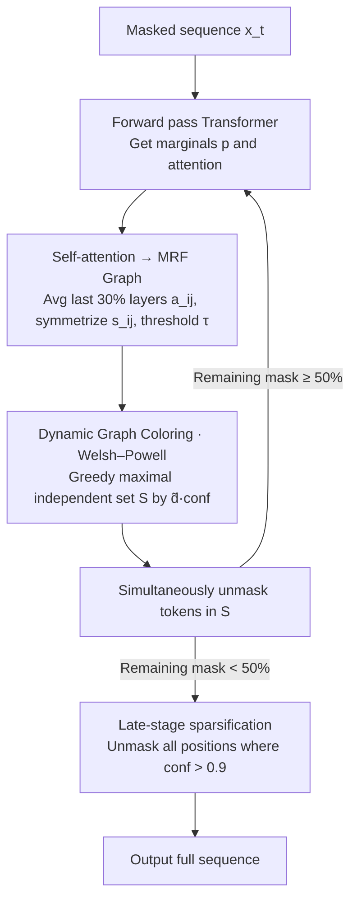

# DAPD: Dependency-Aware Parallel Decoding via Attention for Diffusion LLMs

**Conference**: ICML 2026  
**arXiv**: [2603.12996](https://arxiv.org/abs/2603.12996)  
**Code**: https://ai-isl.github.io/dapd (Project Page)  
**Area**: LLM Efficiency / Diffusion LLMs / Parallel Decoding  
**Keywords**: dLLM, Parallel Decoding, Self-Attention, Markov Random Field, Graph Coloring

## TL;DR
DAPD transforms the single-step parallel unmasking problem in dLLMs into a dynamic graph coloring problem of "selecting independent sets on an attention-induced MRF." Without additional training, it simultaneously unmasks weak-dependency positions. On LLaDA/Dream, it reduces the decoding steps for multi-query mixed prompts to 1/3.87 of the original while maintaining near-identical accuracy.

## Background & Motivation
**Background**: Diffusion Language Models (dLLMs), represented by LLaDA and Dream, generate text by repeatedly denoising mask tokens. Their primary claimed advantage over autoregressive models is the ability to "unmask multiple tokens in parallel in a single step," which significantly reduces the Number of Function Evaluations (NFE)—the main determinant of inference latency.

**Limitations of Prior Work**: The training objective of dLLMs only models the conditional **marginal distribution** $p_\theta(x^i\mid\mathbf{x})$ for each mask position, without explicitly modeling the joint distribution. Sampling multiple tokens independently from these marginals leads to a "joint-marginal mismatch": for example, the prompt "The capital of [M] is [M]" might yield high probabilities for "France" and "London" at two separate mask positions. Each is reasonable individually, but together they are incorrect.

**Key Challenge**: Existing training-free parallel decoding methods (Fast-dLLM / EB-Sampler / KLASS) use only token-wise signals like "marginal confidence / entropy / KL stability" to filter positions, **entirely ignoring dependencies between mask positions**. Consequently, they are either too conservative, unmasking only a few tokens (slow), or too aggressive, unmasking strongly coupled tokens (quality collapse). Introducing auxiliary planners or re-training (dParallel, Learn-to-Parallel) breaks the ELBO framework and incurs high overhead.

**Goal**: To explicitly estimate "which mask positions can be safely unmasked together" at each decoding step without additional training or auxiliary models.

**Key Insight**: dLLMs already compute a self-attention map. If position $i$ barely attends to position $j$, then given other context, the prediction of $X_i$ is largely independent of $X_j$. In other words, **self-attention itself serves as a free probe for conditional independence**.

**Core Idea**: Use symmetrized attention scores $s_{ij}=\tfrac{1}{2}(a_{ij}+a_{ji})$ to induce an MRF dependency graph over mask positions. Parallel decoding is reduced to finding "independent sets" on this graph, using a Welsh–Powell degree-priority greedy coloring strategy to select a maximal independent set for simultaneous unmasking at each step.

## Method

### Overall Architecture
DAPD addresses the scheduling problem of "which masks should be unmasked simultaneously without disrupting the joint distribution." It treats this as a graph theory problem: after the forward pass of each step, the already computed attention is reused to organize current mask positions into a dependency graph. A subset of nodes with no mutual connections is then selected for simultaneous unmasking. Specifically, a single forward pass on the current mask sequence $\mathbf{x}_t$ yields marginals $p_\theta(x^i\mid\mathbf{x}_t)$ and multi-head attention. Attention scores $a_{ij}$ are averaged across all heads of approximately the last 30% of layers and symmetrized into $s_{ij}$. Edges are formed in the dependency graph $G_t=(V_t,E_t)$ via a threshold $\tau_t$. A maximal independent set $S$ is selected greedily based on the descending order of "confidence-weighted proxy degree" $\tilde d_i\cdot\mathrm{conf}_i$. All tokens in $S$ are unmasked according to their marginal argmax. When the remaining mask ratio drops below 50%, the system switches to a fast late-stage strategy where all positions with "confidence > 0.9" are unmasked. This process requires no extra models or training, with overhead limited to negligible graph construction and greedy sorting.

### Key Designs

**1. Self-attention → MRF Dependency Graph: Using internal attention as a free independence probe**

Previous training-free methods treated mask positions as independent units, filtering them only with marginal signals like confidence. This discarded the fundamental information of whether positions are coupled. DAPD's insight is that the attention map in dLLMs indicates conditional independence: if position $i$ rarely attends to $j$, they are approximately independent given other context. The symmetric edge score $s_{ij}=\tfrac{1}{2}(a_{ij}+a_{ji})$ is defined on the mask index set $V_t$, and an edge is triggered if $s_{ij}>\tau_t$. This is theoretically grounded in the local Markov property of Transformers: $p_\theta(X_i\mid X_{V_t\setminus\{i\}})\approx p_\theta(X_i\mid X_{V_t\setminus\{i,j\}})$. Controlled validation on synthetic data (length-9 sequences with known MRF structures) showed an edge detection AUC of 0.928 and a very low Order Violation Ratio (OVR) of 0.04 for degree estimation, proving attention reliably recovers dependency structures with zero extra training.

**2. Dynamic Graph Coloring + Welsh–Powell Degree Priority: Covering masks in minimum steps rather than maximum width**

With the dependency graph, the goal of "finishing all masks in minimum steps" corresponds to the "minimum coloring of $G_t$." Since $V_t$ shrinks and new context changes $E_t$ at each step, this is a **dynamic** graph coloring problem. DAPD makes a counter-intuitive choice: instead of greedily seeking the largest independent set (which favors low-degree nodes and leaves high-degree "hubs" for later, dragging out the tail steps), it uses Welsh–Powell degree priority. By processing nodes in descending order of proxy degree $\tilde d_i:=\sum_{j\ne i}s_{ij}$, it clears "hubs" early, allowing the remaining graph to sparsify rapidly for massive parallel unmasking in later steps. The sorting key is refined to $\tilde d_i\cdot\mathrm{conf}_i$ to balance structural importance with predictive reliability.

**3. Late-stage Confidence Sparsification: Aggressive finishing once dependencies vanish**

When the remaining mask ratio falls below 50%, most nodes have a degree near 0 and are approximately independent. Continuing graph construction at this stage provides little information. DAPD then switches to a strategy of unmasking all positions where $\mathrm{conf}_i>0.9$ at once. Here, the confidence threshold serves as a low-cost approximation of an independent set. An even more aggressive variant unmasks any position with confidence exactly 1.0 immediately, as no feasible joint distribution would differ at that position. This strategy flattens the step-count curve compared to pure confidence methods while preserving accuracy.

### Loss & Training
Completely training-free: DAPD does not modify dLLM weights or introduce trainable parameters. It is evaluated directly on public LLaDA-8B-Instruct and Dream-7B-Instruct models.

## Key Experimental Results

### Main Results
Evaluated on LLaDA / Dream across code (HumanEval / MBPP), math (GSM8K / Math500), instruction following (IFEval), and ParallelBench (max 256 tokens). Key comparison on "Multi-query Mixed Prompt" TriviaQA × 5 (LLaDA, single block):

| Method | Accuracy (↑) | Steps | Gain |
|------|-----------|------|---------|
| Token-wise Baseline (Confidence) | 52.64 | 256.0 | 1.00× |
| Fast-dLLM | 52.12 | 124.4 | 2.06× |
| KLASS | 52.20 | 177.4 | 1.44× |
| EB-Sampler | 51.20 | 131.3 | 1.95× |
| **DAPD (Ours)** | **52.08** | **66.2** | **3.87×** |

DAPD significantly outperforms baselines that require block-splitting or EOS suppression to maintain accuracy. On ParallelBench, DAPD consistently occupies the Score-Steps Pareto frontier.

### Ablation Study

| Configuration | Key Observation |
|------|---------|
| Attention Layer Selection | Best results using the last ~30% of layers (global integration). |
| Sorting Key: $\tilde d_i$ vs $\tilde d_i\cdot\mathrm{conf}_i$ | Weighted version is superior by balancing structure and reliability. |
| Welsh–Powell vs. Max Independent Set | Degree-priority yields fewer total steps by clearing hubs early. |
| Late-stage thresholding (mask < 50%) | Successfully reduces steps when graph edges are sparse. |

### Key Findings
- **Trajectory shift**: Visualizing prompts containing five independent questions shows that baselines use a "bi-directional inward" pseudo-autoregressive pattern. DAPD disperses unmasking across the entire sequence in the first 50% of steps, truly leveraging the any-order capability of dLLMs.
- **Acceleration Source**: The 3.87x gain (vs 2.06x for Fast-dLLM) suggests that explicit dependency modeling uncovers significantly more parallel opportunities than marginal confidence alone.
- **Generalization**: Similar performance gains on the Dream model confirm the method is not LLaDA-specific.
- **Low Overhead**: End-to-end TPS (tokens/sec) is higher than baselines, confirming that the reduction in steps is not offset by per-step computation cost.

## Highlights & Insights
- **"Self-attention = Free Independence Probe"**: A highly reusable perspective. DAPD is the first to systematically reinterpret attention as a dependency graph, addressing the "joint-marginal mismatch" at its root with zero extra training.
- **Formalization to "Dynamic Graph Coloring"**: This elevates parallel decoding from a heuristic parameter search to a combinatorial optimization framework, allowing the use of mature algorithms like Welsh–Powell.
- **Hub-node Priority**: Prioritizing hubs is a smart trade-off—sacrificing single-step width for long-term graph sparsification.
- **Natural Avoidance of EOS Issues**: Baselines often fail in single-block settings due to premature EOS generation. DAPD's dispersed unmasking naturally avoids this "unstructured tail" pitfall.

## Limitations & Future Work
- **Graph Overhead**: While negligible for 256 tokens, the $O(L^2)$ edge score calculation may become a bottleneck for sequences several thousand tokens long.
- **Hyperparameter Robustness**: Choices like the attention layers and the 50% switching point are somewhat specialized for LLaDA/Dream; automatic selection rules are not yet provided.
- **First-order Approximation**: The assumption "low attention ⟹ independence" is a simplification that might fail in structures with complex indirect dependencies.
- **Task Dependence**: The advantage of DAPD is most pronounced in prompts with independent sub-structures (like multi-query batches) rather than monolithically dependent tasks.

## Related Work & Insights
- **vs. Fast-dLLM**: Fast-dLLM uses a fixed confidence threshold. DAPD adopts its late-stage logic but achieves double the acceleration (3.87x vs 2.06x) by modeling dependencies in the early stages.
- **vs. EB-Sampler / KLASS**: These rely on marginal signals (entropy/KL). DAPD introduces structural interaction via attention, better addressing joint-marginal mismatch.
- **vs. Training-based methods (dParallel, APD)**: Those require re-training or auxiliary planners. DAPD achieves competitive results by optimizing the use of existing internal signals.

## Rating
- Novelty: ⭐⭐⭐⭐⭐ (Clean new perspective using attention as MRF edges).
- Experimental Thoroughness: ⭐⭐⭐⭐ (Solid across models and tasks; needs more long-sequence data).
- Writing Quality: ⭐⭐⭐⭐ (Clear formalization and logical flow).
- Value: ⭐⭐⭐⭐⭐ (Training-free, plug-and-play, significant SOTA speedup).

<!-- RELATED:START -->

<!-- RELATED:END -->

## Related Papers

- [\[ICML 2026\] DyLLM: Efficient Diffusion LLM Inference via Saliency-based Token Selection and Partial Attention](dyllm_efficient_diffusion_llm_inference_via_saliency-based_token_selection_and_p.md)
- [\[ICLR 2026\] Skip to the Good Part: Representation Structure & Inference-Time Layer Skipping in Diffusion vs. Autoregressive LLMs](../../ICLR2026/image_restoration/skip_to_the_good_part_representation_structure_inference-time_layer_skipping_in_.md)
- [\[ICML 2026\] Triadic Dynamics Aware Diffusion Posterior Sampling for Inverse Problems: Optimizing Guidance and Stochasticity Schedules](triadic_dynamics_aware_diffusion_posterior_sampling_for_inverse_problems_optimiz.md)
- [\[ICML 2025\] ε-VAE: Denoising as Visual Decoding](../../ICML2025/image_restoration/epsilon-vae_denoising_as_visual_decoding.md)
- [\[CVPR 2026\] CARD: Correlation Aware Restoration with Diffusion](../../CVPR2026/image_restoration/card_correlation_aware_restoration_with_diffusion.md)

<!-- RELATED:END -->
