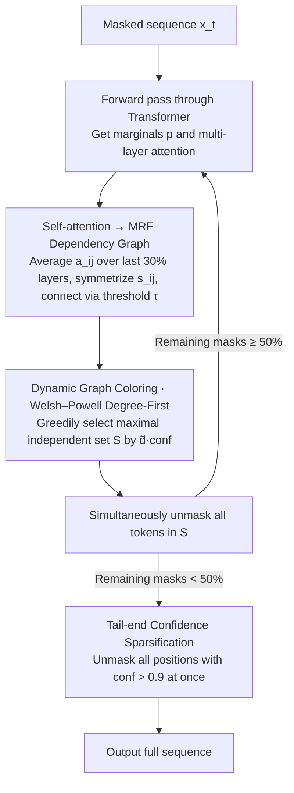

# DAPD: Dependency-Aware Parallel Decoding via Attention for Diffusion LLMs

**Conference**: ICML 2026  
**arXiv**: [2603.12996](https://arxiv.org/abs/2603.12996)  
**Code**: https://ai-isl.github.io/dapd (Project Page)  
**Area**: LLM Efficiency / Diffusion Language Models / Parallel Decoding  
**Keywords**: dLLM, Parallel Decoding, Self-Attention, Markov Random Field, Graph Coloring

## TL;DR
DAPD transforms the single-step parallel unmasking problem of dLLMs into a dynamic graph coloring problem of "selecting independent sets on self-attention-induced MRFs." Without any training, it simultaneously unmasks weakly dependent positions, reducing decoding steps to 1/3.87 of the original on LLaDA / Dream for multi-question mixed prompts with almost no loss in accuracy.

## Background & Motivation
**Background**: Diffusion Language Models (dLLMs), represented by LLaDA and Dream, generate text by repeatedly denoising masked tokens. Their primary claimed advantage over autoregressive models is the ability to unmask multiple tokens in a single step, significantly reducing the number of function evaluations (NFE) — the main determinant of inference latency.

**Limitations of Prior Work**: dLLM training objectives only model the conditional **marginal distribution** $p_\theta(x^i\mid\mathbf{x})$ for each mask position rather than explicitly modeling the joint distribution. Sampling multiple tokens independently from their respective marginals leads to a "joint-marginal mismatch": for instance, the prompt "The capital of [M] is [M]" might yield high marginal probabilities for "France" and "London" at the two mask positions. Individually they are reasonable, but together they are incorrect.

**Key Challenge**: Existing training-free parallel decoding methods (Fast-dLLM / EB-Sampler / KLASS) only use token-wise signals like "marginal confidence / entropy / KL stability" to filter positions, **entirely ignoring dependencies between masked positions**. Consequently, they are either conservative (unmasking few tokens at a time, limiting speed) or aggressive (unmasking strongly coupled tokens simultaneously, collapsing quality). Introducing auxiliary planners or retraining (dParallel, Learn-to-Parallel) disrupts the ELBO framework and incurs high overhead.

**Goal**: To explicitly estimate which mask positions can be safely unmasked together in each decoding step without additional training or auxiliary models.

**Key Insight**: dLLMs already compute a self-attention map during the forward pass. If position $i$ barely attends to position $j$, then the prediction of $X_i$ is largely independent of $X_j$ given the other context. In other words, **self-attention itself serves as a free probe for conditional independence**.

**Core Idea**: Induce an MRF dependency graph over mask positions using symmetrized attention scores $s_{ij}=\tfrac{1}{2}(a_{ij}+a_{ji})$. Parallel decoding is then reduced to finding "independent sets" on this graph. A maximal independent set is selected in each step using the Welsh–Powell degree-first greedy coloring strategy for simultaneous unmasking.

## Method

### Overall Architecture
DAPD addresses the scheduling problem of "which masks should be unmasked simultaneously without violating the joint distribution" by converting it into a graph theory problem. After each forward pass, the already computed attention scores are reused to organize current mask positions into a dependency graph. An internally unconnected subset (independent set) is then selected for parallel unmasking. Specifically, a forward pass on the current masked sequence $\mathbf{x}_t$ yields marginals $p_\theta(x^i\mid\mathbf{x}_t)$ and multi-layer multi-head attention. Scores $a_{ij}$ are averaged over all heads in approximately the last 30% of layers and symmetrized to $s_{ij}$. Edges are formed in the mask dependency graph $G_t=(V_t,E_t)$ based on a threshold $\tau_t$. Nodes are greedily selected into an independent set $S$ in descending order of a "confidence-weighted proxy degree" $\tilde d_i\cdot\mathrm{conf}_i$. All tokens in $S$ are unmasked simultaneously using their respective marginal argmax. When the mask ratio drops below 50%, the system switches to a fast tail-end strategy that unmasks all tokens with confidence > 0.9. This process requires no extra models or retraining, with the only additional overhead being graph construction and greedy sorting, which is negligible compared to a single forward pass.

### Key Designs

**1. Self-Attention → MRF Dependency Graph: Treating internal attention as a free conditional independence probe**

Previous training-free methods treated mask positions as isolated units, filtering them only using marginal signals like confidence, entropy, or KL. This misses the fundamental information regarding whether positions are coupled—the very source of joint-marginal mismatch. DAPD's entry point is that the self-attention map already calculated during the forward pass reflects dependencies. If position $i$ has low attention to $j$, they are approximately conditionally independent given other context. Thus, symmetric edge scores $s_{ij}=\tfrac{1}{2}(a_{ij}+a_{ji})$ are defined over the mask index set $V_t$, where an edge $(i,j)\in E_t \iff s_{ij}>\tau_t$. This uses attention as the MRF edge weights. The theoretical basis is the local Markov property of Transformers: $p_\theta(X_i\mid X_{V_t\setminus\{i\}})\approx p_\theta(X_i\mid X_{V_t\setminus\{i,j\}})$, implying $X_i\perp X_j \mid X_{V_t\setminus\{i,j\}}$. Controlled validation on synthetic data (length-9 sequences with known cyclical dependencies) showed that attention-recovered edges achieved an AUC of 0.928 for edge detection and an Order Violation Ratio (OVR) of only 0.04 for degree estimation, proving attention reliably recovers reality with zero extra parameters.

**2. Dynamic Graph Coloring + Welsh–Powell Degree-First: Covering all masks in minimum steps, not maximum step width**

With the dependency graph, the problem of "unmasking all tokens in minimum steps" corresponds to finding the minimum number of colors to legally color $G_t$—where tokens of the same color are unmasked in parallel. However, since $V_t$ shrinks and $E_t$ changes as context is added, this is a **dynamic** graph coloring problem. DAPD makes a counter-intuitive choice: instead of seeking the maximum independent set (which favors low-degree nodes and leaves "hubs" for later), it uses the Welsh–Powell degree-first heuristic. Nodes are scanned in descending order of proxy degree $\tilde d_i:=\sum_{j\ne i}s_{ij}$ to build a **maximal** (not necessarily maximum) independent set $S$. Eliminating hubs early allows the remaining graph to sparsify rapidly, enabling large-batch unmasking in subsequent steps. The sorting key is refined to $\tilde d_i\cdot\mathrm{conf}_i$, representing an "expected effective degree" that balances structural importance with predictive reliability.

**3. Tail-end Confidence Sparsification: Discarding graph construction as dependencies vanish**

When the mask ratio falls below 50%, most nodes have degrees near zero and are approximately conditionally independent. At this stage, graph construction provides little information relative to its cost. DAPD then disables graph construction and switches to a strategy where all positions with $\mathrm{conf}_i > 0.9$ are unmasked at once. Here, the confidence threshold acts as a low-cost approximation of an independent set. A more aggressive variant discussed is unmasking any position with confidence exactly 1.0 immediately, as a marginal probability of 1 ensures any compatible joint distribution must take the same value, avoiding mismatch risk. This step pushes DAPD's step count below pure confidence-based methods while preserving accuracy.

### Loss & Training
Fully training-free: DAPD does not modify dLLM weights or introduce additional trainable parameters. It reuses existing attention. Evaluations were performed directly on LLaDA-8B-Instruct and Dream-7B-Instruct.

## Key Experimental Results

### Main Results
Evaluation was conducted on LLaDA / Dream across code (HumanEval / MBPP), math (GSM8K / Math500), instruction following (IFEval), and ParallelBench, with a max generation of 256 tokens using lm-eval. Below are the core results for the "Multi-question Mixed Prompt" TriviaQA × 5 setup (LLaDA, single block, EOS suppression disabled):

| Method | Accuracy (↑) | Steps | Gain |
|------|-----------|------|---------|
| Per-token Original (confidence) | 52.64 | 256.0 | 1.00× |
| Fast-dLLM | 52.12 | 124.4 | 2.06× |
| KLASS | 52.20 | 177.4 | 1.44× |
| EB-Sampler | 51.20 | 131.3 | 1.95× |
| **DAPD (Ours)** | **52.08** | **66.2** | **3.87×** |

On tasks like MBPP and IFEval, DAPD significantly outperformed baselines that require block-wise decoding or EOS suppression to maintain accuracy under single-block settings. On ParallelBench (designed to stress-test dependency robustness), DAPD consistently held the Score-Steps Pareto frontier.

### Ablation Study

| Configuration | Key Observation | Description |
|------|---------|------|
| Attention Layer Selection | Optimal with last ~30% layers | High layers integrate global info; low layers favor local token-level signals. |
| Sorting Key: $\tilde d_i$ vs $\tilde d_i\cdot\mathrm{conf}_i$ | Weighted version is superior | Considers both structural importance and prediction reliability. |
| Welsh–Powell vs. MIS | Degree-first yields fewer steps | Unmasking hub nodes early sparsifies the remaining graph faster. |
| Late-stage Threshold Switch | Further reduces steps | Confidence thresholds approximate independent sets when the graph is near-edgeless. |

### Key Findings
- **Qualitative Change in Decoding Trajectories**: Visualizing prompts containing five independent sub-questions shows that baselines (Fast-dLLM / KLASS / EB-Sampler) follow a pseudo-autoregressive "outside-in" pattern. DAPD unmasks tokens scattered across the entire sequence in the first 50% of steps, truly leveraging the bidirectional, any-order capabilities of dLLMs.
- **Speedup via Independent Sub-problems**: The 3.87× speedup of DAPD is ~1.88× that of Fast-dLLM, indicating that explicit dependency modeling uncovers far more parallelism than marginal confidence alone.
- **Cross-model Generalization**: DAPD consistently outperforms on Dream without specialized tricks like block decoding, proving that improvements stem from the method rather than LLaDA-specific tuning.
- **Negligible Graph Overhead**: By reusing computed attention, the end-to-end TPS (tokens/sec) shows actual gains over baselines, representing real-world acceleration rather than just fewer "expensive" steps.

## Highlights & Insights
- **"Self-Attention = Free Conditional Independence Probe" is a high-utility perspective**: While previous token-wise signals (confidence/entropy) are purely marginal, DAPD is the first to systematically reinterpret attention as a dependency graph. It targets the root cause of joint-marginal mismatch with zero extra training.
- **Elegant Formalization as Dynamic Graph Coloring**: DAPD shifts parallel decoding from a continuous parameter tuning problem ("how many tokens to pick") to a combinatorial optimization framework, enabling the use of mature heuristics like Welsh–Powell.
- **Degree-First over Maximum Independent Set**: A counter-intuitive but correct choice—maximizing single-step width is a greedy trap that drags out total steps. Prioritizing hub nodes is a strategy transferable to other global batch scheduling scenarios, such as KV cache replacement or draft selection in speculative decoding.
- **Sidestepping EOS Pitfalls**: Baselines often collapse in single-block settings due to premature EOS generation. Because DAPD unmasks tokens in a scattered fashion and generates structured endings later, it naturally avoids this issue.

## Limitations & Future Work
- **Graph Construction Overhead**: While currently negligible, the $O(L^2)$ edge score calculation may become a bottleneck for sequences with several thousand tokens; long-sequence performance (>1k tokens) was not reported.
- **Robustness of Threshold $\tau_t$ and Layer Selection**: Core hyperparameters are somewhat specialized for LLaDA/Dream. Different architectures may require retuning; no automatic selection rule was provided.
- **Theoretical Approximation Boundaries**: The "low attention $\implies$ conditional independence" assumption is a first-order approximation. Path-based indirect dependencies and task-specific semantics are collapsed into simple averages, which might fail on specially constructed adversarial dependency structures.
- **Task Dependency**: On tasks with a single global answer (e.g., GSM8K), the gap between DAPD and baselines is smaller than on prompts with naturally independent sub-structures (e.g., combined queries).

## Related Work & Insights
- **vs. Fast-dLLM (Wu et al., 2026)**: Fast-dLLM uses a fixed confidence threshold; DAPD shares its tail-end logic but uses MRF independent sets for the early stages, doubling the speedup (3.87× vs 2.06×).
- **vs. EB-Sampler (Ben-Hamu et al., 2025)**: EB-Sampler uses entropy bounds, which are still marginal. DAPD's attention-based interactions target joint-marginal mismatch directly.
- **vs. KLASS (Kim et al., 2025b)**: KLASS focuses on token stability via KL divergence; DAPD uses structural signals (graphs) to distinguish between positions that are highly confident but mutually conflicting.
- **vs. Training-based Methods (dParallel, Learn-to-Parallel)**: These introduce extra planners or retrain models. DAPD offers a training-free path by performing geometric/combinatorial optimization on internal signals.

## Rating
- Novelty: ⭐⭐⭐⭐⭐ Using self-attention as MRF edges and applying dynamic graph coloring is a clean, novel perspective that unifies previous heuristics.
- Experimental Thoroughness: ⭐⭐⭐⭐ Covered two dLLMs, five tasks, and synthetic verification. Lacks evaluation on very long sequences or larger model scales.
- Writing Quality: ⭐⭐⭐⭐ Logical flow from math to visualization is strong; analogies like "hub nodes first" are intuitive.
- Value: ⭐⭐⭐⭐⭐ Training-free, plug-and-play, and doubles SOTA acceleration; high engineering and conceptual value.

<!-- RELATED:START -->

## Related Papers

- [\[ICML 2026\] DyLLM: Efficient Diffusion LLM Inference via Saliency-based Token Selection and Partial Attention](dyllm_efficient_diffusion_llm_inference_via_saliency-based_token_selection_and_p.md)
- [\[ICML 2026\] Triadic Dynamics Aware Diffusion Posterior Sampling for Inverse Problems: Optimizing Guidance and Stochasticity Schedules](triadic_dynamics_aware_diffusion_posterior_sampling_for_inverse_problems_optimiz.md)
- [\[ICML 2025\] ε-VAE: Denoising as Visual Decoding](../../ICML2025/image_restoration/epsilon-vae_denoising_as_visual_decoding.md)
- [\[ICLR 2026\] Text-Aware Image Restoration with Diffusion Models](../../ICLR2026/image_restoration/text-aware_image_restoration_with_diffusion_models.md)
- [\[ICML 2026\] Degradation-Aware Metric Prompting for Hyperspectral Image Restoration](degradation-aware_metric_prompting_for_hyperspectral_image_restoration.md)

<!-- RELATED:END -->
