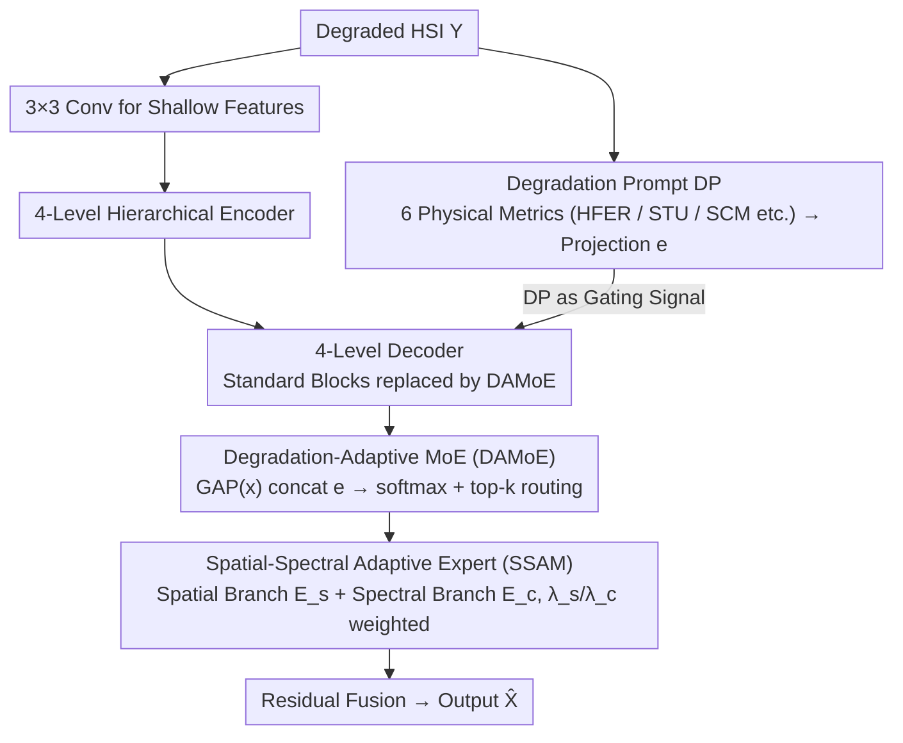

# Degradation-Aware Metric Prompting for Hyperspectral Image Restoration

**Conference**: ICML 2026  
**arXiv**: [2512.20251](https://arxiv.org/abs/2512.20251)  
**Code**: https://github.com/MiliLab/DAMP (Available)  
**Area**: Image Restoration / Hyperspectral Image / Unified Restoration  
**Keywords**: Hyperspectral image restoration, degradation-aware prompting, interpretable metrics, Mixture-of-Experts, zero-shot generalization

## TL;DR
DAMP utilizes 6 interpretable spatial-spectral physical metrics (high-frequency energy ratio, texture uniformity, spectral curvature, etc.) as "Degradation Prompts" (DP) to replace black-box embeddings and explicit degradation labels. These DPs act as gating signals driving a Spatial-Spectral Adaptive MoE to select different "spatial/spectral experts," achieving SOTA performance across 5 HSI restoration tasks and 2 unseen degradations (motion blur, Poisson noise) simultaneously.

## Background & Motivation
**Background**: Hyperspectral images (HSI) record the spectral response of materials across hundreds of continuous bands but are affected by various degradations such as noise, motion blur, stripe artifacts, band loss, and compression. Early methods trained specialized networks for each degradation; subsequently, inspired by "Unified Restoration (UIR)" frameworks like PromptIR and InstructIR in natural images, methods like PromptHSI and MP-HSIR began adopting the "one model for multiple degradations" paradigm.

**Limitations of Prior Work**: Current HSI unified restoration methods follow two flawed paths:

- **Explicit Prior Methods** (PromptHSI/MP-HSIR): Require externally provided degradation labels or text descriptions. In real-world scenarios, it is difficult to determine the specific combination and severity of degradations (e.g., blur + stripes + missing bands) beforehand.
- **Implicit Black-box Methods** (PromptIR/DFPIR): Encode a latent prompt directly from the input. These force unseen degradations into the manifold of the training distribution, resulting in poor generalization and lacking an explicit mechanism to model spectral correlation, leading to low spectral fidelity.

**Key Challenge**: HSI degradations are physically "continuous, mixed, and cross-dimensional" (textural destruction in the spatial dimension and spectral curve distortion in the spectral dimension). However, existing prompts are either discrete categories (discontinuous) or uninterpretable latents (dimension-agnostic). The mismatch between the geometric structure of the prompt space and the physical structure of the degradation causes failures in both generalization and interpretability.

**Goal**: Construct a degradation representation that is **independent of external labels, interpretable, cross-dimensional, and naturally continuous for unseen degradations**, enabling the restoration network to allocate computational resources "on-demand" (e.g., when to reconstruct spatial texture vs. when to restore spectral continuity).

**Key Insight**: A pilot experiment on 1000 degraded HSIs using three simple physical metrics—High-Frequency Energy Ratio (HFER), Spatial Texture Uniformity (STU), and Spectral Curvature Mean (SCM)—showed that 5 degradation types could be clearly distinguished by a random forest. Furthermore, different degradations overlapped on certain metrics (e.g., slight blur and low noise shared similar SCM). This suggests that **a few interpretable metrics can differentiate degradation identities while naturally reflecting commonalities**, addressing both interpretability and generalization.

**Core Idea**: Replace black-box embeddings or category labels with a **multi-dimensional physical metric vector** (Degradation Prompt, DP) as the gating signal for MoE. This forces routing logic to be explicitly anchored to physical rules (e.g., "higher high-frequency energy $\Rightarrow$ bias towards spectral filtering experts"), simultaneously solving interpretability, mixed degradation handling, and zero-shot generalization.

## Method

### Overall Architecture
DAMP is a hierarchical U-Net-style unified HSI restoration network designed to restore multiple HSI degradations without knowing the type or label. It coordinates two parallel streams: one calculates 6-dimensional physical metrics from the input HSI $\mathcal{Y}$, projecting them into a degradation prompt vector $\mathbf{e} \in \mathbb{R}^d$ (DP) as a global condition; the other is the feature restoration stream, using $3\times 3$ convolutions for shallow features, a 4-level hierarchical encoder (standard attention blocks), and a 4-level decoder where standard blocks are replaced by DAMoE. The DP acts as a gating signal to dynamically adjust the restoration trajectory. The final output is $\hat{\mathcal{X}} = \mathcal{R}_\theta(\mathcal{Y})$ via residual fusion. Key innovations include the selection of metrics, DP-driven routing in DAMoE, and the spatial-spectral division within each expert (SSAM).

### Key Designs

**1. Degradation Prompt: Replacing Black-box Representations with Interpretable Physics**

DP addresses the issue of prompts being either discrete (label-dependent) or black-box latents (distribution-locked). The authors selected 6 metrics from 25 candidates through a three-stage screening process (interpretability, spatial-spectral coverage, and feature importance via random forest): High-Frequency Energy Ratio HFER $=\frac{1}{C}\sum_c \frac{\sum_{(u,v)\in\Omega_H}|\mathcal{F}[x_c]|^2}{\sum_{(u,v)}|\mathcal{F}[x_c]|^2}$, Spatial Texture Uniformity (STU), Spectral Curvature Mean SCM $=\frac{1}{C-2}\sum_i|\nabla^2 s_i|$, Spectral Curvature Std, Gradient Std, and Spatial Correlation Coefficient. These metrics are physical indicators: HFER reflects high-frequency detail destruction (sensitive to noise/blur), and SCM reflects spectral curve smoothness (sensitive to band loss). Because they are not bound to the training distribution, DPs remain valid for unseen degradations like Poisson noise or motion blur.

**2. Degradation-Adaptive MoE: DP-Driven Expert Routing**

DAMoE dynamically selects top-$k$ experts in each decoder level. For input features $\mathbf{x}$, the gating score is $\mathbf{g} = \mathcal{T}_k(\text{softmax}(\mathbf{W}_g \cdot \sigma(\mathbf{W}_{proj}[\text{GAP}(\mathbf{x}), \mathbf{e}]) + \epsilon))$, where $\epsilon \sim \mathcal{N}(0,1)$ is noise for load balancing. Final features $\mathbf{f}_{deg} = \sum_{i \in \mathcal{K}} g_i \cdot \mathbf{f}_i$ are fused with "degradation-agnostic features" from a shared expert. Unlike visual-feature-only MoEs, DAMoE routing is anchored by "physical interpretability": high HFER (heavy noise) explicitly biases the gate towards spectral filtering experts, ensuring stable routing even when visual features are severely blurred.

**3. SSAM: Expert-wise Mixture Coefficients for Specialization**

Each expert in DAMoE is implemented as an SSAM block with two parallel branches: $\mathcal{E}_s$ (Window-based Multi-head Self-Attention) for spatial structure and $\mathcal{E}_c$ (1D Convolution) for inter-band correlation. The expert output is $\mathbf{F}_{expert}^{(i)} = \lambda_s^{(i)} \mathcal{E}_s(\mathbf{F}) + \lambda_c^{(i)} \mathcal{E}_c(\mathbf{F})$ where $\lambda_s^{(i)} + \lambda_c^{(i)} = 1$. Crucially, $\lambda_s^{(i)}$ and $\lambda_c^{(i)}$ are learnable parameters specific to the expert, not predicted from the input. This "forced alignment" ensures experts specialize as either spatial experts (large $\lambda_s$) or spectral experts (large $\lambda_c$), providing the router with distinct options to optimize the spatial/spectral restoration ratio based on the DP.

### Loss & Training
The network is optimized using L1 loss: $\mathcal{L} = \|\hat{\mathcal{X}} - \mathcal{X}\|_1$. Gaussian noise in the gate provides load balancing. Training uses AdamW ($\beta_1=0.9, \beta_2=0.999$), lr $=1\times 10^{-4}$, batch size 4 for 3000 epochs (natural HSI) or 1500 epochs (remote sensing HSI) on an RTX 4090.

## Key Experimental Results

### Main Results
Comparison of PSNR/SSIM/SAM across 5 unified restoration tasks (Table 2 selection, units dB / – / °):

| Task (Dataset) | MP-HSIR | PromptIR | MoCE-IR | **Ours** | Gain |
|---|---|---|---|---|---|
| Gaussian Deblur (ARAD) | 44.58 / 0.984 / 0.900 | 49.18 / 0.996 / 0.822 | 50.52 / 0.996 / 0.673 | **52.84 / 0.998 / 0.508** | +2.32 dB |
| Super-Resolution (ARAD) | 41.77 / 0.972 / 1.142 | 40.57 / 0.966 / 1.168 | 40.62 / 0.967 / 1.110 | **44.01 / 0.981 / 0.866** | +2.24 dB |
| Inpainting (Xiong'an) | 33.42 / 0.697 / 11.13 | 31.36 / 0.579 / 13.60 | 29.04 / 0.518 / 15.79 | **33.62 / 0.711 / 10.98** | +0.20 dB |
| Gaussian Denoise (ICVL) | 42.16 / 0.968 / 3.030 | 42.35 / 0.970 / 2.659 | 42.66 / 0.973 / 2.434 | **42.86 / 0.974 / 2.229** | +0.20 dB |
| Avg. on ARAD (5 Tasks) | 47.85 / 0.984 / 1.608 | 47.20 / 0.984 / 1.510 | 48.72 / 0.985 / 1.203 | **51.43 / 0.989 / 0.936** | +2.71 dB |
| Avg. on RS Data | 38.33 / 0.839 / 12.73 | 38.19 / 0.812 / 13.25 | 36.78 / 0.774 / 15.09 | **39.42 / 0.851 / 10.11** | +1.09 dB |

Zero-shot performance (Unseen degradations on CAVE, Table 3):

| Method | Motion Blur PSNR/SSIM | Poisson Denoise PSNR/SSIM |
|---|---|---|
| PromptIR | 30.53 / 0.881 | 21.98 / 0.442 |
| MoCE-IR | 30.34 / 0.878 | 19.51 / 0.401 |
| MP-HSIR | 23.63 / 0.688 | 16.96 / 0.240 |
| **Ours** | **31.05 / 0.899** | **24.08 / 0.538** |

### Ablation Study
Component ablation (Table 4, Average PSNR/SSIM on ARAD):

| Configuration | PSNR (dB) | SSIM | Observation |
|---|---|---|---|
| Baseline (No DP, No SSAM) | 45.82 | 0.976 | Standard U-Net |
| + DP | 50.02 | 0.986 | **+4.20 dB gain** (Main contributor) |
| + DP + SSAM (Full) | **51.43** | **0.989** | +1.41 dB additional gain |

Routing signal ablation (Table 5):

| Routing Signal | PSNR (dB) | Gap vs. DP |
|---|---|---|
| Frequency-based (MoCE-IR type) | 47.72 | −3.71 |
| Degradation Type (Category labels) | 46.27 | −5.16 |
| Implicit Prompt (PromptIR type) | 46.81 | −4.62 |
| **DP (Ours)** | **51.43** | – |

### Key Findings
- Adding DP yields a 4.20 dB gain, far exceeding SSAM's 1.41 dB. The **core innovation is the degradation representation**, not just the MoE architecture.
- Category labels performed worse than implicit prompts, suggesting that "hard classification" loses continuity information. DP succeeds by preserving both continuity and physical interpretability.
- Cross-spectral band error analysis (Fig. 6) shows SSAM minimizes spectral errors across all tasks, proving that expert-wise learned $\lambda_s/\lambda_c$ allows spectral experts to function effectively.
- The +2.10 dB gain in zero-shot Poisson denoising confirms that physical metrics generalize beyond the training distribution.

## Highlights & Insights
- **Shifting "Prompts" from Semantics to Physics**: While natural image UIR focuses on "textual/visual/implicit prompts," DAMP adopts closed-form physical statistics (frequency domain and curvature). This "prompt physicalization" strategy is applicable to any inverse problem with explicit physical models (e.g., medical imaging, seismic signals).
- **Expert-wise vs. Instance-wise Coefficients**: Forcing fixed learnable coefficients within experts (rather than dynamic prediction) sacrifices individual expert flexibility to achieve global specialization. This ensures the router has truly distinct experts to choose from.
- **Routing Signals Define the MoE Ceiling**: Replacing routing signals resulted in a 3-5 dB performance drop, suggesting that "what the gate looks at" is more critical than the internal expert structure.

## Limitations & Future Work
- **Hand-crafted Metrics**: The 6 DP metrics were selected manually via random forest, introducing human bias. Future work could explore end-to-end learnable metric dictionaries.
- **Decoupled from Explicit Physical Models**: DP describes degradation but does not invert the degradation operator $\mathcal{D}(\cdot)$. Coupling DP with a light-weight inversion head (e.g., blur kernel estimation) could provide diagnostic information.
- **Separated Domain Training**: Natural and Remote Sensing HSIs were trained separately due to domain gaps. Future work could use DP as a cross-domain bridge since the metrics are sensor-independent.

## Related Work & Insights
- **vs. PromptIR / InstructIR**: Both use prompts, but PromptIR uses implicit latents and InstructIR uses text. DAMP uses low-dimensional, physically objective prompts, leading to significantly better zero-shot performance (+2 dB).
- **vs. MP-HSIR / PromptHSI**: These rely on external labels unavailable in real scenarios. DAMP is self-contained and calculates metrics directly from the input.
- **vs. MoCE-IR**: MoCE-IR uses frequency-based routing for spatial UIR. DAMP extends this to spatial-spectral physical metrics and forces expert specialization through fixed internal coefficients.

## Rating
- Novelty: ⭐⭐⭐⭐ "Physicalization of prompts" is a significant shift in HSI UIR.
- Experimental Thoroughness: ⭐⭐⭐⭐⭐ Comprehensive 5-task tests across 8 datasets, including zero-shot and error analysis.
- Writing Quality: ⭐⭐⭐⭐ Clear motivation and rich visualizations.
- Value: ⭐⭐⭐⭐ Concepts like physically-aligned prompts and expert specialization are highly transferable.

<!-- RELATED:START -->

## Related Papers

- [\[CVPR 2025\] Degradation-Aware Feature Perturbation for All-in-One Image Restoration](../../CVPR2025/image_restoration/degradation-aware_feature_perturbation_for_all-in-one_image_restoration.md)
- [\[CVPR 2025\] DPIR: Dual Prompting Image Restoration with Diffusion Transformers](../../CVPR2025/image_restoration/dpir_dual_prompting_restoration_dit.md)
- [\[CVPR 2026\] Degradation-Robust Fusion: An Efficient Degradation-Aware Diffusion Framework for Multimodal Image Fusion in Arbitrary Degradation Scenarios](../../CVPR2026/image_restoration/degradation-robust_fusion_an_efficient_degradation-aware_diffusion_framework_for.md)
- [\[ICCV 2025\] MP-HSIR: A Multi-Prompt Framework for Universal Hyperspectral Image Restoration](../../ICCV2025/image_restoration/mp-hsir_a_multi-prompt_framework_for_universal_hyperspectral_image_restoration.md)
- [\[CVPR 2026\] Degradation-Consistent Test-Time Adaptation for All-in-One Image Restoration](../../CVPR2026/image_restoration/degradation-consistent_test-time_adaptation_for_all-in-one_image_restoration.md)

<!-- RELATED:END -->
