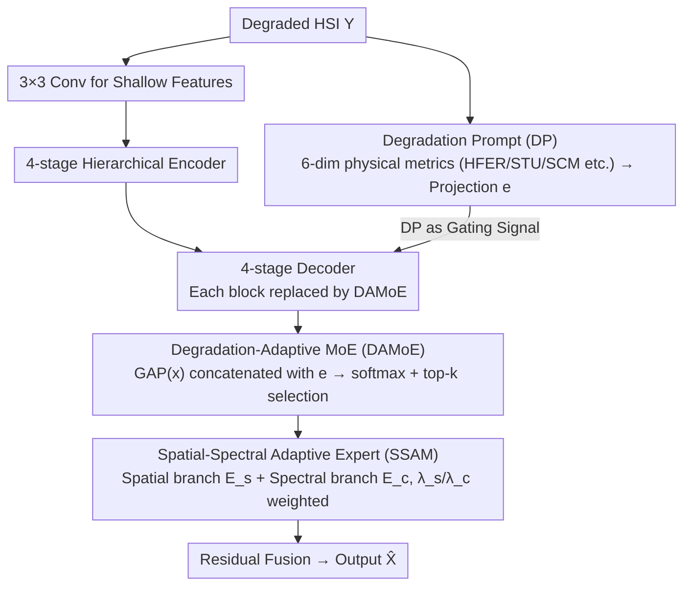

# Degradation-Aware Metric Prompting for Hyperspectral Image Restoration

**Conference**: ICML 2026  
**arXiv**: [2512.20251](https://arxiv.org/abs/2512.20251)  
**Code**: https://github.com/MiliLab/DAMP (Available)  
**Area**: Image Restoration / Hyperspectral Image / Unified Restoration  
**Keywords**: Hyperspectral Image Restoration, Degradation-Aware Prompting, Interpretable Metrics, Mixture-of-Experts, Zero-shot Generalization

## TL;DR
DAMP utilizes six interpretable spatial-spectral physical metrics (such as high-frequency energy ratio, texture consistency, and spectral curvature) as "Degradation Prompts" (DP) to replace black-box embeddings and explicit degradation labels. These DPs serve as gating signals for a Spatial-Spectral Adaptive MoE to select different "spatial/spectral experts," achieving SOTA performance across five HSI restoration tasks and two unseen degradations (motion blur, Poisson noise) simultaneously.

## Background & Motivation
**Background**: Hyperspectral images (HSI) record spectral responses of materials across hundreds of continuous bands, but they are affected by various degradations such as signal-to-noise ratio, motion blur, stripe artifacts, missing bands, and compression. Early methods trained specialized networks for each degradation; subsequently, inspired by "Unified Restoration (UIR)" frameworks in natural images like PromptIR and InstructIR, models such as PromptHSI and MP-HSIR began using a "one model for multiple degradations" paradigm.

**Limitations of Prior Work**: Current HSI unified restoration methods follow two paths, both with significant drawbacks:
- **Explicit Prior-based** (PromptHSI/MP-HSIR): These require externally provided degradation labels or text descriptions. In real-world scenarios, it is difficult to know the exact combination (e.g., blur + stripe + missing bands) or its severity beforehand.
- **Implicit Black-box-based** (PromptIR/DFPIR): These encode a latent prompt directly from the input, forcing unseen degradations into the training distribution manifold, leading to poor generalization. Moreover, they lack explicit mechanisms to model spectral correlation, resulting in low spectral fidelity.

**Key Challenge**: HSI degradations are physically "continuous, mixed, and cross-dimensional" (destroying texture in the spatial dimension and distorting spectral curves in the spectral dimension). However, existing prompts are either discrete categories (discontinuous) or uninterpretable latents (dimension-agnostic). The geometric structure of the prompt space does not match the physical structure of the degradation, leading to failures in both generalization and interpretability.

**Goal**: To construct a degradation representation that is **independent of external labels, interpretable, cross-dimensional, and naturally continuous for unseen degradations**, enabling the restoration network to allocate computational resources "on-demand" (e.g., deciding when to reconstruct spatial textures versus restoring spectral continuity).

**Key Insight**: The authors conducted a pilot experiment on 1,000 degraded HSIs using three simple physical metrics: High-Frequency Energy Ratio (HFER), Spatial Texture Uniformity (STU), and Spectral Curvature Mean (SCM). Use of a random forest for classification revealed that five types of degradation could be clearly distinguished. Simultaneously, different degradation types showed overlapping distributions in certain metrics (e.g., slight blur and low noise have similar SCM). This indicates that **a small number of interpretable metrics can both distinguish degradation identity and naturally reflect commonalities between degradations**—the former addresses interpretability, while the latter addresses generalization.

**Core Idea**: Replace "degradation prompts" from black-box embeddings or category labels with **multi-dimensional physical metric vectors** (Degradation Prompt, DP). Use these as gating signals for MoE, forcing the routing logic to anchor explicitly on physical rules (e.g., "higher high-frequency energy → bias towards spectral filtering experts"), thereby solving interpretability, mixed degradation handling, and zero-shot generalization in one go.

## Method

### Overall Architecture
DAMP is a hierarchical U-Net style unified HSI restoration network designed to restore multiple HSI degradations using a single model without knowing degradation types or labels. The problem is framed as the collaboration of two parallel flows: one calculates 6-dimensional physical metrics from the input degraded HSI $\mathcal{Y}$, projects them into a degradation prompt vector $\mathbf{e} \in \mathbb{R}^d$ (DP) as a global condition across all layers; the other is a standard feature restoration flow using $3\times3$ convolutions for shallow features, a 4-level hierarchical encoder (standard attention blocks), and a 4-level decoder. Crucially, the standard blocks in each decoder stage are replaced by DAMoE, where the DP serves as a gating signal to dynamically adjust the restoration trajectory. Finally, residual fusion combines the input and decoded features to output $\hat{\mathcal{X}} = \mathcal{R}_\theta(\mathcal{Y})$.

### Key Designs

**1. Degradation Prompt: Replacing Black-box Representations with Interpretable Physical Metrics**

DP addresses the issue that existing prompts are either discrete (dependent on labels) or black-box latents (uninterpretable). The authors started with 25 candidate metrics (entropy, gradient, frequency stats) and applied a three-stage screening: first removing abstract statistics without clear physical meanings, then ensuring spatial-spectral coverage, and finally selecting the most discriminative features using random forest importance. The resulting 6 dimensions are: High-Frequency Energy Ratio HFER $=\frac{1}{C}\sum_c \frac{\sum_{(u,v)\in\Omega_H}|\mathcal{F}[x_c]|^2}{\sum_{(u,v)}|\mathcal{F}[x_c]|^2}$, Spatial Texture Uniformity (STU), Spectral Curvature Mean SCM $=\frac{1}{C-2}\sum_i|\nabla^2 s_i|$, SCM Standard Deviation, Gradient Standard Deviation, and Spatial Correlation Coefficient. These metrics are effective because they are physical indicators of degradation: HFER reflects the destruction of high-frequency details, while SCM identifies spectral distortion. Since they are not tied to the training distribution, the DP remains in a reasonable numerical range even for unseen degradations like Poisson noise, facilitating zero-shot generalization.

**2. Degradation-Adaptive MoE: DP-Driven Expert Routing**

DAMoE dynamically selects the top-$k$ experts in each decoder stage. For an input feature $\mathbf{x}$, GAP compresses the spatial dimensions into a global vector, which is concatenated with the DP embedding $\mathbf{e}$. This is passed through two projection layers, softmax, and top-$k$ sparsification to obtain gating scores $\mathbf{g} = \mathcal{T}_k(\text{softmax}(\mathbf{W}_g \cdot \sigma(\mathbf{W}_{proj}[\text{GAP}(\mathbf{x}), \mathbf{e}]) + \epsilon))$. Noise $\epsilon \sim \mathcal{N}(0,1)$ is injected during training for load balancing. The final features $\mathbf{f}_{deg} = \sum_{i \in \mathcal{K}} g_i \cdot \mathbf{f}_i$ are fused with degradation-agnostic features from a shared expert via channel-wise convolution. Unlike MoCE-IR, which uses pure visual feature routing, DAMoE's routing is anchored by "physically interpretable" signals, remaining stable even when visual features are severely blurred.

**3. SSAM: Expert-wise Mixing Coefficients for Differentiation**

Each expert in DAMoE is implemented via SSAM, which uses two parallel branches: $\mathcal{E}_s$ (Window-based Multi-head Self-Attention) for spatial structure and $\mathcal{E}_c$ (1D Convolution) for inter-band correlation. The $i$-th expert output is $\mathbf{F}_{expert}^{(i)} = \lambda_s^{(i)} \mathcal{E}_s(\mathbf{F}) + \lambda_c^{(i)} \mathcal{E}_c(\mathbf{F})$ with $\lambda_s^{(i)} + \lambda_c^{(i)} = 1$. Crucially, $\lambda_s^{(i)}$ and $\lambda_c^{(i)}$ are expert-specific learnable parameters rather than input-specific predictions. This forces experts to specialize as either "spatial experts" (large $\lambda_s$) or "spectral experts" (large $\lambda_c$). By using expert-wise weights instead of instance-wise weights, the model prevents expert homogenization, allowing the router to choose the optimal spatial/spectral ratio based on the DP.

### Loss & Training
The model uses L1 loss: $\mathcal{L} = \|\hat{\mathcal{X}} - \mathcal{X}\|_1$. Gaussian noise in the gating mechanism is the sole load balancing tool. Training utilizes AdamW ($\beta_1=0.9, \beta_2=0.999$), lr $=1\times 10^{-4}$, batch size 4. Natural scene HSI is trained for 3000 epochs, and remote sensing HSI for 1500 epochs on an RTX 4090.

## Key Experimental Results

### Main Results
Comparison of PSNR/SSIM/SAM across 5 unified restoration tasks (Table 2, units dB / – / °):

| Task (Dataset) | MP-HSIR | PromptIR | MoCE-IR | **Ours (DAMP)** | Gain |
|---|---|---|---|---|---|
| Gaussian Deblur (ARAD) | 44.58 / .984 / .900 | 49.18 / .996 / .822 | 50.52 / .996 / .673 | **52.84 / .998 / .508** | +2.32 dB |
| Super-Resolution (ARAD) | 41.77 / .972 / 1.142 | 40.57 / .966 / 1.168 | 40.62 / .967 / 1.110 | **44.01 / .981 / .866** | +2.24 dB |
| Inpainting (Xiong'an) | 33.42 / .697 / 11.13 | 31.36 / .579 / 13.60 | 29.04 / .518 / 15.79 | **33.62 / .711 / 10.98** | +0.20 dB |
| Gaussian Denoise (ICVL) | 42.16 / .968 / 3.030 | 42.35 / .970 / 2.659 | 42.66 / .973 / 2.434 | **42.86 / .974 / 2.229** | +0.20 dB |
| Avg. on ARAD (5 tasks) | 47.85 / .984 / 1.608 | 47.20 / .984 / 1.510 | 48.72 / .985 / 1.203 | **51.43 / .989 / .936** | +2.71 dB |

Zero-shot Results (on unseen degradations in CAVE, Table 3):

| Method | Motion Blur PSNR/SSIM | Poisson Denoise PSNR/SSIM |
|---|---|---|
| PromptIR | 30.53 / 0.881 | 21.98 / 0.442 |
| MoCE-IR | 30.34 / 0.878 | 19.51 / 0.401 |
| **Ours (DAMP)** | **31.05 / 0.899** | **24.08 / 0.538** |

### Ablation Study
Ablation of components (Table 4, avg. PSNR/SSIM on ARAD):

| Configuration | PSNR (dB) | SSIM | Note |
|---|---|---|---|
| Baseline (No DP/SSAM) | 45.82 | 0.976 | Vanilla U-Net |
| + DP | 50.02 | 0.986 | **+4.20 dB gain** |
| + DP + SSAM (Full) | **51.43** | **0.989** | Final model |

Routing strategy ablation (Table 5):

| Routing Signal | PSNR (dB) | Gap to DP |
|---|---|---|
| Frequency-based | 47.72 | −3.71 |
| Degradation Type (Labels) | 46.27 | −5.16 |
| Implicit Prompt | 46.81 | −4.62 |
| **DP (Ours)** | **51.43** | – |

### Key Findings
- DP alone contributes a gain of 4.20 dB, significantly higher than SSAM's 1.41 dB, identifying the degradation representation as the core innovation.
- Category label routing performed worse than implicit prompt routing by 0.5 dB, suggesting that "hard classification" loses information about degradation continuity; DP wins by preserving both continuity and interpretability.
- Zero-shot Poisson denoising improvement (+2.10 dB) is rare in UIR literature, confirming that DP's physical metrics yield meaningful values even for unseen noise distributions.

## Highlights & Insights
- **Reorienting "Prompts" toward Physics**: While natural image UIR focuses on "textual/visual/implicit" prompts, DAMP uses closed-form frequency and curvature statistics. This "prompt physicalization" approach is highly transferable to tasks with clear physical degradation models (e.g., medical imaging, CT).
- **Expert-wise vs. Instance-wise mixing**: Forcing fixed learnable coefficients within experts (rather than dynamic prediction) sacrifices individual expert flexibility for collective specialization, providing the router with distinct choices.
- **Routing Signal determines the MoE ceiling**: Changing the routing signal results in a 3-5 dB difference, suggesting that "what the gate sees" is more critical than "what the expert is."

## Limitations & Future Work
- **Handcrafted Metrics**: The 6-dimensional DP is selected through manual screening and random forests, involving human bias. A future extension would involve learning the metric pool end-to-end.
- **Explicit Physical Coupling**: DP describes the degradation degree but does not invert the degradation operator. Adding a light inversion head (to estimate blur kernels, etc.) could further enhance performance.
- **Domain Separation**: Natural and remote sensing scenes were trained as independent models. A unified cross-domain model using DP as a bridge could be explored.

## Related Work & Insights
- **vs. PromptIR/InstructIR**: These use high-dimensional prompts coupled with the training distribution. DAMP uses low-dimensional, objectively physical prompts, leading to significantly better zero-shot performance (+2 dB).
- **vs. MP-HSIR/PromptHSI**: These rely on external labels unavailable in real scenarios. DAMP is self-contained.
- **vs. MoCE-IR**: While both use MoE, MoCE-IR routes via spatial frequency stats. DAMP uses spatial-spectral physical quantities and expert-wise specialization, leading to a 2.71 dB average lead.

## Rating
- Novelty: ⭐⭐⭐⭐ (Clear conceptual shift to physical prompts in HSI UIR).
- Experimental Thoroughness: ⭐⭐⭐⭐⭐ (5 tasks, 8 datasets, zero-shot, and comprehensive ablations).
- Writing Quality: ⭐⭐⭐⭐ (Clear motivation and rich visualizations).
- Value: ⭐⭐⭐⭐ (Directly applicable to multi-spectoral/medical imaging UIR).

<!-- RELATED:START -->

## Related Papers

- [\[CVPR 2025\] Degradation-Aware Feature Perturbation for All-in-One Image Restoration](../../CVPR2025/image_restoration/degradation-aware_feature_perturbation_for_all-in-one_image_restoration.md)
- [\[CVPR 2026\] DRFusion: Degradation-Robust Fusion via Degradation-Aware Diffusion Framework](../../CVPR2026/image_restoration/drfusion_degradation_robust_fusion_via_degradation_aware_diffusion_framework.md)
- [\[CVPR 2025\] DPIR: Dual Prompting Image Restoration with Diffusion Transformers](../../CVPR2025/image_restoration/dpir_dual_prompting_restoration_dit.md)
- [\[CVPR 2026\] Degradation-Robust Fusion: An Efficient Degradation-Aware Diffusion Framework for Multimodal Image Fusion in Arbitrary Degradation Scenarios](../../CVPR2026/image_restoration/degradation-robust_fusion_an_efficient_degradation-aware_diffusion_framework_for.md)
- [\[CVPR 2026\] EMR-Diff: Edge-aware Multimodal Residual Diffusion Model for Hyperspectral Image Super-resolution](../../CVPR2026/image_restoration/emr-diff_edge-aware_multimodal_residual_diffusion_model_for_hyperspectral_image_.md)

<!-- RELATED:END -->
