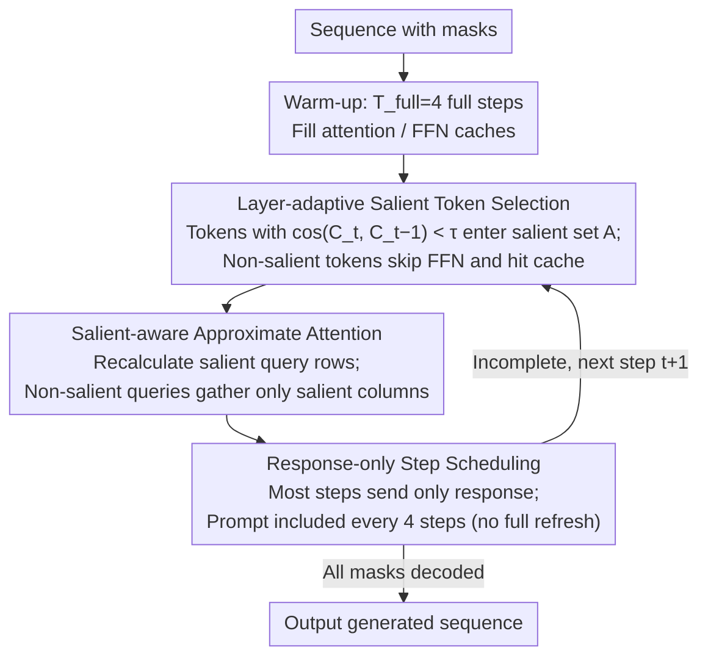

# DyLLM: Efficient Diffusion LLM Inference via Saliency-based Token Selection and Partial Attention

**Conference**: ICML2026  
**arXiv**: [2603.08026](https://arxiv.org/abs/2603.08026)  
**Code**: https://github.com/scale-snu/DyLLM.git (Available)  
**Area**: LLM Efficiency  
**Keywords**: Diffusion Language Models, Inference Acceleration, Temporal Sparsity, Salient Token Selection, Approximate Attention

## TL;DR
DyLLM is a training-free inference acceleration framework for diffusion LLMs. It identifies "salient tokens" by measuring the cosine similarity of attention contexts between adjacent denoising steps. By recalculating FFN and attention only for these tokens using salient-aware approximate attention, it increases throughput to 7.6× / 9.6× on LLaDA / Dream with negligible performance loss.

## Background & Motivation

**Background**: Masked Diffusion Language Models (MDLM, e.g., LLaDA / Dream / Gemini Diffusion) utilize bidirectional attention to fill in masked sequences simultaneously. They have approached the performance of AR LLMs like Llama on benchmarks such as GSM8K and MBPP, offering potential for parallel decoding and breaking the sequential token-by-token constraint.

**Limitations of Prior Work**: MDLMs recalculate the **entire sequence** at each denoising step ("repeated prefill"). Because bidirectional attention lacks a fixed causal order, KV cache cannot be reused incrementally as in AR models. Consequently, FFN dominates the computation in every step, and the overall throughput is consumed by "repeated prefixes," providing no advantage over vLLM-optimized AR decoding.

**Key Challenge**: Parallel decoding (multiple tokens per step, bidirectional attention) naturally conflicts with cache reuse (which requires position/context stability). Existing solutions either refresh based on fixed blocks/schedules (e.g., PrefixCache / DualCache in Fast-dLLM, dKV-Cache) or select tokens based on global thresholds (dLLM-Cache, Elastic-Cache). These methods fail to capture the fine-grained structure where "only a few tokens in each layer change at each step."

**Goal**: To reduce the computation of FFN + Attention from the full sequence to a **layer-adaptive and token-adaptive** small subset during each step, without retraining or modifying model weights, while maintaining generation quality.

**Key Insight**: The authors plotted the distribution of cosine similarity $s_{t,l}^{(i)}$ for adjacent attention contexts $C_{t,l}^{(i)}$ in LLaDA (Fig. 2). They found: (1) most tokens have $s\approx 1$ across all layers, but the "tail" is thicker in deeper layers, indicating that **temporal sparsity** exists; (2) sparsity **varies per layer**, with deeper layers requiring more updates. This provides a natural per-layer sparse selector.

**Core Idea**: Use the cosine similarity of attention contexts from adjacent steps as a saliency metric. Recalculate FFN and attention only for "salient tokens" in each layer/step. Approximate the attention context update for non-salient tokens by "gathering only $\Delta V$ from salient columns," simultaneously exploiting sparsity in both FFN and attention.

## Method

### Overall Architecture
DyLLM addresses the "repeated prefill" bottleneck in MDLM by wrapping the standard decoding loop with a "saliency scheduler." First, it uses the first $T_{full}=4$ full steps to fill the attention/FFN output caches for all layers. Subsequently, it enters the "Salient only" stage: for each step $t$ and layer $l$, a subset of "truly active" salient tokens $\mathcal{A}_{t,l}$ is identified where $\cos(C_t, C_{t-1}) < \tau$. FFN and attention are precisely recalculated only for this subset, while others hit the cache. This effectively migrates the "prefill → decode" paradigm of AR inference to diffusion decoding, but with a layer-adaptive and step-adaptive active set.

### Key Designs

**1. Layer-adaptive Salient Token Selection: Contextual drift as a proxy**

To solve the issue of fixed thresholds causing waste or mis-pruning, DyLLM calculates the cosine similarity $s_{t,l}^{(i)}=\cos(C_{t,l}^{(i)},C_{t-1,l}^{(i)})$ between the attention context $C_{t,l}^{(i)}$ (the result of $\mathrm{softmax}(QK^T)V$) and the previous step. Tokens with $s_{t,l}^{(i)}<\tau$ form the salient set $\mathcal{A}_{t,l}=\{i\mid s_{t,l}^{(i)}<\tau\}$, where $\tau$ is 0.99 (LLaDA) or 0.995 (Dream). Non-salient tokens skip FFN calculation and reuse the cached FFN output. The validity of skipping FFN when the direction is stable is supported by: Prop 3.1, which shows RMSNorm is scale-insensitive under linear projection; and Prop 3.2, which provides an upper bound for FFN input perturbation $\delta\le\kappa(W_o)\sqrt{2(1-s_{t,l})}$—as $s\to 1$, the error of skipping FFN approaches zero. Using a per-layer threshold naturally allows aggressive pruning in early layers and conservative updates in deeper layers, distributing the "error budget" across layers.

**2. Salient-aware Approximate Attention: Dual path row + column sparsity**

Reducing FFN is insufficient given the $O(N^2 d)$ overhead of attention. DyLLM decomposes context increments into $\Delta C_{t,l}=S_{t,l}\Delta V_{t,l}+(\Delta S)V_{t-1,l}$. For salient queries $i\in\mathcal{A}_{t,l-1}$, the full row is recalculated (row-sparse path). For non-salient queries, the attention scores remain nearly constant ($\Delta S^{(i,\cdot)}\approx 0$), so the update simplifies to $\Delta C_{t,l}^{(i)}\approx S_{t,l}^{(i,\cdot)}\Delta V_{t,l}$. Since $\Delta V_{t,l}$ is non-zero only for salient columns, it only needs to gather attention scores from salient columns (column-sparse path). This reduces overall complexity to $O(N\cdot|\mathcal{A}_{t,l-1}|d)$. Crucially, the same salient set determines both "which rows to recalculate" and "which KV columns to aggregate," allowing for a unified sparse mask implemented in a FlashAttention-like fused kernel.

**3. Response-only Step Scheduling: Eliminating periodic full refreshes**

Existing cache methods (dKV-Cache / Fast-dLLM / dLLM-Cache) rely on "full token refresh" cycles, which drop throughput back to baseline levels during refresh steps. Leveraging the locality bias of RoPE—where salient tokens tend to concentrate in the response section—DyLLM feeds only response tokens into the model for most steps. Every 4 steps, it includes the prompt; however, even then, it uses the salient set to compute sparsely. Since the prompt context is stable and mostly hits the cache, there are no traditional "full refresh" steps. This removes the main bottleneck of prior work where throughput would plummet as the number of parallel tokens $n_u$ increased.

### Loss & Training
Completely training-free, requiring no fine-tuning or extra loss. Hyperparameters include only the saliency threshold $\tau$ (model-dependent, task-agnostic) and initial full steps $T_{full}=4$. In implementation, custom CUDA kernels for sparse attention and caching were developed, as native PyTorch sparse operators are too overhead-heavy for fine-grained token sparsity.

## Key Experimental Results

### Main Results

On LLaDA 8B Instruct / Dream 7B Instruct with $n_u=1$ using a single H100 80GB PCIe card. Throughput is in tokens/s:

| Model | Bench | Original (acc / tput) | DyLLM Best (acc / tput / speedup) | Fast-dLLM Dual | dLLM-Cache |
|------|-------|----------------------|----------------------------------|----------------|------------|
| LLaDA 8B | GSM8K | 77.79 / 11.47 | **79.08 / 87.21 / ×7.60** | 78.24 / 75.24 (×6.56) | 77.18 / 36.77 (×3.21) |
| LLaDA 8B | MATH | 33.22 / 15.81 | **38.68 / 96.98 / ×6.13** | 32.36 / 93.26 (×5.90) | 24.70 / 36.56 (×2.31) |
| LLaDA 8B | MBPP | 29.20 / 33.11 | **30.00 / 169.62 / ×5.12** | 25.40 / 165.44 (×5.00) | 29.00 / 93.04 (×2.81) |
| Dream 7B | GSM8K | 75.59 / 12.57 | **79.30 / 111.79 / ×8.89** ($\tau$=0.9975) | 68.39 / 153.21 (×12.19) | 72.40 / 46.19 (×3.67) |
| Dream 7B | MATH | 37.60 / 17.64 | **45.12 / 130.57 / ×7.40** | 36.06 / 191.56 (×10.86) | 44.98 / 48.76 (×2.76) |
| Dream 7B | MMLU-Pro | 47.94 / 12.60 | 47.45 / 83.10 / ×6.60 | 46.73 / 128.52 (×10.20) | 49.30 / 27.19 (×2.16) |

Note: Fast-dLLM DualCache has higher throughput on Dream but experiences a significant drop in GSM8K accuracy (68.39, −7.2), a cost of its periodic full refreshes and block-level mis-pruning. DyLLM consistently leads dLLM-Cache by 2.16–3.67× throughput while maintaining accuracy.

### Ablation Study

| Config (LLaDA, GSM8K) | Acc | Description |
|--------------------|-----|------|
| Original | 77.79 | Baseline |
| Salient-only FFN (τ=0.995) | 78.09 | FFN skipped based on saliency; full attention | 
| Salient + Approx. (τ=0.995) | 78.01 | Full DyLLM (FFN + Approx. attention) |
| τ=0.99 | 79.08 | More aggressive threshold improves accuracy (suppresses softmax noise) |
| τ=0.985 | 78.62 | Performance begins to drop with lower thresholds |

Combined with confidence-aware parallel decoding (Tab 3, Dream GSM8K): DyLLM (τ=0.9975) achieves an average $n_u$ of **3.92** with 77.10 acc, while Fast-dLLM Dual achieves $n_u=3.68$ but acc drops to 67.85. This proves sparse updates do not conflict with parallel decoding.

### Key Findings
- **"Passive Denoising" of Softmax Noise**: Aggressive thresholds (τ=0.99) slightly increase accuracy. The authors attribute this to the fact that softmax always assigns positive weights; as sequences lengthen, cumulative contributions from low-relevance tokens introduce noise. DyLLM explicitly truncates these via saliency, acting as an implicit sparse attention regularizer.
- **GQA Amplifies Gains**: Dream uses GQA, which makes attention cheaper relative to FFN (70%+ of runtime). DyLLM's FFN sparsity targets this main component, leading to nearly 2× the speedup seen in LLaDA.
- **$n_u$ Scalability as the Killer Feature**: Prior works require full refreshes every $B$ steps, where cost scales with $n_u$. DyLLM has no full refresh steps, maintaining near-linear acceleration gains as $n_u\in\{1,2,4\}$.
- **$\tau$ is Model-dependent, Task-agnostic**: Only one calibration per model is needed (LLaDA=0.99 / Dream=0.995), generalizing across all benchmarks.

## Highlights & Insights
- Reconceptualizes "accelerating diffusion LLM" from an engineering view (caching KV/activations) to a physical essence view (updating only tokens that are truly "moving").
- **A single sparse mask drives both FFN skipping and dual-path attention**, enabling efficient implementation via FlashAttention-like fused kernels. This "shared active set" can migrate to any iterative refinement model (e.g., image diffusion).
- Identifies and eliminates "full refresh" as the Achilles' heel of cache-based methods during parallel decoding.

## Limitations & Future Work
- **Memory Overhead**: Requires storing attention and FFN output caches in addition to KV cache, expanding memory usage by roughly $(2d/g + 2d)/(2d/g)$ (where $g$ is GQA head count). This may affect ultra-large batch inference.
- **$\tau$ Calibration**: While task-agnostic, new models require a threshold sweep; lacks an automated or layer-adaptive mechanism for setting $\tau$.
- **Dependency on Temporal Sparsity**: Gains might diminish in early denoising steps or if future MDLMs use sampling strategies that flatten the $s_{t,l}$ distribution.
- **Online Serving**: Experiments were batched offline on H100; integration into production stacks like vLLM (involving variable batch sizes and KV cache sharing) remains an open problem.

## Related Work & Insights
- **vs Fast-dLLM**: Fast-dLLM uses fixed block caching and periodic full refreshes. DyLLM uses per-layer adaptive active sets and **eliminates full refreshes**, providing much better $n_u$ scalability.
- **vs dKV-Cache**: dKV-Cache is a "time-window" cache without token-wise selectivity; DyLLM is sparse in both token and layer dimensions.
- **vs dLLM-Cache / Elastic-Cache**: These use global thresholds requiring per-task tuning. DyLLM is 2.16–3.67× faster and more robust across tasks.
- **vs Classical Sparse Attention**: While classics focus on "which KV columns to attend to," DyLLM focuses on "which query rows are changing," which is more suited for the "repeated refinement" nature of diffusion.

## Rating
- Novelty: ⭐⭐⭐⭐ Saliency in diffusion LLMs isn't entirely new, but the unified application to FFN and dual-path attention with a formal error bound (Prop 3.2) is a solid combinatorial innovation.
- Experimental Thoroughness: ⭐⭐⭐⭐ Covers 4 benchmarks, 2 models, 3 baselines, and extensive ablation (thresholds, $nu$, parallel decoding, layer distributions). Lacks B200 or multi-node production deployment tests.
- Writing Quality: ⭐⭐⭐⭐ Clear logic chain (Observation → Metric → Proposition → Method → Experiment).
- Value: ⭐⭐⭐⭐⭐ Critical for the "AR vs Diffusion" debate. Achieving 7.6–9.6× throughput training-free and scale-friendly is a significant contribution to the diffusion LLM ecosystem.

<!-- RELATED:START -->

## Related Papers

- [\[NeurIPS 2025\] Encoder-Decoder Diffusion Language Models for Efficient Training and Inference](../../NeurIPS2025/image_restoration/encoder-decoder_diffusion_language_models_for_efficient_training_and_inference.md)
- [\[ECCV 2024\] Efficient Diffusion Transformer with Step-wise Dynamic Attention Mediators](../../ECCV2024/image_restoration/efficient_diffusion_transformer_with_step-wise_dynamic_attention_mediators.md)
- [\[ICML 2026\] DAPD: Dependency-Aware Parallel Decoding via Attention for Diffusion LLMs](dapd_dependency-aware_parallel_decoding_via_attention_for_diffusion_llms.md)
- [\[ICLR 2026\] Beyond Scattered Acceptance: Fast and Coherent Inference for DLMs via Longest Stable Prefixes](../../ICLR2026/image_restoration/beyond_scattered_acceptance_fast_and_coherent_inference_for_dlms_via_longest_sta.md)
- [\[ICML 2026\] AnyMod-LLVE: Low-Light Video Enhancement with Modality-Agnostic Inference](anymod-llve_low-light_video_enhancement_with_modality-agnostic_inference.md)

<!-- RELATED:END -->
