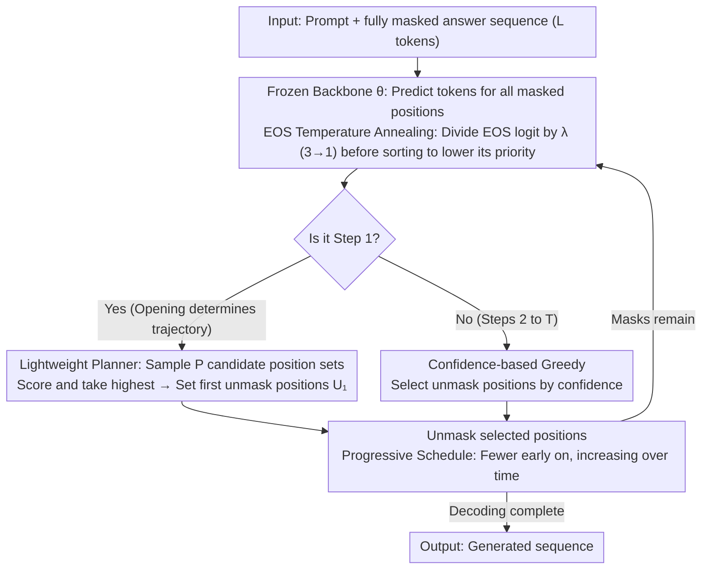

# Early Decisions Matter: Proximity Bias and Initial Trajectory Shaping in Non-Autoregressive Diffusion Language Models

**Conference**: ICML 2026  
**arXiv**: [2604.10567](https://arxiv.org/abs/2604.10567)  
**Code**: None  
**Area**: LLM Efficiency / Diffusion Language Models / Non-autoregressive Decoding  
**Keywords**: dLLM, non-autoregressive decoding, proximity bias, EOS overflow, lightweight planner

## TL;DR
This paper systematically characterizes the failure mechanism of masked diffusion language models (dLLM) under **fully non-autoregressive (NAR) decoding**. It identifies that proximity bias causes confidence-based sampling to degenerate into reverse autoregrssion, which is prematurely saturated by EOS tokens. By using a 5M-parameter lightweight planner and EOS temperature annealing to intervene in unmasking positions **only at the first step**, the authors improve LLaDA 8B NAR decoding by 2.8–4.3 points on reasoning tasks like GSM8K with almost no additional overhead.

## Background & Motivation

**Background**: dLLMs (LLaDA, Dream, MDLM, etc.) model text in a mask-and-predict format. Theoretically, they possess two major advantages: **Parallelism** (decoding multiple tokens at once) and **Bidirectionality** (utilizing both preceding and succeeding contexts), making them potential alternatives to autoregressive (AR) LLMs.

**Limitations of Prior Work**: In practical deployment, **fully NAR decoding** can rarely produce coherent text stably. SOTA methods (LLaDA, Block Diffusion, etc.) have to collapse into **semi-autoregressive (semi-AR)** decoding—generating in sequential blocks—thereby forfeiting the advantages of bidirectional parallelism and performing poorly on tasks requiring strong global structure like reasoning or planning.

**Key Challenge**: Is the failure due to insufficient capacity of the dLLM backbone itself, or structural flaws in the NAR decoding sampling strategy? Previous research mostly relied on empirical conclusions like "semi-AR is more stable," lacking an analysis of NAR temporal dynamics, which resulted in improvements merely bypassing the issue with "more AR priors."

**Goal**: (1) Identify the root cause for the failure of confidence-based NAR decoding; (2) Design a *minimal intervention* to make fully NAR usable for reasoning tasks without fine-tuning the backbone or introducing block structures.

**Key Insight**: By tracking unmasking positions along the *time axis*, the authors discovered two mutually reinforcing biases—**proximity bias** (newly decoded tokens are always near those from the previous step) and **EOS dominance** (EOS logits are consistently largest under high uncertainty). This leads to a crucial asymmetry: **The positional decision of the first step has a disproportionately large impact on the final quality of the entire trajectory.**

**Core Idea**: Instead of injecting token temperature across all steps, concentrate all interventions on the *position selection of the very first step*. Using a lightweight planner to select the first batch of unmasking positions and suppressing EOS logits via annealing in early stages is sufficient to flip the entire trajectory quality.

## Method

### Overall Architecture
The method addresses the "unraveling" problem of masked diffusion language models during fully NAR decoding using a deliberately conservative approach. It is built upon standard MDLM reverse decoding—where each step $d$ predicts tokens for all masked positions and selects a subset $\mathcal{U}_d$ to unmask. Ours **leaves the backbone $\theta$ unchanged** and **does not modify** the greedy strategy for subsequent steps. It only replaces the position selection $\mathcal{U}_1$ in the first step from "Top-1 confidence" to a score-based selection by a lightweight planner, while applying inverse-temperature scaling to EOS logits across all steps that decays over time. These elements are integrated into a progressive schedule: releasing fewer tokens $|\mathcal{U}_d|<L/T$ in early steps to ensure the planner has sufficient discriminative power during the critical opening.

### Key Designs

**1. Proximity Bias Diagnosis: Attributing NAR failure to two quantifiable phenomena**

The reason intervention can be so minimal is the precise localization of the failure point. Fixing $L=256$ and scanning $T\in\{32, ..., 256\}$, the authors found a counter-intuitive phenomenon: NAR performance monotonically *decreases* as the number of steps $T$ increases, contradicting the dLLM common sense that "more steps are better." Visualizing unmasking positions and EOS ratios yielded three observations forming a complete evidence chain: (i) Step 1 always prioritizes unmasking EOS at the sequence end; (ii) positions unmasked in subsequent steps stay close to previous ones, forming a "reverse AR from end to beginning"; (iii) on GSM8K, an average of 144.6 out of 256 slots are taken by EOS. Further pass@k comparisons showed that injecting randomness *only* into Step 1 position selection (with all other steps greedy) is 7 points higher than "token temperature sampling throughout," whereas delaying randomness to middle steps causes a drop. Finally, "anchor + late-stage resampling" experiments with 256 trajectories quantitatively proved that the final accuracy gap between correct and incorrect early trajectories is $\sim 16{-}33$ points with non-overlapping confidence intervals. This triple mechanism—*proximity bias × EOS dominance × temporal asymmetry*—concretizes vague "NAR instability" into the provable conclusion "the first step determines the whole," justifying intervention solely at the start.

**2. Lightweight Planner: Using 5M parameters as an "Opening Coach"**

Since the first step nearly determines the whole, concentrating compute on learning this step is highly cost-effective. The Planner $\pi_\phi(\mathcal{U}_1\mid h_\mathcal{S})$ is a 2-layer Transformer encoder with a position-wise scoring head. A key constraint is that it **only consumes the hidden states of the backbone's last layer at the candidate positions $\mathcal{S}$** ($h_\mathcal{S}$), without looking at the entire context. This forces it to learn "positional priors" rather than simply replicating backbone confidence. Each candidate token produces a scalar score, averaged into a total score for the candidate set. Training is offline: for each sample, $S=32$ candidate $\mathcal{U}_1$ sets are randomly sampled, and the rest of the steps are run greedily to the end. Trajectory-level 0/1 binary labels (or cell accuracy for Sudoku) are used to optimize BCE, aiming for $\max_\phi \mathbb{E}_{\mathcal{U}_1\sim\pi_\phi}[R(\mathbf{z}_0)]$, where $R(\mathbf{z}_0)$ is the task reward. At inference, $P=32$ candidate sets are scored, the highest is taken as $\mathcal{U}_1$, and subsequent steps revert to standard confidence-based greedy. These 5M parameters are negligible compared to an 8B backbone.

**3. EOS Temperature Annealing: Suppressing EOS in sorting while retaining stop capability**

Once proximity bias starts from an EOS, it propagates forward through the sequence. The most economical way to break this is not retraining or changing padding (e.g., Rainbow Padding requires fine-tuning), but temporarily weakening EOS influence during the "deciding what to unmask" phase. Specifically, an inverse-temperature $\lambda_d$ that decays over time is applied to the EOS logit—the logit is divided by $\lambda_d$ before softmax, with $\lambda_T=3$ linearly annealing to 1. This significantly lowers its priority in unmasking. Importantly, this **only affects the sorting for position selection and does not change the actual token prediction**: once a position is selected, the token is still predicted using greedy argmax on the original logits, preserving the model’s natural stopping behavior. Combined with the progressive schedule, this increases the number of effective (non-EOS) tokens on GSM8K from 157.2 to 188.6, returning the "generation window" to the reasoning task.

### Loss & Training
The planner loss is trajectory-level BCE, with labels generated from one-time offline rollouts of 0/1 correctness (cell accuracy for Sudoku). Training updates only the planner $\phi$ (≈ 5M parameters), while the backbone $\theta$ remains frozen. The progressive schedule ensures the number of tokens released in early steps $B<L/T$, making candidate positions more distinguishable at Step 1. Inference hyperparameters are $T=32, L=256, P=32$, with $\lambda_T=3$ linearly annealing to 1.

## Key Experimental Results

### Main Results (LLaDA 8B Instruct, $T=32, L=256$, Full NAR)

| Dataset | Top-1 (greedy) | + Planner | + EOS Anneal | + Both | Prob Margin + Both |
| :--- | :--- | :--- | :--- | :--- | :--- |
| GSM8K | 46.6 | 55.0 | 50.9 | **56.8** | **58.6** |
| MATH | 19.2 | 22.4 | 22.4 | 22.8 | **23.0** |
| Countdown | 42.2 | 44.1 | **46.1** | 43.8 | 45.3 |
| Sudoku | 71.2 | 65.2 | 63.6 | 67.0 | 69.5 |
| **Avg** | 44.8 | 46.7 | 45.7 | **47.6** | **49.1** |

> Under the same setting, semi-AR averaged only 27.0; purely random initial positions (Init. Position) averaged 37.1, and full token temperature sampling reached 44.4. This proves NAR can be "revived" and pushed beyond semi-AR levels using the proposed method.

### Cross-budget Generalization ($T=64, 128$; planner trained only at $T=32$)

| Setting ($T$) | Top-1 | Ancestral | Temperature | Init.Pos | + Planner | + EOS | Both |
| :--- | :--- | :--- | :--- | :--- | :--- | :--- | :--- |
| Avg @ 64 | 39.7 | 26.6 | 41.9 | 41.6 | 48.0 | 47.4 | **50.2** |
| Avg @ 128 | 37.7 | 28.2 | 39.2 | 43.0 | 47.8 | 48.1 | **52.8** |

Baselines drop under higher compute budgets (aggravated EOS dominance), while the proposed method continues to rise, indicating the planner learns universal "opening priorities" rather than heuristics overfitted to $T=32$.

### Key Findings
- **Proximity bias + premature EOS are dual engines of NAR failure**: Neither phenomenon alone explains the results; together they justify why performance worsens as $T$ increases and why semi-AR traditionally wins.
- **Strong Temporal Asymmetry**: Delaying randomness from Step 1 to Step 5 causes pass@k to collapse; a stable $16{-}33$ point accuracy gap exists between correct and incorrect early trajectories.
- **Structured tasks are sensitive to randomness**: In Sudoku, any "blind randomness" is worse than greedy (71.2 → 48.3), but the learned planner captures structural priors, narrowing the loss from 23 points to 6.
- **Orthogonality with existing heuristics**: Applying the method to Probability Margin further improved GSM8K from 47.2 to 58.6, showing the planner complements token-level heuristics.
- **Near-Zero Cost**: The 5M planner only runs at Step 1; EOS annealing is a simple scalar scaling; gains saturate at candidate pool size $P > 32$.

## Highlights & Insights
- **Counter-intuitive "Opening > Mid-game"**: In a theoretically "global and parallel" model like dLLM, critical decisions are concentrated in the first step. This flips the default assumption of "uniform stochasticity" in diffusion sampling.
- **Diagnosis-driven Minimal Intervention**: Deriving "only modify the first step + suppress EOS logit" from the triple diagnosis (*proximity bias × EOS × temporal asymmetry*) is highly self-consistent and provides an excellent model for "explaining why it's broken before fixing it."
- **Transferability of Planner Design**: Using local backbone hidden representations at candidate positions + trajectory-level rewards to train a 5M model is a paradigm that can be directly transferred to other mask-and-predict models (code generation mask LMs, image token diffusion, etc.).

## Limitations & Future Work
- **Planner training depends on task-level 0/1 rewards**: It is difficult to get clear labels for sparse-reward open-ended generation (creative writing, dialogue), which may require process rewards or LLM judges.
- **Validated only on LLaDA / Dream 7-8B**: Verification on larger-scale dLLMs and other downstream tasks (code, multilingual) is needed; whether the planner needs retraining per backbone remains an open recommendation.
- **Lack of "Full-length dLLM first-step training" baseline**: Performance comparison between a 5M planner and first-step RL fine-tuning on the backbone was not provided.
- **Still slightly inferior to greedy on structured tasks**: Both (67.0) remains lower than Top-1 greedy (71.2) on Sudoku, indicating the planner sacrifices some task priors for diversity. Task-adaptive opening strategies (e.g., confidence threshold switching) are worth exploring.

## Related Work & Insights
- **vs Rainbow Padding (Kim et al., 2026)**: Both address EOS overflow, but Rainbow Padding requires token replacement and backbone fine-tuning; Ours keeps the backbone frozen and only scales logits, offering lower deployment costs and a deeper explanation via proximity bias.
- **vs Block Diffusion / LLaDA semi-AR**: Semi-AR bypasses NAR instability with strong structural priors but at the cost of parallelism and potential reasoning bottlenecks. Ours achieves higher accuracy (47.6 vs 27.0) under full NAR, proving NAR itself is not broken—its sampling strategy is.
- **vs Convolutional NAR (Seo et al., 2025)**: Seo et al. use convolutional filters for *spatial* consistency; Ours extends the analysis to the *temporal* axis and identifies first-step asymmetry as the primary target for governance.
- **vs Peng et al. 2025 / Liu et al. 2025a (per-step planner)**: Their planners activate at every step, incurring high overhead; Ours activates only at Step 1, providing much higher cost-performance while capturing most gains.

## Rating
- Novelty: ⭐⭐⭐⭐ "Proximity bias × temporal asymmetry" is a novel, provable diagnosis. The "Opening-only" intervention contrasts sharply with prior per-step planners.
- Experimental Thoroughness: ⭐⭐⭐⭐ 4 tasks × 2 backbones × 3 compute budgets + pass@k / anchor experiments provide a complete chain of evidence. Main weakness is lack of open generation and larger scale dLLMs.
- Writing Quality: ⭐⭐⭐⭐ Clear "Phenomenon—Diagnosis—Intervention" logical flow. Figures and narrative align well, and notation is standardized.
- Value: ⭐⭐⭐⭐ Successfully pushes "fully NAR decoding" from unusable to surpassing semi-AR at near-zero cost. A key enabler for dLLM reasoning deployment.

<!-- RELATED:START -->

## Related Papers

- [\[ICML 2026\] Consistent Diffusion Language Models](consistent_diffusion_language_models.md)
- [\[ICML 2026\] Plan for Speed: Dilated Scheduling for Masked Diffusion Language Models](plan_for_speed_dilated_scheduling_for_masked_diffusion_language_models.md)
- [\[ICML 2026\] Structured Diffusion Bridges: Inductive Bias for Denoising Diffusion Bridges](structured_diffusion_bridges_inductive_bias_for_denoising_diffusion_bridges.md)
- [\[ICLR 2026\] Activation Steering for Masked Diffusion Language Models](../../ICLR2026/image_restoration/activation_steering_for_masked_diffusion_language_models.md)
- [\[CVPR 2026\] EVLF: Early Vision-Language Fusion for Generative Dataset Distillation](../../CVPR2026/image_restoration/evlf_early_vision-language_fusion_for_generative_dataset_distillation.md)

<!-- RELATED:END -->
