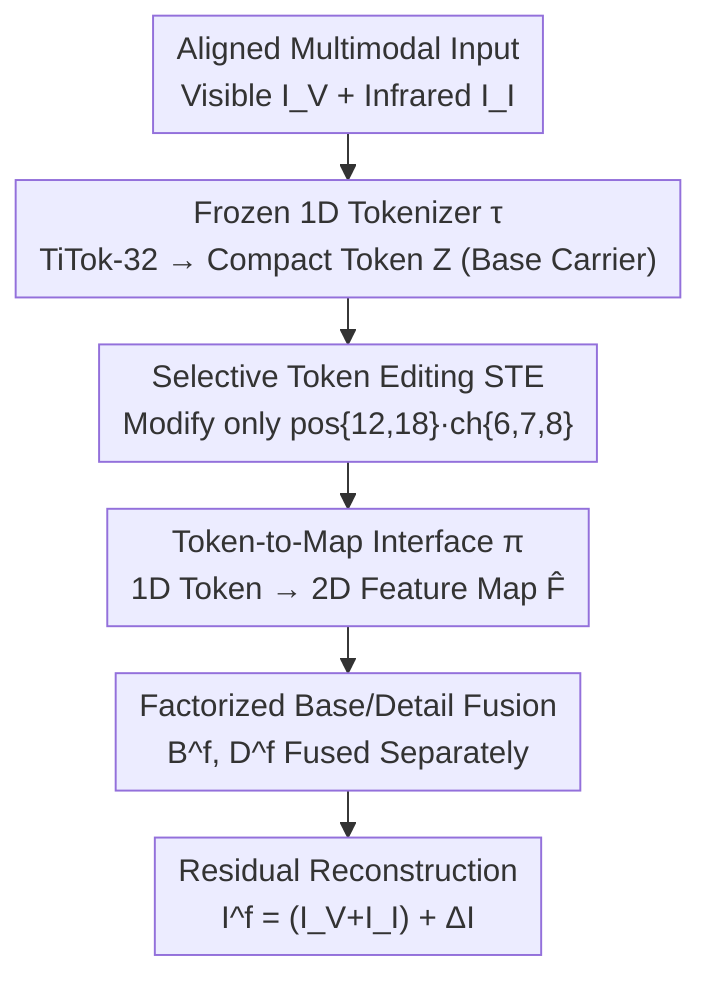

# From 2D Grids to 1D Tokens: Reforming Shared Representations for Multimodal Image Fusion

**Conference**: ICML 2026  
**arXiv**: [2606.12303](https://arxiv.org/abs/2606.12303)  
**Code**: https://zju-xyc.github.io/1D-Fusion-Project-Page/ (Project Page)  
**Area**: Image Fusion / Low-level Vision  
**Keywords**: Multimodal image fusion, 1D token, selective token editing, global/local decoupling, infrared-visible fusion

## TL;DR
Multimodal image fusion has long relied on shared representations in 2D feature grids, leading to the entanglement of global appearance (brightness/contrast/tone) and local details, making them difficult to regulate independently. This paper moves "global appearance" into the compact token space of a frozen 1D tokenizer (TiTok-32). By employing "Selective Token Editing (STE)" to modify only a few token-channel entries, the method regulates global consistency while preserving a 2D pathway for detail recovery, achieving comprehensive SOTA results across four benchmarks.

## Background & Motivation
**Background**: Multimodal image fusion (MMIF, e.g., infrared-visible, medical multimodality) aims to synthesize complementary information from different sensors into a single image. It requires both preserving local details (textures, edges, structures) and maintaining consistent global appearance (overall brightness, contrast, perceptual tone). Prevailing methods follow the "encoder-fusion-decoder" paradigm, encoding pixels or patches into a **dense 2D feature grid** $\mathbf F^{(m)}\in\mathbb R^{h\times w\times d}$, performing fusion at the positional or neighborhood level within this grid space.

**Limitations of Prior Work**: While 2D grids are effective for modeling local structures, they are inefficient for "image-level global appearance." The issue is that global appearance factors (illumination, contrast, tone) are **not naturally indexed by spatial coordinates**—they should ideally be low-dimensional variables shared across the entire image. However, in 2D grids, they are implicitly scattered across many locations through "spatial broadcasting." This introduces spatial redundancy and entangles the global base with local textures, modality-specific cues, and residual noise, resulting in inconsistent brightness, blurred details, or amplified artifacts.

**Key Challenge**: The authors formalize this using a latent factor abstraction—features at a position in a 2D grid can be approximated as:
$$\mathbf F^{(m)}_{ij}=\phi(\text{detail}^{(m)}_{ij})+A\,\text{base}^{(m)}+\epsilon_{ij}$$
where $\phi(\cdot)$ is the local detail encoding, $A$ linearly broadcasts the base factor to various spatial locations, and $\epsilon_{ij}$ is the position-dependent residual. Consequently, the base is not an independent variable but is entangled with details and residuals. **Estimating or aligning a low-dimensional global factor from such a high-dimensional spatial field is inherently unstable**: statistically sensitive to positional residuals (statistical inefficiency) and optimizationally a many-to-one inverse problem (ill-posed and sensitive to distribution shifts).

**Goal / Key Insight**: Inspired by compact image tokenization (e.g., TiTok using 32 tokens to represent an image), the authors propose extracting "global appearance" from 2D grids and placing it into a **non-spatial 1D token interface**, while leaving local details to the 2D pathway.

**Core Idea**: Utilize a frozen pre-trained 1D tokenizer as a compact, controllable carrier for the global base. By using "Selective Token Editing" to only modify a few token-channel entries, the global appearance consistency can be adjusted in a lightweight manner without altering the fusion backbone or adding complex losses.

## Method

### Overall Architecture
The framework decouples "global appearance" and "local details" at the representation layer. Aligned multimodal inputs (visible $I^{\mathcal V}$, infrared $I^{\mathcal I}$) are first passed through a **frozen 1D tokenizer** $\tau$ to obtain compact token sequences $\mathbf Z^{(m)}\in\mathbb R^{N\times d_t}$ as base carriers. STE performs sparse edits on a few key tokens within the token space. Subsequently, a **token-to-map interface** $\pi$ maps the 1D tokens back to 2D feature maps $\hat{\mathbf F}^{(m)}$, which enter private encoders for factorized base/detail fusion. Finally, residual reconstruction generates the fused image. Crucially, this modification is confined to the "representation layer," **preserving the detail-modeling advantages of mature 2D fusion backbones**.

### Key Designs

**1. Replacing 2D Grids with 1D Tokens as Shared Representation: Providing an independent, compact carrier for global appearance**

This step directly addresses the issue of the base factor being spatially broadcast and entangled in 2D grids. The authors use a 1D image tokenizer $\tau$ to map each modality to $\mathbf Z^{(m)}=\tau(I^{(m)})$, instantiated as a frozen pre-trained **TiTok**, which carries the entire image's appearance with minimal tokens ($K{=}32$). Unlike 2D grids, the 1D token space is **non-spatial**: global factors can be accessed and regulated with very few degrees of freedom without coordinating thousands of spatial locations. The authors clarify that they do not claim 1D tokenizers are superior reconstruction backbones or semantic encoders; rather, they **leverage their compact organization to regulate non-local factors**, while leaving details to the 2D pathway.

**2. Selective Token Editing (STE): Modifying a few appearance-sensitive token-channels to adjust appearance**

In a highly compressed 1D representation, not every token contributes equally—main content is robust to local perturbations, while global appearance attributes are often concentrated in specific tokens. STE sparsely edits a small set of token entries to enhance sharpness and appearance consistency without disturbing core semantics. It **does not rely on manual assignment of editing positions** but uses offline Gumbel-Softmax probing: for each editing slot $s$, it maintains selection logits $\mathbf a_s\in\mathbb R^K$, and selects token positions according to:
$$\mathbf y_s=\operatorname{softmax}\!\Big(\frac{\mathbf a_s+\mathbf g_s}{\tau_g}\Big),\quad p_s=\arg\max_k y_{s,k}$$
(where $\mathbf g_s\sim\operatorname{Gumbel}(0,1)$), evaluating the fused output using metrics like Edge Intensity (EI), Average Gradient (AG), Spatial Frequency (SF), and SSIM. Under the TiTok-32 configuration, probing **consistently** identifies positions $\{12,18\}$ as the most effective appearance-sensitive slots and channels $\{6,7,8\}$ as the most stable editing group. Once positions/channels are determined, STE replaces manual perturbations with a compact learnable bias:
$$\widetilde{\mathbf Z}=\mathbf Z+\mathbf M\odot\Delta$$
The binary mask $\mathbf M$ is active only at positions $\{12,18\}$ and channels $\{6,7,8\}$, while $\Delta$ is a learnable bias. By modifying extremely few entries, STE acts as a **plug-and-play** lightweight appearance controller compatible with any 2D fusion backbone.

**3. Token-to-Map Interface + Factorized Base/Detail Fusion: Connecting 1D global info back to the 2D detail ecosystem**

While 1D tokens are suitable for global semantics, mature fusion modules are built on 2D feature maps. The token-to-map interface $\pi$ handles "representation adaptation"—mapping the token sequence to a token-induced 2D feature map $\hat{\mathbf F}^{(m)}=\pi(\mathbf Z^{(m)})$. $\pi$ employs hierarchical mapping: first increasing the token dimension from 12 to 64, linearly mapping to a $32\times32$ coarse map with a $3\times3$ convolutional residual local aggregation branch, followed by three levels of upsampling to reach $256\times256$. Each upsampling level integrates scale-aligned detail features extracted from the original image (using kernels of $7\times7$, $5\times5$, and $3\times3$, respectively) to suppress structural artifacts while avoiding the over-smoothing of pure upsampling. Built on this, a private encoder $E_{\mathrm{pri}}$ splits $\hat{\mathbf F}^{(m)}$ into base $B^{(m)}$ (low-frequency global appearance) and detail $D^{(m)}$ (high-frequency local structure), then **fuses them separately** in their respective subspaces: $B^f=\mathcal F_{\text{base}}(B^{\mathcal V},B^{\mathcal I})$ and $D^f=\mathcal F_{\text{detail}}(D^{\mathcal V},D^{\mathcal I})$. This decouples base alignment from detail preservation.

### Loss & Training
A **two-stage training strategy** is adopted with the **tokenizer frozen throughout** (to prevent the shared representation from drifting and ensure the base is always carried by the compact token space).
- **Stage I (Reconstruction Warm-up / Factorization Stability)**: Cross-modality fusion is disabled, and each modality performs internal reconstruction. The reconstruction loss is $\mathcal L_{\text{rec}}^{(m)}=\alpha_{\text{ssim}}\mathcal L_{\text{SSIM}}+\alpha_{\text{mse}}\|I^{(m)}-\hat I^{(m)}\|_2^2$. A decomposition regularization $\mathcal L_{\text{decomp}}=\frac{\mathrm{cc}(D^{\mathcal V},D^{\mathcal I})^2}{\delta+\mathrm{cc}(B^{\mathcal V},B^{\mathcal I})}$ (where $\mathrm{cc}$ is the correlation coefficient) is added to encourage detail diversity and base consistency.
- **Stage II (Cross-modality Fusion)**: Base/detail fusion modules are activated. The final residual reconstruction is $I^f=I^{\text{ref}}+\Delta I$, where the reference input $I^{\text{ref}}=I^{\mathcal V}+I^{\mathcal I}$. The fusion loss consists of $\mathcal L_{\text{fusion}}=\alpha_{\text{in}}\|I_{\max}-I^f\|_1+\alpha_{\text g}\|G_{\max}-\nabla I^f\|_1$ (with $I_{\max}$ and $G_{\max}$ being element-wise max intensity/gradient maps), retaining the decomposition regularization.

## Key Experimental Results

### Main Results
Quantitative comparisons using EN (Entropy), SD (Standard Deviation), SCD, and SSIM across four benchmarks ($\text{M}^3\text{FD}$, RoadScene, TNO, Harvard). The following table excerpts results from $\text{M}^3\text{FD}$ and TNO:

| Dataset | Metric | CDDFuse | Text-DiFuse | EMMA | Ours |
|--------|------|---------|-------------|------|------|
| $\text{M}^3\text{FD}$ | EN | 6.80 | 6.93 | 6.78 | **7.19** |
| $\text{M}^3\text{FD}$ | SD | 35.22 | 39.87 | 35.12 | **47.35** |
| $\text{M}^3\text{FD}$ | SCD | 1.62 | 1.16 | 1.45 | **1.85** |
| $\text{M}^3\text{FD}$ | SSIM | 1.02 | 1.12 | 0.92 | **1.49** |
| TNO | EN | 7.17 | 7.28 | 7.27 | **7.34** |
| TNO | SD | 48.49 | 50.04 | 48.92 | **50.97** |
| TNO | SSIM | 1.08 | 0.35 | 1.01 | **1.42** |

Ours achieves SOTA results on most metrics, with significant gains in SD (contrast/information content) and SSIM (structural fidelity).

### Ablation Study

| Dimension | Setting | Key Finding |
|----------|------|----------|
| Object Detection | $\text{M}^3\text{FD}$, mAP | Fusion quality directly impacts detection; Ours outperforms CDDFuse (mAP 0.346) and other baselines. |
| Semantic Segmentation | FMB, mIoU | Same as above; CDDFuse mIoU 0.684 serves as a reference. |
| STE Probing | TiTok-32 | Consistently identifies pos {12,18} and ch {6,7,8} as appearance-sensitive/stable groups. |

### Key Findings
- **Moving base from 2D grids to 1D tokens is the primary driver of performance**: Large improvements in SD and SSIM indicate simultaneous enhancement of global appearance and structural fidelity, confirming the decoupling of base and detail.
- **Minimal intervention is effective**: STE edits only approximately $2\times3=6$ token-channel entries without complex losses, yet it stably improves sharpness and reduces artifacts.
- **Frozen tokenizer is crucial**: Maintaining a frozen tokenizer prevents representation drift and ensures the base is always carried by a compact token space.

## Highlights & Insights
- **Revisiting the "Carrier of Shared Representation"**: The most significant insight is that the bottleneck in MMIF lies in 2D grids being unsuitable for non-spatial global factors. Using a frozen 1D tokenizer to physically separate global/local carriers is a perspective shift at the representation layer rather than the module level.
- **Tokenizer as an Interface, not a Backbone**: Instead of forcing the 1D tokenizer to reconstruct all high-frequency details, it is used as a controllable interface for global regulation, avoiding its limitations compared to dense grids.
- **Transferable Paradigm**: The "probe sensitive slots + sparse edit" paradigm using Gumbel-Softmax is applicable to other tasks requiring controllable editing in compressed representations (e.g., controllable generation, image editing).

## Limitations & Future Work
**Limitations**:
- **Dependency on specific tokenizer configurations**: Positions $\{12,18\}$ and channels $\{6,7,8\}$ are "configuration-specific" slots for TiTok-32; changing the tokenizer or compression rate requires re-probing.
- **Structural dependency**: Since 1D tokens only carry the global base, if the tokenizer loses critical structures, the token-to-map interface may struggle to recover them perfectly.

**Future Work**: Adaptive selection of appearance-sensitive slots or extending STE to a learnable number of slots could further improve robustness.

## Related Work & Insights
- **vs. Dense 2D Grid Fusion (CDDFuse, SwinFusion)**: These fuse in 2D feature maps where global appearance remains entangled with details; Ours moves appearance to 1D tokens to explicitely decouple them.
- **vs. Compressed Tokenizers (TiTok)**: While TiTok is typically for reconstruction/generation, this paper uses it as a **fixed interface** to study how selective manipulation of few tokens improves downstream fusion.
- **vs. Text/Diffusion Guided Fusion (Text-DiFuse, DDFM)**: These rely on external priors; Ours uses endogenous, detectable token slots for lightweight learnable editing without extra modalities.

## Rating
- Novelty: ⭐⭐⭐⭐⭐ Decoupling via 1D tokens is a unique representation-layer perspective in MMIF.
- Experimental Thoroughness: ⭐⭐⭐⭐ Comprehensive across four benchmarks and two downstream tasks.
- Writing Quality: ⭐⭐⭐⭐ Motivation via latent factor abstraction is very clear.
- Value: ⭐⭐⭐⭐ Lightweight, plug-and-play, and insightful for the image fusion community.

<!-- RELATED:START -->

## Related Papers

- [\[CVPR 2026\] Degradation-Robust Fusion: An Efficient Degradation-Aware Diffusion Framework for Multimodal Image Fusion in Arbitrary Degradation Scenarios](../../CVPR2026/image_restoration/degradation-robust_fusion_an_efficient_degradation-aware_diffusion_framework_for.md)
- [\[CVPR 2026\] Physically-Grounded Turbulence Mitigation with Frame-Shared Degradation Parameters](../../CVPR2026/image_restoration/physically-grounded_turbulence_mitigation_with_frame-shared_degradation_paramete.md)
- [\[CVPR 2026\] MMDIR: Multimodal Instruction-Driven Framework for Mixed-Degradation Document Image Restoration](../../CVPR2026/image_restoration/mmdir_multimodal_instruction-driven_framework_for_mixed-degradation_document_ima.md)
- [\[CVPR 2026\] The Surprising Effectiveness of Noise Pretraining for Implicit Neural Representations](../../CVPR2026/image_restoration/the_surprising_effectiveness_of_noise_pretraining_for_implicit_neural_representa.md)
- [\[CVPR 2026\] FusionRegister: Every Infrared and Visible Image Fusion Deserves Registration](../../CVPR2026/image_restoration/fusionregister_every_infrared_and_visible_image_fusion_deserves_registration.md)

<!-- RELATED:END -->
