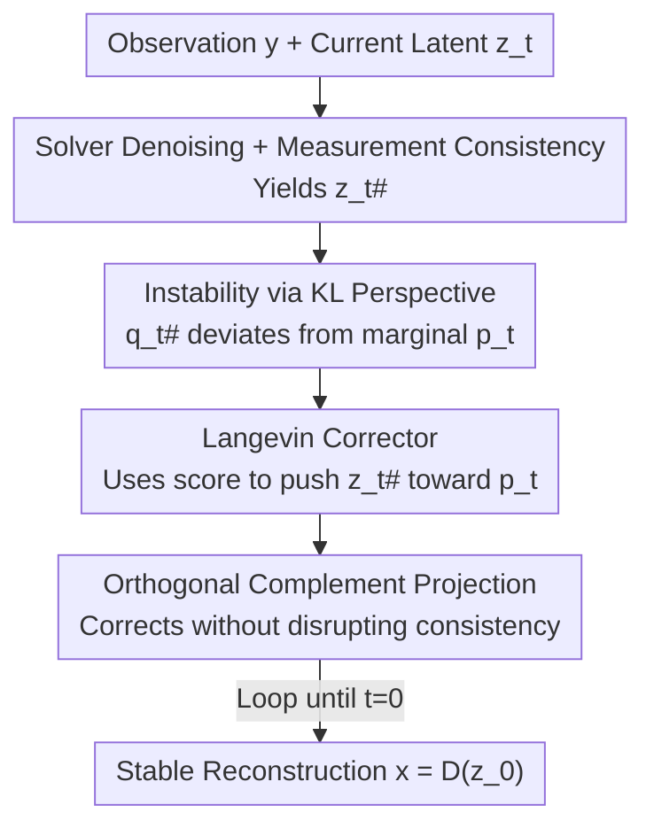

# Measurement-Consistent Langevin Corrector for Stabilizing Latent Diffusion Inverse Problem Solvers

**Conference**: ICML 2026  
**arXiv**: [2601.04791](https://arxiv.org/abs/2601.04791)  
**Code**: TBD  
**Area**: Diffusion Models / Image Restoration / Inverse Problem Solving  
**Keywords**: Latent Diffusion, Inverse Problems, Langevin Correction, Measurement Consistency, Plug-and-Play

## TL;DR
This paper reinterprets the instability of Latent Diffusion Model (LDM) inverse problem solvers as "solver dynamics deviating from the time-marginal distributions learned by the diffusion model." It proposes the MCLC module—a plug-and-play component that inserts a Langevin correction step, constrained to the orthogonal complement of the measurement gradient, after the measurement consistency step. This pulls the latent variables back to stable reverse diffusion trajectories without compromising measurement fidelity. MCLC consistently improves baselines such as LDPS, PSLD, and ReSample across various linear and non-linear degradation tasks on FFHQ and ImageNet.

## Background & Motivation

**Background**: The goal of inverse problems (deblurring, super-resolution, inpainting, etc.) is to recover the original signal $x$ from noisy and incomplete observations $y = A(x) + n$. As a classic ill-posed problem, it necessitates reliance on priors. Diffusion models have become powerful data-driven priors for solving inverse problems: from a Bayesian perspective, the posterior gradient $\nabla_x \log p(x|y) = \nabla_x \log p(y|x) + \nabla_x \log p(x)$ can be decomposed into a measurement likelihood term and a prior term. Injecting the likelihood gradient into the diffusion sampling process yields a "measurement-consistent posterior sampler." To scale diffusion models to large datasets, Latent Diffusion Models (LDM) model the process in the latent space of a pre-trained autoencoder, leading to several LDM-based solvers (PSLD, ReSample, LatentDAPS, etc.).

**Limitations of Prior Work**: LDM solvers frequently exhibit **instability**, where the measurement consistency step pushes the sampling path away from the data manifold, resulting in artifacts and degraded reconstruction fidelity (Fig. 1 in the paper shows visibly cluttered latent variables in the PSLD reverse trajectory).

**Key Challenge**: Prior works interpreted this instability as being "off-manifold" and relied on a **strong linear manifold assumption**, approximating the diffusion manifold locally as linear to design "manifold-preserving" projection methods (e.g., autoencoder projections or gradient projections). However, even if the pixel space satisfies a linear manifold assumption, this property **cannot be transferred to the latent space** due to the highly non-linear nature of the decoder $D$. Consequently, these assumptions fail in latent space, and manifold-preserving methods remain unstable.

**Goal**: To find a stabilization mechanism that does not depend on linear manifold assumptions, is naturally applicable to the latent space, pulls the solver back to stable dynamics, and preserves measurement fidelity.

**Key Insight**: The objective of training a diffusion model is to ensure the reverse process matches the family of time-marginal distributions $\{p_t\}$ induced by the forward process. Thus, these time-marginal distributions provide a **concrete and measurable** reference frame for "stable reverse dynamics." The authors quantify the gap between the "time-evolution distribution induced by the solver $q_t^{\#}$" and the "learned $p_t$ from the diffusion model" using KL divergence (Fig. 2 shows a significant KL gap in naive solvers) and define instability directly as this gap.

**Core Idea**: Replace "preserving manifold geometry" with "reducing the KL gap between solver dynamics and diffusion time-marginal distributions." This is achieved through a **Langevin correction step constrained to the orthogonal complement of the measurement gradient**, narrowing the gap without disrupting measurement consistency.

## Method

### Overall Architecture
The Measurement-Consistent Langevin Corrector (MCLC) is a **plug-and-play correction module inserted after each time step** of existing LDM solvers. It does not modify the original solver. The workflow for one time step is: ① The solver performs a regular denoising step followed by a measurement consistency step to obtain a measurement-consistent latent variable $z_t^{\#}$; ② MCLC uses $z_t^{\#}$ as a starting point for one (or more) Langevin updates, using the score $s_\theta$ estimated by the diffusion model to push the latent variable toward the stable time-marginal $p_t$; ③ Crucially, this Langevin update is **projected onto the orthogonal complement of the measurement gradient**, ensuring the correction occurs only in directions that do not affect measurement consistency. This loop continues until $t=0$ for reconstruction.

The logic chain—quantifying instability via KL, proving KL reduction via Langevin convergence, and ensuring consistency via orthogonal projection—is summarized in the framework below:

### Key Designs

**1. Defining "Instability" Explicitly as Deviation from Time-Marginal Distributions using KL Divergence**

While previous "off-manifold" descriptions relied on hard-to-measure geometric assumptions, the authors use a measurable reference: diffusion model training minimizes $\mathbb{E}_{t}[D_{KL}(q_t \| p_t)]$, establishing a learned stable marginal $p_t$ for each time step. This work denotes the time-evolution distribution induced by the measurement-guided solver as $q_t^{\#}$ and proposes Assumption 3.1: $D_{KL}(q_t^{\#} \| p_t) \ge \gamma_t > 0$, suggesting measurement consistency steps inevitably deviate from the stable marginal. Fig. 2 confirms this gap. This definition shifts the goal from vague manifold geometry to the optimizable objective of "making $q_t^{\#}$ close to $p_t$," aligning specifically with the diffusion training objectives.

**2. Langevin Corrector: Pulling Latents to the Stable Marginal with Diffusion Scores**

Given that instability equals deviation from $p_t$, the most direct solution is a Langevin correction step post-measurement consistency. Proposition 3.2 provides the theoretical basis: for a continuous Langevin process $dZ_t^c = \nabla \log p_t(Z_t^c)\,dc + \sqrt{2}\,dW_c$ targeting a frozen $p_t$, the KL divergence to $p_t$ is monotonically non-increasing. Implementation uses Euler–Maruyama discretization:

$$z_t^c \leftarrow z_t^{\#} + \eta_t\, \nabla \log p_t(z_t^{\#}) + \sqrt{2\eta_t}\,\epsilon,\quad \epsilon \sim \mathcal{N}(0, I)$$

Where the score $\nabla \log p_t$ is provided by the pre-trained diffusion model. The authors emphasize that the corrector addresses the distribution bias introduced by measurement consistency, rather than mere discretization errors.

**3. Orthogonal Complement Projection: Preserving Consistency during Correction**

Naive Langevin updates face a critical issue (Remark 3.3): they perturb the measurement consistency $r(z_t) := L(z_t, y)$. A first-order Taylor expansion $r(z_t + \Delta z_t) \approx r(z_t) + \nabla_{z_t} r(z_t)\, \Delta z_t$ shows that generally $\nabla_{z_t} r(z_t)\,\Delta z_t \ne 0$, meaning the correction disrupts the established measurement consistency. MCLC solves this by **projecting the Langevin update onto the orthogonal complement of the measurement gradient**:

$$z_t^c \leftarrow z_t^{\#} + \eta_t \cdot P_{\perp g_t}\, s_\theta(z_t^{\#}, t) + \sqrt{2\eta_t}\cdot P_{\perp g_t}(\epsilon)$$

Where $g_t := \frac{\nabla_{z_t} r(z_t)}{\|\nabla_{z_t} r(z_t)\|}$ is the normalized measurement gradient. $P_{\perp g} = (I - g g^T)$ projects any vector onto the orthogonal complement of $g$. Since neither the drift nor the noise term contains components in the direction of the measurement gradient, the first-order term $\nabla_{z_t} r(z_t)\,\Delta z_t = 0$. Theorem 3.4 further proves that even with higher-order terms, as long as $\mathbb{E}[\|\Delta z_t\|^2] \le k < 1$, the consistency perturbation is bounded by $\mathbb{E}[\Delta r] \le Ck + O(k)$, allowing a controllable balance via the step size $\eta_t$.

### Loss & Training
MCLC is a **purely inference-time** plug-and-play module. No additional training is required, as it reuses the pre-trained diffusion model's score network. The only tunable parameters are the Langevin step size $\eta_t$ and the number of correction steps, which balance data fidelity, stability, and computational overhead. The authors note that while per-task tuning is typical for inverse problems, the MCLC settings generalize well across various tasks.

## Key Experimental Results

### Main Results
Evaluated on FFHQ and ImageNet, MCLC was integrated into LDPS, PSLD, ReSample, and LatentDAPS, covering linear and non-linear tasks (Gaussian Blur, Motion Blur, 4× SR). Comparisons were made against DiffStateGrad (DiffState). Metrics include PSNR↑, LPIPS↓, FID↓, and P-FID↓. MCLC showed the most significant gains in perceptual metrics.

| Task | Baseline | Method | FFHQ LPIPS↓ | FFHQ FID↓ | FFHQ P-FID↓ | ImageNet FID↓ |
|------|------|------|------|------|------|------|
| Gaussian Blur | LDPS | Base | 0.349 | 100.10 | 93.55 | 120.79 |
| Gaussian Blur | LDPS | **Ours** | **0.303** | **80.83** | **54.74** | **103.87** |
| Gaussian Blur | PSLD | Base | 0.314 | 89.18 | 90.54 | 104.86 |
| Gaussian Blur | PSLD | **Ours** | **0.286** | **66.28** | **59.13** | **92.74** |
| Motion Blur | PSLD | Base | 0.343 | 106.34 | 102.60 | 141.67 |
| Motion Blur | PSLD | **Ours** | **0.308** | **74.64** | **60.05** | **99.21** |
| Motion Blur | LDPS | **Ours** | 0.318 | 82.94 | **55.55** | 119.65 |

Notably, on strong degradation tasks like motion blur, the improvement is substantial: PSLD+MCLC reduced FFHQ P-FID from 102.60 to 60.05.

### Ablation Study
MCLC relies on the combination of Langevin correction (to reduce KL) and orthogonal projection (to preserve fidelity).

| Configuration | Effect | Description |
|------|------|------|
| Base (No correction) | Unstable, artifacts | Significant KL gap between $q_t^{\#}$ and $p_t$ (Fig. 2) |
| + Naive Langevin | Reduced KL, compromised fidelity | Remark 3.3: First-order term $\nabla r \cdot \Delta z \ne 0$ |
| + Orthogonal Projection (Full MCLC) | Narrowed KL gap, high fidelity | KL gap nears 0, reconstruction is cleaner |

### Key Findings
- **Orthogonal projection is key to fidelity**: Standard Langevin updates disturb measurement consistency; only the orthogonal complement projection allows correction without disrupting the fit to $y$.
- **Perceptual quality gains exceed pixel-wise PSNR**: MCLC primarily improves LPIPS/FID/P-FID by removing artifacts. PSNR gains are more modest, indicating MCLC fixes stability and perception rather than just pixel-wise alignment.
- **Cross-solver compatibility**: MCLC benefits LDPS/PSLD/ReSample/LatentDAPS universally, demonstrating that the KL-based stabilization is more general than method-specific manifold assumptions.
- **Limited gain on LatentDAPS**: On some tasks, LatentDAPS+MCLC performance was close to the base, suggesting solvers that are already stable have smaller KL gaps and thus less to gain.

## Highlights & Insights
- **Redefining "Instability"**: Replacing the vague "off-manifold" concept with measurable "deviation from time-marginal $p_t$" bypasses the failure of linear manifold assumptions in latent space.
- **Transferable Trick**: The concept of projecting updates onto a constraint's orthogonal complement is transferable to any iterative sampling task where specific constraints must be maintained.
- **Theoretical Alignment**: MCLC provides a rigorous chain of reasoning from Langevin convergence (Prop 3.2) to controllable consistency perturbation bounds (Thm 3.4).

## Limitations & Future Work
- **Computational Overhead**: Each step requires additional Langevin updates and projections, increasing sampling costs.
- **Hyperparameter Tuning**: While generalizing well, step sizes still require task-specific adjustment, a common issue in inverse problems.
- **First-order Dependency**: Preservation of consistency relies on first-order Taylor approximations; higher-order terms might become significant for highly non-linear operators.
- **Pixel PSNR Gains**: The method prioritizes perception/stability; benefits for scientific imaging requiring extreme pixel accuracy might be less pronounced.

## Related Work & Insights
- **vs. Manifold methods (He et al. 2024 / Zirvi et al. 2025)**: These use autoencoder or gradient projections under linear manifold assumptions; MCLC avoids these assumptions by focusing on time-marginal distributions.
- **vs. DiffStateGrad (DiffState)**: DiffState often shows limited improvement or slight degradation in perceptual metrics; MCLC consistently outperforms it in LPIPS/FID/P-FID.
- **vs. Standard Langevin Correctors**: Standard correctors (e.g., predictor-corrector) do not account for measurement consistency; MCLC specifically protects it via orthogonal projection.

## Rating
- Novelty: ⭐⭐⭐⭐⭐ Redefining instability via KL and using orthogonal projection is highly novel.
- Experimental Thoroughness: ⭐⭐⭐⭐ Coverage of 4 solvers across multiple tasks, though improvements are skewed toward perceptual metrics.
- Writing Quality: ⭐⭐⭐⭐ Clear theoretical chain with intuitive figures.
- Value: ⭐⭐⭐⭐⭐ Practical, plug-and-play value for latent space inverse problem stabilization.

<!-- RELATED:START -->

## Related Papers

- [\[CVPR 2026\] Outlier-Robust Diffusion Solvers for Inverse Problems](../../CVPR2026/image_restoration/outlier-robust_diffusion_solvers_for_inverse_problems.md)
- [\[ICML 2026\] Consistent Diffusion Language Models](consistent_diffusion_language_models.md)
- [\[ICML 2026\] Coevolutionary Continuous Discrete Diffusion: Make Your Diffusion Language Model a Latent Reasoner](coevolutionary_continuous_discrete_diffusion_make_your_diffusion_language_model_.md)
- [\[ICML 2026\] PODiff: Latent Diffusion in Proper Orthogonal Decomposition Space for Scientific Super-Resolution](podiff_latent_diffusion_in_proper_orthogonal_decomposition_space_for_scientific_.md)
- [\[CVPR 2026\] Dual Ascent Diffusion for Inverse Problems](../../CVPR2026/image_restoration/dual_ascent_diffusion_for_inverse_problems.md)

<!-- RELATED:END -->
