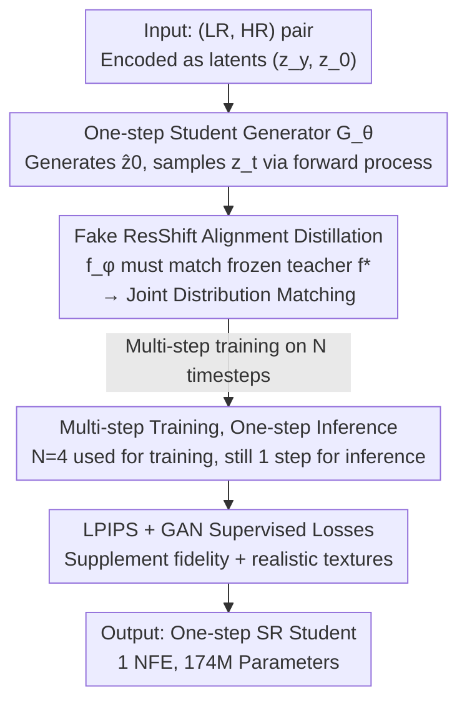

# One-Step Residual Shifting Diffusion for Image Super-Resolution via Distillation

**Conference**: ICML2026  
**arXiv**: [2503.13358](https://arxiv.org/abs/2503.13358)  
**Code**: https://github.com/Daniil-Selikhanovych/RSD  
**Area**: Image Super-Resolution / Image Restoration  
**Keywords**: Real-world Image Super-Resolution, Diffusion Distillation, One-step Inference, ResShift, Fake Model Alignment

## TL;DR
To address the slow inference of diffusion SR models, this paper proposes RSD (Residual Shifting Distillation): distilling a 15-step ResShift teacher into a **one-step** student generator. The core mechanism involves "training the student so that a 'fake ResShift' trained on its output exactly matches the true teacher"—which is equivalent to matching the **joint distribution** (rather than just marginals as in VSD) of the teacher and student across all timesteps. Consequently, RSD outperforms the teacher and the comparable distillation method SinSR on LPIPS / CLIPIQA / MUSIQ. With only 174M parameters, 0.5GB VRAM, and 5 GPU-hours of training, it approaches the perceptual quality of massive T2I-based SR models.

## Background & Motivation
**Background**: Real-world blind super-resolution (Real-ISR) aims to reconstruct high-resolution (HR) images from low-resolution (LR) inputs with unknown complex degradations, which is a highly ill-posed inverse problem. Diffusion Models (DMs) have become a powerful solution due to their ability to model complex distributions and provide higher perceptual quality than GANs. Among them, ResShift shifts the diffusion starting point to "noisy LR images," achieving better perceptual results than GANs/Transformers with only 15 denoising steps (NFE).

**Limitations of Prior Work**: However, ResShift inference is still approximately 10× slower than GANs. Existing acceleration routes are suboptimal: (1) **SinSR** uses deterministic sampling to distill ResShift into 1 step but **produces blur** and loses realistic perceptual details; (2) **OSEDiff** and others compress pre-trained Text-to-Image (T2I) models into 1 step using LoRA + Variational Score Distillation (VSD). While perceptual quality is high, their **parameter count is 2.5–10× that of SinSR**, they are expensive to train/infer, and they show low fidelity (PSNR/SSIM) with a tendency toward **hallucinations** (e.g., hallucinating incorrect structures on panda noses or roof details).

**Key Challenge**: In Real-ISR, it is difficult to simultaneously achieve "one-step speed, realistic perception, and lightweight architecture"—SinSR is lightweight but blurry, while OSEDiff has good perception but is bloated and prone to hallucinations. The root cause lies in the distillation objective: SinSR's knowledge distillation only forces the student to match the teacher's trajectory, while OSEDiff's VSD only aligns the **marginal distribution of each timestep**. Neither aligns from the more fundamental perspective of whether the student's generated data distribution truly equals the real data distribution.

**Goal**: Can the strengths of SinSR (lightweight, low cost) and OSEDiff (high perception) be merged to create a one-step diffusion SR model that approaches T2I SR in perceptual quality while maintaining training/inference costs similar to SinSR?

**Key Insight**: The authors adopt the favorable perception-distortion tradeoff of ResShift and draw inspiration from image-to-image distillation methods (DMD2, IBMD) that "train an auxiliary 'fake model' to measure distribution discrepancies," changing the distillation objective from "trajectory/marginal alignment" to "joint distribution alignment."

**Core Idea**: Train a one-step student $G_\theta$ such that a **ResShift model retrained on its output (termed the "fake ResShift") exactly coincides with the true teacher $f^*$**. If the fake model $\approx$ the true teacher, then the (LR, HR) distribution generated by the student $\approx$ the real data distribution.

## Method

### Overall Architecture
RSD aims to compress the 15-step ResShift teacher into a 1-step student without losing perceptual quality. The input is an (LR, HR) image pair $(y_0, x_0)$, and the output is a one-step stochastic generator $G_\theta$: given an LR image and noise, it produces a high-definition image $\widehat{x}_0=G_\theta(x_T, y_0, \epsilon)$ in one step.

The entire training process runs in the latent space of ResShift: first, the (LR, HR) pair is encoded into latent variables $(z_y, z_0)$. The student $G_\theta$ generates $\widehat{z}_0$ in one step, from which a noisy $z_t$ is sampled via the ResShift forward process. This $z_t$ is fed simultaneously to the **frozen true teacher ResShift $f^*$** and a **trainable "fake ResShift" $f_\phi$**. From these, the distillation loss $L_\theta$ (optimizing the student) and the fake model loss $L_{\text{fake}}$ (optimizing $f_\phi$) are calculated. Additionally, LPIPS perceptual loss and GAN loss are added to supplement fidelity and realistic textures. The three parties (student $G_\theta$, fake model $f_\phi$, and discriminator) are optimized alternately. After convergence, only the one-step student is retained for inference.

### Key Designs

**1. Fake ResShift Alignment: Reforming the Distillation Objective into "Joint Distribution Matching"**

The problem with SinSR/VSD is that they only align trajectories or marginals per step. RSD adopts a more fundamental objective: training the student $G_\theta$ so that the **ResShift $f_{G_\theta}$ retrained on its output equals the true teacher $f^*$**. The rationale is that if $f_{G_\theta} \approx f^*$, then the student-generated distribution $p_\theta(y_0, x_0)$ will match the real data distribution $p_{\text{data}}(y_0, x_0)$. This is formulated as $L_\theta=\sum_t w_t\,\mathbb{E}\,\lVert f_{G_\theta}(x_t,y_0,t)-f^*(x_t,y_0,t)\rVert_2^2$ (Eq. 9).

However, $\nabla_\theta L_\theta$ contains $\nabla_\theta f_{G_\theta}$, which makes backpropagation through "completely training a ResShift on student data" computationally infeasible. The key step in this paper (Proposition 3.1) provides an **equivalent solvable form**: by introducing an auxiliary "fake ResShift" $f_\phi$ trained on student data using the standard ResShift objective $L_{\text{fake}}$, $L_\theta$ can be calculated using only $f^*$, $f_\phi$, and $\widehat{x}_0$, bypassing the backpropagation through $f_{G_\theta}$. In other words, "training a fake ResShift to fit student output" and "evaluating the student's distillation loss" are two sides of the same coin. The authors further prove that this loss equals the **KL divergence of the joint distribution** between teacher and student over the entire trajectory: $L_\theta=\mathbb{E}_{p(y_0)}D_{\text{KL}}\big(p(x_{0:T}|y_0)\,\Vert\,p^*(x_{0:T}|y_0)\big)$ (Eq. 11). This is the fundamental difference from VSD—which only aligns **marginals at each $t$**—whereas RSD aligns the **joint distribution across all $t$**, thereby transferring the teacher's distribution more completely.

**2. Multi-step Training, One-step Inference: Improving Robustness via N-timestep Training**

Training the student only at the final timestep $T$ yields limited quality and stability. RSD draws from DMD2/multi-step generation ideas by fixing a set of $N$ timesteps $1 < t_1 < \dots < t_N = T$. The generator $G_\theta$ is conditioned on time to approximate $p_\theta(\widehat{x}_0|x_{t_n},y_0) \approx q(x_0|x_{t_n},y_0)$ at each $t_n$, and then trained jointly using Proposition 3.1. **While training uses multiple steps, inference remains one-step.** Ablations (Table 5) show that as $N$ increases from 1 to 15, PSNR increases monotonically, while perceptual metrics first rise then fall. The authors chose $N=4$ for the best perception-distortion tradeoff (LPIPS 0.355, MUSIQ 66.4, with high CLIPIQA). This technique significantly enhances student robustness without increasing the inference cost.

**3. LPIPS + GAN Supervised Losses: Filling Fidelity and Texture Gaps**

The teacher's estimate of $x_0$ inherently has approximation bias, which pure distillation would inherit. RSD adds two supervised losses: first, **LPIPS loss** (inspired by OSEDiff), which compares student output with HR ground truth in perceptual feature space to recover textures and structures beyond the teacher's guidance (the authors found MSE loss unhelpful in this setting); second, **GAN loss** (inspired by DMD2), where a small discriminator head is attached to the fake ResShift bottleneck features to better match the HR distribution. Unlike DMD2, which compares noisy data vs. the marginal of the generated output, RSD compares $p_{\text{data}}(x_0|y_0)$ with $p_\theta(\widehat{x}_0^{t_n}|y_0)$ at each $t_n$ (Eq. 12). The final loss per $t_n$ is $L_\theta + \lambda_1 L_{\text{LPIPS}} + \lambda_2 L_{\text{GAN}}$ (Eq. 13). $L_\theta$ and $L_{\text{GAN}}$ are computed in latent space to save compute, while $L_{\text{LPIPS}}$ is computed in pixel space.

### Loss & Training
The total loss $L_\theta + \lambda_1 L_{\text{LPIPS}} + \lambda_2 L_{\text{GAN}}$ is applied at each sampling timestep $t_n$ through alternating optimization of three components: the student $G_\theta$, the fake model $f_\phi$ (trained with the standard ResShift objective $L_{\text{fake}}$), and the discriminator head $D$. RSD is a **simulation-free** method—it does not require running the teacher's full 15-step sampling during training, making it significantly more efficient (the paper notes SinSR is about 3× slower to converge).

## Key Experimental Results

### Main Results
Evaluated on RealSR, RealSet65, DRealSR, ImageNet-Test, and DIV2K, and compared against GANs, ResShift, SinSR, CTMSR, and T2I-based methods (OSEDiff/SUPIR/AdcSR/PiSA-SR/TSD-SR). RSD uses 1 NFE throughout.

| Dataset | Metric | ResShift (Teacher, 15 steps) | SinSR (1 step) | OSEDiff (T2I, 1 step) | RSD (Ours, 1 step) |
| :--- | :--- | :--- | :--- | :--- | :--- |
| RealSR | LPIPS↓ | 0.360 | 0.365 | 0.299 | **0.273** |
| RealSR | CLIPIQA↑ | 0.596 | 0.689 | 0.677 | 0.706 |
| RealSR | MUSIQ↑ | 59.87 | 61.58 | 67.60 | 65.86 |
| RealSet65 | MUSIQ↑ | 61.33 | 62.17 | 68.85 | 69.17 |

Key Findings: RSD **outperforms its teacher ResShift** in perceptual metrics like LPIPS / CLIPIQA / MUSIQ and is markedly superior to SinSR. Compared to the massive T2I-based OSEDiff, it achieves comparable perceptual quality (even higher MUSIQ on RealSet65) with a fraction of the compute. "RSD (distill only)" (without supervised losses) is more perceptually aggressive but has lower fidelity, while "RSD (Ours)" (with LPIPS+GAN) achieves a balance.

### Ablation Study

| Method | T2I Prior | NFE | Inference Time (s) | Params (M) | Peak VRAM (MB) | Training |
| :--- | :--- | :--- | :--- | :--- | :--- | :--- |
| SUPIR | Yes | 50 | 17.704 | 4801 | 52535 | 240h / 64×A6000 |
| OSEDiff | Yes | 1 | 0.075 | 1775 | 3651 | 24h / 4×A100 |
| ResShift (T) | No | 15 | 0.643 | 174 | 1167 | 110h / 1×A100 |
| SinSR | No | 1 | 0.060 | 174 | 570 | 60h / 1×A100 |
| **RSD (Ours)** | No | 1 | **0.059** | 174 | **539** | **5h / 4×A100** |

| Ablation (RealSR) | Config | PSNR↑ / LPIPS↓ | Description |
| :--- | :--- | :--- | :--- |
| Multi-step $N$ | $N=1$ | 24.82 / 0.405 | Single-step training, weaker perception |
| Multi-step $N$ | $N=4$ | 24.92 / 0.355 | **Selected**, best P-D tradeoff |
| Multi-step $N$ | $N=15$ | 25.91 / 0.294 | Highest PSNR but CLIPIQA drops to 0.686 |
| Supervised Loss | $\lambda_{1,2}=0$ | 24.92 / 0.355 | Pure distillation |
| Supervised Loss | Only $\lambda_1$ | 26.01 / 0.271 | Add LPIPS, significant fidelity boost |

### Key Findings
- **Joint Distribution Alignment is the key source of gain**: RSD's superiority over the teacher and SinSR stems from switching the objective from VSD's marginal alignment to joint distribution KL.
- **Lightweight by Design**: RSD uses the ResShift architecture (174M), saving 2.5–10× parameters and over 5× VRAM compared to T2I models. Inference takes 0.059s, and simulation-free training takes only 5 GPU-hours (approx. 1/12 of SinSR).
- **N-step training controls the P-D tradeoff**: Larger $N$ improves fidelity (PSNR), but no-reference perceptual metrics peak and then decline; $N=4$ is the "sweet spot." Inference always remains one-step.

## Highlights & Insights
- **"Fake Model Alignment" enables solvable joint distribution distillation**: Using a fake ResShift $f_\phi$ trained alongside the student avoids the non-differentiable $\nabla_\theta f_{G_\theta}$ and is proven equivalent to joint distribution KL—turning the fundamental goal of "data distribution matching" into an optimizable loss.
- **The Decoupling of Multi-step Training and One-step Inference** is highly practical: robustness is gained via multi-timestep training without any inference cost, and $N$ serves as a tunable knob for the perception-distortion tradeoff.
- **Achieving Large-Model Perceptual Quality on a Lightweight Teacher**: It demonstrates that without relying on billion-parameter T2I priors, a small-scale ResShift can reach OSEDiff-level perception using a better distillation objective and supervised losses, which is highly instructive for edge-device SR.

## Limitations & Future Work
- **Constrained by the Teacher's Capacity**: RSD's efficiency comes from ResShift, but it also inherits ResShift's performance ceiling. Switching to a stronger T2I teacher could improve results further and support higher resolutions, though it would sacrifice current lightweight advantages.
- Training involves alternating three parties (student, fake model, discriminator) plus balancing multiple losses ($L_\theta, L_{\text{LPIPS}}, L_{\text{GAN}}$), resulting in higher hyperparameter tuning complexity than SinSR.
- Main experiments used 256×256 HR crops (aligning with the teacher), which is not perfectly comparable to OSEDiff's 512×512 training setting; cross-resolution fairness requires Appendix consultation.

## Related Work & Insights
- **vs. SinSR (ResShift Distillation)**: SinSR uses deterministic distillation, which is one-step but blurry, losing perceptual details while requiring full 15-step teacher sampling during training; RSD uses joint distribution alignment, surpassing the teacher and training roughly 3× faster.
- **vs. OSEDiff (T2I + VSD Distillation)**: OSEDiff utilizes billion-parameter T2I priors for high perception but suffers from high costs, lower PSNR, and hallucinations; RSD achieves comparable perception with 1/10 the parameters and significant VRAM savings.
- **vs. IBMD (Continuous Time I2I Distillation)**: RSD is a discrete-time adaptation for ResShift; the authors claim RSD significantly outperforms IBMD in Real-ISR perceptual metrics and costs (Appendix A.3).

## Rating
- Novelty: ⭐⭐⭐⭐⭐ Upgrading the objective from VSD marginal alignment to a "fake-model-solvable joint KL" is theoretically grounded and clear.
- Experimental Thoroughness: ⭐⭐⭐⭐⭐ Spans five datasets, multiple fidelity/perceptual metrics, efficiency tables, and various ablations.
- Writing Quality: ⭐⭐⭐⭐ Solid motivation and derivations, though the core proofs (Prop 3.1, KL equivalence) are dense with many details in the Appendix.
- Value: ⭐⭐⭐⭐⭐ Approaches T2I SR quality with 174M / 0.5GB / 5 GPU-hours, making it highly valuable for real-time and edge Real-ISR deployment.

<!-- RELATED:START -->

## Related Papers

- [\[CVPR 2026\] One-Step Diffusion Transformer for Controllable Real-World Image Super-Resolution](../../CVPR2026/image_restoration/one-step_diffusion_transformer_for_controllable_real-world_image_super-resolutio.md)
- [\[CVPR 2026\] Time-Aware One Step Diffusion Network for Real-World Image Super-Resolution](../../CVPR2026/image_restoration/time-aware_one_step_diffusion_network_for_real-world_image_super-resolution.md)
- [\[CVPR 2026\] FiDeSR: High-Fidelity and Detail-Preserving One-Step Diffusion Super-Resolution](../../CVPR2026/image_restoration/fidesr_high-fidelity_and_detail-preserving_one-step_diffusion_super-resolution.md)
- [\[CVPR 2026\] IFCSR: Inference-Free Fidelity-Realism Control for One-Step Diffusion-based Real-World Image Super-Resolution](../../CVPR2026/image_restoration/ifcsr_inference-free_fidelity-realism_control_for_one-step_diffusion-based_real-.md)
- [\[CVPR 2026\] GDPO-SR: Group Direct Preference Optimization for One-Step Generative Image Super-Resolution](../../CVPR2026/image_restoration/gdpo-sr_group_direct_preference_optimization_for_one-step_generative_image_super.md)

<!-- RELATED:END -->
