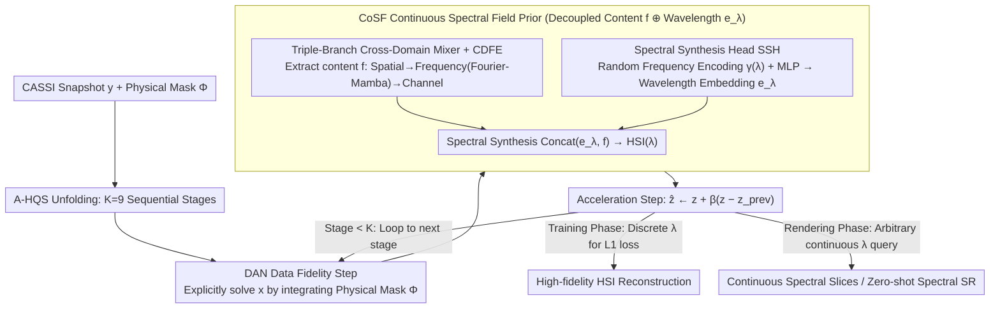

# Phy-CoSF: Physics-Guided Continuous Spectral Fields Reconstruction and Super-Resolution for Snapshot Compressive Imaging

**Conference**: ICML 2026  
**arXiv**: [2605.13583](https://arxiv.org/abs/2605.13583)  
**Code**: [github.com/PaiDii/Phy-CoSF](https://github.com/PaiDii/Phy-CoSF)  
**Area**: Image Restoration / Hyperspectral Imaging / Implicit Neural Representation  
**Keywords**: CASSI, Hyperspectral Reconstruction, Deep Unfolding Network, Implicit Neural Representation, Continuous Spectral Super-Resolution

## TL;DR
A train-render two-stage deep unfolding framework for Coded Aperture Snapshot Compressive Imaging (CASSI) is proposed, enabling arbitrary wavelength querying. By embedding a Continuous Spectral Field (CoSF) prior module—consisting of a Fourier-Mamba-driven triple-branch cross-domain feature mixer, random frequency encoding, and a spectral synthesis head—into each unfolding stage, the model can be trained on discrete wavelengths and perform continuous spectral reconstruction and zero-shot spectral super-resolution during inference.

## Background & Motivation

**Background**: CASSI systems compress 3D hyperspectral images (HSI) into a single snapshot using a physical mask, a disperser, and a 2D sensor. Reconstructing the full HSI from a single frame is a severely ill-posed inverse problem. Prevailing solutions have evolved from model-driven priors (sparsity, low-rank) to E2E CNN/Transformers (TSA-Net, MST++) and Deep Unfolding Networks (DUNs) such as ADMM-Net, GAP-Net, DAUHST, DERNN-LNLT, LADE-DUN, and MiJUN. DUNs have become mainstream due to their combination of physical interpretability and data-driven performance.

**Limitations of Prior Work**: Existing mainstream methods (both E2E and DUN) are built on the assumption of **fixed discrete wavelengths** for input and output. If trained on 28 wavelength channels, they can only output those specific 28 channels. However, the physical principle of CASSI involves continuous dispersion. This "discrete-in, discrete-out" setting contradicts the physical nature of the system and precludes high-value capabilities such as inferring new wavelengths or spectral super-resolution. Extending to new wavelengths typically requires re-collecting training data and retraining the entire model.

**Key Challenge**: The strength of DUNs stems from learning discrete channel denoising/deblurring operators at each stage. To achieve continuous wavelength querying, the prior itself must be a continuous function of wavelength. Embedding the "arbitrary output via coordinate querying" capability of Implicit Neural Representations (INR) into an unfolding network without compromising physical consistency is a critical challenge.

**Goal**: (1) Enable a single model to perform both high-fidelity HSI reconstruction and spectral super-resolution at arbitrary target wavelengths; (2) Retain the physically interpretable structure of DUN (based on A-HQS algorithm unfolding) while replacing the prior module with a decoupled "wavelength-independent content + continuous spectral synthesis" form; (3) Fully exploit the complementary structures of HSI in spatial, frequency, and channel domains.

**Key Insight**: The authors recognize that spectral synthesis is inherently similar to "querying color by coordinates" in NeRF. By using a "wavelength-independent content representation $f$" and a "continuous wavelength embedding $e_\lambda$" for implicit decoding within each DUN stage, the model can be trained on discrete samples and rendered at any $\lambda$.

**Core Idea**: Transform the DUN into a **train-render two-stage paradigm**. The training phase queries only at discrete wavelengths where ground truth (GT) exists to calculate L1 loss, while the rendering phase allows for free querying of any continuous wavelength using the same model to achieve zero-shot spectral super-resolution.

## Method

### Overall Architecture
Phy-CoSF addresses the ill-posed inverse problem of HSI reconstruction from a CASSI snapshot by unfolding the accelerated Half-Quadratic Splitting (A-HQS) algorithm into $K=9$ stages based on the forward physical model $y = \Phi x + n$. A continuous spectral field representation is embedded in the prior step of each stage. Each stage sequentially performs three tasks: first, the Degradation-Aware Network (DAN) explicitly solves the data fidelity sub-problem $x_{k+1} = (\Phi^T \Phi + \mu I)^{-1}(\Phi^T y + \mu \hat z_k)$, integrating the physical mask $\Phi$ into the computational graph; second, the CoSF module solves the prior sub-problem $z_{k+1} = \text{CoSF}(x_{k+1}, \eta)$, where $\eta = \sqrt{\tau/\mu}$ is a learnable noise level; finally, an acceleration step is performed as $\hat z_{k+1} = z_{k+1} + \beta_k(z_{k+1} - z_k)$. During training, the network queries randomly selected discrete wavelengths to calculate L1 loss. During rendering, any wavelength $\lambda$ can be fed into CoSF to render a single-wavelength slice $HSI(\lambda) \in \mathbb{R}^{1\times H\times W}$.

### Key Designs

**1. Continuous Spectral Field Prior (CoSF): Transitioning from Discrete Denoising to Continuous Fields**
Traditional DUNs suffer because the learned priors are only valid for the discrete channels used during training. CoSF breaks this limitation by decoupling the prior into wavelength-independent content and wavelength-dependent embeddings. The content side uses a Triple-Branch Cross-Domain Feature Mixer to extract a multi-scale representation $f \in \mathbb{R}^{C \times H \times W}$. Specifically, a $3\times 3$ convolution increases channels to get fine-grained features $f_H$, while $4\times 4$ convolutions perform progressive downsampling to obtain meso-scale $f_M$ and coarse-scale $f_L$ features. All branches are processed via CDFE, interpolated back to original resolution, and concatenated. On the wavelength side, the Spectral Synthesis Head (SSH) normalizes $\lambda$ to $[-1,1]$, applies Random Frequency Encoding $\gamma(\lambda) = [\sin(2\pi\lambda b_1), \dots, \cos(2\pi\lambda b_m)]$ where $b_i \sim \mathcal{N}(0,\sigma^2)$, and projects it via an MLP to get $e_\lambda \in \mathbb{R}^D$. The content and embedding are concatenated to synthesize the intensity map $HSI(\lambda)$.

**2. Cross-Domain Feature Encoder (CDFE): Successive Spatial-Frequency-Channel Refinement**
CDFE captures HSI signals across three naturally decoupled domains. In the spatial domain, GLAM-Net extracts local textures. In the frequency domain, a 2D-FFT maps features where each coefficient encodes global structure; the spectrum is flattened into a 1D sequence and fed into a Mamba block for long-range dependency modeling before an iFFT returns it to the spatial domain with residual connections. Finally, the channel domain uses a GDFN for calibration. Using Mamba in the frequency domain is a deliberate choice to achieve $O(N)$ long-range modeling, avoiding the $O(N^2)$ complexity of Transformers in high-resolution HSI scenarios.

**3. Train-Render Two-Stage Paradigm: Zero-shot Spectral Super-Resolution**
Since ground truth for spectral super-resolution is difficult to obtain, training occurs only on discrete wavelengths with available GT. The SSH treats $\lambda$ as a continuous input condition, meaning the model learns a continuous function of wavelength rather than a discrete lookup table. During inference, any $\lambda$ not seen during training can be queried to produce high-fidelity spectral slices, effectively achieving zero-shot super-resolution in the spectral dimension.

### Loss & Training
The network is trained using only the L1 reconstruction loss $\mathcal{L}_{rec} = \|HSI_{pred}(\lambda) - HSI_{gt}(\lambda)\|_1$, with a set of discrete wavelengths randomly sampled for each batch. The unfolding uses $K = 9$ stages. The Fourier-Mamba blocks within CDFE use direction-independent 1D Mamba on the $H \times W$ flattened frequency domain sequence. Evaluation is conducted on 10 scenes from the ICVL dataset using SAM, PSNR, and SSIM metrics.

## Key Experimental Results

### Main Results
Continuous spectral reconstruction (compared with mainstream DUN/E2E methods under uniform discrete wavelength settings):

| Method | Params (M) | FLOPs (G) | Avg SAM ↓ | Avg PSNR (dB) ↑ | Avg SSIM ↑ |
|---|---|---|---|---|---|
| MST++ | 0.07 | 1.18 | 2.43 | 34.48 | 0.884 |
| CST-L+ | 0.15 | 3.94 | 2.41 | 34.39 | 0.882 |
| GAP-Net | 4.21 | 65.73 | 2.38 | 36.01 | 0.915 |
| DAUHST-9stg | 2.42 | 6.68 | 2.32 | 35.76 | 0.911 |
| RDLUF-MixS2-9stg | 0.11 | 31.49 | 2.47 | 35.03 | 0.900 |
| DERNN-LNLT*-9stg | 0.93 | 122.14 | 2.33 | 35.72 | 0.911 |
| LADE-DUN-10stg | 1.23 | 8.34 | 2.16 | 35.79 | 0.914 |
| MiJUN-9stg | 0.04 | 6.01 | 2.37 | 35.26 | 0.901 |
| **Phy-CoSF-9stg** | 0.27 | 801.38 | **1.14** | **36.45** | **0.915** |

Phy-CoSF achieves a SAM of 1.14, nearly doubling the performance of the strongest baseline (LADE-DUN at 2.16). It also obtains the highest PSNR at 36.45 dB. However, the FLOPs are significantly higher (801G) compared to other unfolding networks.

### Ablation Study

| Configuration | Key Metrics (Avg) | Description |
|---|---|---|
| Full Phy-CoSF-9stg | SAM 1.14 / PSNR 36.45 | All three modules included |
| w/o CoSF (Discrete Prior) | PSNR ~35.7 | Loss of continuous rendering; 0.7 dB+ drop |
| w/o Fourier-Mamba | Lower SSIM/PSNR | Missing global dependency modeling |
| Single-scale Content | Detail loss | Validates fine/meso/coarse necessity |
| Fixed Encoding | Lower fidelity | RFE provides necessary inductive bias |

### Key Findings
- **Significant SAM Advantage**: The angular error in the spectral direction is halved, largely due to the RFE and decoupled wavelength encoding accurately capturing spectral signatures.
- **Parameters vs. FLOPs**: The model is parameter-efficient (0.27M) but computationally intensive (801G FLOPs) because the SSH must be executed per stage and per wavelength.
- **Zero-shot Spectral SR**: This is the first CASSI DUN framework to enable high-fidelity spectral slice querying at arbitrary wavelengths.
- **Fourier-Mamba Efficiency**: Using Mamba for 1D sequence modeling in the frequency domain succeeds in maintaining global context without the quadratic complexity of Transformers.

## Highlights & Insights
- Integrating INR into each stage of a DUN is a natural yet powerful combination: DUN provides physical interpretability, while INR provides continuous querying.
- The decoupled design ($f$ and $e_\lambda$) is transferable to other inverse problems involving continuous coordinate querying, such as temporal frame interpolation or spatial super-resolution.
- The use of Random Fourier Encoding coupled with learnable MLP projections successfully brings the high-frequency inductive biases of NeRF to 1D spectral coordinates.

## Limitations & Future Work
- High computational complexity (801G FLOPs) makes it unsuitable for real-time HSI reconstruction.
- Continuous spectral super-resolution is primarily demonstrated qualitatively; quantitative evaluation against ground truth at new wavelengths is needed.
- Evaluation is limited to the ICVL dataset; robustness to other datasets (KAIST, CAVE) and real-world instrument noise remains to be verified.
- The SSH requires sequential querying for each wavelength, which could be optimized through parallel batch querying.

## Related Work & Insights
- **vs. LADE-DUN**: While LADE-DUN uses a latent diffusion generative prior, Phy-CoSF replaces the prior with a continuous field, gaining superior spectral fidelity and rendering flexibility.
- **vs. MiJUN**: MiJUN utilizes Mamba for spatial-temporal unfolding; Phy-CoSF applies Mamba to the frequency domain and integrates INR.
- **vs. NeRF/INR**: This work effectively extends the "coordinate -> color" concept from spatial/view coordinates to the spectral axis in HSI reconstruction.

## Rating
- Novelty: ⭐⭐⭐⭐ 
- Experimental Thoroughness: ⭐⭐⭐ 
- Writing Quality: ⭐⭐⭐⭐ 
- Value: ⭐⭐⭐⭐

<!-- RELATED:START -->

## Related Papers

- [\[CVPR 2026\] DetectSCI: Toward Object-Guided ROI Reconstruction for High-Resolution Video Snapshot Compressive Imaging](../../CVPR2026/image_restoration/detectsci_toward_object-guided_roi_reconstruction_for_high-resolution_video_snap.md)
- [\[ICML 2026\] Coevolutionary Continuous Discrete Diffusion: Make Your Diffusion Language Model a Latent Reasoner](coevolutionary_continuous_discrete_diffusion_make_your_diffusion_language_model_.md)
- [\[CVPR 2026\] Multi-Scale Gradient-Guided Unrolling Architecture with Adaptive Mamba for Compressive Sensing](../../CVPR2026/image_restoration/multi-scale_gradient-guided_unrolling_architecture_with_adaptive_mamba_for_compr.md)
- [\[CVPR 2026\] Spectral Super-Resolution via Adversarial Unfolding and Data-Driven Spectrum Regularization](../../CVPR2026/image_restoration/spectral_super-resolution_via_adversarial_unfolding_and_data-driven_spectrum_reg.md)
- [\[ICML 2026\] Semi-Supervised Neural Super-Resolution for Mesh-Based Simulations](semi-supervised_neural_super-resolution_for_mesh-based_simulations.md)

<!-- RELATED:END -->
