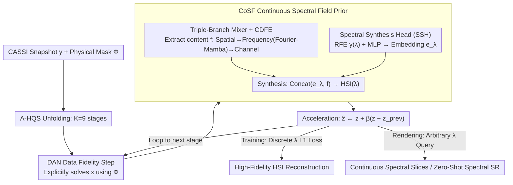

# Phy-CoSF: Physics-Guided Continuous Spectral Fields Reconstruction and Super-Resolution for Snapshot Compressive Imaging

**Conference**: ICML 2026  
**arXiv**: [2605.13583](https://arxiv.org/abs/2605.13583)  
**Code**: [github.com/PaiDii/Phy-CoSF](https://github.com/PaiDii/Phy-CoSF)  
**Area**: Image Restoration / Hyperspectral Imaging / Implicit Neural Representation  
**Keywords**: CASSI, Hyperspectral Reconstruction, Deep Unfolding Network, Implicit Neural Representation, Continuous Spectral Super-Resolution

## TL;DR
Ours designs a train-render two-stage, wavelength-arbitrary queryable deep unfolding framework for Coded Aperture Snapshot Compressive Imaging (CASSI). By embedding a Continuous Spectral Field (CoSF) prior module—comprising a Fourier-Mamba-driven triple-branch cross-domain feature mixer, random frequency encoding, and a spectral synthesis head—within each unfolding stage, the model can be trained on discrete wavelengths and synthesize hyperspectral images at any continuous wavelength during inference, achieving continuous spectral reconstruction and zero-shot spectral super-resolution.

## Background & Motivation

**Background**: CASSI systems compress a 3D hyperspectral image (HSI) into a single snapshot using a physical mask, a disperser, and a 2D sensor. Reconstructing the complete HSI from a single frame is a severely ill-posed inverse problem. Leading solutions have evolved from model-driven priors (sparsity, low-rank) to E2E CNN/Transformer (TSA-Net, MST++) and then to Deep Unfolding Networks (DUN) like ADMM-Net, GAP-Net, DAUHST, DERNN-LNLT, LADE-DUN, and MiJUN, with DUNs becoming mainstream due to their combination of physical interpretability and data-driven learning.

**Limitations of Prior Work**: All mainstream methods (whether E2E or DUN) rely on the assumption of **fixed discrete wavelengths** for input and output. They are bound to specific wavelength channels (e.g., 28) during training and can only output those same channels during inference. However, the physical imaging principle of CASSI is continuous dispersion. This "discrete-to-discrete" setting contradicts the physical nature of the process and precludes high-value capabilities like inferring at new wavelengths or performing spectral super-resolution.

**Key Challenge**: The strength of DUNs comes from learning a discrete channel denoising/deblurring operator for each stage. To enable continuous wavelength queries, the prior itself must be a continuous function of wavelength. Embedding the "coordinate-based query" capability of Implicit Neural Representations (INR) into an unfolding network without compromising physical consistency is a critical challenge.

**Goal**: (1) Enable a single model to perform both high-fidelity HSI reconstruction and spectral super-resolution at arbitrary target wavelengths. (2) Maintain the physically interpretable structure of DUN (A-HQS algorithm) while redesigning the prior module into a decoupled form of "wavelength-independent content + continuous spectral synthesis." (3) Exploit the complementary structures of HSI across spatial, spectral, and frequency domains.

**Key Insight**: The authors recognize that spectral synthesis is fundamentally similar to "querying color by coordinates" in NeRF. By using wavelength-independent content representation $f$ and continuous wavelength embeddings $e_\lambda$ for implicit decoding in each DUN stage, the model can be trained on discrete samples and rendered at any $\lambda$ during inference.

**Core Idea**: Transforming DUN into a **train-render two-stage paradigm**. During the training phase, queries and L1 losses are computed only on discrete wavelengths where ground truth (GT) exists. In the rendering phase, the same model freely queries arbitrary continuous wavelengths to achieve "zero-shot spectral super-resolution."

## Method

### Overall Architecture
Phy-CoSF addresses the ill-posed inverse problem of HSI reconstruction from a single CASSI snapshot by unfolding the accelerated Half-Quadratic Splitting (A-HQS) algorithm into $K=9$ stages based on the forward physical model $y = \Phi x + n$. A continuous spectral field representation is embedded in the prior step of each stage. Each stage performs three operations: 1. A Degradation-Aware Network (DAN) explicitly solves the data fidelity sub-problem $x_{k+1} = (\Phi^T \Phi + \mu I)^{-1}(\Phi^T y + \mu \hat z_k)$, incorporating the physical mask $\Phi$ into the computational graph. 2. The CoSF module solves the prior sub-problem $z_{k+1} = \text{CoSF}(x_{k+1}, \eta)$, where $\eta = \sqrt{\tau/\mu}$ is a learnable noise level. 3. An acceleration step $\hat z_{k+1} = z_{k+1} + \beta_k(z_{k+1} - z_k)$ is performed. During training, the network computes L1 loss only on randomly sampled discrete wavelengths; during inference, it can render single-wavelength slices $HSI(\lambda) \in \mathbb{R}^{1\times H\times W}$ for any input $\lambda$.

### Key Designs

**1. CoSF Prior: Replacing discrete denoising with a continuous spectral field**
Traditional DUN priors are only effective for the discrete channels used during training. CoSF breaks this by decoupling the prior into "wavelength-independent content" and "wavelength-dependent embeddings." The content side uses a Triple-Branch Cross-Domain Feature Mixer to extract a multi-scale representation $f \in \mathbb{R}^{C \times H \times W}$. It employs $3\times 3$ convolutions for fine-grained features $f_H$, and sequential downsampling for meso-scale $f_M$ and coarse-scale $f_L$. All branches are processed via CDFE and upsampled to the original resolution to capture local textures, structures, and global context. The wavelength side uses a Spectral Synthesis Head (SSH) that normalizes $\lambda$ to $[-1,1]$, applies Random Frequency Encoding (RFE) $\gamma(\lambda) = [\sin(2\pi\lambda b_1), \dots, \cos(2\pi\lambda b_m)]$ (where $b_i \sim \mathcal{N}(0, \sigma^2)$ is fixed), and projects it via MLP to $e_\lambda \in \mathbb{R}^D$. The final slice is synthesized as $HSI(\lambda) = \text{SH}(\text{Concat}(e_\lambda, f))$. RFE provides a "high-frequency inductive bias" to counter the low-frequency bias of deep networks.

**2. CDFE: Feature encoding across Spatial, Frequency, and Channel domains**
HSI signals possess spatial structures, spectral correlations, and cross-channel dependencies. CDFE uses a serial backbone to refine features across these domains: 1. Spatial: GLAM-Net (global-local attention) for local textures. 2. Frequency: A 2D-FFT maps features to the frequency domain—where coefficients encode global structure—followed by a Mamba block to model long-range dependencies efficiently before an iFFT back to the spatial domain. 3. Channel: GDFN for channel calibration. Using Mamba in the frequency domain is a deliberate choice for $O(N)$ complexity modeling of $H\times W$ sequences, avoiding the $O(N^2)$ overhead of Transformers.

**3. Train-Render Paradigm: Zero-shot spectral super-resolution**
Since GT data for spectral super-resolution is difficult to obtain, training occurs only on discrete wavelengths with available GT. During each training batch, CoSF queries these discrete coordinates to compute $|HSI_{pred}(\lambda) - HSI_{gt}(\lambda)\|_1$. Because the SSH treats $\lambda$ as a continuous input, the model learns a continuous function rather than a discrete lookup table. At inference, any $\lambda$ not seen during training can be queried to produce high-fidelity slices, achieving zero-shot super-resolution.

### Loss & Training
Training utilizes the L1 reconstruction loss $\mathcal{L}_{rec} = \|HSI_{pred}(\lambda) - HSI_{gt}(\lambda)\|_1$ with random sampling of discrete wavelengths. The unfolding stages are set to $K = 9$, each containing a DAN, a CoSF, and an acceleration step. The Fourier-Mamba within CDFE uses a direction-independent 1D Mamba on the flattened $H \times W$ frequency spectrum. Evaluation is performed on 10 scenes from the ICVL dataset using SAM, PSNR, and SSIM.

## Key Experimental Results

### Main Results
Continuous spectral reconstruction (compared at standard discrete wavelengths):

| Method | Params (M) | FLOPs (G) | Avg SAM ↓ | Avg PSNR (dB) ↑ | Avg SSIM ↑ |
|---|---|---|---|---|---|
| MST++ | 0.07 | 1.18 | 2.43 | 34.48 | 0.884 |
| CST-L+ | 0.15 | 3.94 | 2.41 | 34.39 | 0.882 |
| GAP-Net | 4.21 | 65.73 | 2.38 | 36.01 | 0.915 |
| DAUHST-9stg | 2.42 | 6.68 | 2.32 | 35.76 | 0.911 |
| RDLUF-MixS2-9stg | 0.11 | 31.49 | 2.47 | 35.03 | 0.900 |
| DERNN-LNLT*-9stg | 0.93 | 122.14 | 2.33 | 35.72 | 0.911 |
| LADE-DUN-10stg | 1.23 | 8.34 | 2.16 | 35.79 | 0.914 |
| MiJUN-9stg | 0.04 | 6.01 | 2.37 | 35.26 | 0.901 |
| **Phy-CoSF-9stg** | 0.27 | 801.38 | **1.14** | **36.45** | **0.915** |

Phy-CoSF achieves a SAM of 1.14 (nearly halving the error of the best baseline LADE-DUN at 2.16) and a peak PSNR of 36.45 dB. However, its FLOPs (801G) are significantly higher than other unfolding networks.

### Ablation Study

| Configuration | Key Metrics (Avg) | Description |
|---|---|---|
| Full Phy-CoSF-9stg | SAM 1.14 / PSNR 36.45 | All modules included |
| w/o CoSF (Discrete prior) | PSNR ~35.7 | Loses continuous rendering; performance drops > 0.7 dB |
| w/o Fourier-Mamba | Degraded SSIM/PSNR | Loss of global dependency modeling |
| Single-scale mixer | Detail loss | Validates triple-branch necessity |
| Fixed encoding (no RFE) | Blurred high frequencies | RFE provides necessary inductive bias |

### Key Findings
- **Significant SAM gain**: SAM dropping from ~2.4 to 1.14 indicates a halving of spectral angle error, primarily due to the continuous $\lambda$ encoding in SSH.
- **Parameter Efficiency vs. Computation**: With only 0.27M parameters, it is very efficient in size but computation-heavy (801G FLOPs) due to per-wavelength querying in the implicit architecture.
- **Zero-shot Spectral SR**: This is the first CASSI DUN to achieve zero-shot super-resolution by querying arbitrary $\lambda$ during rendering.
- **Fourier-Mamba Efficiency**: 1D SSM models long-range dependencies in the frequency domain at $O(N)$ complexity, outperforming Transformers for high-resolution HSI sequences.

## Highlights & Insights
- Integrating INR into DUN stages is a highly synergistic combination: DUN provides physical interpretability, while INR provides continuous query capabilities.
- The decoupling of content $f$ and embedding $e_\lambda$ is transferable to other inverse problems requiring continuous coordinate queries (e.g., video frame interpolation or HDR).
- Transforming 2D frequency spectra into 1D sequences for Mamba processing effectively bypasses the complexity bottlenecks of Transformers on large images.
- The use of Random Fourier Encoding paired with learnable MLPs allows for task-specific adaptation of high-frequency biases, a technique proven in NeRF and now successfully applied to spectral coordinates.

## Limitations & Future Work
- **High FLOPs**: 801G is much higher than competitors like DAUHST (6.68G), making it less suitable for real-time applications.
- **Evaluation**: Quantitative evaluation for zero-shot SR at new wavelengths is missing; current results are mostly qualitative.
- **Generalization**: Testing was limited to the ICVL dataset; performance on noisier or different dispersion settings remains to be seen.
- **Rendering Speed**: Synthesizing 200+ bands requires multiple forward passes; parallel query optimizations could be investigated.

## Related Work & Insights
- **vs. LADE-DUN**: While LADE-DUN uses a latent diffusion generative prior, Phy-CoSF adopts a continuous field prior, improving PSNR from 35.79 to 36.45 and adding continuous rendering.
- **vs. MiJUN**: MiJUN uses Mamba for tensor-based unfolding; Phy-CoSF applies Mamba specifically in the frequency domain.
- **vs. NeRF/INR**: This work extends the "coordinate to value" concept of NeRF along the spectral axis rather than the spatial axis, representing a successful translation of INR ideas to hyperspectral inverse problems.

## Rating
- Novelty: ⭐⭐⭐⭐ One of the first works to transition CASSI reconstruction from discrete to continuous spectra using INR + DUN.
- Experimental Thoroughness: ⭐⭐⭐ Strong comparative results on ICVL, but lacks multi-dataset and quantitative SR evaluation.
- Writing Quality: ⭐⭐⭐⭐ Clear physical derivation and modular breakdown.
- Value: ⭐⭐⭐⭐ Introduces "on-demand wavelength query" to HSI, beneficial for remote sensing and medical imaging.

<!-- RELATED:START -->

## Related Papers

- [\[CVPR 2026\] DetectSCI: Toward Object-Guided ROI Reconstruction for High-Resolution Video Snapshot Compressive Imaging](../../CVPR2026/image_restoration/detectsci_toward_object-guided_roi_reconstruction_for_high-resolution_video_snap.md)
- [\[CVPR 2026\] LRDUN: A Low-Rank Deep Unfolding Network for Efficient Spectral Compressive Imaging](../../CVPR2026/image_restoration/lrdun_a_low-rank_deep_unfolding_network_for_efficient_spectral_compressive_imagi.md)
- [\[CVPR 2026\] SGDE: Self-supervised Geometry Degradation Estimation Framework for Coded Aperture Compressive Spectral Imaging](../../CVPR2026/image_restoration/sgde_self-supervised_geometry_degradation_estimation_framework_for_coded_apertur.md)
- [\[ICLR 2026\] Continuous Space-Time Video Super-Resolution with 3D Fourier Fields](../../ICLR2026/image_restoration/continuous_space-time_video_super-resolution_with_3d_fourier_fields.md)
- [\[ICML 2026\] Coevolutionary Continuous Discrete Diffusion: Make Your Diffusion Language Model a Latent Reasoner](coevolutionary_continuous_discrete_diffusion_make_your_diffusion_language_model_.md)

<!-- RELATED:END -->
