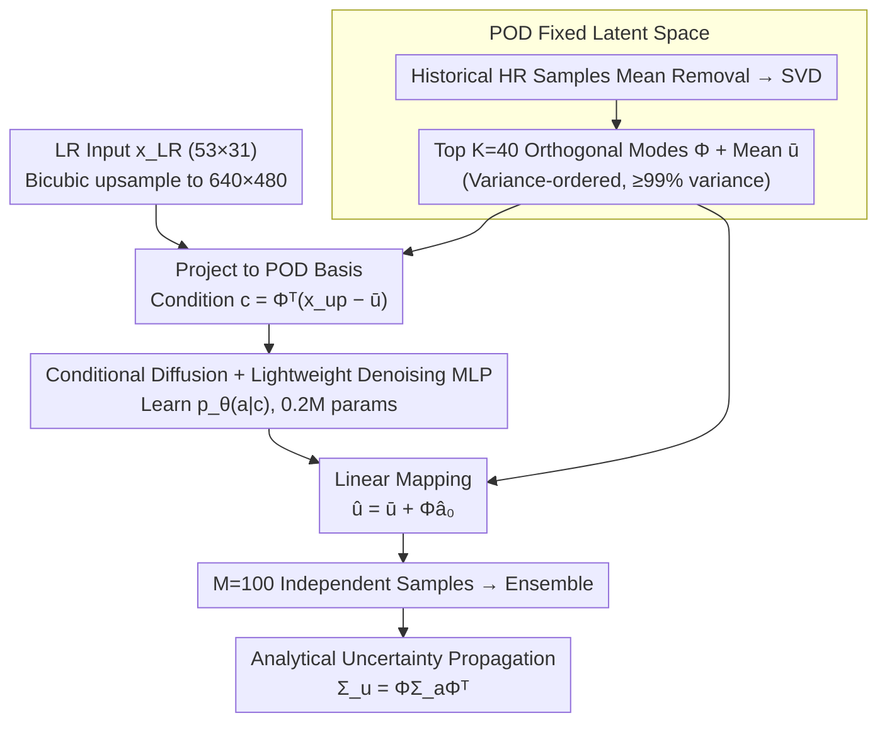

# PODiff: Latent Diffusion in Proper Orthogonal Decomposition Space for Scientific Super-Resolution

**Conference**: ICML 2026  
**arXiv**: [2605.03399](https://arxiv.org/abs/2605.03399)  
**Code**: None  
**Area**: Diffusion Models / Scientific Machine Learning / Probabilistic Super-Resolution  
**Keywords**: POD Latent Space, Conditional Diffusion, Uncertainty Quantification, SST Downscaling, Ensemble Generation  

## TL;DR
PODiff moves the diffusion process from pixel space to a fixed, variance-sorted POD coefficient space. By utilizing a minimal MLP, it achieves accuracy comparable to pixel-level diffusion on $640\times 480$ SST downscaling tasks. Since reconstruction is linear, ensemble variance can be analytically back-propagated to physical space via $\Sigma_u=\Phi\Sigma_a\Phi^\top$, yielding spatially interpretable and well-calibrated uncertainty.

## Background & Motivation
**Background**: In scientific computing fields such as climate, oceanography, and geophysical fluids, "low-resolution field → high-resolution field" super-resolution (downscaling) is a long-standing task. Recently, diffusion models have become mainstream for probabilistic super-resolution: unlike deterministic U-Nets that provide only point estimates, diffusion models enable ensemble sampling to naturally provide predictive distributions.

**Limitations of Prior Work**: Running diffusion directly in pixel space is extremely expensive for typical oceanic fields like $640\times 480$. In this paper, PixelDiff required 48 hours of training, 12.5 GB peak VRAM, and 1.24 seconds for single-sample inference; generating a 100-sample ensemble is even more prohibitive. Classic latent diffusion (Rombach et al.) moves diffusion to a low-dimensional space learned by an autoencoder, but this non-linear latent space lacks a clear correspondence with "spatial variance," making it impossible to analytically translate latent variance into physical variance.

**Key Challenge**: The probabilistic advantage of diffusion models requires "sampling many times," yet the cost of pixel-space sampling is unacceptably high. Using latents often loses the interpretable mapping between "latent variables ↔ physical space uncertainty."

**Goal**: (1) Move diffusion into a low-dimensional latent space that maintains a clear correspondence with physical space; (2) Enable analytical mapping of uncertainty from latent space back to physical space; (3) Demonstrate both points in a practical task like SST downscaling.

**Key Insight**: The authors observe that scientific fields (climate, fluids) typically possess strong low-rank linear structures—the first few POD modes can explain the vast majority of variance. POD simultaneously provides a set of **orthogonal, variance-sorted** bases, meaning the latent space naturally possesses a geometric structure: low-order coefficients correspond to large-scale modes, and high-order coefficients correspond to fine-scale variations.

**Core Idea**: Use POD projection instead of a learned autoencoder as the diffusion latent space. Diffusion is performed only on $K\ll d$ POD coefficients. The linear reconstruction $\hat u=\bar u+\Phi\hat a$ allows an analytical relationship for covariance between $\Sigma_a$ and $\Sigma_u$.

## Method

### Overall Architecture
The input is a low-resolution field $x_\text{LR}\in\mathbb{R}^{d_\text{low}}$ (53×31 ACCESS-S2 ocean reanalysis), and the output is a $640\times 480$ high-resolution SST field for the same region along with its pixel-wise variance. The pipeline consists of four steps: (1) **Offline POD**—SVD is performed on historical high-resolution training samples after mean removal to obtain the top $K$ orthogonal modes $\Phi\in\mathbb{R}^{d\times K}$ and mean $\bar u$. $K$ is the smallest integer such that cumulative variance $\geq\eta$ (experimentally $\eta\approx 99\%$, $K=40$). (2) **Condition Construction**—The low-resolution input is bicubic-upsampled to $d=640\times 480$ and projected onto POD bases to obtain $c=\Phi^\top(x_\text{up}-\bar u)\in\mathbb{R}^K$. (3) **POD Coefficient Space Diffusion**—A lightweight conditional MLP learns $p_\theta(a\mid c)$, with forward noise $a_t=\sqrt{\bar\alpha_t}\,a_0+\sqrt{1-\bar\alpha_t}\,\epsilon$, and reverse training for $T=1000$ steps and sampling for $S=100$ steps. (4) **Linear Back-projection & Variance Propagation**—The predicted $\hat a_0$ is de-standardized and reconstructed as $\hat u=\bar u+\Phi\hat a_0$. Multiple independent samples form an ensemble, and the latent sample covariance $\Sigma_a$ is analytically propagated to physical space via $\Sigma_u=\Phi\Sigma_a\Phi^\top$.

### Key Designs

**1. POD as a Fixed Latent Space: Replacing Learned Autoencoders with Problem-specific Geometry**

Pixel-space diffusion is too expensive at $d\approx 3\times 10^5$ dimensions, while non-linear latents of learned autoencoders are decoupled from physical quantities. PODiff does not train any encoder; instead, it performs an offline SVD on the centralized snapshot matrix $U=[u_1-\bar u,\dots,u_N-\bar u]$ to retain the top $K$ modes $\Phi$ sorted by eigenvalues. Thus, any field can be written as $u\approx\bar u+\Phi a$ with coefficients $a=\Phi^\top(u-\bar u)$. Selecting $K=40$ (cumulative variance $\geq 99\%$) compresses the spatial field into 40 dimensions, with the first mode alone explaining over 70% of SST variance. This basis provides three advantages: it eliminates encoder-decoder training and latent distortion; it is orthogonal and variance-sorted, ensuring a stable latent geometry where low-order coefficients correspond to large scales; and linear reconstruction ensures the covariance relationship $\Sigma_u=\Phi\Sigma_a\Phi^\top$ holds strictly. Its real effectiveness comes from the "variance-sorted, data-adaptive" property rather than mere dimensionality reduction—as evidenced by the RandOrthDiff control (replacing POD with random orthogonal bases), where RMSE jumped from 0.39 to 1.00 $^\circ$C.

**2. Conditional Diffusion and Lightweight Denoising MLP: Moving Diffusion from Convolutions to 40D Vectors**

After dimensionality reduction, diffusion only needs to learn the conditional distribution $p_\theta(a\mid c)$ in a $K$-dimensional coefficient space. The condition vector $c$ is derived by projecting the bicubic-upsampled low-resolution field onto the POD basis. This is concatenated with noise coefficient $a_t$ and fed into a 4-layer, 256-wide residual MLP with sinusoidal timestep embeddings to output predicted noise $\epsilon_\theta(a_t,c,t)$. The training objective is the standard $\ell_2$ noise prediction loss $\mathbb{E}\|\epsilon-\epsilon_\theta\|^2$. Due to the minimal dimensionality, the denoising network has only 0.20M parameters, compared to 33M in U-Net-based pixel diffusion. This replacement reduces training time from 48h to 3.8h and peak VRAM from 12.5GB to 1.4GB, while fully preserving the probabilistic sampling capabilities of diffusion.

**3. Analytical Uncertainty Propagation: Back-projecting Latent Variance via Linear Bases**

To provide spatially resolved predictive variance, PODiff does not train an additional uncertainty head but leverages the linearity of reconstruction. By performing $M=100$ independent diffusion samples, each $\hat a_0^{(m)}$ is mapped back to physical space via $\hat u^{(m)}=\bar u+\Phi\hat a_0^{(m)}$. The physical space covariance is $\Sigma_u=\Phi\Sigma_a\Phi^\top$ (where $\Sigma_a$ is the latent coefficient sample covariance). Uncertainty in low-order modes dominates large-scale patterns, while high-order modes manifest as local detail variations. The propagation path is geometrically interpretable. In contrast, MC Dropout U-Net requires 100 full U-Net forward passes, and PixelDiff requires 100 pixel-level diffusion reverse passes to estimate variance, whereas here the sampling cost is compressed to the MLP level. Calibration quality is assessed using empirical coverage, reliability curves, MACE, and CRPS.

### Loss & Training
The training objective is the standard DDPM noise prediction loss $\mathcal{L}(\theta)=\mathbb{E}_{a_0,t,\epsilon}\|\epsilon-\epsilon_\theta(a_t,c,t)\|_2^2$, with $t\sim\text{Uniform}\{1,\dots,T\}$, $T=1000$, and inference using an $S=100$ step sampler. The optimizer is AdamW with a learning rate of $2\times 10^{-4}$. The best checkpoint is selected based on validation diffusion loss. The SST task uses 1998–2009 for training, 2010 for validation, and 2011 (including marine heatwave extreme events) for testing. All metrics are calculated only over ocean pixels.

## Key Experimental Results

### Main Results
SST downscaling, mean across all 365 days of 2011; "Extreme" is a subset of extreme events exceeding the 90th percentile of the daily climatology.

| Method | RMSE (∘C) | MAE (∘C) | Extreme RMSE | Extreme MAE |
|------|----------|---------|--------------|-------------|
| PODiff-K40 (Ours) | **0.3923** | **0.2976** | **0.4836** | **0.3537** |
| PixelDiff (Pixel Diffusion) | 0.4118 | 0.3158 | 0.4899 | 0.3600 |
| U-Net (33M) | 0.6788 | 0.5141 | 0.8366 | 0.6109 |
| POD-proj (No Diffusion) | 0.7084 | 0.5223 | 0.8896 | 0.6305 |
| RBF Interpolation | 0.7784 | 0.5804 | 0.7899 | 0.5936 |
| RandOrthDiff-K40 | 0.9987 | 0.7577 | 1.2309 | 0.9003 |

Computational cost comparison (Key Selling Point):

| Method | Params | Peak VRAM | Training Time | Single Sample Inference |
|------|------|--------|--------|----------|
| U-Net | 33M | 8.8 GB | 8.2 h | 0.05 s |
| PixelDiff | 33M | 12.5 GB | 48 h | 1.24 s |
| PODiff-K40 (Ours) | **0.20M** | **1.4 GB** | **3.8 h** | 0.08 s |

### Ablation Study

| Configuration | RMSE | Description |
|------|------|------|
| PODiff-K40 | 0.3923 | Full model, $K=40$ (≥99% variance) |
| PODiff-K20 | 0.5171 | Truncated to 20 modes |
| PODiff-K10 | 0.7725 | Truncated to 10 modes, approaches no-diffusion baseline |
| POD-proj | 0.7084 | Same $K$ but no diffusion, only $\hat u=\bar u+\Phi c$ |
| RandOrthDiff-K40 | 0.9987 | Same architecture and $K$; POD replaced with random orthogonal basis |

Calibration (empirical coverage / nominal): For a 90% nominal confidence interval, PODiff achieved 0.9009, PixelDiff 0.9010, while MC Dropout U-Net reached only 0.8871; PODiff and PixelDiff CRPS were also significantly lower than MC Dropout (0.2889 vs 0.4821).

### Key Findings
- **POD basis is the secret sauce**: Using the same MLP-diffusion architecture but replacing POD with random orthogonal bases caused RMSE to soar from 0.39 to 1.00, returning to RBF interpolation levels. This proves performance originates from the "variance-sorted, physical-consistent low-dimensional basis" rather than just "low-dimension + diffusion."
- **Diffusion is necessary**: POD-proj (using only $\Phi\Phi^\top$ projection) produced an RMSE of 0.71, nearly double that of PODiff-K40, proving that dimensionality reduction alone is insufficient and diffusion effectively captures the conditional distribution of $a$.
- **PixelDiff gains no accuracy despite 10× cost**: PODiff matches PixelDiff in accuracy while reducing training time to 1/13 and inference speed by 15×; the gap is even more pronounced during ensemble generation.
- **Reasonable uncertainty spatial structure**: High-variance regions are concentrated in coastal areas and strong temperature gradient zones rather than simply following reconstruction errors, indicating that latent space uncertainty captures "unresolved small-scale dynamics."
- **Slight over-confidence in low nominal intervals**: The 50% nominal interval measured 0.47, suggesting that truncated POD (discarding <1% trailing variance) makes central intervals slightly narrow, though the 90%+ high-confidence tails remain well-calibrated.

## Highlights & Insights
- **"Using problem-specific geometry as the latent"** is the cleverest aspect: Instead of training an autoencoder and then justifying the latent dimensions, it directly employs a mathematically variance-sorted linear basis (POD/SVD). For scientific fields where low-rank structures dominate, this approach even outperforms general pixel-space diffusion.
- **"Analytical uncertainty propagation" is clean and efficient**: While many latent diffusion models require training an extra head for uncertainty, the linearity here allows latent variance to propagate automatically via $\Phi\Sigma_a\Phi^\top$. No additional network is needed, and the path is geometrically interpretable (low-order modes ↔ large-scale uncertainty).
- **Transferable Trick**: This framework can be applied to any scientific problem with a "known low-rank prior" (pressure fields, flow fields, MRI modes, PDE solution spaces). One can perform offline POD once, run diffusion on $K$ dimensions, and return uncertainty via a linear operator. Extending this to wavelet bases or Koopman operator eigenfunctions is a natural progression.
- **Ablation design of RandOrthDiff is exemplary**: Many papers using PCA omit checking "if any orthogonal basis works"; here, the authors explicitly show that a random orthogonal basis drops performance to baseline levels, accurately attributing success to POD’s variance-ordering.

## Limitations & Future Work
- **Strong Low-Rank Assumption**: Effectiveness depends on the field being low-rank ($K\ll d$ covers 99% variance). For highly turbulent, strongly non-linear, or discontinuous fields (shocks, free-surface jumps), POD truncation errors might magnify, requiring thousands of modes.
- **Fixed Basis and Distribution Shift**: POD is calculated once on training data. Significant climate drifts, new regions, or new physics might require re-calculation or online updates; the paper leaves this for future work.
- **Unmodeled Truncation Uncertainty**: Variance from discarded high-order modes is ignored, causing slight over-confidence in the central 50% interval; a baseline correction term using training variance of unreserved modes could be considered.
- **Denoising MLP limitations**: Replacing the MLP with a 1D Transformer or considering physical correlations between POD coefficients (e.g., energy cascade) might further improve modeling for high-order coefficients.
- **2D SST focus**: Extending to 3D atmospheric or temporal coupled fields (using temporal POD) is the natural next step.

## Related Work & Insights
- **vs. Rombach et al. Latent Diffusion (LDM)**: LDM uses learned autoencoders for non-linear latents, effective for natural images but lacking physical meaning. PODiff uses linear interpretable bases, sacrificing some expressivity for "analytical variance propagation," making it ideal for scientific fields.
- **vs. PixelDiff (Authors' Baseline)**: Accuracy is virtually tied, but with 165× fewer parameters, 13× faster training, and 15× faster inference. It is a classic case of "exchanging domain structure for efficiency."
- **vs. MC Dropout U-Net**: MC Dropout is a common cheap uncertainty baseline, but results show it systematically under-covers (50% interval reached only 41%) and has nearly double the CRPS of PODiff, suggesting "dropout as Bayesian" is unreliable for scientific super-resolution.
- **vs. Leinonen et al. Climate Latent Diffusion**: Also uses latent diffusion for geophysical downscaling, but persists with learned latents; PODiff emphasizes that POD latents provide both efficiency and interpretable uncertainty.
- **Insight**: Re-embedding "30-year-old engineering dimensionality reduction" like POD/SVD into modern generative models is a direction worth revisiting—for example, replacing POD coefficient space with Koopman eigen-spaces for probabilistic dynamical system forecasting.

## Rating
- Novelty: ⭐⭐⭐⭐ While POD as a latent isn't new, the complete realization of "diffusion + analytical variance propagation + end-to-end SST validation" with systematic abaltions like RandOrthDiff is significant.
- Experimental Thoroughness: ⭐⭐⭐⭐ dual tracks (real SST task + advection-diffusion benchmark), comprehensive calibration/RMSE/cost metrics, and precise attribution in ablations.
- Writing Quality: ⭐⭐⭐⭐ Clean formulas and expression; the design rationale for choosing POD over autoencoders is very well-articulated.
- Value: ⭐⭐⭐⭐ Provides the SciML community with an immediately usable probabilistic super-resolution scheme. The reduction in parameters and VRAM (>60×) allows ensemble inference to run on standard hardware.

<!-- RELATED:START -->

## Related Papers

- [\[ICML 2026\] Coevolutionary Continuous Discrete Diffusion: Make Your Diffusion Language Model a Latent Reasoner](coevolutionary_continuous_discrete_diffusion_make_your_diffusion_language_model_.md)
- [\[ICML 2026\] Measurement-Consistent Langevin Corrector for Stabilizing Latent Diffusion Inverse Problem Solvers](measurement-consistent_langevin_corrector_for_stabilizing_latent_diffusion_inver.md)
- [\[CVPR 2026\] HDW-SR: High-Frequency Guided Diffusion Model based on Wavelet Decomposition for Image Super-Resolution](../../CVPR2026/image_restoration/hdw-sr_high-frequency_guided_diffusion_model_based_on_wavelet_decomposition_for_.md)
- [\[CVPR 2026\] Rectifying Latent Space for Generative Single-Image Reflection Removal](../../CVPR2026/image_restoration/rectifying_latent_space_for_generative_single-image_reflection_removal.md)
- [\[NeurIPS 2025\] Latent Harmony: Synergistic Unified UHD Image Restoration via Latent Space Regularization and Controllable Refinement](../../NeurIPS2025/image_restoration/latent_harmony_synergistic_unified_uhd_image_restoration_with_pre-trained_diffus.md)

<!-- RELATED:END -->
