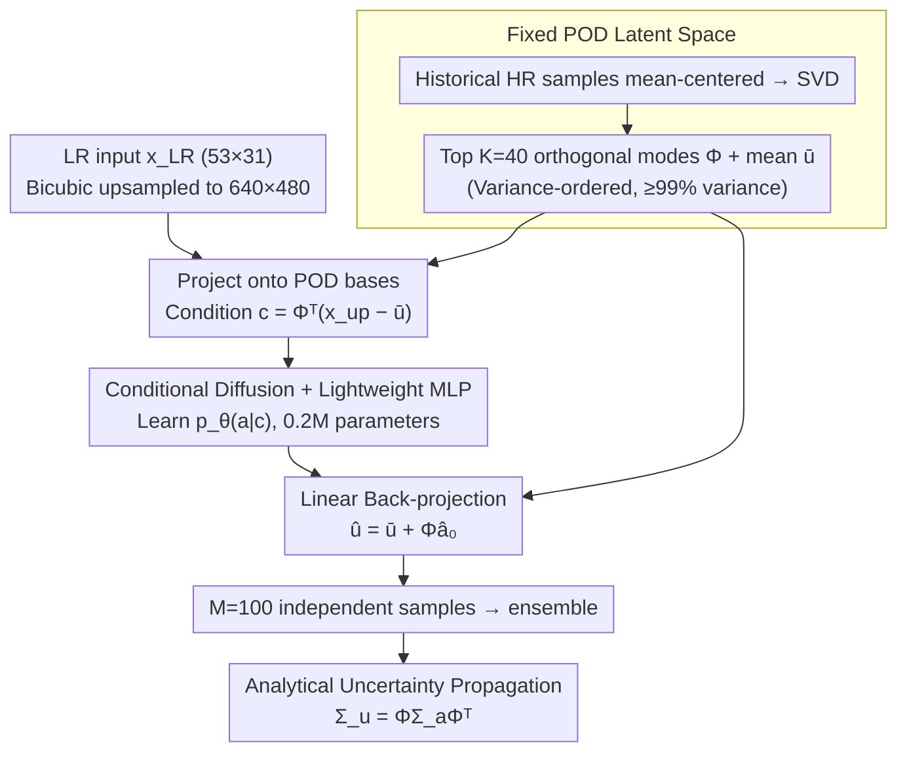

# PODiff: Latent Diffusion in Proper Orthogonal Decomposition Space for Scientific Super-Resolution

**Conference**: ICML 2026  
**arXiv**: [2605.03399](https://arxiv.org/abs/2605.03399)  
**Code**: None  
**Area**: Diffusion Models / Scientific Machine Learning / Probabilistic Super-Resolution  
**Keywords**: POD latent space, conditional diffusion, uncertainty quantification, SST downscaling, ensemble generation

## TL;DR
PODiff moves diffusion models from pixel space to a fixed, variance-ordered Proper Orthogonal Decomposition (POD) coefficient space. Using a minimal MLP, it achieves accuracy comparable to pixel-level diffusion on $640\times 480$ Sea Surface Temperature (SST) downscaling tasks. Since the reconstruction is linear, ensemble variance can be analytically propagated back to physical space via $\Sigma_u=\Phi\Sigma_a\Phi^\top$, providing spatially interpretable and well-calibrated uncertainty.

## Background & Motivation
**Background**: In scientific computing domains such as climate, oceanography, and geophysical fluids, "low-resolution field $\rightarrow$ high-resolution field" super-resolution (downscaling) is a fundamental task. Recently, diffusion models have become mainstream for probabilistic super-resolution: unlike deterministic U-Nets that provide only point estimates, diffusion models can sample ensembles to naturally provide predictive distributions.

**Limitations of Prior Work**: Direct diffusion in pixel space is prohibitively expensive for typical $640\times 480$ oceanic fields—PixelDiff requires 48 hours of training, 12.5 GB peak VRAM, and 1.24 seconds for a single inference sample; generating a 100-sample ensemble is even more costly. Conventional latent diffusion (Rombach et al.) moves diffusion to a low-dimensional space learned by an autoencoder, but these non-linear latent spaces lack a clear correspondence with "spatial variance," making it impossible to analytically translate latent space variance into physical uncertainty.

**Key Challenge**: The probabilistic advantage of diffusion models requires "sampling many times," yet pixel-space sampling is unacceptably slow. Meanwhile, using latent models risks losing the interpretable mapping between latent variables and physical space uncertainty.

**Goal**: (1) Transfer diffusion to a low-dimensional latent space that maintains explicit physical correspondence; (2) Allow uncertainty to be analytically mapped from the latent space back to physical space; (3) Demonstrate both objectives on practical tasks like SST downscaling.

**Key Insight**: The authors observe that scientific fields (climate, fluids) typically exhibit strong low-rank linear structures—the first few POD modes explain the vast majority of variance. POD provides a set of **orthogonal, variance-ordered** bases, meaning the latent space naturally inherits geometric structure: low-order coefficients $\leftrightarrow$ large-scale modes, and high-order coefficients $\leftrightarrow$ fine-scale variations.

**Core Idea**: Replace learned autoencoders with POD projections as the diffusion latent space. Diffusion operates only on $K\ll d$ POD coefficients. The linear reconstruction $\hat u=\bar u+\Phi\hat a$ ensures an analytical relationship between the latent covariance $\Sigma_a$ and the physical covariance $\Sigma_u$.

## Method

### Overall Architecture
The input is a low-resolution field $x_\text{LR}\in\mathbb{R}^{d_\text{low}}$ (53×31 ACCESS-S2 ocean reanalysis), and the output is a $640\times 480$ high-resolution SST field along with its pixel-wise variance. The pipeline consists of four steps: (1) **Offline POD**—SVD is performed on mean-centered historical high-resolution training samples to obtain the top $K$ orthogonal modes $\Phi\in\mathbb{R}^{d\times K}$ and mean $\bar u$. $K$ is the smallest integer such that cumulative variance $\geq\eta$ (experimentally $\eta\approx 99\%$, $K=40$). (2) **Condition Construction**—Low-resolution inputs are bicubicly upsampled to $d=640\times 480$ and projected onto POD bases to obtain $c=\Phi^\top(x_\text{up}-\bar u)\in\mathbb{R}^K$. (3) **POD Coefficient Space Diffusion**—A lightweight conditional MLP learns $p_\theta(a\mid c)$, with forward noising $a_t=\sqrt{\bar\alpha_t}\,a_0+\sqrt{1-\bar\alpha_t}\,\epsilon$, and reverse training for $T=1000$ steps with $S=100$ sampling steps. (4) **Linear Back-projection & Variance Propagation**—Predicted $\hat a_0$ is de-standardized to $\hat u=\bar u+\Phi\hat a_0$. Multiple independent samples form an ensemble, where the latent sample covariance $\Sigma_a$ is analytically propagated to physical space via $\Sigma_u=\Phi\Sigma_a\Phi^\top$.

### Key Designs

**1. POD as Fixed Latent Space: Replacing learned autoencoders with problem-intrinsic geometry**

Pixel-space diffusion at $d\approx 3\times 10^5$ dimensions is too costly, while non-linear latents from learned autoencoders decouple from physical quantities. PODiff uses an offline SVD on the snapshot matrix $U=[u_1-\bar u,\dots,u_N-\bar u]$ to derive modes $\Phi$. Any field can be approximated as $u\approx\bar u+\Phi a$ with coefficients $a=\Phi^\top(u-\bar u)$. Selecting $K=40$ ($\geq 99\%$ variance) compresses the spatial field into 40 dimensions. This basis offers a triple advantage: it eliminates encoder-decoder training, avoids latent space distortion, and its orthogonal, variance-ordered nature ensures stable latent geometry where low-order coefficients map to large scales. Crucially, linear reconstruction allows the covariance relationship $\Sigma_u=\Phi\Sigma_a\Phi^\top$ to hold strictly. Its effectiveness stems from being "variance-ordered and data-adaptive" rather than just dimensionality reduction—evidenced by the fact that replacing POD with random orthogonal bases (RandOrthDiff) causes RMSE to spike from 0.39 to 1.00 $^\circ$C.

**2. Conditional Diffusion with Lightweight MLP: Moving diffusion from convolutions to 40-dim vectors**

Following dimensionality reduction, diffusion only needs to learn the conditional distribution $p_\theta(a\mid c)$ in a $K$-dimensional space. The condition vector $c$ is derived from projecting the upsampled low-resolution field onto the POD basis. This is concatenated with noisy coefficients $a_t$ and fed into a 4-layer, 256-wide residual MLP with sinusoidal timestep embeddings to predict the noise $\epsilon_\theta(a_t,c,t)$. The training uses the standard $\ell_2$ noise prediction loss. Due to the minimal dimensionality, the denoiser has only 0.20M parameters, compared to the 33M in a pixel-level U-Net. This reduces training time from 48h to 3.8h and peak VRAM from 12.5GB to 1.4GB, while fully preserving the probabilistic sampling capabilities of diffusion.

**3. Analytical Uncertainty Propagation: Back-projecting variance via linear bases**

To provide spatially resolved predictive variance, PODiff does not train an additional uncertainty head but leverages the linearity of reconstruction. By performing $M=100$ independent diffusion samplings, each $\hat a_0^{(m)}$ is reconstructed via $\hat u^{(m)}=\bar u+\Phi\hat a_0^{(m)}$. The physical space covariance is defined as $\Sigma_u=\Phi\Sigma_a\Phi^\top$ ($\Sigma_a$ is the latent sample covariance). Low-order modes dominate the large-scale uncertainty morphology, while high-order modes exhibit local detail changes, making the propagation path geometrically interpretable. In contrast, methods like MC Dropout U-Net or PixelDiff requires 100 full model passes to estimate variance, whereas here the sampling cost is reduced to the MLP level. Calibration is evaluated using empirical coverage, reliability curves, MACE, and CRPS.

### Loss & Training
The objective is the standard DDPM noise prediction loss $\mathcal{L}(\theta)=\mathbb{E}_{a_0,t,\epsilon}\|\epsilon-\epsilon_\theta(a_t,c,t)\|_2^2$, where $t\sim\text{Uniform}\{1,\dots,T\}$, $T=1000$, and inference uses an $S=100$ step sampler. The optimizer is AdamW with a learning rate of $2\times 10^{-4}$. Checkpoints are selected based on validation diffusion loss. The SST task uses 1998–2009 for training, 2010 for validation, and 2011 (including marine heatwave extreme events) for testing. All metrics are calculated only over ocean pixels.

## Key Experimental Results

### Main Results
SST downscaling results averaged over the full year of 2011; "Extreme" refers to a subset of events exceeding the 90th percentile of the daily climatology.

| Method | RMSE ($^\circ$C) | MAE ($^\circ$C) | Extreme RMSE | Extreme MAE |
|------|----------|---------|--------------|-------------|
| PODiff-K40 | **0.3923** | **0.2976** | **0.4836** | **0.3537** |
| PixelDiff (Pixel Diffusion) | 0.4118 | 0.3158 | 0.4899 | 0.3600 |
| U-Net (33M) | 0.6788 | 0.5141 | 0.8366 | 0.6109 |
| POD-proj (No Diffusion) | 0.7084 | 0.5223 | 0.8896 | 0.6305 |
| RBF Interpolation | 0.7784 | 0.5804 | 0.7899 | 0.5936 |
| RandOrthDiff-K40 | 0.9987 | 0.7577 | 1.2309 | 0.9003 |

Computational Cost Comparison:

| Method | Params | Peak VRAM | Training Time | Inference (per sample) |
|------|------|--------|--------|----------|
| U-Net | 33M | 8.8 GB | 8.2 h | 0.05 s |
| PixelDiff | 33M | 12.5 GB | 48 h | 1.24 s |
| PODiff (K=40) | **0.20M** | **1.4 GB** | **3.8 h** | 0.08 s |

### Ablation Study

| Configuration | RMSE | Description |
|------|------|------|
| PODiff-K40 | 0.3923 | Full model, $K=40$ ($\geq 99\%$ variance) |
| PODiff-K20 | 0.5171 | Truncated to 20 modes |
| PODiff-K10 | 0.7725 | Truncated to 10 modes, approaching no-diffusion baseline |
| POD-proj | 0.7084 | Identical $K$ but without diffusion, only $\hat u=\bar u+\Phi c$ |
| RandOrthDiff-K40 | 0.9987 | Identical architecture/K, but POD basis replaced by random orthogonal basis |

Calibration (empirical coverage / nominal): For a 90% nominal interval, PODiff achieved 0.9009, PixelDiff 0.9010, while MC Dropout U-Net reached only 0.8871; CRPS for PODiff and PixelDiff was significantly lower than MC Dropout (0.2889 vs 0.4821).

### Key Findings
- **POD basis is the secret sauce**: Using the same MLP-diffusion architecture but replacing POD with a random orthogonal basis causes RMSE to rise from 0.39 to 1.00, regressing to RBF interpolation levels. This proves performance comes not just from "low-dim + diffusion" but from the "variance-ordered, physically consistent low-dim basis."
- **Diffusion is essential**: POD-proj (projection only via $\Phi\Phi^\top$) results in an RMSE of 0.71, nearly double that of PODiff-K40, proving that dimensionality reduction alone is insufficient; diffusion effectively captures the conditional distribution of $a$.
- **PixelDiff offers no accuracy gain but 10x the cost**: PODiff matches PixelDiff in accuracy while reducing training time to 1/13 and inference speed by 15x.
- **Uncertainty structure is spatially reasonable**: High variance regions concentrate in coastal and high-gradient zones rather than simply following reconstruction error, indicating that latent uncertainty captures "unresolved fine-scale dynamics."
- **Lower nominal intervals are slightly over-confident**: The 50% nominal interval measured at 0.47, suggesting that truncated POD (discarding $<1\%$ tail variance) makes the central interval slightly narrow, though the 90%+ tails remain well-calibrated.

## Highlights & Insights
- **"Using the intrinsic geometry of the problem as the latent space"** is the most elegant aspect of this work. Instead of training an autoencoder and justifying its latent dimensions, the authors use a mathematical basis (POD/SVD) that naturally orders by variance, aligning the latent space with physical quantities from the start.
- **Analytical uncertainty propagation** is a refreshingly clean design. While many latent diffusion models require training an extra head for uncertainty, the linearity of reconstruction allows latent variance to propagate via $\Phi\Sigma_a\Phi^\top$ automatically, with geometrically interpretable paths (e.g., low-order modes ↔ large-scale uncertainty).
- **Transferable Trick**: This approach can be applied to any scientific problem with a known low-rank prior (pressure fields, flow fields, MRI modes). Applying this to wavelet bases or Koopman operator eigenfunctions is a natural extension.
- **RandOrthDiff as an ablation**: Many papers using PCA omit controls for whether "any orthogonal basis" would work; here, the failure of random orthogonal bases precisely attributes the success to POD's variance-ordering property.

## Limitations & Future Work
- **Strong Low-Rank Assumption**: Effectiveness depends on the field being low-rank (where $K\ll d$ covers 99% variance). Highly turbulent or discontinuous fields (e.g., shocks) would require thousands of modes, increasing POD truncation error.
- **Fixed Basis**: The basis is computed once from training data and cannot adapt to distribution shifts, such as long-term climate drift. Updating the basis online remains a future task.
- **Truncated Uncertainty Unmodeled**: Variance from discarded high-order modes is ignored, causing slight over-confidence in central intervals; a baseline correction term using training variance of unmodeled modes could be considered.
- **MLP Denoiser Capacity**: Replacing the MLP with a 1D Transformer or modeling physical correlations between POD coefficients (e.g., energy cascades) could improve the modeling of high-order coefficients.

## Related Work & Insights
- **vs. Rombach et al. (LDM)**: LDM uses non-linear latents suitable for natural images; PODiff uses linear interpretable bases, sacrificing some expressivity for "analytical variance propagation" suited for scientific fields.
- **vs. PixelDiff**: Matches accuracy but with 165x fewer parameters, 13x faster training, and 15x faster inference—a classic case of using domain structure to gain efficiency.
- **vs. MC Dropout U-Net**: Shows that MC Dropout systematically under-covers (41% for a 50% interval) and has double the CRPS, suggesting "dropout as Bayesian inference" is unreliable for scientific super-resolution.

## Rating
- Novelty: ⭐⭐⭐⭐ While POD as a diffusion latent has been mentioned elsewhere, this is the first complete realization of "diffusion + analytical variance propagation + end-to-end SST validation" with rigorous ablation.
- Experimental Thoroughness: ⭐⭐⭐⭐ Dual-track verification on real SST and advection-diffusion benchmarks, covering calibration, RMSE, and computational cost metrics.
- Writing Quality: ⭐⭐⭐⭐ Clean formulations and clear design rationale, particularly regarding the choice of POD over autoencoders.
- Value: ⭐⭐⭐⭐ Provides a practical, efficient probabilistic super-resolution solution for the SciML community, reducing compute requirements (>60x) to make ensemble inference feasible on standard GPUs.

<!-- RELATED:START -->

## Related Papers

- [\[ICML 2026\] Coevolutionary Continuous Discrete Diffusion: Make Your Diffusion Language Model a Latent Reasoner](coevolutionary_continuous_discrete_diffusion_make_your_diffusion_language_model_.md)
- [\[NeurIPS 2025\] Latent Harmony: Synergistic Unified UHD Image Restoration via Latent Space Regularization and Controllable Refinement](../../NeurIPS2025/image_restoration/latent_harmony_synergistic_unified_uhd_image_restoration_with_pre-trained_diffus.md)
- [\[NeurIPS 2025\] Audio Super-Resolution with Latent Bridge Models](../../NeurIPS2025/image_restoration/audio_super-resolution_with_latent_bridge_models.md)
- [\[CVPR 2026\] Reflection Separation from a Single Image via Joint Latent Diffusion](../../CVPR2026/image_restoration/reflection_separation_from_a_single_image_via_joint_latent_diffusion.md)
- [\[CVPR 2026\] Time Without Time: Pseudo-Temporal Representation for Space-Time Super-Resolution](../../CVPR2026/image_restoration/time_without_time_pseudo-temporal_representation_for_space-time_super-resolution.md)

<!-- RELATED:END -->
