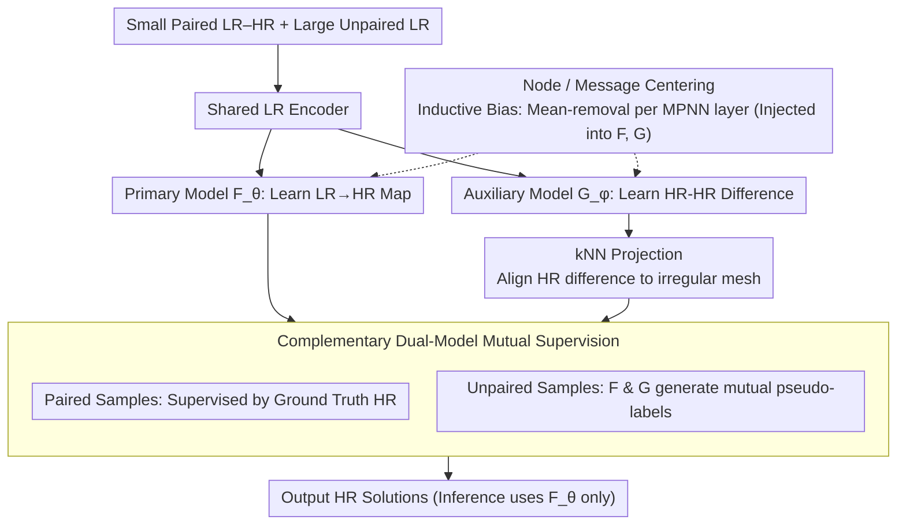

# Semi-Supervised Neural Super-Resolution for Mesh-Based Simulations

**Conference**: ICML 2026  
**arXiv**: [2605.09284](https://arxiv.org/abs/2605.09284)  
**Code**: <https://github.com/jykim-git/SuperMeshNet.git>  
**Area**: 3D Vision / Physical Simulation / Graph Neural Networks  
**Keywords**: mesh super-resolution, semi-supervised regression, complementary learning, message passing inductive bias, PDE simulation acceleration

## TL;DR
SuperMeshNet utilizes two complementary MPNNs—a primary model predicting LR→HR and an auxiliary model predicting HR-HR differences corresponding to LR-LR pairs—to generate mutual pseudo-labels on unpaired LR samples. Combined with two lightweight inductive biases (node-level and message-level centering), this approach allows PDE mesh super-resolution to outperform a 100% HR fully supervised baseline using only 10% HR data, consistently reducing RMSE across six MPNN architectures.

## Background & Motivation

**Background**: Mesh-based PDE simulations such as FEM and FVM are directly controlled by mesh size in terms of solution accuracy and computational cost; fine meshes are accurate but expensive. Neural network super-resolution aims to use low-cost LR simulations to predict HR solutions. Existing works fall into two categories: CNN-based (requiring inefficient interpolation of irregular meshes onto regular grids) and MPNN-based (directly processing graphs but requiring large amounts of paired HR supervision).

**Limitations of Prior Work**: The acquisition of HR data is the very bottleneck that super-resolution seeks to avoid—fine-mesh simulations are the primary cost—making "fully supervised" approaches somewhat contradictory. Existing unsupervised solutions like PhySRNet incorporate PDE residuals into the loss but are restricted to finite differences on regular grids; MAgNet performs zero-shot interpolation, but its prediction error is significantly higher than supervised versions.

**Key Challenge**: The scarcity of HR data versus the data-hungry nature of MPNN training. Classical semi-supervised regression methods (Mean Teacher, UCVME, TNNR) almost all assume two models predict the "same target," leading to highly correlated pseudo-labels that reinforce errors, which fails in MPNN super-resolution scenarios.

**Goal**: (1) Introduce semi-supervision to mesh-based super-resolution for the first time with compatibility across arbitrary MPNNs; (2) Design a mechanism where two models predict "different but related targets" to make pseudo-labels complementary and decorrelate errors; (3) Systematically summarize useful MPNN inductive biases for super-resolution.

**Key Insight**: From a physics perspective, two HR solutions governed by the same PDE but with different parameters $\mu$ have a difference that characterizes the system's response to parameter perturbations. If a model specifically learns this difference, the dimensionality of the pseudo-labels it provides is orthogonal to "direct HR prediction," breaking pseudo-label collapse.

**Core Idea**: Use a primary model $F_\theta$ to learn the inter-resolution map $u_l \to u_h$ and an auxiliary model $G_\phi$ to learn the intra-resolution difference $(u_l^r, u_l^s) \to (u_h^r - u_h^s)$. The two models serve as mutual pseudo-label sources for complementary supervision on unpaired LR data.

## Method

### Overall Architecture
SuperMeshNet addresses the contradiction of "HR data scarcity vs. reliance on HR supervision" by partitioning data into a small paired LR–HR set $\mathcal{D}_a=\{(u_l^q, u_h^q)\}_{q=1}^{N_h}$ ($N_h \ll N$) and a large unpaired LR set $\mathcal{D}_b=\{u_l^q\}_{q=N_h+1}^{N}$. It then enables two MPNNs with different prediction targets to generate mutual pseudo-labels on unpaired samples. The primary model $F_\theta(u_l^q)=\hat{u}_h^q$ learns the inter-resolution map $u_l \to u_h$ for final inference. The auxiliary model $G_\phi(u_l^r, u_l^s)=\hat{u}_h^{rs}$ learns the difference between two HR solutions and acts as a complementary source during training. Both models share a single LR encoder to save computation. The primary model uses SRGNN as its backbone and fuses two upsampling paths: kNN-upsampler and latent-space upsampler.

### Key Designs

**1. Complementary Dual-Model Mutual Supervision: Decorrelating Pseudo-Labels**

A pain point of classic semi-supervised regression (Mean Teacher, UCVME) is that two isomorphic networks predict the same target, causing pseudo-labels to converge to the same mode and reinforce errors (confirmation bias). This work physically decouples this: since two HR solutions are governed by the same PDE with different parameters $\mu$, their difference characterizes the "system response to parameter perturbations," which is an orthogonal learning dimension to "direct HR prediction." Supervision uses two paired samples $\alpha,\beta$ to train $\mathcal{L}_{F,sup} = \ell(\hat{u}_h^\alpha, u_h^\alpha) + \ell(\hat{u}_h^\beta, u_h^\beta)$ and $\mathcal{L}_{G,sup} = \ell(\hat{u}_h^{\alpha\beta}, u_h^\alpha - \text{kNN}(u_h^\beta;P_h^\beta\to P_h^\alpha))$. For an unpaired sample $\gamma$, the models generate mutual pseudo-labels: $\mathcal{L}_{F,unsup}$ uses $\hat{u}_h^{\gamma\alpha} + u_h^\alpha$ (auxiliary difference prediction plus known HR) as a pseudo-label to guide $F_\theta(u_l^\gamma)$, and $\mathcal{L}_{G,unsup}$ uses $\hat{u}_h^\gamma - u_h^\alpha$ (primary prediction minus known HR) to guide $G_\phi(u_l^\gamma, u_l^\alpha)$. Because the predictions reside in different spaces (HR solution vs. HR difference), errors are naturally decorrelated, while physical priors regarding parameter sensitivity are injected.

**2. kNN Projection: Defining HR Differences on Irregular Meshes**

The auxiliary model needs to calculate $u_h^r - u_h^s$, but different parameters $\mu$ result in different geometries where node positions $P_h^r \ne P_h^s$, preventing point-wise subtraction. This work uses kNN distance weighting to project one side's values onto the other's node coordinates, denoted as $\text{kNN}(u_h^s; P_h^s \to P_h^r)$. All difference terms in the unsupervised losses perform this projection first. kNN was chosen over a learned alignment network because irregular structures are inherent to mesh simulation; kNN interpolation provides a PointNet-style differentiable, lightweight solution with zero extra parameters.

**3. Node / Message Centering: One-line General Inductive Bias for MPNNs**

The authors observed that super-resolution relies mainly on local relative structures rather than absolute means. Thus, they apply mean-removal $x_i \leftarrow x_i - \frac{1}{n}\sum_i x_i$ after updating node embeddings in each MPNN layer. For architectures explicitly aggregating messages (like MGN), they additionally apply $agg_i \leftarrow agg_i - \frac{1}{n}\sum_i agg_i$ to the aggregated values, effectively erasing the global mean in intermediate representations. This is similar to BatchNorm smoothing the loss landscape but is specifically beneficial for tasks that do not depend on global means. It is MPNN-agnostic: ablation shows that RMSE consistently decreases across GCN/SAGE/GAT/GTR/GIN/MGN (e.g., MGN drops from 0.0269 to 0.0226).

### A Complete Example
Take a training batch containing two paired LR samples $\alpha,\beta$ (HR known) and one unpaired LR sample $\gamma$ (HR unknown). Step one is supervision: $F_\theta$ predicts $\hat{u}_h^\alpha,\hat{u}_h^\beta$ to compare against ground truth; $G_\phi$ predicts $\hat{u}_h^{\alpha\beta}$ to fit the difference between $u_h^\alpha$ and (kNN-projected) $u_h^\beta$. Step two is mutual supervision: on sample $\gamma$, $G_\phi(u_l^\gamma,u_l^\alpha)$ provides a difference prediction $\hat{u}_h^{\gamma\alpha}$, which when added to $u_h^\alpha$ synthesizes an HR pseudo-label for $F_\theta(u_l^\gamma)$. Conversely, $F_\theta(u_l^\gamma)$ provides $\hat{u}_h^\gamma$, which when minus $u_h^\alpha$ synthesizes a difference pseudo-label for $G_\phi(u_l^\gamma, u_l^\alpha)$. Within one batch, both models are pulled simultaneously by ground truth and the other’s pseudo-labels, allowing unpaired samples to be utilized "for free."

### Loss & Training
The total loss is $\mathcal{L}_F = \mathcal{L}_{F,sup} + \mathcal{L}_{F,unsup}$ and $\mathcal{L}_G = \mathcal{L}_{G,sup} + \mathcal{L}_{G,unsup}$. Both weights are set to 1 without scheduling. When outputting multiple physical quantities (velocity + pressure), weighted MSE is used to offset magnitude differences: 99:1 for time-dependent PDE datasets and $10^{-8}:1$ for real geometry datasets. The optimizer is Adam ($\text{lr}=10^{-3}$) with PyTorch AMP on an i9-10920X + RTX A6000.

## Key Experimental Results

### Main Results

Dataset 1 (Linear elasticity von Mises stress, FEM), RMSE↓ across 6 MPNNs:

| Method | $N_h$, $N$ | GCN | SAGE | GAT | GTR | GIN | MGN |
|------|------------|-----|------|-----|-----|-----|-----|
| Supervised (no bias) | 20, 20 | 0.0874 | 0.0876 | 0.0826 | 0.0758 | 0.0819 | 0.0655 |
| Supervised (no bias) | 200, 200 | 0.0575 | 0.0544 | 0.0512 | 0.0450 | 0.0381 | 0.0228 |
| SuperMeshNet-O (no bias) | 20, 200 | 0.0613 | 0.0589 | 0.0544 | 0.0451 | 0.0404 | 0.0269 |
| **SuperMeshNet (with bias)** | 20, 200 | **0.0431** | **0.0450** | **0.0457** | **0.0385** | **0.0277** | **0.0226** |

Real Geometry (Motorbike + Rider incompressible Navier-Stokes) Drag / Lift coefficients (relative error):

| Method | $N_h$,$N$ | Drag (rel. err) | Lift (rel. err) |
|------|-----------|--------------------|--------------------|
| Ground truth HR | — | 0.3724 | 0.0368 |
| SuperMeshNet | 40, 200 | 0.3778 (0.014) | 0.0433 (0.177) |
| Fully Supervised | 200, 200 | 0.3653 (0.019) | 0.0380 (0.033) |

### Ablation Study

Dataset 1, MGN, $N_h=20, N=200$, Inductive Bias Ablation:

| Configuration | RMSE | Description |
|------|------|------|
| No bias (O) | 0.0269 | Complementary learning only |
| + Node centering (N) | 0.0237 | N alone captures significant gain |
| + Message centering (M) | 0.0247 | M alone slightly weaker than N |
| N + M | **0.0226** | Optimal with both combined |

Semi-supervised Regression Baselines (Dataset 1, $N_h=20, N=200$, MGN):

| Method | RMSE | Training Time (s) |
|------|------|----------------|
| Mean-Teacher | 0.0325 | 693.84 |
| TNNR | 0.0624 | 477.48 |
| UCVME | 0.0293 | 1122.62 |
| SuperMeshNet-O | 0.0269 | 503.2 |
| **SuperMeshNet** | **0.0226** | **421** |

### Key Findings
- Using only 10% HR data (20 vs 200) outperforms the 100% HR fully supervised baseline—saving 90% of HR data is the core practical conclusion. Since fine-mesh simulation costs scale exponentially, overall training cost is significantly reduced.
- Complementary learning achieves the lowest RMSE with the shortest training time (421 s vs. UCVME's 1122 s) because other methods use redundant dual networks, whereas Ours reuses a shared encoder.
- In time-dependent PDE Dataset 2, where HR and LR vorticity differ drastically (128x node ratio), full supervision fails while SuperMeshNet recovers HR—proving $G_\phi$ provides stronger signals via HR-HR relationships than pure LR→HR mapping.

## Highlights & Insights
- The "two models predicting different physical quantities coupled via common HR" paradigm elegantly combines co-training with PDE physical symmetries. This can be extended to any problem with "parameterized solution families" (climate, biomechanics, lattice simulation).
- Node / Message centering is a general inductive bias that requires only one line of code yet uniformly improves 6 MPNN architectures, showing that mean-removal is a low-cost, robust trick for "relative structure" tasks.
- The experimental design emphasizes the value of 90% HR data saving rather than just absolute RMSE reduction, addressing the real bottleneck in mesh-based super-resolution.

## Limitations & Future Work
- Semi-supervised training takes longer than pure supervision (though shorter than comparable semi-supervised methods); the authors admit net benefits are achieved only when meshes are fine enough for HR simulation costs to dominate.
- Theoretical guarantees for training stability are missing, with only empirical studies provided in the appendix. If the auxiliary model $G_\phi$ has high error, error amplification could theoretically occur, likely failing on highly non-linear or bifurcating PDEs.
- The selection of HR samples is important (empirical exploration in Appendix I.12), but currently uses random sampling. An active learning style HR sampling strategy would likely lower $N_h$ further.

## Related Work & Insights
- **vs PhySRNet (Arora, 2022)**: Fully unsupervised but requires finite-difference, limited to grids; Ours handles irregular meshes with minimal HR data.
- **vs MAgNet (Boussif et al., 2022)**: Zero-shot MPNN interpolation with high error; Ours significantly reduces error with minimal HR samples.
- **vs UCVME / Mean Teacher / TNNR**: These use "same-target dual-networks" leading to pseudo-label collapse; Ours uses "different-target dual-networks" to ensure decorrelation.

## Rating
- Novelty: ⭐⭐⭐⭐ "Dual-model different-target + physical difference" for mesh SR is a genuine first and fits MPNN well.
- Experimental Thoroughness: ⭐⭐⭐⭐⭐ Extremely detailed coverage across 6 MPNNs, 3 FEM + 3 CFD datasets, semi-supervised baselines, and inductive bias ablations.
- Writing Quality: ⭐⭐⭐⭐ Rigorous physical/mathematical notation, clear pipeline diagrams, and a rich appendix.
- Value: ⭐⭐⭐⭐ Saving 90% HR data directly addresses pain points in industrial CAE and climate simulation; code is open and ready to use.

<!-- RELATED:START -->

## Related Papers

- [\[CVPR 2026\] SDUIE: Semi-Supervised Diffusion for Underwater Image Enhancement with Quant-Text Dual Control](../../CVPR2026/image_restoration/sduie_semi-supervised_diffusion_for_underwater_image_enhancement_with_quant-text.md)
- [\[ICML 2026\] Coloring the Noise: Adversarial Sobolev Alignment for Faithful Image Super Resolution](coloring_the_noise_adversarial_sobolev_alignment_for_faithful_image_super_resolu.md)
- [\[ICML 2026\] PODiff: Latent Diffusion in Proper Orthogonal Decomposition Space for Scientific Super-Resolution](podiff_latent_diffusion_in_proper_orthogonal_decomposition_space_for_scientific_.md)
- [\[NeurIPS 2025\] Spiking Meets Attention: Efficient Remote Sensing Image Super-Resolution with Attention Spiking Neural Networks](../../NeurIPS2025/image_restoration/spiking_meets_attention_efficient_remote_sensing_image_super-resolution_with_att.md)
- [\[ICML 2026\] Phy-CoSF: Physics-Guided Continuous Spectral Fields Reconstruction and Super-Resolution for Snapshot Compressive Imaging](phy-cosf_physics-guided_continuous_spectral_fields_reconstruction_and_super-reso.md)

<!-- RELATED:END -->
