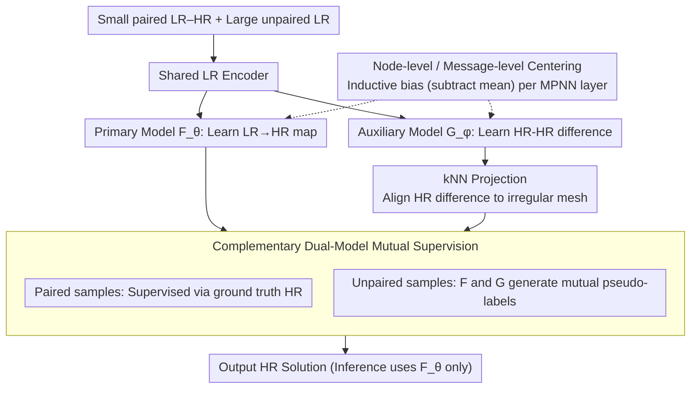

# Semi-Supervised Neural Super-Resolution for Mesh-Based Simulations

**Conference**: ICML 2026  
**arXiv**: [2605.09284](https://arxiv.org/abs/2605.09284)  
**Code**: <https://github.com/jykim-git/SuperMeshNet.git>  
**Area**: 3D Vision / Physical Simulation / Graph Neural Networks  
**Keywords**: mesh super-resolution, semi-supervised regression, complementary learning, message passing inductive bias, PDE simulation acceleration

## TL;DR
SuperMeshNet employs two complementary MPNNs—a primary model predicting LR→HR and an auxiliary model predicting HR-HR differences corresponding to LR-LR pairs—to mutually generate pseudo-labels for unpaired samples. Combined with two lightweight inductive biases (node-level and message-level centering), this approach allows PDE mesh super-resolution to outperform a 100% HR fully supervised baseline using only 10% HR data, consistently reducing RMSE across six MPNN architectures.

## Background & Motivation

**Background**: Mesh-based PDE simulations such as FEM and FVM balance solution accuracy against computational cost through mesh density; fine meshes are accurate but expensive. Neural network super-resolution aims to predict HR solutions from low-cost LR simulations. Existing works generally fall into two categories: CNN-based (requiring inefficient interpolation of irregular meshes onto regular grids) and MPNN-based (directly processing graphs but requiring large volumes of paired HR supervision).

**Limitations of Prior Work**: The acquisition of HR data itself is the bottleneck that super-resolution seeks to avoid—fine-grid simulations are precisely what is costly. Consequently, "fully supervised" learning is inherently contradictory. Existing unsupervised solutions like PhySRNet incorporate PDE residuals into the loss function but are limited to finite difference methods on regular grids. MAgNet performs zero-shot interpolation, yet its prediction error is significantly higher than supervised counterparts.

**Key Challenge**: The scarcity of HR data versus the greedy nature of MPNN training. Conventional semi-supervised regression methods (Mean Teacher, UCVME, TNNR) almost exclusively assume that two models predict the "same target," leading to highly correlated pseudo-labels that reinforce errors, which fails in MPNN super-resolution scenarios.

**Goal**: (1) Introduce semi-supervised learning to mesh-based super-resolution for the first time with compatibility for any MPNN; (2) design a mechanism where "two models predict different but related targets" to decorrelate pseudo-label errors; (3) systematically summarize MPNN inductive biases beneficial for super-resolution.

**Key Insight**: From a physical perspective, two HR solutions are governed by the same PDE and differ only by a parameter $\mu$. Thus, their difference characterizes the system's response to parameter perturbations. If a model specifically learns this difference, the pseudo-labels it provides are orthogonal in dimension to "direct HR prediction," thereby preventing pseudo-label collapse.

**Core Idea**: Use a primary model $F_\theta$ to learn the inter-resolution map $u_l \to u_h$ and an auxiliary model $G_\phi$ to learn the intra-resolution difference $(u_l^r, u_l^s) \to (u_h^r - u_h^s)$. These models provide reciprocal pseudo-labels for complementary supervision on unpaired LR data.

## Method

### Overall Architecture
SuperMeshNet addresses the paradox of HR data scarcity by partitioning data into a small paired LR–HR set $\mathcal{D}_a=\{(u_l^q, u_h^q)\}_{q=1}^{N_h}$ ($N_h \ll N$) and a large unpaired LR set $\mathcal{D}_b=\{u_l^q\}_{q=N_h+1}^{N}$. Two MPNNs with distinct prediction targets generate pseudo-labels for each other on unpaired samples. The primary model $F_\theta(u_l^q)=\hat{u}_h^q$ learns the LR→HR inter-resolution map for final inference. The auxiliary model $G_\phi(u_l^r, u_l^s)=\hat{u}_h^{rs}$ learns the difference between HR solutions of two LR samples and serves only as a complementary supervision source during training. Both models share an LR encoder to save computation. The primary backbone is SRGNN, fused via kNN-upsampler and latent-space upsampler paths.

### Key Designs

**1. Complementary Dual-Model Mutual Supervision: Decorrelating Pseudo-labels**

The failure point of standard semi-supervised regression (e.g., Mean Teacher) is that isomorphic networks predicting the same target quickly converge to the same mode, leading to confirmation bias. This work physically decouples this: since two HR solutions under different parameters $\mu$ represent the system's sensitivity to perturbations, learning the difference is a learning dimension orthogonal to direct HR prediction. For paired samples $\alpha, \beta$, supervision is applied via $\mathcal{L}_{F,sup} = \ell(\hat{u}_h^\alpha, u_h^\alpha) + \ell(\hat{u}_h^\beta, u_h^\beta)$ and $\mathcal{L}_{G,sup} = \ell(\hat{u}_h^{\alpha\beta}, u_h^\alpha - \text{kNN}(u_h^\beta;P_h^\beta\to P_h^\alpha))$. For an unpaired sample $\gamma$, $\mathcal{L}_{F,unsup}$ uses $\hat{u}_h^{\gamma\alpha} + u_h^\alpha$ (auxiliary difference prediction plus known HR) as the pseudo-label to supervise $F_\theta(u_l^\gamma)$. Conversely, $\mathcal{L}_{G,unsup}$ uses $\hat{u}_h^\gamma - u_h^\alpha$ as the pseudo-label to supervise $G_\phi(u_l^\gamma, u_l^\alpha)$. Since predictions reside in different spaces (HR solution vs. HR difference), errors are naturally decorrelated and physical priors regarding parameter sensitivity are injected.

**2. kNN Projection: Defining HR Differences Across Irregular Meshes**

The auxiliary model must calculate $u_h^r - u_h^s$. However, different parameters $\mu$ result in different geometries where node positions $P_h^r \ne P_h^s$, making point-wise subtraction impossible. This work uses kNN distance weighting to project one solution onto the node coordinates of the other, denoted as $\text{kNN}(u_h^s; P_h^s \to P_h^r)$. All difference terms in the unsupervised losses undergo this projection. kNN is chosen over a learned alignment network because it is a differentiable, lightweight, PointNet-style solution with zero extra parameters, suited for inherently irregular mesh structures.

**3. Node-level / Message-level Centering: Universal MPNN Inductive Bias**

It was observed that super-resolution primarily relies on local relative structures rather than absolute means. Thus, after updating node embeddings in each MPNN layer, a mean subtraction is performed: $x_i \leftarrow x_i - \frac{1}{n}\sum_i x_i$. For architectures that explicitly aggregate messages (like MGN), an additional centering is applied to the aggregated values: $agg_i \leftarrow agg_i - \frac{1}{n}\sum_i agg_i$. This effectively removes global mean shifts in intermediate representations, similar to how BatchNorm smoothes the loss landscape, but specifically for mean-independent tasks. This is MPNN-agnostic: ablation shows RMSE consistently decreases across GCN, SAGE, GAT, GTR, GIN, and MGN (e.g., MGN drops from 0.0269 to 0.0226).

### Mechanism
Consider a training batch with two paired LR samples $\alpha, \beta$ (HR known) and one unpaired LR sample $\gamma$ (HR unknown). 
1. **Supervised Step**: $F_\theta$ predicts $\hat{u}_h^\alpha, \hat{u}_h^\beta$ to match ground truth; $G_\phi$ predicts $\hat{u}_h^{\alpha\beta}$ to match the difference between $u_h^\alpha$ and the projected $u_h^\beta$. 
2. **Mutual Supervision Step**: For $\gamma$, $G_\phi(u_l^\gamma, u_l^\alpha)$ provides the difference prediction $\hat{u}_h^{\gamma\alpha}$, which is added to $u_h^\alpha$ to synthesize an HR pseudo-label for $F_\theta(u_l^\gamma)$. In reverse, $F_\theta(u_l^\gamma)$ provides $\hat{u}_h^\gamma$, which is subtracted from $u_h^\alpha$ to synthesize a difference pseudo-label for $G_\phi(u_l^\gamma, u_l^\alpha)$. Both models are steered by both ground truth and mutual pseudo-labels within a single batch.

### Loss & Training
The total losses are $\mathcal{L}_F = \mathcal{L}_{F,sup} + \mathcal{L}_{F,unsup}$ and $\mathcal{L}_G = \mathcal{L}_{G,sup} + \mathcal{L}_{G,unsup}$. Both weights are set to 1 without scheduling. For multi-variable outputs (velocity + pressure), weighted MSE is used to balance magnitudes: 99:1 for time-dependent PDE datasets and $10^{-8}:1$ for real geometry datasets. Optimization uses Adam ($\text{lr}=10^{-3}$) with PyTorch AMP on i9-10920X + RTX A6000 hardware.

## Key Experimental Results

### Main Results

Dataset 1 (Linear elasticity von Mises stress, FEM), RMSE↓ across 6 MPNNs:

| Method | $N_h$, $N$ | GCN | SAGE | GAT | GTR | GIN | MGN |
|------|------------|-----|------|-----|-----|-----|-----|
| Full Supervision (no bias) | 20, 20 | 0.0874 | 0.0876 | 0.0826 | 0.0758 | 0.0819 | 0.0655 |
| Full Supervision (no bias) | 200, 200 | 0.0575 | 0.0544 | 0.0512 | 0.0450 | 0.0381 | 0.0228 |
| SuperMeshNet-O (no bias) | 20, 200 | 0.0613 | 0.0589 | 0.0544 | 0.0451 | 0.0404 | 0.0269 |
| **Ours (SuperMeshNet)** | 20, 200 | **0.0431** | **0.0450** | **0.0457** | **0.0385** | **0.0277** | **0.0226** |

Real Geometry (Motorbike + Rider incompressible Navier-Stokes) Drag/Lift Coefficients (Relative Error):

| Method | $N_h$, $N$ | Drag (rel. err) | Lift (rel. err) |
|------|-----------|--------------------|--------------------|
| Ground truth HR | — | 0.3724 | 0.0368 |
| Ours | 40, 200 | 0.3778 (0.014) | 0.0433 (0.177) |
| Full Supervision | 200, 200 | 0.3653 (0.019) | 0.0380 (0.033) |

### Ablation Study

Dataset 1, MGN, $N_h=20, N=200$, Inductive Bias Ablation:

| Configuration | RMSE | Description |
|------|------|------|
| No bias (O) | 0.0269 | Complementary learning only |
| + Node centering (N) | 0.0237 | N alone provides major gain |
| + Message centering (M) | 0.0247 | M alone is weaker than N |
| N + M | **0.0226** | Combination is optimal |

Semi-supervised Regression Baselines (Dataset 1, $N_h=20, N=200$, MGN):

| Method | RMSE | Training Time (s) |
|------|------|----------------|
| Mean-Teacher | 0.0325 | 693.84 |
| TNNR | 0.0624 | 477.48 |
| UCVME | 0.0293 | 1122.62 |
| SuperMeshNet-O | 0.0269 | 503.2 |
| **Ours** | **0.0226** | **421** |

### Key Findings
- Using only 10% HR data (20 vs. 200), the model outperforms the 100% HR fully supervised baseline. Reducing HR requirements by 90% is the core practical conclusion; since data generation costs grow exponentially with resolution, the total training cost is significantly reduced.
- Complementary learning achieves the lowest RMSE with the shortest training time (421s vs. UCVME 1122s) because it utilizes a shared encoder, unlike other semi-supervised methods that require redundant computations.
- On time-dependent PDE Dataset 2, where HR and LR vorticity differ greatly (128x node ratio), full supervision fails, but SuperMeshNet recovers the HR solution, proving that the HR-HR relationship learned by $G_\phi$ provides a stronger signal than the pure LR→HR map.

## Highlights & Insights
- Decoupling two models to predict different physical quantities coupled by a common HR ground truth is an elegant paradigm merging co-training with PDE physical symmetry. This can generalize to any problem with a "parameterized solution family" structure.
- Node/message centering is a universal inductive bias that requires only a single line of code yet uniformly improves six MPNN architectures, confirming that mean-subtraction is a robust, inexpensive trick for relative-structure tasks.
- The experimental design pragmatically emphasizes the 90% reduction in HR data rather than just absolute RMSE reduction, addressing the genuine bottleneck in mesh-based simulation.

## Limitations & Future Work
- While faster than other semi-supervised methods, training time is still longer than pure supervision. The net gain is only realized when fine meshes are sufficiently expensive to generate.
- There is a lack of theoretical guarantees for training stability, though empirical studies are provided. Theoretically, if the auxiliary model $G_\phi$ has high error, mutual error amplification remains possible, especially in highly nonlinear or bifurcating PDEs.
- The selection of HR samples is critical; while random sampling was used, an active learning strategy for HR selection could potentially lower $N_h$ even further.

## Related Work & Insights
- **vs. PhySRNet (Arora, 2022)**: PhySRNet is fully unsupervised but requires finite-difference methods limited to regular grids; Ours handles irregular meshes with minimal HR data.
- **vs. MAgNet (Boussif et al., 2022)**: MAgNet uses zero-shot interpolation with much higher errors; Ours leverages a small HR set to significantly improve accuracy.
- **vs. UCVME / Mean Teacher / TNNR**: These methods use "same-target dual-networks" prone to pseudo-label collapse; Ours uses "different-target dual-networks" to fundamentally decorrelate labels.

## Rating
- Novelty: ⭐⭐⭐⭐ Combining "different-target dual-networks" with physical differencing for mesh SR is a genuine first.
- Experimental Thoroughness: ⭐⭐⭐⭐⭐ Extremely detailed, covering 6 MPNNs, multiple FEM/CFD datasets, and various baselines.
- Writing Quality: ⭐⭐⭐⭐ Rigorous physical and mathematical notation with clear pipeline diagrams.
- Value: ⭐⭐⭐⭐ A 90% HR reduction directly addresses the pain points of industrial CAE and climate simulation.

<!-- RELATED:START -->

## Related Papers

- [\[CVPR 2026\] SDUIE: Semi-Supervised Diffusion for Underwater Image Enhancement with Quant-Text Dual Control](../../CVPR2026/image_restoration/sduie_semi-supervised_diffusion_for_underwater_image_enhancement_with_quant-text.md)
- [\[ICML 2026\] Coloring the Noise: Adversarial Sobolev Alignment for Faithful Image Super Resolution](coloring_the_noise_adversarial_sobolev_alignment_for_faithful_image_super_resolu.md)
- [\[NeurIPS 2025\] Spiking Meets Attention: Efficient Remote Sensing Image Super-Resolution with Attention Spiking Neural Networks](../../NeurIPS2025/image_restoration/spiking_meets_attention_efficient_remote_sensing_image_super-resolution_with_att.md)
- [\[ICML 2026\] PODiff: Latent Diffusion in Proper Orthogonal Decomposition Space for Scientific Super-Resolution](podiff_latent_diffusion_in_proper_orthogonal_decomposition_space_for_scientific_.md)
- [\[ICML 2026\] Phy-CoSF: Physics-Guided Continuous Spectral Fields Reconstruction and Super-Resolution for Snapshot Compressive Imaging](phy-cosf_physics-guided_continuous_spectral_fields_reconstruction_and_super-reso.md)

<!-- RELATED:END -->
